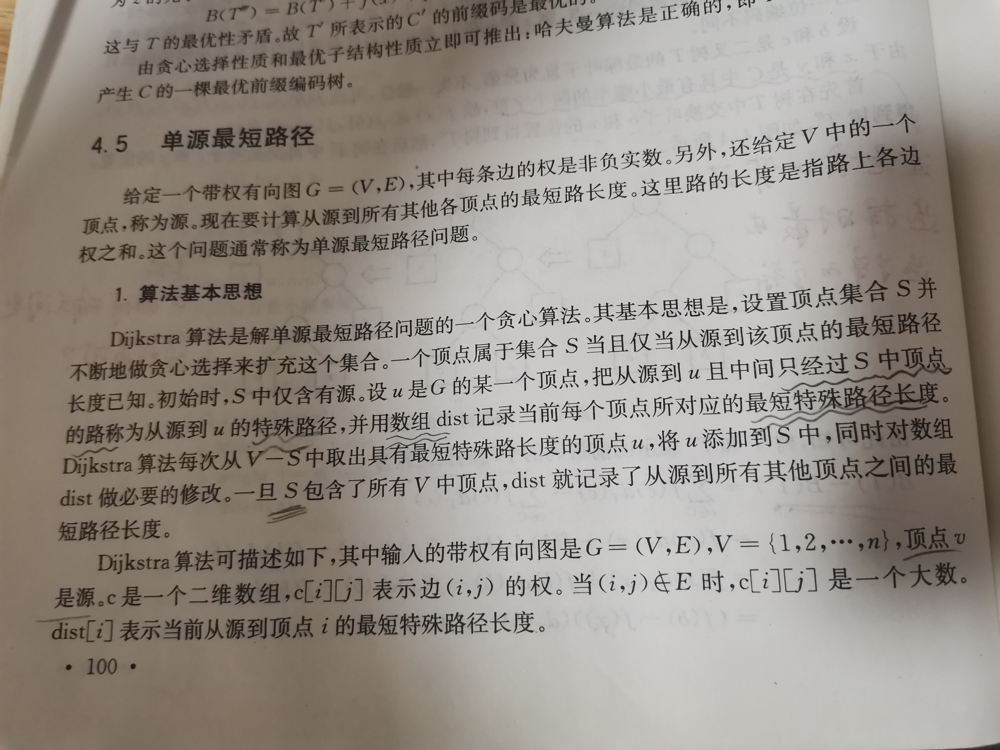
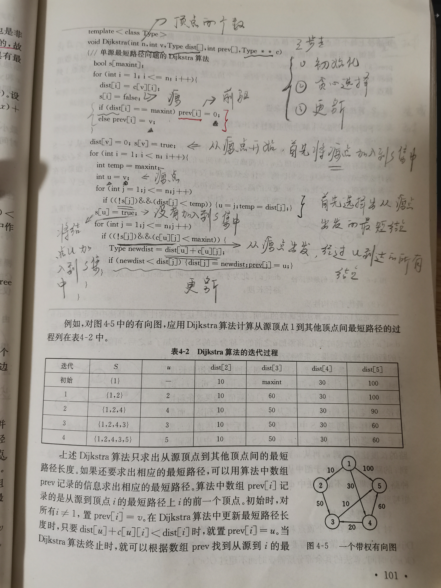
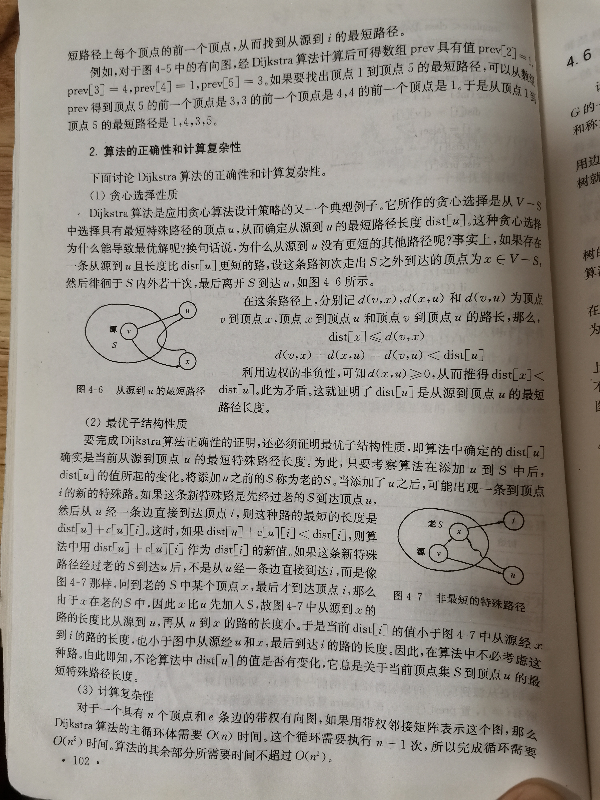

# 计算机算法设计与分析








一、按照在`Relation-structure-computation\Structure\Data-structure\Graph\Search-algorithm\Methods\Summary\Search-Algorithm`中描述的算法框架来分析Dijkstra's algorithm。

集合S为**CLOSED**集，在该算法中，并没有显式地维护**OPEN集**。

对于Dijkstra's algorithm，它的“strategies for selecting which node to expand next”是采用的greedy策略，即每次选择最小的distance，显然这是典型的greedy思想，显然只能够保证在不断的greedy选择下，最终能够得到从source到所有的其他节点的最短距离

二、dijkstra的算法思想：

1、greedy

2、dynamic programming

三、集合S为**CLOSED**集，它能够避免circle、陷入死循环

## 完整code

```c++
#define  maxint 9999
/**
 * 单源最短路径的Dijkstra算法
 * 步骤:
 * 1. 初始化
 * 2. 贪心选择
 * 3. 更新
 * @param n 顶点的个数
 * @param v 源点的index
 * @param dist 源点到各节点的距离
 * @param prev 前驱节点
 * @param c 图中节点之间的距离
 */
template<typename Type>
void Dijkstra(int n, int v, Type dist[], int prev[], Type** c)
{
	bool s[maxint]; // CLOSED，当源点到节点的距离已知的时候，就将该节点加入到这个集合中
	// 1. 初始化
	for (int i = 1; i <= n; ++i)
	{
		dist[i] = c[v][i]; // 源点到节点的距离
		s[i] = false;
		// 与源点不相邻的节点
		if (dist[i] == maxint)
		{
			prev[i] = 0;
		}
		// 与源点的相邻节点
		else
		{
			prev[i] = v;
		}

	}
	dist[v] = 0;
	s[v] = true; // 将源点加入到CLOSED中

	for (int i = 1; i < n; ++i)
	{
		// 2. 贪心选择
		// 选择dist中的最小值
		int temp = maxint;
		int u = v;
		for (int j = 1; i <= n; j++)
		{
			if ((!s[j]) && (dist[j] < temp))
			{
				u = j;
				temp = dist[j];
			}
		}
		s[u] = true; // 将u加入到CLOSED中
		// 3. 更新
		// 使用u来进行更新
		for (int j = 1; j <= n; ++j)
		{
			if ((!s[j]) && (c[u][j] < maxint))
			{
				Type newdist = dist[u] + c[u][j];
				if (newdist < dist[j])
				{
					dist[j] = newdist;
					prev[j] = u;
				}
			}
		}
	}
}

int main()
{

}

```

上述实现，使用数组`dist`来记录从`src`到各个其他节点的最短距离。

