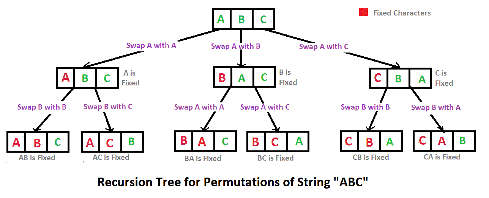

# 递归函数的表示与分析

下面总结了表示递归函数执行过程的表示方法。

## 递归调用树

对递归函数进行复杂度分析是非常重要的，因为所有使用递归的函数都涉及这个问题；其实复杂度分析本质上来说是统计递归函数的执行次数、执行深度等问题，所以如果对递归函数的调用过程有一个直观，准确地描述的话，那么分析其递归函数的复杂度也会非常容易，目前流行的表示方法是：递归调用树，如下是一些使用递归调用树来表示：

### geeksforgeeks [Write a program to print all permutations of a given string](https://www.geeksforgeeks.org/write-a-c-program-to-print-all-permutations-of-a-given-string/)

[](https://media.geeksforgeeks.org/wp-content/cdn-uploads/NewPermutation.gif)

###  leetcode [斐波那契数](https://leetcode-cn.com/problems/fibonacci-number/) 

  

那如何来理解**递归调用树**呢？实际上，**递归函数**的执行过程并不会显示的构造出一个**递归调用树**，它只是逻辑上形成了一个树，下面对此进行详细的分析：

我们知道，函数的调用过程所使用的是[Call stack](https://en.wikipedia.org/wiki/Call_stack)，每一次的函数调用都会在[Call stack](https://en.wikipedia.org/wiki/Call_stack)上push一个  **stack frame**（参见[Call stack](https://en.wikipedia.org/wiki/Call_stack)）；递归函数一直执行的是同一个函数，所以它的[Call stack](https://en.wikipedia.org/wiki/Call_stack)中的**stack frame**的执行逻辑是相同的（入参可能不同）；在递归函数执行的过程中，每执行一次递归调用就往[Call stack](https://en.wikipedia.org/wiki/Call_stack)上push（入栈）一个  **stack frame**，直到某个递归函数执行到了base case，则它会return，这就意味中它的  **stack frame**会pop（出栈），则控制会返回到调用它的函数；显然，前面所描述的过程对应这[树的深度优先遍历](https://en.wikipedia.org/wiki/Tree_traversal)，所以我们说：递归函数的执行过程是对递归调用树进行深度优先遍历。

> NOTE: 上面所描述的：函数调用-入栈，函数返回-出栈，非常类似于括号匹配算法中的正括号入栈，反括号出栈；

总的来说，递归调用数是对递归函数的[Call stack](https://en.wikipedia.org/wiki/Call_stack)的可视化分析；

其实我们是完全可以根据**递归函数**画出对应的**递归调用树**的。比如`perm`函数就是典型的**排列树**，二分搜索、quike sort等就是典型的**二叉树**。


### geeksforgeeks [Matrix Chain Multiplication | DP-8](https://www.geeksforgeeks.org/matrix-chain-multiplication-dp-8/)


 


## 使用括号表示

在 wikipedia [Recursion (computer science) # Recursive programs](https://en.wikipedia.org/wiki/Recursion_(computer_science)#Recursive_programs) 中给出了使用括号来表示recursive function execution的例子。

### Factorial

$$
\operatorname {fact} (n)={\begin{cases}1&{\mbox{if }}n=0\\n\cdot \operatorname {fact} (n-1)&{\mbox{if }}n>0\\\end{cases}}
$$


Computing the recurrence relation for `n = 4`:

```C++
b4       = 4 * b3         
         = 4 * (3 * b2)
         = 4 * (3 * (2 * b1))
         = 4 * (3 * (2 * (1 * b0)))
         = 4 * (3 * (2 * (1 * 1)))
         = 4 * (3 * (2 * 1))
         = 4 * (3 * 2)
         = 4 * 6
         = 24
```
### Towers of Hanoi

*Main article:* [Towers of Hanoi](https://en.wikipedia.org/wiki/Towers_of_Hanoi)


$$
\operatorname {hanoi} (n)={\begin{cases}1&{\mbox{if }}n=1\\2\cdot \operatorname {hanoi} (n-1)+1&{\mbox{if }}n>1\\\end{cases}}
$$
Computing the recurrence relation for n = 4:


```C++
hanoi(4)     = 2*hanoi(3) + 1
             = 2*(2*hanoi(2) + 1) + 1
             = 2*(2*(2*hanoi(1) + 1) + 1) + 1
             = 2*(2*(2*1 + 1) + 1) + 1
             = 2*(2*(3) + 1) + 1
             = 2*(7) + 1
             = 15
```


## 递归函数的复杂性分析

### [Analysis of Algorithm | Set 4 (Solving Recurrences)](https://www.geeksforgeeks.org/analysis-algorithm-set-4-master-method-solving-recurrences/)


### [Lecture 20: Recursion Trees and the Master Method](https://www.cs.cornell.edu/courses/cs3110/2012sp/lectures/lec20-master/lec20.html)