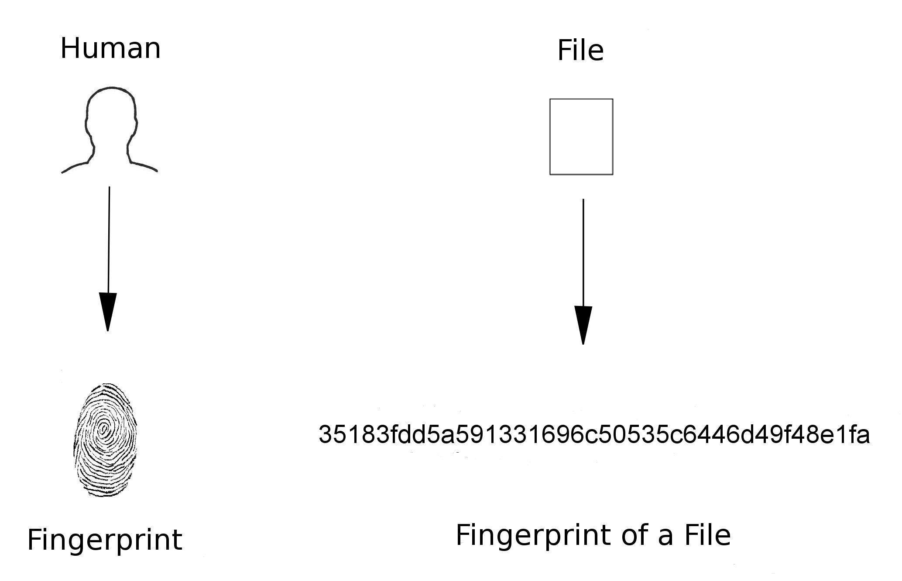

# peterjockisch [Practical Application of Cryptographic Checksums](http://www.peterjockisch.de/texte/computerartikel/Kryptographische-Pruefsummen/Kryptographische-Pruefsummen_EN.html)

## 1.1 Introduction

Computer files can be manipulated in many ways un­no­ticed. Cryptographic checksums, hash values, serve to protect your data: By forming an electronic fingerprint of a file, an always constant numerical value is created. If this value deviates at a later point in time, there is dam­age or manipulation. With a single mouse click, the in­teg­rity of a file can be checked at any time.

> NOTE: 
>
> 1、保证data integrity，分支被篡改
>
> 2、"electronic fingerprint" 非常形象的比喻，下面对此进行了专门的说明
>
> 

Humans are complex creatures. In order to identify them quickly and easily, **fingerprints** are often created. **Com­put­er files** can be identified according to the same prin­ci­ple: by generating an “**electronic fingerprint**”, the so-called **cryptographic checksum**, an always constant num­ber.

