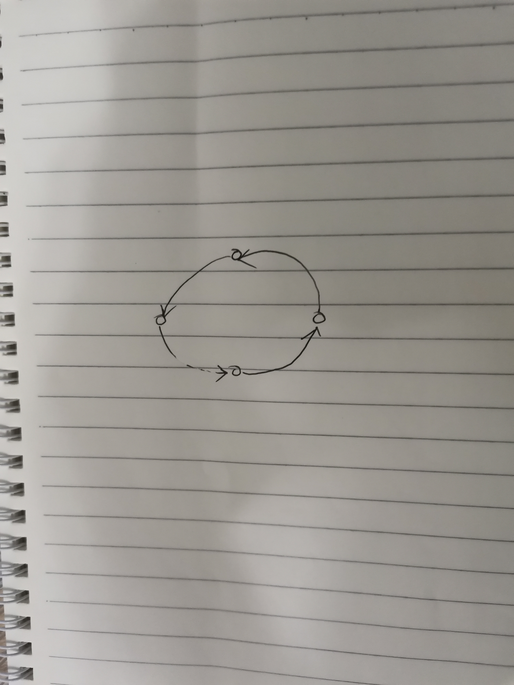
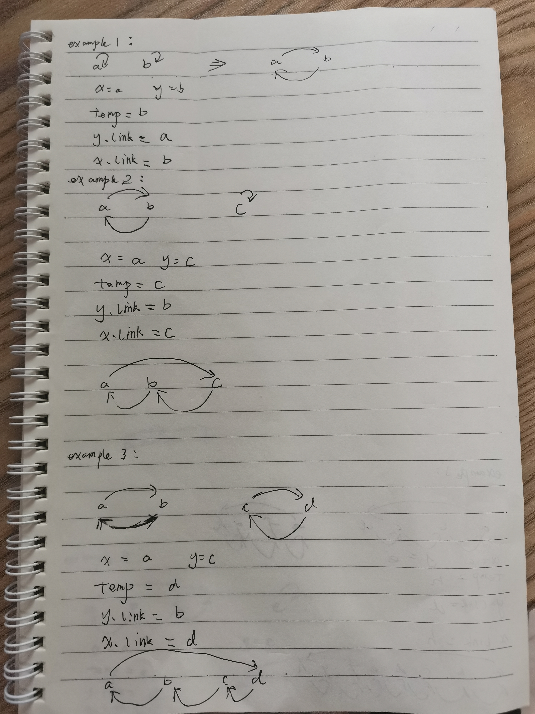

# Circular-linked-list

## 使用circular-linked-list的algorithm

在union-find set中遇到了**circular-single-linked-list**，在dancing links algorithm中遇到了**circular-doubly-linked-list**，将它们统称为circular-linked-list。

## 形象地circular-linked-list

linked-list对应的是一个直线了，circular-linked-list对应的是一个环:



circular-linked-list可以看作是将一个linked-list的首位相连而成。

优良特性:

1、circular linked list是没有严格意义的head、tail的，如果硬是要指定head、tail的话，circular linked list的tail node指向它的head node。

2、方向性: 从上图可以看出，circular linked list是有方向的，它的方向就是沿着next pointer的指向，它的形象展示就是如下图所示的带流向的环。


## Operations


### 构建

1、single node

self-reference

2、concatenate two circular-linked-lists

形象的理解: 两个**转向**相同的环，都需要破个口子，然后分别连接，从而构成一个大的环，大的环的**转向**和之前的方向相同；


#### stackoverflow [Union-Find: retrieve all members of a set efficiently](https://stackoverflow.com/questions/23055236/union-find-retrieve-all-members-of-a-set-efficiently)

I'm working with an `union-find` algorithm. In the first part of my program, the algorithm computes a partition of a big set `E`.

After that, I want to retrieve all the members of the set `S`, which contains a given node `x`.

Until now, naively, I was testing membership of all elements of `E` to the set `S`. But yesterday I was reading "Introduction to Algorithms" (by CLRS, 3rd edition, ex. 21.3-4), and, in the exercises, I found that:

> Suppose that we wish to add the operation `PRINT-SET(x)`, which is given a node `x` and prints all the members of `x`'s set, in any order. Show how we can add just a single attribute to each node in a disjoint-set forest so that `PRINT-SET(x)` takes time linear in the number of members of `x`'s set, and the asymptotic running times of the other operations are unchanged.

"linear in the number of members of `x`'s set" would be a great improvement for my problem! So, I'm trying to solve this exersice... and after some unsuccessful tries, I'm asking help on Stack Overflow!

##### [A](https://stackoverflow.com/a/23061520)

```pseudocode
MAKE-SET(x)
    x.p = x
    x.rank = 0
    x.link = x        # Circular linked list

UNION(x,y)
    sx = FIND-SET(x)
    sy = FIND-SET(y)
    if sx != sy
        LINK(sx, sy)

LINK(x,y)             # x,y都是之前的set的root
    temp = y.link     # Concatenation
    y.link = x.link   # of the two
    x.link = temp     # circular lists，新形成的list也是circular list
    if x.rank > y.rank
        y.p = x
    else x.p = y
         if x.rank == y.rank
             y.rank = y.rank + 1

FIND-SET(x)
    if x != x.p
        x.p = FIND-SET(x.p)
    return x.p

PRINT-SET(x)
    root = x
    PRINT(x)
    while x.link != root
        x = x.link
        PRINT(x)
```

上述pseudocode中的 `link` 其实就是 `next` pointer。

1、构建

涉及 `MAKE-SET(x)`、`LINK(x,y)` 函数，下面是一些草稿:




经过了前面的介绍，我们知道circular linked list可以看作是带流向的环，合并每个circular linked list其实就是合并这两个带流向的环，其实联系我们平时合并两个环也是能够想象出算法的: 取两个circular linked list的任意两个node1、node2，让circular linked list1从node1流入到circular linked list2，让circular linked list2从node2流入circular linked list1，这样就能够构建一个更大的环，下面是算法的具体实现:

```
 temp = y.link     # Concatenation
 y.link = x.link   # of the two
 x.link = temp     # circular lists，新形成的list也是circular list
```

从 `LINK(x,y)` 函数来看，在上述算法中，它会使set的root node作为circular linked list的tail node，那么concatenation两个知道tail node的circular linked list很简单:

`x`是circular linked list1的tail node，所以 `x.link` 就是circular linked list1的head node

`y`是circular linked list2的tail node，所以 `y.link` 就是circular linked list2的head node

上述concatenation将使`y`的head node作为新的circular linked list的head node，将`x`成为新的circular linked list的tail node，所以`x.link`需要指向circular linked list2的head node，即 `y.link`


### Traverse


circular linked list的一个非常好的特性:  能够通过任意一个node开始traverse整个linked list并且不陷入dead loop，这就说明circular linked list是没有严格意义的head、tail的，如果硬是要指定head、tail的话，circular linked list的tail node指向它的head node。

在函数 `PRINT-SET(x)` 中展示了traverse circular linked list的方法，简而言之: 对于circular linked list的，它的head node在哪里并不重要，在对它进行traverse的时候，由于它是circular的，因此它能够保证从任何一个node出发，能够访问到每个节点，然后绕了一圈就绕回来了，通过判断节点是否是起始节点就可以判断是否完成遍历，它非常巧妙。

traverse circular linked-list本质上和traverse linked-list一样，使用move next模式，两者不同的是stop condition不同:

1、对于single linked-list，它的stop condition是到了tail node，即 `node->next == nullptr`

2、对于circular linked-list，它的stop condition是绕了一圈回到了原地


正确写法:

```pseudocode
PRINT-SET(x)
    root = x
    PRINT(x)
    while x.link != root
        x = x.link
        PRINT(x)
```

错误写法:

```
PRINT-SET(x)
    root = x
    while x.link != root
        PRINT(x)
        x = x.link
        
```

无法处理single node，因为single node，它是self-reference的，所以 `x.link == root` ，所以上述写法无法遍历到single node。


