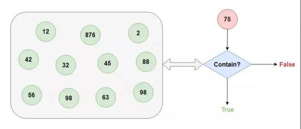
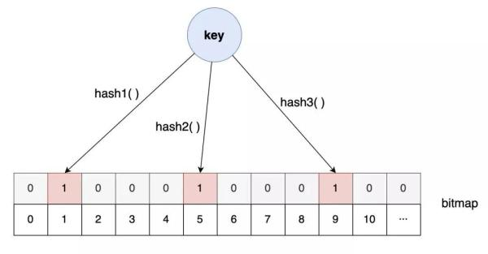

# Bloom filter

在阅读 developer.51cto [高性能开发的“十大武器”，爱了爱了！#**缓存技术&布隆过滤器**](https://developer.51cto.com/art/202011/630654.htm)  时，发现的bloom filter；

参考文章:

1、developer.51cto [高性能开发的“十大武器”，爱了爱了！#**缓存技术&布隆过滤器**](https://developer.51cto.com/art/202011/630654.htm) 

2、jianshu [布隆过滤器(Bloom Filter)的原理和实现](https://www.jianshu.com/p/88c6ac4b38c8)

3、csdn [Bloom Filter概念和原理](https://blog.csdn.net/jiaomeng/article/details/1495500)

4、wikipedia [Bloom filter](https://en.wikipedia.org/wiki/Bloom_filter)

5、geeksforgeeks [Bloom Filters – Introduction and Implementation](https://www.geeksforgeeks.org/bloom-filters-introduction-and-python-implementation/)

## developer.51cto [高性能开发的“十大武器”，爱了爱了！#**缓存技术&布隆过滤器**](https://developer.51cto.com/art/202011/630654.htm) 

> 在 developer.51cto [高性能开发的“十大武器”，爱了爱了！](https://developer.51cto.com/art/202011/630654.htm) 中，对Bloom filter有着比较好的介绍:

有了**缓存系统**，我们就可以在向数据库请求之前，先询问**缓存系统**是否有我们需要的数据，如果有且满足需要，我们就可以省去一次数据库的查询，如果没有，我们再向数据库请求。

注意，这里有一个关键的问题，如何判断我们要的数据是不是在**缓存系统**中呢?

进一步，我们把这个问题抽象出来：如何快速判断一个数据量很大的集合中是否包含我们指定的数据?

这个时候，就是**布隆过滤器**大显身手的时候了，它就是为了解决这个问题而诞生的。那**布隆过滤器**是如何解决这个问题的呢?

先回到上面的问题中来，这其实是一个**查找问题**，对于**查找问题**，最常用的解决方案是**搜索树**和**哈希表**两种方案。

因为这个问题有两个关键点：**快速**、**数据量**很大。

**树结构**首先得排除，哈希表倒是可以做到常数阶的性能，但数据量大了以后，一方面对**哈希表**的**容量**要求巨大，另一方面如何设计一个好的**哈希算法**能够做到如此大量数据的哈希映射也是一个难题。

对于**容量**的问题，考虑到只需要判断对象是否存在，而并非拿到对象，我们可以将**哈希表**的**表项**大小设置为 1 个 bit，1 表示存在，0 表示不存在，这样大大缩小**哈希表**的容量。

而对于**哈希算法**的问题，如果我们对**哈希算法**要求低一些，那**哈希碰撞**的机率就会增加。

那一个**[哈希算法](https://www.scaler.com/topics/data-structures/hashing-in-data-structure/)**容易冲突，那就多弄几个，多个哈希函数同时冲突的概率就小的多。

**布隆过滤器**就是基于这样的设计思路：

当设置对应的 key-value 时，按照一组哈希算法的计算，将对应比特位置 1。

但当对应的 key-value 删除时，却不能将对应的比特位置 0，因为保不准其他某个 key 的某个哈希算法也映射到了同一个位置。

也正是因为这样，引出了布隆过滤器的另外一个重要特点：布隆过滤器判定存在的实际上不一定存在，但判定不存在的则一定不存在。

## wikipedia [Bloom filter](https://en.wikipedia.org/wiki/Bloom_filter)

> https://en.wanweibaike.com/wiki-Bloom%20Filter

### Algorithm description

> NOTE: 
>
> 一、从下面的描述来看，bloom filter的原理是相对比较简单的
>
> 

An *empty Bloom filter* is a [bit array](https://en.wanweibaike.com/wiki-Bit_array) of *m* bits, all set to 0. There must also be *k* different [hash functions](https://en.wanweibaike.com/wiki-Hash_function) defined, each of which [maps](https://en.wanweibaike.com/wiki-Map_(mathematics)) or hashes some set element to one of the *m* array positions, generating a uniform random distribution. Typically, *k* is a small constant which depends on the desired false error rate *ε*, while *m* is proportional to *k* and the number of elements to be added.

> NOTE: 
>
> 如何计算 "false error rate *ε*"，参见后面的 "Probability of false positives" 章节。
>
> 

To *add* an element, feed it to each of the *k* hash functions to get *k* array positions. Set the bits at all these positions to 1.

To *query* for an element (test whether it is in the set), feed it to each of the *k* hash functions to get *k* array positions. If *any* of the bits at these positions is 0, the element is definitely not in the set; if it were, then all the bits would have been set to 1 when it was inserted. If all are 1, then either the element is in the set, *or* the bits have by chance been set to 1 during the insertion of other elements, resulting in a [false positive](https://en.wanweibaike.com/wiki-False_positive). 

> NOTE:
>
> 一、"false positive"即"假阳性"，即原本不属于集合中，但是被错误地判断为属于集合中了，通过上面的介绍可知，导致它的原因是非常简单的；
>
> 更多关于false positive，参见: zhidao [什么是False Positive和False Negative](https://zhidao.baidu.com/question/497731425534941924.html)
>
> 

In a simple Bloom filter, there is no way to distinguish between the two cases, but more advanced techniques can address this problem.

### Probability of false positives

> NOTE: 
>
> 一个不属于集合中的元素被错误地判定为属于集合中，这就是false positive，它的原因是: 它的所有的slot都被其他的元素置为1了，从而导致了错误的判定；
>
> 那它的概率大小如何计算呢？这是本节讨论的话题。
>
> 

**分析方式一**

> NOTE: 
>
> 这种分析方式的相对简单、容易理解、不需要太多的数学知识，它的前提: 
>
> > Assume that a [hash function](https://en.wanweibaike.com/wiki-Hash_function) selects each array position with equal probability
>
> 因此，"If *m* is the number of bits in the array, the probability that a certain bit is set to 1 by a certain hash function during the insertion of an element is"
> $$
> {\displaystyle {\frac {1}{m}}.}
> $$

Assume that a [hash function](https://en.wanweibaike.com/wiki-Hash_function) selects each array position with equal probability. If *m* is the number of bits in the array, the probability that a certain bit is not set to 1 by a certain hash function during the insertion of an element is
$$
1-{\frac {1}{m}}
$$
If *k* is the number of hash functions and each has no significant correlation between each other, then the probability that the bit is not set to 1 by any of the hash functions is
$$
{\displaystyle \left(1-{\frac {1}{m}}\right)^{k}.}
$$
We can use the well-known identity for [*e*](https://en.wanweibaike.com/wiki-E_(mathematical_constant))−1
$$
{\displaystyle \lim _{m\to \infty }\left(1-{\frac {1}{m}}\right)^{m}={\frac {1}{e}}}
$$
to conclude that, for large *m*,
$$
{\displaystyle \left(1-{\frac {1}{m}}\right)^{k}=\left(\left(1-{\frac {1}{m}}\right)^{m}\right)^{k/m}\approx e^{-k/m}.}
$$

> NOTE: 
>
> 仅仅和$k$、$m$ 有关

If we have inserted *n* elements, the probability that a certain bit is still 0 is
$$
{\displaystyle \left(1-{\frac {1}{m}}\right)^{kn}\approx e^{-kn/m};}
$$
the probability that it is 1 is therefore
$$
{\displaystyle 1-\left(1-{\frac {1}{m}}\right)^{kn}\approx 1-e^{-kn/m}.}
$$
Now test membership of an element that is not in the set. Each of the *k* array positions computed by the hash functions is 1 with a probability as above. The probability of all of them being 1, which would cause the [algorithm](https://en.wanweibaike.com/wiki-Algorithm) to erroneously claim that the element is in the set, is often given as
$$
{\displaystyle \varepsilon =\left(1-\left[1-{\frac {1}{m}}\right]^{kn}\right)^{k}\approx \left(1-e^{-kn/m}\right)^{k}.}
$$
This is not strictly correct as it assumes independence for the probabilities of each bit being set. However, assuming it is a close approximation we have that the probability of false positives decreases as *m* (the number of bits in the array) increases, and increases as *n* (the number of inserted elements) increases.

#### Optimal number of hash functions

> NOTE: 
>
> 一、如何计算得到"Optimal number of hash functions"呢？其实思路是比较简单的: 让 "Probability of false positives" 的值最小时，k的值就是"Optimal number of hash functions"
>
> 二、推导过程是比较复杂的

The number of hash functions, *k*, must be a positive integer. Putting this constraint aside, for a given *m* and *n*, the value of *k* that minimizes the false positive probability is
$$
{\displaystyle k={\frac {m}{n}}\ln 2.}
$$

### Examples

> NOTE: 
>
> 通过下面列举的例子可以看出，bloom filter有着广泛的应用
