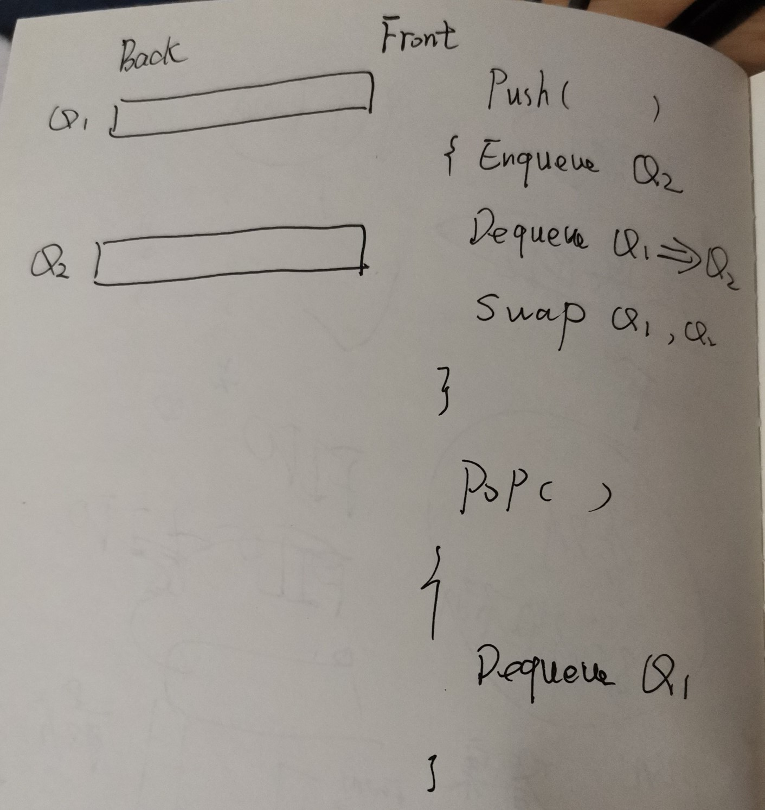

# Stack and queue

两者的order正好相反，因此当使用对方来实现的时候，往往需要使用一个temporary来协助反转。

## Implement Stack using Queues

一、需要使用两个queue(`Q1`、`Q2`)，`Q2`作为temporary，有两种策略:

策略一、当使用queue来实现stack的时候，每次`push`一个element，由于stack是LIFO，因此，要将它放到existing elements的前面。可以先将这个新的element放到temporary empty queue `Q2` (`Q2.Enqueue`)，显然此时它就是这个queue的front，然后将`Q1`中所有existing element逐个dequeue到`Q2`中，这样这个新增的element就位于所有的existing element的前面了(队列是能够保证有序的)；然后`swap(Q1, Q2)`。

当`pop`的时候，直接`Q1.Dequeue`。




策略二、每次`push`一个element，直接`Q1.Enqueue`；

`pop`的时候，首先将`Q1`中所有existing element逐个dequeue到`Q2`中，直至最后一个元素，将这个元素作为返回值；然后`swap(Q1, Q2)`。


### geeksforgeeks [Implement Stack using Queues](https://www.geeksforgeeks.org/implement-stack-using-queue/)


**Method 1 (By making push operation costly)**

```C++
/* Program to implement a stack using
 two queue */
#include <bits/stdc++.h>

using namespace std;

class Stack
{
	// Two inbuilt queues
	queue<int> q1, q2;

	// To maintain current number of
	// elements
	int curr_size;

public:
	Stack()
	{
		curr_size = 0;
	}

	void push(int x)
	{
		curr_size++;

		// Push x first in empty q2
		q2.push(x);

		// Push all the remaining
		// elements in q1 to q2.
		while (!q1.empty())
		{
			q2.push(q1.front());
			q1.pop();
		}

		// swap the names of two queues
		queue<int> q = q1;
		q1 = q2;
		q2 = q;
	}

	void pop()
	{

		// if no elements are there in q1
		if (q1.empty())
			return;
		q1.pop();
		curr_size--;
	}

	int top()
	{
		if (q1.empty())
			return -1;
		return q1.front();
	}

	int size()
	{
		return curr_size;
	}
};

// Driver code
int main()
{
	Stack s;
	s.push(1);
	s.push(2);
	s.push(3);

	cout << "current size: " << s.size() << endl;
	cout << s.top() << endl;
	s.pop();
	cout << s.top() << endl;
	s.pop();
	cout << s.top() << endl;

	cout << "current size: " << s.size() << endl;
	return 0;
}
// This code is contributed by Chhavi
// g++ test.cpp -pedantic -Wall -Wextra

```

**Method 2 (By making pop operation costly)**

```C++
/* Program to implement a stack
 using two queue */
#include <bits/stdc++.h>
using namespace std;

class Stack
{
	queue<int> q1, q2;
	int curr_size;

public:
	Stack()
	{
		curr_size = 0;
	}

	void pop()
	{
		if (q1.empty())
			return;

		// Leave one element in q1 and
		// push others in q2.
		while (q1.size() != 1)
		{
			q2.push(q1.front());
			q1.pop();
		}

		// Pop the only left element
		// from q1
		q1.pop();
		curr_size--;

		// swap the names of two queues
		queue<int> q = q1;
		q1 = q2;
		q2 = q;
	}

	void push(int x)
	{
		q1.push(x);
		curr_size++;
	}

	int top()
	{
		if (q1.empty())
			return -1;

		while (q1.size() != 1)
		{
			q2.push(q1.front());
			q1.pop();
		}

		// last pushed element
		int temp = q1.front();

		// to empty the auxiliary queue after
		// last operation
		q1.pop();

		// push last element to q2
		q2.push(temp);

		// swap the two queues names
		queue<int> q = q1;
		q1 = q2;
		q2 = q;
		return temp;
	}

	int size()
	{
		return curr_size;
	}
};

// Driver code
int main()
{
	Stack s;
	s.push(1);
	s.push(2);
	s.push(3);
	s.push(4);

	cout << "current size: " << s.size() << endl;
	cout << s.top() << endl;
	s.pop();
	cout << s.top() << endl;
	s.pop();
	cout << s.top() << endl;
	cout << "current size: " << s.size() << endl;
	return 0;
}
// This code is contributed by Chhavi

```


## Implement Queue using Stack


### geeksforgeeks [Queue using Stacks](https://www.geeksforgeeks.org/queue-using-stacks/)


**Method 2 (By making deQueue operation costly)**In this method, in en-queue operation, the new element is entered at the top of stack1. In de-queue operation, if stack2 is empty then all the elements are moved to stack2 and finally top of stack2 is returned.

> NOTE: 
>
> 一、将两个stack串联起来，就形成了一个queue:
>
> 1、enqueue总是push到s1；dequeue总是从s2中pop，当s2为空的时候，就将s1中的所有元素弹到s2中，由于栈有reverse的功能，因此此时s2中的元素的出栈顺序是符合dequeue的要求的。

```
enQueue(q,  x)
  1) Push x to stack1 (assuming size of stacks is unlimited).
Here time complexity will be O(1)

deQueue(q)
  1) If both stacks are empty then error.
  2) If stack2 is empty
       While stack1 is not empty, push everything from stack1 to stack2.
  3) Pop the element from stack2 and return it.
Here time complexity will be O(n)
```

Method 2 is definitely better than method 1.

Method 1 moves all the elements twice in enQueue operation, while method 2 (in deQueue operation) moves the elements once and moves elements only if stack2 empty. So, the amortized complexity of the dequeue operation becomes .

Implementation of method 2:


```C++
// CPP program to implement Queue using
// two stacks with costly deQueue()
#include <bits/stdc++.h>
using namespace std;

struct Queue {
	stack<int> s1, s2;

	// Enqueue an item to the queue
	void enQueue(int x)
	{
		// Push item into the first stack
		s1.push(x);
	}

	// Dequeue an item from the queue
	int deQueue()
	{
		// if both stacks are empty
		if (s1.empty() && s2.empty()) {
			cout << "Q is empty";
			exit(0);
		}

		// if s2 is empty, move
		// elements from s1
		if (s2.empty()) {
			while (!s1.empty()) {
				s2.push(s1.top());
				s1.pop();
			}
		}

		// return the top item from s2
		int x = s2.top();
		s2.pop();
		return x;
	}
};

// Driver code
int main()
{
	Queue q;
	q.enQueue(1);
	q.enQueue(2);
	q.enQueue(3);

	cout << q.deQueue() << '\n';
	cout << q.deQueue() << '\n';
	cout << q.deQueue() << '\n';

	return 0;
}

```