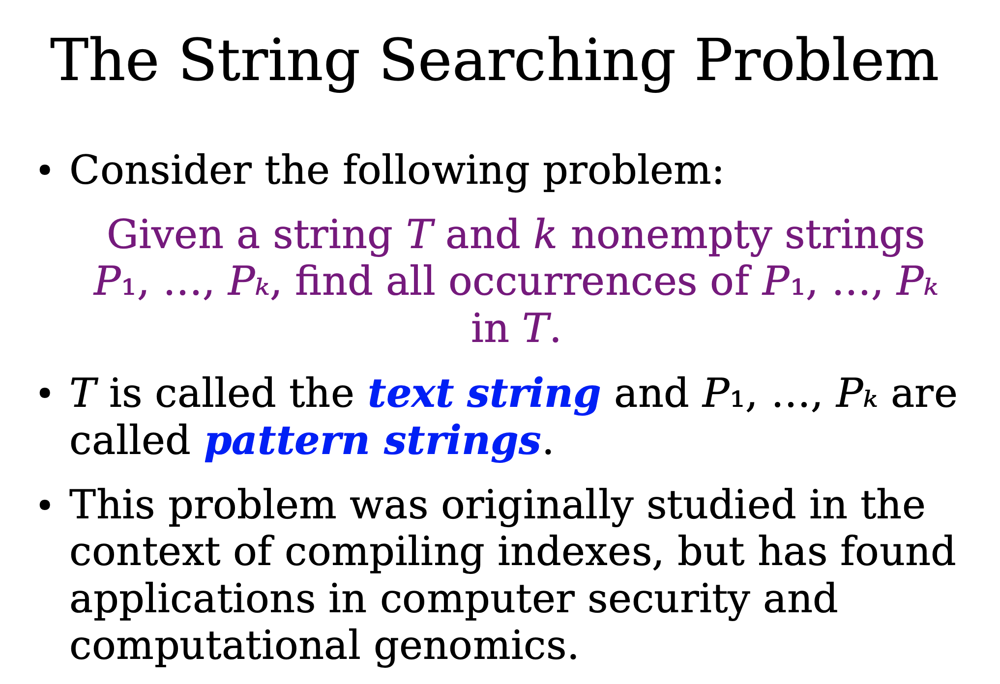
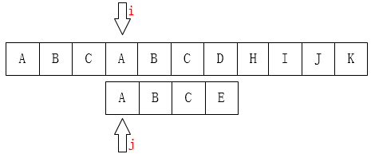
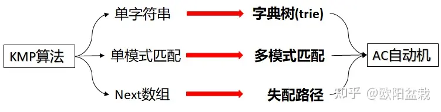

# [Knuth–Morris–Pratt algorithm](https://en.wikipedia.org/wiki/Knuth%E2%80%93Morris%E2%80%93Pratt_algorithm)、[Aho–Corasick algorithm](https://en.wikipedia.org/wiki/Aho%E2%80%93Corasick_algorithm) 

它们是典型的string-searching algorithm:

wikipedia [string-searching algorithm](https://en.wikipedia.org/wiki/String-searching_algorithm) :

> In [computer science](https://en.wikipedia.org/wiki/Computer_science), **string-searching algorithms**, sometimes called **string-matching algorithms**, are an important class of [string algorithms](https://en.wikipedia.org/wiki/String_algorithms) that try to find a place where one or several [strings](https://en.wikipedia.org/wiki/String_(computer_science)) (also called patterns) are found within a larger string or text.

[stanford-cs166](https://web.stanford.edu/class/cs166/)




- [Knuth–Morris–Pratt algorithm](https://en.wikipedia.org/wiki/Knuth%E2%80%93Morris%E2%80%93Pratt_algorithm): pattern

- [Aho–Corasick algorithm](https://en.wikipedia.org/wiki/Aho%E2%80%93Corasick_algorithm): patterns、dictionary


## [Knuth–Morris–Pratt algorithm](https://en.wikipedia.org/wiki/Knuth%E2%80%93Morris%E2%80%93Pratt_algorithm) 

---

> References: 
>
> cnblogs [详解KMP算法](https://www.cnblogs.com/yjiyjige/p/3263858.html) 
>
> wikipedia [Knuth–Morris–Pratt algorithm](https://en.wikipedia.org/wiki/Knuth%E2%80%93Morris%E2%80%93Pratt_algorithm) 

---


### wikipedia [Knuth–Morris–Pratt algorithm](https://en.wikipedia.org/wiki/Knuth%E2%80%93Morris%E2%80%93Pratt_algorithm)

In [computer science](https://en.wikipedia.org/wiki/Computer_science), the **Knuth–Morris–Pratt [string-searching algorithm](https://en.wikipedia.org/wiki/String-searching_algorithm)** (or **KMP algorithm**) searches for occurrences of a "word" `W` within a main "text string" `S` by employing the observation that when a mismatch occurs, the word itself embodies sufficient information to determine where the next match could begin, thus bypassing re-examination of previously matched characters.

The [algorithm](https://en.wikipedia.org/wiki/Algorithm) was conceived by [James H. Morris](https://en.wikipedia.org/wiki/James_H._Morris) and independently discovered by [Donald Knuth](https://en.wikipedia.org/wiki/Donald_Knuth) "a few weeks later" from [automata theory](https://en.wikipedia.org/wiki/Automata_theory).[[1\]](https://en.wikipedia.org/wiki/Knuth–Morris–Pratt_algorithm#cite_note-knuth1977-2)[[2\]](https://en.wikipedia.org/wiki/Knuth–Morris–Pratt_algorithm#cite_note-3) Morris and [Vaughan Pratt](https://en.wikipedia.org/wiki/Vaughan_Pratt) published a technical report in 1970.[[3\]](https://en.wikipedia.org/wiki/Knuth–Morris–Pratt_algorithm#cite_note-4) The three also published the algorithm jointly in 1977.[[1\]](https://en.wikipedia.org/wiki/Knuth–Morris–Pratt_algorithm#cite_note-knuth1977-2) Independently, in 1969, [Matiyasevich](https://en.wikipedia.org/wiki/Yuri_Matiyasevich)[[4\]](https://en.wikipedia.org/wiki/Knuth–Morris–Pratt_algorithm#cite_note-5)[[5\]](https://en.wikipedia.org/wiki/Knuth–Morris–Pratt_algorithm#cite_note-6) discovered a similar algorithm, coded by a two-dimensional Turing machine, while studying a string-pattern-matching recognition problem over a binary alphabet. This was the first linear-time algorithm for string matching.


### Code

#### Python

```python
def get_failure_array(pattern: str):
    failure = [0]  # 初始条件
    i = 0  
    j = 1  
    while j < len(pattern):
        if pattern[i] == pattern[j]:
            i += 1
        elif i > 0:
            i = failure[i - 1]
            continue
        j += 1
        failure.append(i)
    return failure


def kmp_search(pattern: str, text: str):
    """

    :param pattern:
    :param text:
    :return:
    """
    # 1) Construct the failure array
    failure = get_failure_array(pattern)

    # 2) Step through text searching for pattern
    i, j = 0, 0  # index into text, pattern
    while i < len(text):
        if pattern[j] == text[i]:
            if j == (len(pattern) - 1):
                return True
            j += 1
        elif j > 0:
            # if this is a prefix in our pattern
            # just go back far enough to continue
            j = failure[j - 1]
            continue
        i += 1
    return False


if __name__ == "__main__":
    pass

```


#### C++

```c++
class Solution
{
public:
  int strStr(string haystack, string needle)
  {
    if (needle.empty())
    {
      return 0;
    }
    else
    {
      return kmp(haystack, needle);
    }
  }
  int kmp(const string &haystack, const string &needle)
  {
    auto failureArray = getFailureArray(needle);
    int i = 0, j = 0;
    while (i < haystack.size())
    {
      if (haystack[i] == needle[j])
      {
        if (j == needle.size() - 1)
        {
          return i - j;
        }
        ++j;
      }
      else if (j > 0)
      {
        j = failureArray[j - 1];
        continue;
      }
      ++i;
    }
    return -1;
  }
  std::vector<int> getFailureArray(const string &needle)
  {
    std::vector<int> failureArray(needle.size());
    int i = 0, j = 1;
    while (j < needle.size())
    {
      if (needle[i] == needle[j])
      {
        ++i;
      }
      else if (i > 0)
      {
        i = failureArray[i - 1];
        continue;
      }
      failureArray[j++] = i;
    }
    return failureArray;
  }
};
```


### KMP的核心思想

KMP的核心思想是: 充分利用已匹配的substring(matched substring)的信息，已匹配的substring是pattern的左部分(因为是从左到右进行匹配)。当mismatch的时候，如何移动 `j` 指针。

> NOTE:
>
> 在大脑中将 `pattern` 想象成沿着 `text` 进行滑动，就像游标卡尺的游标一样，下面是一个例子:
>
> Without KMP:
>
>  
>
> 
>
> 
>
> With KMP:
>
> 如果是人为来寻找的话，肯定不会再把`i`移动回第1位，**因为主串匹配失败的位置前面除了第一个`A`之外再也没有`A`**了，我们为什么能知道主串前面只有一个`A`？**因为我们已经知道前面三个字符都是匹配的！（这很重要）**。移动过去肯定也是不匹配的！有一个想法，`i`可以不动，我们只需要移动`j`即可，如下图：
>
>  
>
> 一、显然上面这种匹配方式能够跳过很多的无意义的匹配，因为 `txt` 匹配失败的部分没有A，最为对比，可以可以尝试使用native算法进行匹配，可以发现是会进行很多无意义的匹配。
>
> 二、这个就是一个典型的说明i指针不需要回溯的例子，当失配的时候，`i` 指针是不需要移动的，仅仅移动 `j` 指针即可。

关于此，在下面文章中有着总结:

- cnblogs [详解KMP算法](https://www.cnblogs.com/yjiyjige/p/3263858.html) 中的描述:

> “**利用已经部分匹配这个有效信息，保持`i`指针不回溯，通过修改`j`指针，让模式串尽量地移动到有效的位置**。”

指针i不回溯，意味着它是一直增大的，这样的做法能够保证跳过无意义的匹配过程。

- 百度百科[kmp算法](https://baike.baidu.com/item/kmp%E7%AE%97%E6%B3%95/10951804?fr=aladdin)中的总结：

> 用暴力算法匹配字符串过程中，我们会把`T[0]` 跟 `W[0]` 匹配，如果相同则匹配下一个字符，直到出现不相同的情况，此时我们会丢弃前面的匹配信息，然后把`T[1]` 跟 `W[0]`匹配，循环进行，直到主串结束，或者出现匹配成功的情况。这种丢弃前面的匹配信息的方法，极大地降低了匹配效率。
>
> 而在KMP算法中，对于每一个模式串我们会事先计算出模式串的内部匹配信息，在匹配失败时最大的移动模式串，以减少匹配次数。
>
> 比如，在简单的一次匹配失败后，我们会想将模式串尽量的右移和主串进行匹配。右移的距离在KMP算法中是如此计算的：在**已经匹配的模式串子串**中，找出最长的相同的[前缀](https://baike.baidu.com/item/前缀)和[后缀](https://baike.baidu.com/item/后缀)，然后移动使它们重叠。


```
ABCABCDHIJK
ABCE
```

### Failure function

---

> References: 
>
> wikipedia [Knuth–Morris–Pratt algorithm # "Partial match" table (also known as "failure function")](https://en.wikipedia.org/wiki/Knuth%E2%80%93Morris%E2%80%93Pratt_algorithm#%22Partial_match%22_table_(also_known_as_%22failure_function%22)) 
>
> wikipedia [Substring # prefix](https://en.wikipedia.org/wiki/Substring#Prefix) 
>
> wikipedia [Substring # suffix](https://en.wikipedia.org/wiki/Substring#Suffix) 

---

Longest common prefix and suffix，显然所为common指的是两者的公共部分、重叠部分，无论string search还是KMP build failure function，都可以看作是在寻找公共部分、重叠部分。

prefix可以看作是pattern、suffix可以看作是text

一、Failure array以array的方式非常紧凑地来存储DFA，它的DFA的完整形式在 zhihu [KMP 算法详解](https://zhuanlan.zhihu.com/p/83334559) 中有展示。


二、明确数组的定义:

`next[i]` 表示的是: 最长公共前缀后缀的长度( `k` )，因此在计算failure array的时候是涉及到长度和下标的转换的。


三、计算 next/failure array 的过程其实与匹配 `txt` 和 `pattern` 的过程非常类似: 寻找最长公共**前缀**和**后缀**其实就是匹配**前缀子字符串** 和 **后缀子字符串**，**前缀子字符串**相当于`pattern`，**后缀子字符串** 相当于 `txt`，下面的图就非常形象地展示了这个过程，这就告诉我们在计算 next/failure array 的时候，是可以使用kmp的思想来进行实现的:

1、当 `pattern[k]` 和 `pattern[j]` 相等的时候:

> 这种情况是非常容易理解的


2、当 `pattern[k]` 和 `pattern[j]` 不相等的时候:

> 当`P[k] != P[j]`时，如下图所示：
>
>  
>
> 
>
> 像这种情况，如果你从代码上看应该是这一句：`k = next[k];`为什么是这样子？你看下面应该就明白了。
>
> 
>
> 现在你应该知道为什么要`k = next[k]`了吧！像上边的例子，我们已经不可能找到`[ A，B，A，B ]`这个最长的后缀串了，但我们还是可能找到`[ A，B ]`、`[ A ]`这样的前缀串的。所以这个过程像不像在定位`[ A，B，A，C ]`这个串，当`C`和主串不一样了（也就是`k`位置不一样了），那当然是把指针移动到`next[k]`啦。


上述第二行的图，就是以"KMP匹配" 的过程来展示计算 next/failure array 的过程: 

当  `P[k] != P[j]`，显然就是失配了，因此 `[ A，B，A，B ]` 不可能是最长的后缀串，那下次从什么地方开始匹配呢？即如何进行转移呢？显然这个匹配过程是可以转换为"KMP匹配"过程，正如上述第二行的图所展示的，显然我们要充分运用KMP的思想: 此时 `[0-k-1]`部分 和 `[j-k, j-1]`部分是已经匹配的，为了充分运用已经匹配的信息，我们应该转移到 `next[k]` 处进行匹配，就是上述第三张图所展示的。上述过程其实使用了KMP的思想，也就是说，在计算next/failure array的时候，其实也使用了KMP的思想。


关于这一点，另外一种验证方式是通过代码来进行验证，阅读完整的KMP算法可知: `get_failure_array` 和 `kmp_search` 在失配时的处理逻辑一模一样。


四、计算failure array的过程是KMP算法的精妙之处，它涉及:

1、当 **匹配** 的时候: 向前、expand

2、当 **失配** 的时候: 向后、reduce

五、在 cnblogs [详解KMP算法](https://www.cnblogs.com/yjiyjige/p/3263858.html) 中使用数学语言来进行定义。


六、算法思想:

1、double pointer

2、dynamic programming、recursion

KMP的failure function的求解过程在计算`f(k+1)`的时所依赖的`f(0),f(1)...,f(k)`都是通过查failure table而获得的，而不是重新计算，这其实就是动态规划算法的思想。在上述代码中，`i`就表示计算`f(k+1)`所依赖的数据，它的实现方式是非常类似于迭代版的斐波那契数列。

#### Python实现

一、failure function `f(j)`表示的是从 `pattern[0-j]` 的序列（显然这个序列的长度是`j+1`）的**最长公共前缀后缀**的**长度**，即`f(j)`所表示的是长度为`j+1`的序列的最长公共前缀后缀的长度。

base case: `f[0]==0`，因为长度为1的序列的最长前缀后缀的长度为0。

二、在这个程序中，`i`表示"公共前缀子字符串的长度"，根据长度和下标的对应关系可知，`i`始终指向的是 **下一个待匹配的字符** 。

三、该算法是典型的fast-slow double pointer，`i` 是 slow pointer，`j` 是 fast pointer，与此类似的使用fast-slow double pointer来处理array的algorithm，在下面的文章中有介绍：

1、labuladong [如何高效对有序数组/链表去重？](https://mp.weixin.qq.com/s/6Eb7gKqNqXH9B0hSZvMs5A)

2、labuladong  [双指针技巧秒杀四道数组/链表题目](https://mp.weixin.qq.com/s/55UPwGL0-Vgdh8wUEPXpMQ)

```python
def get_failure_array(pattern: str):
    """

    """
    failure_array = [0]  # failure array，f[0]已知
    i = 0  # i表示的是当前的公共前后缀的长度，当前j为0，所以它的初始值是0
    j = 1  # j表示的是index，因为f[0]已知，所以j从1开始
    while j < len(pattern):
        if pattern[i] == pattern[j]:
            i += 1
        elif i > 0:  # 失配
            i = failure_array[i - 1] # 拿到已经匹配部分[0~i-1]的公共前缀后缀的长度
            continue
        j += 1
        failure_array.append(i)
    return failure_array

```


#### Examples


Example1

```
Position:    012345
P:           abacab
```

| 0    | 1    | 2    | 3    | 4    | 5    |
| ---- | ---- | ---- | ---- | ---- | ---- |
| 0    | 0    | 1    | 0    | 1    | 2    |


Example2

```
Position:    012345678
P:           ababcabab
```

| 0    | 1    | 2    | 3    | 4    | 5    | 6    | 7    | 8    |
| ---- | ---- | ---- | ---- | ---- | ---- | ---- | ---- | ---- |
| 0    | 0    | 1    | 2    | 0    | 1    | 2    | 3    | 4    |


Example3

```
Position:    012345678
P:           ababcabab
```

| 0    | 1    | 2    | 3    | 4    | 5    | 6    | 7    | 8    |
| ---- | ---- | ---- | ---- | ---- | ---- | ---- | ---- | ---- |
| 0    | 0    | 1    | 2    | 0    | 1    | 2    | 3    | 4    |


Example3

```
Position:    0123456789
P:           ABACDABABC
```

| 0    | 1    | 2    | 3        | 4    | 5    | 6    | 7    | 8    | 9    |
| ---- | ---- | ---- | -------- | ---- | ---- | ---- | ---- | ---- | ---- |
| 0    | 0    | 1    | f(1)=0;0 | 0    | 1    | 2    | 3    | 2    | 0    |

这个例子非常好。


### LeetCode


#### [LeetCode-1392. 最长快乐前缀-困难](https://leetcode.cn/problems/longest-happy-prefix/) 

一、这道题就是纯粹的使用KMP failure array。

二、这道题给我的一新认知是: KMP求解的最长公共前缀后缀是可以相交的，下面是一个典型的例子: 

```
输入：s = "ababab"
输出："abab"
```


```c++
class Solution
{
public:
    string longestPrefix(string s)
    {
        vector<int> failure_array(s.size(), 0);
        int i = 0, j = 1;
        while (j < s.size())
        {
            if (s[i] == s[j])
            {
                i += 1;
            }
            else if (i > 0)
            {
                i = failure_array[i - 1];
                continue;
            }
            failure_array[j++] = i;
        }
        return s.substr(0, failure_array.back());
    }
};
```


## [Aho–Corasick algorithm](https://en.wikipedia.org/wiki/Aho%E2%80%93Corasick_algorithm) 

---

> References: 
>
> - wikipedia [Aho–Corasick algorithm](https://en.wikipedia.org/wiki/Aho%E2%80%93Corasick_algorithm) 
> - geeksforgeeks [Aho-Corasick Algorithm for Pattern Searching](https://www.geeksforgeeks.org/aho-corasick-algorithm-pattern-searching/) 
> - cp-algorithms [Aho-Corasick algorithm](https://cp-algorithms.com/string/aho_corasick.html) 
> - [stanford-cs166.1166-Aho-Corasick Automata](https://web.stanford.edu/class/archive/cs/cs166/cs166.1166/lectures/02/Slides02.pdf) (good)

---

tag-[automaton=自动机]-[Aho-Corasick-algorithm=AC-automaton]-[KMP-failure-function+trie]-BFS

### Terminology

proper suffix

suffix link、failure link

terminal link

### 算法概述

充分利用已经匹配的信息。

$pattern_i$ 的后缀(suffix)和 $pattern_j$ 的prefix重合，则可构建fail link。


#### Is [Aho–Corasick automaton](https://en.wikipedia.org/wiki/Aho%E2%80%93Corasick_algorithm) an [epsilon-NFA](https://en.wikipedia.org/wiki/Nondeterministic_finite_automaton#NFA_with_%CE%B5-moves) ?

在 [zhihu-Aho-Corasick算法纵览（AC自动机）](https://zhuanlan.zhihu.com/p/368184958) 中，有这样一段评论:

> 纠正一下：AC自动机不是DFA，而是epsilon-NFA，fail指针对应的就是空转换操作。

思考: failure link对应的是 [epsilon transition](https://en.wikipedia.org/wiki/Epsilon_transition) ？

gpt-4-vision: Is Aho–Corasick failure link a epsilon-transition?

> No, the **failure link** in the **Aho–Corasick automaton** is not an **epsilon-transition**. In an **epsilon-NFA** (**epsilon-Non-deterministic Finite Automaton**), an **epsilon-transition** allows the automaton to change its state without consuming any input symbols. In contrast, the **Aho–Corasick automaton** is a **deterministic finite automaton** (DFA), and all **state transitions**, including those via **failure links**, are triggered by actual input symbols.
>
> The **failure link** in the **Aho–Corasick automaton** serves a different purpose. When the automaton is in a given state and reads an input symbol that does not match any outgoing transition from that state, it follows the **failure link** to another state. **This other state represents the longest proper suffix of the string recognized by the current state that is also a prefix of another pattern in the set of patterns being matched**. The automaton then checks for a transition from this new state using the same input symbol.
>
> The key point is that **failure links** are followed only after an input symbol has been read and no matching transition is found in the current state. This is fundamentally different from **epsilon-transitions**, which do not require any input symbol to be read.
>
> The **Aho–Corasick automaton** uses **failure links** to efficiently backtrack and find the next possible match without re-reading the input text, allowing the algorithm to perform multiple pattern matching in linear time relative to the length of the input text.

gpt-4-vision: Is Aho–Corasick automaton a epsilon-NF?

> No, the Aho–Corasick automaton is not an epsilon-NFA (epsilon-Non-deterministic Finite Automaton). The Aho–Corasick algorithm constructs a finite state machine that resembles a trie with additional links between the various internal nodes, which are called "failure links." These failure links allow the automaton to transition between different states efficiently when mismatches occur during string matching.
>
> The key characteristics of the Aho–Corasick automaton are:
>
> 1. **Deterministic**: Unlike epsilon-NFAs, the Aho–Corasick automaton is deterministic. For each state and input symbol, there is exactly one transition defined. This means that at any given state, given an input character, the automaton knows exactly which state to transition to without any ambiguity.
> 2. **No Epsilon Transitions**: The Aho–Corasick automaton does not use epsilon transitions (transitions that occur without consuming any input symbols). All state transitions in the Aho–Corasick automaton are triggered by actual characters in the input text.
> 3. **Failure Links**: The automaton uses failure links to redirect the search to previous states that represent the longest possible suffixes of the current string being matched. These links are followed when the current input character does not match any outgoing transition from the current state.
> 4. **Output Links**: In addition to failure links, the Aho–Corasick automaton may also have output links that point to patterns that end at the current state. These links are used to report matches found in the input text.
>
> The Aho–Corasick automaton is specifically designed for efficient multiple pattern matching and is widely used in applications such as string searching algorithms, intrusion detection systems, and bioinformatics. It allows for simultaneous matching of multiple patterns against an input text in linear time relative to the length of the input plus the number of matched entries.

output link的作用其实就是trie的 `is_end_of_word`。


#### gpt-4-vision

The **Aho-Corasick algorithm** is a string-searching algorithm that is used to find all occurrences of a set of substrings (patterns) within a text. It was invented by Alfred V. Aho and Margaret J. Corasick in 1975. The algorithm is particularly efficient when you need to search for many patterns simultaneously in a large body of text.

The **Aho-Corasick algorithm** constructs a finite state machine (trie structure) from the patterns, with additional "failure" links. This trie is then used to scan the text for matches in linear time relative to the length of the text and the number of patterns.

Here's a high-level overview of the algorithm:

1. **Preprocessing Phase**: Construct a trie from the given patterns. Each node represents a character, and each path from the root to a leaf node represents a pattern. Add **failure links** to the **trie**, which are used to fall back to the longest possible **suffix** of the current string that is also a **prefix** of a pattern.
2. **Search Phase**: Traverse the text using the trie. When a character in the text does not match any outgoing edge from the current node, follow the **failure link**. If a **leaf node** is reached, a match is found. Record the match and continue the search.


### wikipedia [Aho–Corasick algorithm](https://en.wikipedia.org/wiki/Aho%E2%80%93Corasick_algorithm) 

It is a kind of **dictionary-matching [algorithm](https://en.wikipedia.org/wiki/Algorithm)** that locates elements of a finite set of strings (the "dictionary") within an input text. 

Informally, the algorithm constructs a [finite-state machine](https://en.wikipedia.org/wiki/Finite-state_machine) that resembles a [trie](https://en.wikipedia.org/wiki/Trie) with additional links between the various internal nodes. These extra internal links allow fast transitions between failed string matches (e.g. a search for `cart` in a trie that does not contain `cart`, but contains `art`, and thus would fail at the node prefixed by `car`), to other branches of the trie that share a common suffix (e.g., in the previous case, a branch for `attribute` might be the best lateral transition). This allows the automaton to transition between string matches without the need for backtracking.

> NOTE:
>
> 一、上面这段话中的例子没有理解
>
> 二、在 [zhihu-Aho-Corasick算法纵览（AC自动机）](https://zhuanlan.zhihu.com/p/368184958) 中将该algorithm描述为:
>
> > 一棵带有“失配指针”的字典树(Trie) 

#### Example

In this example, we will consider a dictionary consisting of the following words: {`a`, `ab`, `bab`, `bc`, `bca`, `c`, `caa`}. 


### Code

https://github.com/WojciechMula/pyahocorasick

#### gpt-4-vision

The **Aho-Corasick algorithm** is not implemented in Python's standard library, but you can write your own implementation or use third-party libraries that provide it. Below is a simplified version of the Aho-Corasick algorithm in Python:

```python
import unittest
from collections import deque
from typing import *


class AhoCorasickAutomataNode:
    def __init__(self, value: str = ''):
        self.value: str = value  # 当前node对应的substring
        self.next_states: Dict[str, AhoCorasickAutomataNode] = {}  # children
        self.fail_state: Optional[AhoCorasickAutomataNode] = None  # suffix link
        self.output: List[str] = []  # output link


class AhoCorasickAutomata:
    def __init__(self):
        self.root: AhoCorasickAutomataNode = AhoCorasickAutomataNode()

    def add_word(self, word: str):
        node = self.root
        for char in word:
            if char not in node.next_states:
                node.next_states[char] = AhoCorasickAutomataNode(node.value + char)
            node = node.next_states[char]
        node.output.append(word)

    def build_failure_states(self):
        queue = deque()
        for node in self.root.next_states.values():
            queue.append(node)
            node.fail_state = self.root

        while queue:
            current_node: AhoCorasickAutomataNode = queue.popleft()
            for char, next_node in current_node.next_states.items():
                queue.append(next_node)
                fail_state_node: AhoCorasickAutomataNode = current_node.fail_state
                # root node的fail_state_node是Node，所以下面的判定条件: fail_state_node is not None 表示的是到达了root node
                while fail_state_node is not None and char not in fail_state_node.next_states:
                    fail_state_node = fail_state_node.fail_state
                next_node.fail_state = fail_state_node.next_states[char] if fail_state_node else self.root
                next_node.output += next_node.fail_state.output

    def search(self, text: str):
        node = self.root
        results = []
        for i in range(len(text)):
            while node is not None and text[i] not in node.next_states:
                node = node.fail_state
            if node is None:
                node = self.root
                continue
            node = node.next_states[text[i]]
            for pattern in node.output:
                results.append((i - len(pattern) + 1, pattern))
        return results


class TestAhoCorasickAutomatae(unittest.TestCase):
    def test_1(self):
        aho_corasick = AhoCorasickAutomata()
        patterns = ['a', 'ab', 'bc', 'aab', 'aac', 'bd']
        for pattern in patterns:
            aho_corasick.add_word(pattern)
        aho_corasick.build_failure_states()
        text = 'aabc'
        matches = aho_corasick.search(text)
        matches.sort()
        print(matches)  # Output: [(0, 'a'), (1, 'ab'), (1, 'a'), (2, 'bc'), (1, 'aab')]

        self.assertEqual(matches, [(0, 'a'), (0, 'aab'), (1, 'a'), (1, 'ab'), (2, 'bc')])

```


### LeetCode


#### [LeetCode-1032. Stream of Characters-Hard](https://leetcode.cn/problems/stream-of-characters/)

```Python
import unittest
from collections import deque
from typing import *


class AhoCorasickAutomataNode:
    def __init__(self, value: str = ''):
        self.value: str = value  # 当前node对应的substring
        self.next_states: Dict[str, AhoCorasickAutomataNode] = {}  # children
        self.fail_state: Optional[AhoCorasickAutomataNode] = None  # suffix link
        self.output: List[str] = []  # output link


class AhoCorasickAutomata:
    def __init__(self):
        self.root: AhoCorasickAutomataNode = AhoCorasickAutomataNode()

    def add_word(self, word: str):
        node = self.root
        for char in word:
            if char not in node.next_states:
                node.next_states[char] = AhoCorasickAutomataNode(node.value + char)
            node = node.next_states[char]
        node.output.append(word)

    def build_failure_states(self):
        queue = deque()
        for node in self.root.next_states.values():
            queue.append(node)
            node.fail_state = self.root

        while queue:
            current_node: AhoCorasickAutomataNode = queue.popleft()
            for char, next_node in current_node.next_states.items():
                queue.append(next_node)
                fail_state_node: AhoCorasickAutomataNode = current_node.fail_state
                # root node的fail_state_node是Node，所以下面的判定条件: fail_state_node is not None 表示的是到达了root node
                while fail_state_node is not None and char not in fail_state_node.next_states:
                    fail_state_node = fail_state_node.fail_state
                next_node.fail_state = fail_state_node.next_states[char] if fail_state_node else self.root
                next_node.output += next_node.fail_state.output

    def search(self, text: str, node: Optional[AhoCorasickAutomataNode] = None) -> Tuple[AhoCorasickAutomataNode, List]:
        node = node if node else self.root
        results = []
        for i in range(len(text)):
            while node is not None and text[i] not in node.next_states:
                node = node.fail_state
            if node is None:
                node = self.root
                continue
            node = node.next_states[text[i]]
            for pattern in node.output:
                results.append((i - len(pattern) + 1, pattern))
        return node, results


class StreamChecker:

    def __init__(self, words: List[str]):
        self.automata = AhoCorasickAutomata()
        self.automata_current_node = self.automata.root
        for word in words:
            self.automata.add_word(word)
        self.automata.build_failure_states()

    def query(self, letter: str) -> bool:
        self.automata_current_node, matches = self.automata.search(letter, self.automata_current_node)
        return len(matches) > 0

# Your StreamChecker object will be instantiated and called as such:
# obj = StreamChecker(words)
# param_1 = obj.query(letter)

```


## [Knuth–Morris–Pratt algorithm](https://en.wikipedia.org/wiki/Knuth%E2%80%93Morris%E2%80%93Pratt_algorithm)  VS [Aho–Corasick algorithm](https://en.wikipedia.org/wiki/Aho%E2%80%93Corasick_algorithm) 

Common in the two algorithm:

- 在 mismatch 的发生的时候，充分利用 pattern(proper prefix、proper suffix)、已匹配的substring(matched substring)的信息来加速匹配。

- 两者构建fail link都使用的是**dynamic programming** algorithm，算法非常类似。


[zhihu-Aho-Corasick算法纵览（AC自动机）](https://zhuanlan.zhihu.com/p/368184958)

> AC自动机就是KMP算法拓展到多模式匹配之后的结果，是一棵带有“失配指针”的字典树。
>
> 

非常好的对比。


