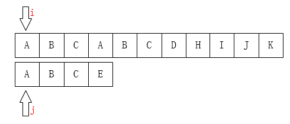

# [Knuth–Morris–Pratt algorithm](https://en.wikipedia.org/wiki/Knuth%E2%80%93Morris%E2%80%93Pratt_algorithm)、[Aho–Corasick algorithm](https://en.wikipedia.org/wiki/Aho%E2%80%93Corasick_algorithm)


## [Knuth–Morris–Pratt algorithm](https://en.wikipedia.org/wiki/Knuth%E2%80%93Morris%E2%80%93Pratt_algorithm) 

---

> References: 
>
> cnblogs [详解KMP算法](https://www.cnblogs.com/yjiyjige/p/3263858.html) 
>
> wikipedia [Knuth–Morris–Pratt algorithm](https://en.wikipedia.org/wiki/Knuth%E2%80%93Morris%E2%80%93Pratt_algorithm) 

---


KMP的核心思想是: 充分利用已匹配的substring的信息，已匹配的substring是pattern的左部分(因为是从左到右进行匹配)。当mismatch的时候，如何移动 `j` 指针。

> NOTE:
>
> 在大脑中将keyword想象成沿着text进行滑动，就像游标卡尺的游标一样，下面是一个例子:
>
>  
>
> 
>
> 

关于此，在下面文章中有着总结:

- cnblogs [详解KMP算法](https://www.cnblogs.com/yjiyjige/p/3263858.html) 中的描述:

> “**利用已经部分匹配这个有效信息，保持`i`指针不回溯，通过修改`j`指针，让模式串尽量地移动到有效的位置**。”

指针i不回溯，意味着它是一直增大的，这样的做法能够保证跳过无意义的匹配过程。

- 百度百科[kmp算法](https://baike.baidu.com/item/kmp%E7%AE%97%E6%B3%95/10951804?fr=aladdin)中的总结：

> 用暴力算法匹配字符串过程中，我们会把`T[0]` 跟 `W[0]` 匹配，如果相同则匹配下一个字符，直到出现不相同的情况，此时我们会丢弃前面的匹配信息，然后把`T[1]` 跟 `W[0]`匹配，循环进行，直到主串结束，或者出现匹配成功的情况。这种丢弃前面的匹配信息的方法，极大地降低了匹配效率。
>
> 而在KMP算法中，对于每一个模式串我们会事先计算出模式串的内部匹配信息，在匹配失败时最大的移动模式串，以减少匹配次数。
>
> 比如，在简单的一次匹配失败后，我们会想将模式串尽量的右移和主串进行匹配。右移的距离在KMP算法中是如此计算的：在**已经匹配的模式串子串**中，找出最长的相同的[前缀](https://baike.baidu.com/item/前缀)和[后缀](https://baike.baidu.com/item/后缀)，然后移动使它们重叠。


```
ABCABCDHIJK
ABCE
```


longest common prefix and suffix。

## [Aho–Corasick algorithm](https://en.wikipedia.org/wiki/Aho%E2%80%93Corasick_algorithm) 

---

> References: 
>
> - wikipedia [Aho–Corasick algorithm](https://en.wikipedia.org/wiki/Aho%E2%80%93Corasick_algorithm) 
> - geeksforgeeks [Aho-Corasick Algorithm for Pattern Searching](https://www.geeksforgeeks.org/aho-corasick-algorithm-pattern-searching/) 

---


### gpt-4-vision

The **Aho-Corasick algorithm** is a string-searching algorithm that is used to find all occurrences of a set of substrings (patterns) within a text. It was invented by Alfred V. Aho and Margaret J. Corasick in 1975. The algorithm is particularly efficient when you need to search for many patterns simultaneously in a large body of text.

The **Aho-Corasick algorithm** constructs a finite state machine (trie structure) from the patterns, with additional "failure" links. This trie is then used to scan the text for matches in linear time relative to the length of the text and the number of patterns.

Here's a high-level overview of the algorithm:

1. **Preprocessing Phase**: Construct a trie from the given patterns. Each node represents a character, and each path from the root to a leaf node represents a pattern. Add **failure links** to the **trie**, which are used to fall back to the longest possible **suffix** of the current string that is also a **prefix** of a pattern.
2. **Search Phase**: Traverse the text using the trie. When a character in the text does not match any outgoing edge from the current node, follow the **failure link**. If a **leaf node** is reached, a match is found. Record the match and continue the search.

The **Aho-Corasick algorithm** is not implemented in Python's standard library, but you can write your own implementation or use third-party libraries that provide it. Below is a simplified version of the Aho-Corasick algorithm in Python:

```python
from collections import deque
import unittest
from typing import List


class TrieNode:
    def __init__(self):
        self.children = {}
        self.failure_link = None
        self.output = []


def build_trie(patterns: List[str]):
    root = TrieNode()
    for pattern in patterns:
        node = root
        for char in pattern:
            # https://www.w3schools.com/python/ref_dictionary_setdefault.asp
            node = node.children.setdefault(char, TrieNode())
        node.output.append(pattern)
    return root


def build_failure_links(root: TrieNode):
    queue = deque([root])
    while queue:
        current_node = queue.popleft()
        for char, child_node in current_node.children.items():
            queue.append(child_node)
            fallback = current_node.failure_link
            while fallback and char not in fallback.children:
                fallback = fallback.failure_link
            child_node.failure_link = fallback.children[char] if fallback else root
            child_node.output += child_node.failure_link.output if child_node.failure_link else []


def aho_corasick_search(text, root):
    matches = []
    node = root
    for i, char in enumerate(text):
        while node and char not in node.children:
            node = node.failure_link
        if not node:
            node = root
            continue
        node = node.children[char]
        for pattern in node.output:
            matches.append((i - len(pattern) + 1, pattern))
    return matches


class AhoCorasickStringSearchAlgorithm(unittest.TestCase):
    def test_aho_corasick_string_search_algorithm(self):
        # Example usage
        patterns = ['a', 'ab', 'bc', 'bca', 'c', 'caa']
        root = build_trie(patterns)
        build_failure_links(root)
        text = 'abccab'
        matches = aho_corasick_search(text, root)
        print(matches)

```


### Code

https://github.com/WojciechMula/pyahocorasick


