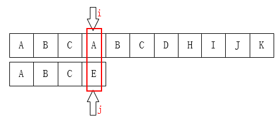

# [Knuth–Morris–Pratt algorithm](https://en.wikipedia.org/wiki/Knuth%E2%80%93Morris%E2%80%93Pratt_algorithm)、[Aho–Corasick algorithm](https://en.wikipedia.org/wiki/Aho%E2%80%93Corasick_algorithm)


## [Knuth–Morris–Pratt algorithm](https://en.wikipedia.org/wiki/Knuth%E2%80%93Morris%E2%80%93Pratt_algorithm) 

---

> References: 
>
> cnblogs [详解KMP算法](https://www.cnblogs.com/yjiyjige/p/3263858.html) 
>
> wikipedia [Knuth–Morris–Pratt algorithm](https://en.wikipedia.org/wiki/Knuth%E2%80%93Morris%E2%80%93Pratt_algorithm) 

---


keyword search，即在文本`text`中搜索`keyword`，对于这类问题，可以double pointer( `first=i` 指向`text`; ` second=j`指向`keyword` ) 来进行描述。最为对照，下面是naive string search algorithm:

```python
class StringSearchAlgorithms:
    """字符串搜索算法"""

    @classmethod
    def naive_search_algorithm(cls, text: str, keyword: str) -> int:
        """
        在text中搜索keyword
        :param text:
        :param keyword:
        :return:
        """
        i, j = 0, 0
        while i < len(text) and j < len(keyword):
            if text[i] == keyword[j]:
                i += 1
                j += 1
            else:
                # mismatch，则从头再来
                i += 1
                j = 0
        if j == len(keyword):
            return i - j
        else:
            return -1

```


KMP的核心思想是: 充分利用已匹配的substring的信息，已匹配的substring是keyword的左部分(因为是从左到右进行匹配)。当mismatch的时候，如何移动 `j` 指针。

> NOTE:
>
> 在大脑中将keyword想象成沿着text进行滑动，就像游标卡尺的游标一样，下面是一个例子:
>
>  
>
> 
>
> 

关于此，在下面文章中有着总结:

- cnblogs [详解KMP算法](https://www.cnblogs.com/yjiyjige/p/3263858.html) 中的描述:

> “**利用已经部分匹配这个有效信息，保持`i`指针不回溯，通过修改`j`指针，让模式串尽量地移动到有效的位置**。”

指针i不回溯，意味着它是一直增大的，这样的做法能够保证跳过无意义的匹配过程。

- 百度百科[kmp算法](https://baike.baidu.com/item/kmp%E7%AE%97%E6%B3%95/10951804?fr=aladdin)中的总结：

> 用暴力算法匹配字符串过程中，我们会把`T[0]` 跟 `W[0]` 匹配，如果相同则匹配下一个字符，直到出现不相同的情况，此时我们会丢弃前面的匹配信息，然后把`T[1]` 跟 `W[0]`匹配，循环进行，直到主串结束，或者出现匹配成功的情况。这种丢弃前面的匹配信息的方法，极大地降低了匹配效率。
>
> 而在KMP算法中，对于每一个模式串我们会事先计算出模式串的内部匹配信息，在匹配失败时最大的移动模式串，以减少匹配次数。
>
> 比如，在简单的一次匹配失败后，我们会想将模式串尽量的右移和主串进行匹配。右移的距离在KMP算法中是如此计算的：在**已经匹配的模式串子串**中，找出最长的相同的[前缀](https://baike.baidu.com/item/前缀)和[后缀](https://baike.baidu.com/item/后缀)，然后移动使它们重叠。


```
ABCABCDHIJK
ABCE
```

