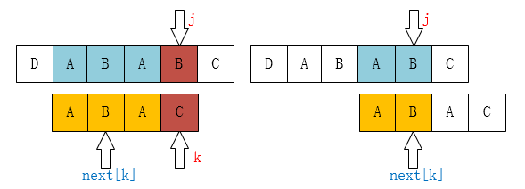

# Knuth–Morris–Pratt algorithm

It takes me some effort to master KMP algorithm. Here are three articles that helped me solve the mystery as I learned. 

## Q&A

### 核心思想

一、这个算法的思想在:

1、cnblogs [详解KMP算法](https://www.cnblogs.com/yjiyjige/p/3263858.html) 中有着很好的描述:

> “**利用已经部分匹配这个有效信息，保持`i`指针不回溯，通过修改`j`指针，让模式串尽量地移动到有效的位置**。”

指针i不回溯，意味着它是一直增大的。

这样的做法能够保证跳过无意义的匹配过程。


2、百度百科[kmp算法](https://baike.baidu.com/item/kmp%E7%AE%97%E6%B3%95/10951804?fr=aladdin)中的总结：

> 用暴力算法匹配字符串过程中，我们会把`T[0]` 跟 `W[0]` 匹配，如果相同则匹配下一个字符，直到出现不相同的情况，此时我们会丢弃前面的匹配信息，然后把`T[1]` 跟 `W[0]`匹配，循环进行，直到主串结束，或者出现匹配成功的情况。这种丢弃前面的匹配信息的方法，极大地降低了匹配效率。
>
> 而在KMP算法中，对于每一个模式串我们会事先计算出模式串的内部匹配信息，在匹配失败时最大的移动模式串，以减少匹配次数。
>
> 比如，在简单的一次匹配失败后，我们会想将模式串尽量的右移和主串进行匹配。右移的距离在KMP算法中是如此计算的：在**已经匹配的模式串子串**中，找出最长的相同的[前缀](https://baike.baidu.com/item/前缀)和[后缀](https://baike.baidu.com/item/后缀)，然后移动使它们重叠。


二、KMP算法涉及两个字符串: `pattern`、`txt`，它本身也使用了double pointer: first、second ，这是涉及两个字符串问题常用的套路。


### 思考: 为什么**`i`指针**不回溯依然能够保证找到正确的解？

需要结合具体的例子来进行理解:

一、example1 cnblogs [详解KMP算法](https://www.cnblogs.com/yjiyjige/p/3263858.html) 

> 如果是人为来寻找的话，肯定不会再把`i`移动回第1位，**因为主串匹配失败的位置前面除了第一个`A`之外再也没有`A`**了，我们为什么能知道主串前面只有一个`A`？**因为我们已经知道前面三个字符都是匹配的！（这很重要）**。移动过去肯定也是不匹配的！有一个想法，`i`可以不动，我们只需要移动`j`即可，如下图：
>
>  

pattern和txt中已经匹配的内容其实就是pattern的一部分，"**因为主串匹配失败的位置前面除了第一个`A`之外再也没有`A`**了" 这是可以通过预处理pattern来实现的，简而言之，仅仅根据已经匹配的部分就能够知道 `j` 指针的转移，从而避免很多无效的匹配。


### 如何理解公共前缀后缀

如果一个字符，它没有公共前缀，那么说明它在前面就没有出现过。


### 当pattern的最后一个字符失配时如何处理？

```
aaacaaab
aaab
```


```
ABCDABE
ABCDABF
```


### KMP failure/next function/array and DFA

一、Failure array以array的方式非常紧凑地来存储DFA，它的DFA的完整形式在 zhihu [KMP 算法详解](https://zhuanlan.zhihu.com/p/83334559) 中有展示。


二、明确数组的定义:

`next[i]` 表示的是: 最长公共前缀后缀的长度( `k` )，因此在计算failure array的时候是涉及到长度和下标的转换的。


三、计算 next/failure array 的过程其实与匹配 `txt` 和 `pattern` 的过程非常类似: 寻找最长公共**前缀**和**后缀**其实就是匹配**前缀子字符串** 和 **后缀子字符串**，**前缀子字符串**相当于`pattern`，**后缀子字符串** 相当于 `txt`，下面的图就非常形象地展示了这个过程，这就告诉我们在计算 next/failure array 的时候，是可以使用kmp的思想来进行实现的:

1、当 `pattern[k]` 和 `pattern[j]` 相等的时候:

> 这种情况是非常容易理解的


2、当 `pattern[k]` 和 `pattern[j]` 不相等的时候:

> 当`P[k] != P[j]`时，如下图所示：
>
>  
>
> 
>
> 像这种情况，如果你从代码上看应该是这一句：`k = next[k];`为什么是这样子？你看下面应该就明白了。
>
>  
>
> 现在你应该知道为什么要`k = next[k]`了吧！像上边的例子，我们已经不可能找到`[ A，B，A，B ]`这个最长的后缀串了，但我们还是可能找到`[ A，B ]`、`[ A ]`这样的前缀串的。所以这个过程像不像在定位`[ A，B，A，C ]`这个串，当`C`和主串不一样了（也就是`k`位置不一样了），那当然是把指针移动到`next[k]`啦。


上述第二行的图，就是以"KMP匹配" 的过程来展示计算 next/failure array 的过程: 

当  `P[k] != P[j]`，显然就是失配了，因此 `[ A，B，A，B ]` 不可能是最长的后缀串，那下次从什么地方开始匹配呢？即如何进行转移呢？显然这个匹配过程是可以转换为"KMP匹配"过程，正如上述第二行的图所展示的，显然我们要充分运用KMP的思想: 此时 `[0-k-1]`部分 和 `[j-k, j-1]`部分是已经匹配的，为了充分运用已经匹配的信息，我们应该转移到 `next[k]` 处进行匹配，就是上述第三张图所展示的。上述过程其实使用了KMP的思想，也就是说，在计算next/failure array的时候，其实也使用了KMP的思想。


关于这一点，另外一种验证方式是通过代码来进行验证，阅读完整的KMP算法可知: `get_failure_array` 和 `kmp_search` 在失配时的处理逻辑一模一样。


四、计算failure array的过程是KMP算法的精妙之处，它涉及:

1、当 **匹配** 的时候: 向前、expand

2、当 **失配** 的时候: 向后、reduce

五、在 cnblogs [详解KMP算法](https://www.cnblogs.com/yjiyjige/p/3263858.html) 中使用数学语言来进行定义。


六、算法思想:

1、double pointer

2、dynamic programming、recursion

KMP的failure function的求解过程在计算`f(k+1)`的时所依赖的`f(0),f(1)...,f(k)`都是通过查failure table而获得的，而不是重新计算，这其实就是动态规划算法的思想。在上述代码中，`i`就表示计算`f(k+1)`所依赖的数据，它的实现方式是非常类似于迭代版的斐波那契数列。

#### Python实现

一、failure function `f(j)`表示的是从 `pattern[0-j]` 的序列（显然这个序列的长度是`j+1`）的**最长公共前缀后缀**的**长度**，即`f(j)`所表示的是长度为`j+1`的序列的最长公共前缀后缀的长度。

base case: `f[0]==0`，因为长度为1的序列的最长前缀后缀的长度为0。

二、在这个程序中，`i`表示"公共前缀子字符串的长度"，根据长度和下标的对应关系可知，`i`始终指向的是 **下一个待匹配的字符** 。

三、该算法是典型的fast-slow double pointer，`i` 是 slow pointer，`j` 是 fast pointer，与此类似的使用fast-slow double pointer来处理array的algorithm，在下面的文章中有介绍：

1、labuladong [如何高效对有序数组/链表去重？](https://mp.weixin.qq.com/s/6Eb7gKqNqXH9B0hSZvMs5A)

2、labuladong  [双指针技巧秒杀四道数组/链表题目](https://mp.weixin.qq.com/s/55UPwGL0-Vgdh8wUEPXpMQ)

```python

def get_failure_array(pattern: str):
    """

    """
    failure_array = [0]  # failure array，f[0]已知
    i = 0  # i表示的是当前的公共前后缀的长度，当前j为0，所以它的初始值是0
    j = 1  # j表示的是index，因为f[0]已知，所以j从1开始
    while j < len(pattern):
        if pattern[i] == pattern[j]:
            i += 1
        elif i > 0:  # 失配
            i = failure_array[i - 1] # 拿到已经匹配部分[0~i-1]的公共前缀后缀的长度
            continue
        j += 1
        failure_array.append(i)
    return failure_array

```


#### Examples


Example1

```
Position:    012345
P:           abacab
```

| 0    | 1    | 2    | 3    | 4    | 5    |
| ---- | ---- | ---- | ---- | ---- | ---- |
| 0    | 0    | 1    | 0    | 1    | 2    |


Example2

```
Position:    012345678
P:           ababcabab
```

| 0    | 1    | 2    | 3    | 4    | 5    | 6    | 7    | 8    |
| ---- | ---- | ---- | ---- | ---- | ---- | ---- | ---- | ---- |
| 0    | 0    | 1    | 2    | 0    | 1    | 2    | 3    | 4    |


Example3

```
Position:    012345678
P:           ababcabab
```

| 0    | 1    | 2    | 3    | 4    | 5    | 6    | 7    | 8    |
| ---- | ---- | ---- | ---- | ---- | ---- | ---- | ---- | ---- |
| 0    | 0    | 1    | 2    | 0    | 1    | 2    | 3    | 4    |


Example3

```
Position:    0123456789
P:           ABACDABABC
```

| 0    | 1    | 2    | 3        | 4    | 5    | 6    | 7    | 8    | 9    |
| ---- | ---- | ---- | -------- | ---- | ---- | ---- | ---- | ---- | ---- |
| 0    | 0    | 1    | f(1)=0;0 | 0    | 1    | 2    | 3    | 2    | 0    |

这个例子非常好。

### Source code

#### Python

```python

def get_failure_array(pattern: str):
    failure = [0]  # 初始条件
    i = 0  
    j = 1  
    while j < len(pattern):
        if pattern[i] == pattern[j]:
            i += 1
        elif i > 0:
            i = failure[i - 1]
            continue
        j += 1
        failure.append(i)
    return failure


def kmp_search(pattern: str, text: str):
    """

    :param pattern:
    :param text:
    :return:
    """
    # 1) Construct the failure array
    failure = get_failure_array(pattern)

    # 2) Step through text searching for pattern
    i, j = 0, 0  # index into text, pattern
    while i < len(text):
        if pattern[j] == text[i]:
            if j == (len(pattern) - 1):
                return True
            j += 1
        elif j > 0:
            # if this is a prefix in our pattern
            # just go back far enough to continue
            j = failure[j - 1]
            continue
        i += 1
    return False


if __name__ == "__main__":
    pass

```


#### C++

```c++

class Solution
{
public:
  int strStr(string haystack, string needle)
  {
    if (needle.empty())
    {
      return 0;
    }
    else
    {
      return kmp(haystack, needle);
    }
  }
  int kmp(const string &haystack, const string &needle)
  {
    auto failureArray = getFailureArray(needle);
    int i = 0, j = 0;
    while (i < haystack.size())
    {
      if (haystack[i] == needle[j])
      {
        if (j == needle.size() - 1)
        {
          return i - j;
        }
        ++j;
      }
      else if (j > 0)
      {
        j = failureArray[j - 1];
        continue;
      }
      ++i;
    }
    return -1;
  }
  std::vector<int> getFailureArray(const string &needle)
  {
    std::vector<int> failureArray(needle.size());
    int i = 0, j = 1;
    while (j < needle.size())
    {
      if (needle[i] == needle[j])
      {
        ++i;
      }
      else if (i > 0)
      {
        i = failureArray[i - 1];
        continue;
      }
      failureArray[j++] = i;
    }
    return failureArray;
  }
};
```


## cnblogs [详解KMP算法](https://www.cnblogs.com/yjiyjige/p/3263858.html) 

KMP算法要解决的问题就是在字符串（也叫主串）中的模式（pattern）定位问题。说简单点就是我们平时常说的关键字搜索。模式串就是关键字（接下来称它为`P`），如果它在一个主串（接下来称为`T`）中出现，就返回它的具体位置，否则返回`-1`（常用手段）。

 


### Native algorithm

首先，对于这个问题有一个很单纯的想法：从左到右一个个匹配，如果这个过程中有某个字符不匹配，就跳回去，将模式串向右移动一位。这有什么难的？

我们可以这样初始化：

 

之后我们只需要比较**`i`指针**指向的字符和**`j`指针**指向的字符是否一致。如果一致就都向后移动，如果不一致，如下图：

 

 

`A`和`E`不相等，那就把**`i`指针**移回第1位（假设下标从0开始），`j`移动到模式串的第0位，然后又重新开始这个步骤：

 

基于这个想法我们可以得到以下的程序：

```java
/**
 * 暴力破解法
 * @param ts 主串
 * @param ps 模式串
 * @return 如果找到，返回在主串中第一个字符出现的下标，否则为-1
 */
public static int bf(String ts, String ps) {
    char[] t = ts.toCharArray();
    char[] p = ps.toCharArray();

    int i = 0; // 主串的位置
    int j = 0; // 模式串的位置

    while (i < t.length && j < p.length) {
       if (t[i] == p[j]) { // 当两个字符相同，就比较下一个
           i++;
           j++;
       } else {
           i = i - j + 1; // 一旦不匹配，i后退
           j = 0; // j归0
       }
    }

    if (j == p.length) {
       return i - j;
    } else {
       return -1;
    }
}
```

上面的程序是没有问题的，但不够好！

> NOTE: 
>
> 一、geeksforgeeks [Naive algorithm for Pattern Searching](https://www.geeksforgeeks.org/naive-algorithm-for-pattern-searching/) 中给出的代码是比上述代码更加容易理解的。 
>
> 二、上述程序是典型的double pointer: first+second


如果是人为来寻找的话，肯定不会再把`i`移动回第1位，**因为主串匹配失败的位置前面除了第一个`A`之外再也没有`A`**了，我们为什么能知道主串前面只有一个`A`？**因为我们已经知道前面三个字符都是匹配的！（这很重要）**。移动过去肯定也是不匹配的！有一个想法，`i`可以不动，我们只需要移动`j`即可，如下图：

 

> NOTE: 
>
> 一、显然上面这种匹配方式能够跳过很多的无意义的匹配，因为 `txt` 匹配失败的部分没有A，最为对比，可以可以尝试使用native算法进行匹配，可以发现是会进行很多无意义的匹配。
>
> 二、这个就是一个典型的说明i指针不需要回溯的例子，当失配的时候，`i` 指针是不需要移动的，仅仅移动 `j` 指针即可。

上面的这种情况还是比较理想的情况，我们最多也就多比较了两次。但假如是在主串`SSSSSSSSSSSSSA`中查找`SSSSB`，比较到最后一个才知道不匹配，然后`i`**回溯**，这个的效率是显然是最低的。

> NOTE: 
>
> 一、关于回溯，参见[Backtracking](https://en.wikipedia.org/wiki/Backtracking)

### KMP算法

大牛们是无法忍受“暴力破解”这种低效的手段的，于是他们三个研究出了KMP算法。其思想就如同我们上边所看到的一样：“**利用已经部分匹配这个有效信息，保持`i`指针不回溯，通过修改`j`指针，让模式串尽量地移动到有效的位置**。”

> NOTE: 
>
> 一、上面这段话使用了 "**尽量地**" 修饰语，等你完全理解了KMP算法，你就幡然醒悟这个修饰语是非常妙的: 既然说是尽量，那么也就是说移动到的位置不一定是最最有效的位置，而是一个相对有效的位置，可能需要经过多次移动才能够到达正确的位置，毕竟计算机不是像我们人这样的智能。

所以，整个KMP的重点就在于**当某一个字符与主串不匹配时，我们应该知道`j`指针要移动到哪**？


#### Example 1

接下来我们自己来发现`j`的移动规律：

 

如图：`C`和`D`不匹配了，我们要把`j`移动到哪？显然是第1位。为什么？因为前面有一个`A`相同啊：


> NOTE:
>
> 一、作为对比，可以尝试使用native算法进行匹配，显然 `txt[1]` 和 `pattern[0]` 是不匹配的，显然这是无意义的匹配；根据公共前缀后缀信息，我们可知: `txt[2]` 和 `pattern[0]` 是匹配的，所以我们据此可以将j指针移到1处。

#### Example 2

如下图也是一样的情况： 


可以把`j`指针移动到第2位，因为前面有两个字母是一样的：

 


#### Example 3

```
ABCAD
ABCAE
```

显然当`j=4,i=4`时两者失配，那此事`j`转移到哪里呢？显然要转移到`1`。这是和下面的结论有出入的。

```
ABCDABE
ABCDABF
```

#### Example 4

```
aaacaaab
aaab
```


#### 结论

> NOTE:
>
> 一、需要注意的是: 原文的例子背景特殊，都是公共前缀和公共后缀之间仅仅相隔一个字符，但是需要注意的是，它是允许相隔多个字符的，作者的表述其实是比较精准的，不过初次接触的时候，可能会被图所迷惑。
>
> 二、`k`如何理解呢？
>
> 1、表示的是公共前缀公共后缀的长度
>
> 2、`j` 移动的位置
>
> 

至此我们可以大概看出一点端倪，当匹配失败时，`j`要移动的下一个位置`k`。存在着这样的性质：**最前面的`k`字符和`j`之前的最后`k`个字符是一样的**。

如果用数学公式来表示是这样的

`P[0 ~ k-1] == P[j-k ~ j-1]`

> NOTE: 
>
> 一、上面是使用数学语言来描述公共前缀和公共后缀
>
> 二、`j-1` 表示的就是上述自然语言中的 "**`j`之前的**"

这个相当重要，如果觉得不好记的话，可以通过下图来理解：

 

弄明白了这个就应该可能明白为什么可以直接将`j`移动到`k`位置了。

因为:

当`T[i] != P[j]`时

有`T[i-j ~ i-1] == P[0 ~ j-1]`

由`P[0 ~ k-1] == P[j-k ~ j-1]`

必然：`T[i-k ~ i-1] == P[0 ~ k-1]`

> NOTE: 上述公式其实就是a==b, b==c,则a==c

公式很无聊，能看明白就行了，不需要记住。

这一段只是为了证明我们为什么可以直接将`j`移动到`k`而无须再比较前面的`k`个字符。

### 求解next数组

好，接下来就是重点了，怎么求这个（这些）`k`呢？因为在`P`的每一个位置都可能发生不匹配，也就是说我们要计算每一个位置`j`对应的`k`，所以用一个数组`next`来保存，`next[j] = k`，表示当`T[i] != P[j]`时，**`j`指针**的下一个位置。

很多教材或博文在这个地方都是讲得比较含糊或是根本就一笔带过，甚至就是贴一段代码上来，为什么是这样求？怎么可以这样求？根本就没有说清楚。而这里恰恰是整个算法最关键的地方。

```java
public static int[] getNext(String ps) {
    char[] p = ps.toCharArray();
    int[] next = new int[p.length];
    next[0] = -1; // 第0个元素匹配失败，j不需要移动，要移动i
    int j = 0;
    int k = -1;
    while (j < p.length - 1) {
       if (k == -1 || p[j] == p[k]) {
            next[++j] = ++k;
       } else {
           k = next[k];
       }
    }
    return next;

}
```

> NOTE:
>
> 一、`next[j]` 表示的是 `[0:j-1]` 的公共前后缀的长度，因为当`p[j]`和`t[i]`不相等的时候，显然需要充分利用研究匹配部分的信息，对于公共前后缀部分，是不需要再次进行匹配的，而是可以直接利用的。
>
> 另外需要注意的一点是，`next[j]`保存的是长度，根据长度和下标的映射关系，如果使用此长度作为下标，显然会匹配到公共前后缀的后一个元素，这是非常符合KMP算法的，因为它就是需要从这个开始匹配。
> 
>    二、上述算法是典型的fast-slow double pointer，k就是slow pointer，j就是fast pointer。
>    
>   与此类似的使用fast-slow double pointer来处理array的algorithm，在下面的文章中有介绍：
>    
>    1、labuladong [如何高效对有序数组/链表去重？](https://mp.weixin.qq.com/s/6Eb7gKqNqXH9B0hSZvMs5A)
> 
>    2、labuladong  [双指针技巧秒杀四道数组/链表题目](https://mp.weixin.qq.com/s/55UPwGL0-Vgdh8wUEPXpMQ)
>    
>    另外需要注意对特殊情况的处理，当只有一个元素的还是，它有公共前缀吗？该算法是假定有的
>    
>    三、初始值说明
>    
>    ```c++
>    next[0] == -1 # 在位置0不匹配，j不需要转移，需要转移i，它其实也表示它没有前部分
>    next[1] == 0 # 在位置1不匹配，转移到0
>    ```
>    
>    

这个版本的求`next`数组的算法应该是流传最广泛的，代码是很简洁。可是真的很让人摸不到头脑，它这样计算的依据到底是什么？

好，先把这个放一边，我们自己来推导思路，现在要始终记住一点，`next[j]`的值（也就是`k`）表示，当`P[j] != T[i]`时，`j`指针的下一步移动位置。

#### 当`j`为0时

先来看第一个：当`j`为0时，如果这时候不匹配，怎么办？


像上图这种情况，`j`已经在最左边了，不可能再移动了，这时候要应该是`i`指针后移。所以在代码中才会有`next[0] = -1;`这个初始化。

> NOTE: 
>
> 一、看了下面的完整的代码就知道为什么使用`-1`来作为初始值，因为`++k`和`++j`是在相同的分支中，`++j`后 `j` 为0，这就保证了从P的第一个元素开始匹配。

#### 当`j`为1时

如果是当`j`为1的时候呢？

 

显然，`j`指针一定是后移到0位置的。因为它前面也就只有这一个位置了。

#### 当`P[k] == P[j]`时

下面这个是最重要的，请看如下图：

 


请仔细对比这两个图。

我们发现一个规律：

当`P[k] == P[j]`时，有`next[j+1] == next[j] + 1`

> NOTE: 
>
> 递归函数


其实这个是可以证明的：

因为在`P[j]`之前已经有`P[0 ~ k-1] == p[j-k ~ j-1]`。（`next[j] == k`）

这时候现有`P[k] == P[j]`，我们是不是可以得到`P[0 ~ k-1] + P[k] == p[j-k ~ j-1] + P[j]`。

即：`P[0 ~ k] == P[j-k ~ j]`，即`next[j+1] == k + 1 == next[j] + 1`。

这里的公式不是很好懂，还是看图会容易理解些。

#### 当`P[k] != P[j]`时,

当`P[k] != P[j]`时，如下图所示：

 


像这种情况，如果你从代码上看应该是这一句：`k = next[k];`为什么是这样子？你看下面应该就明白了。

 

现在你应该知道为什么要`k = next[k]`了吧！像上边的例子，我们已经不可能找到`[ A，B，A，B ]`这个最长的后缀串了，但我们还是可能找到`[ A，B ]`、`[ B ]`这样的前缀串的。所以这个过程像不像在定位`[ A，B，A，C ]`这个串，当`C`和主串不一样了（也就是`k`位置不一样了），那当然是把指针移动到`next[k]`啦。

> NOTE: 这篇文章这里的分析还是比较难以理解的，下一篇在分析更加透彻。

> NOTE: 构建`next`数组的算法是使用的数学归纳法来求解next数组的每个值，即根据`next`数组中前`j`个元素的值来求解`next[j+1]`的值。

### KMP算法

有了`next`数组之后就一切好办了，我们可以动手写KMP算法了：

```java
public static int KMP(String ts, String ps) {
    char[] t = ts.toCharArray();
    char[] p = ps.toCharArray();
  
    int i = 0; // 主串的位置
    int j = 0; // 模式串的位置

    int[] next = getNext(ps);

    while (i < t.length && j < p.length) {
       if (j == -1 || t[i] == p[j]) { // 当j为-1时，要移动的是i，当然j也要归0
           i++;
           j++;
       } else {
           // i不需要回溯了
           // i = i - j + 1;
           j = next[j]; // j回到指定位置
       }
    }
    if (j == p.length) {
       return i - j;
    } else {
       return -1;
    }

}
```

和暴力破解相比，就改动了4个地方。其中最主要的一点就是，`i`不需要回溯了。

最后，来看一下上边的算法存在的缺陷。来看第一个例子：

 

显然，当我们上边的算法得到的`next`数组应该是`[ -1，0，0，1 ]`

所以下一步我们应该是把`j`移动到第1个元素咯：

 

不难发现，**这一步是完全没有意义的。因为后面的`B`已经不匹配了，那前面的`B`也一定是不匹配的**，同样的情况其实还发生在第2个元素`A`上。

显然，**发生问题的原因在于`P[j] == P[next[j]]`**。

所以我们也只需要添加一个判断条件即可：

```java
public static int[] getNext(String ps) {

    char[] p = ps.toCharArray();

    int[] next = new int[p.length];

    next[0] = -1;

    int j = 0;

    int k = -1;

    while (j < p.length - 1) {

       if (k == -1 || p[j] == p[k]) {

           if (p[++j] == p[++k]) { // 当两个字符相等时要跳过

              next[j] = next[k];

           } else {

              next[j] = k;

           }

       } else {

           k = next[k];

       }

    }

    return next;

}
```


该算法的实现是非常类似于动态规划算法的

`next[j]`的值`k`就是`j`位之前的子串中，前缀集和后缀集中的最大重复子串的长度。

`abacabac`

|        |             |              | next[0]=-1;j=0;k=-1 |
| ------ | ----------- | ------------ | ------------------- |
| 条件1  | 条件2       | 分支2        | 分支1               |
| k==-1  |             |              | next[1]=0;j=1;k=0   |
|        | p[1]!=p[0]; | k=next[0]=-1 |                     |
| k==-1  |             |              | next[2]=0;j=2;k=0   |
|        | p[2]==p[0]; |              | next[3]=1;j=3;k=1   |
|        | p[3]!=p[1]; | k=next[1]=0  |                     |
|        | p[3]!=p[0]; | k=next[0]=-1 |                     |
| k==-1; |             |              | next[4]=0;j=4;k=0   |
|        | p[4]==p[0]  |              | next[5]=1;j=5;k=1   |
|        | p[5]==p[1]  |              | next[6]=2;j=6;k=2   |
|        | p[6]==p[2]  |              | next[7]=3;j=7;k=3   |
|        | p[7]==p[3]  |              | next[8]=4;j=8;k=4   |

要想得到`p[j+1]`，只需要比较`p[j]`和`p[k]`即可；


## wikipedia [Knuth–Morris–Pratt algorithm](https://en.wikipedia.org/wiki/Knuth%E2%80%93Morris%E2%80%93Pratt_algorithm)

In [computer science](https://en.wikipedia.org/wiki/Computer_science), the **Knuth–Morris–Pratt [string-searching algorithm](https://en.wikipedia.org/wiki/String-searching_algorithm)** (or **KMP algorithm**) searches for occurrences of a "word" `W` within a main "text string" `S` by employing the observation that when a mismatch occurs, the word itself embodies sufficient information to determine where the next match could begin, thus bypassing re-examination of previously matched characters.

The [algorithm](https://en.wikipedia.org/wiki/Algorithm) was conceived by [James H. Morris](https://en.wikipedia.org/wiki/James_H._Morris) and independently discovered by [Donald Knuth](https://en.wikipedia.org/wiki/Donald_Knuth) "a few weeks later" from [automata theory](https://en.wikipedia.org/wiki/Automata_theory).[[1\]](https://en.wikipedia.org/wiki/Knuth–Morris–Pratt_algorithm#cite_note-knuth1977-2)[[2\]](https://en.wikipedia.org/wiki/Knuth–Morris–Pratt_algorithm#cite_note-3) Morris and [Vaughan Pratt](https://en.wikipedia.org/wiki/Vaughan_Pratt) published a technical report in 1970.[[3\]](https://en.wikipedia.org/wiki/Knuth–Morris–Pratt_algorithm#cite_note-4) The three also published the algorithm jointly in 1977.[[1\]](https://en.wikipedia.org/wiki/Knuth–Morris–Pratt_algorithm#cite_note-knuth1977-2) Independently, in 1969, [Matiyasevich](https://en.wikipedia.org/wiki/Yuri_Matiyasevich)[[4\]](https://en.wikipedia.org/wiki/Knuth–Morris–Pratt_algorithm#cite_note-5)[[5\]](https://en.wikipedia.org/wiki/Knuth–Morris–Pratt_algorithm#cite_note-6) discovered a similar algorithm, coded by a two-dimensional Turing machine, while studying a string-pattern-matching recognition problem over a binary alphabet. This was the first linear-time algorithm for string matching.[[6\]](https://en.wikipedia.org/wiki/Knuth–Morris–Pratt_algorithm#cite_note-7)


## KMP in leetcode

汇总整理素材:

1、[LeetCode-『 字符串哈希、KMP 』掌握模板，快乐其实很简单 🤣](https://leetcode.cn/problems/longest-happy-prefix/solution/by-flix-k4p3/) 

|                                                              |                                                              |      |
| ------------------------------------------------------------ | ------------------------------------------------------------ | ---- |
| [LeetCode-28. 实现 strStr()-简单](https://leetcode.cn/problems/implement-strstr/) |                                                              |      |
| [LeetCode-214. 最短回文串-困难](https://leetcode.cn/problems/shortest-palindrome/) | https://leetcode.com/problems/shortest-palindrome/discuss/60113/clean-kmp-solution-with-super-detailed-explanation |      |
| [LeetCode-1392. 最长快乐前缀](https://leetcode.cn/problems/longest-happy-prefix/) | https://leetcode.com/problems/longest-happy-prefix/discuss/549465/kmp-algorithm |      |
| [LeetCode-1910. 删除一个字符串中所有出现的给定子字符串](https://leetcode.cn/problems/remove-all-occurrences-of-a-substring/) | https://leetcode.com/problems/remove-all-occurrences-of-a-substring/discuss/1299275/True-O(n-%2B-m)-KMP/989600/ |      |
|                                                              |                                                              |      |