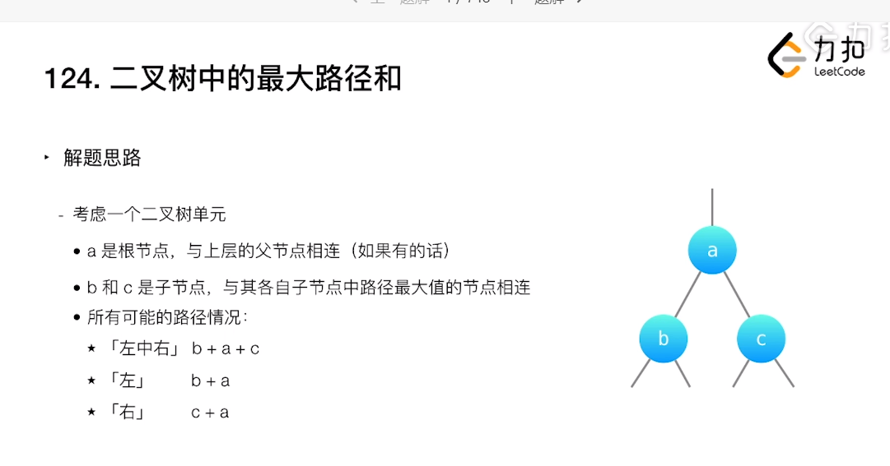
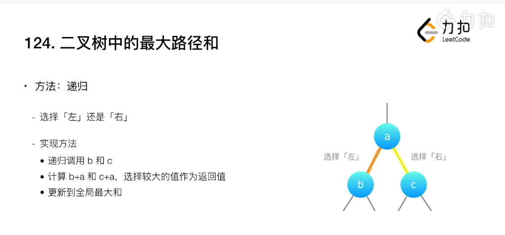
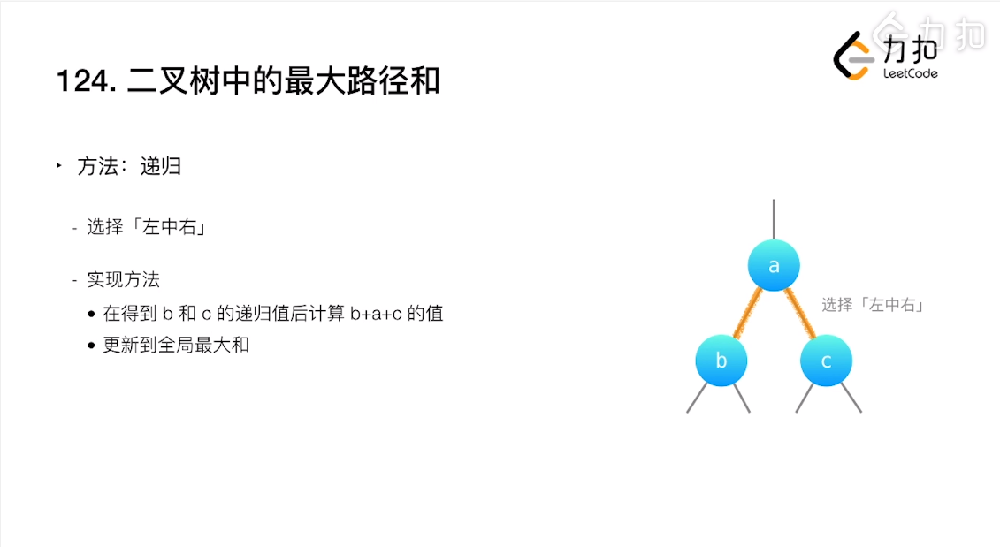

# leetcode [124. 二叉树中的最大路径和](https://leetcode.cn/problems/binary-tree-maximum-path-sum/)

这是在阅读 labuladong [数据结构和算法学习指南](https://mp.weixin.qq.com/s/ZYaXOSVM3YBIeRWm7E_jcQ) 时发现的。

## 如何罗列出所有的可能的path？

由于是path，而traverse就是沿着path进行的，因此可以尝试和traverse相关联。

## 从最小的单位开始分析

1、这是divide-and-conquer的思想，这一点在 leetcode [124. 二叉树中的最大路径和](https://leetcode.cn/problems/binary-tree-maximum-path-sum/) 中，有着非常好的体现

2、一个子节点将自己的值告诉parent node，parent node可以将它的值和另外一个node进行比较，然后选择和谁结合。由于parent node知道它的left child node 和 right child node，因此，它可以进行决定是和left child node还是和right child node进行结合，这就是解题视频中所述的:



## 如进行选择？

一句话: 打擂台。




### 需要注意: 两个最大值

一、整个二叉树的最大值，并不一定会经过根节点

二、我们要罗列所有的情况，因此必须要计算经过根节点的path的最大值，因此我们需要考虑两个最大值:

1、全局最大值

2、经过根节点的path的最大值

这就是上面PPT中的: "计算`b+a`和`c+a`，选择较大的值作为返回值"

三、从后续的实现code来看，它的recursive function的返回值是"经过根节点的path的最大值"，全局最大值放在了recursive function内部进行更新

四、parent node的值，是不能够舍弃的，因为path必然会经过它



这有些贪心的思想在里面: 每次都选择最大值。

### 舍弃负数


上面枚举了三个node的值都是`-1`的例子，以这个例子来进行说明:

1、对于b节点，`max(0, -1)`返回0

2、对于c节点，`max(0, -1)`返回0

3、由于全局最大的初始值为`INT_MIN`，a的值`-1`更大，因此，会选择`-1`

这就是前面所说的: parent node是不能够舍弃的。


## Implementation

### 我的答案

```C++
class Solution
{
public:
	int maxPathSum(TreeNode *root)
	{
		int globol_max = INT_MIN;
		maxPathSum(root, globol_max);
		return globol_max;
	}
	int maxPathSum(TreeNode *root, int &globol_max)
	{
		if (root)
		{
			int left_path_sum = max(maxPathSum(root->left, globol_max), 0);

			int right_path_sum = max(maxPathSum(root->right, globol_max), 0);

			int lmr = left_path_sum + right_path_sum + root->val;

			int max_path = root->val + max(left_path_sum, right_path_sum );

			globol_max = max(globol_max, max(lmr, max_path));
			return max_path;
		}
		else
		{
			return 0;
		}
	}
};
```


### 标准答案

```C++
class Solution {
private:
    int maxSum = INT_MIN;

public:
    int maxGain(TreeNode* node) {
        if (node == nullptr) {
            return 0;
        }
        
        // 递归计算左右子节点的最大贡献值
        // 只有在最大贡献值大于 0 时，才会选取对应子节点
        int leftGain = max(maxGain(node->left), 0);
        int rightGain = max(maxGain(node->right), 0);

        // 节点的最大路径和取决于该节点的值与该节点的左右子节点的最大贡献值
        int priceNewpath = node->val + leftGain + rightGain;

        // 更新答案
        maxSum = max(maxSum, priceNewpath);

        // 返回节点的最大贡献值
        return node->val + max(leftGain, rightGain);
    }

    int maxPathSum(TreeNode* root) {
        maxGain(root);
        return maxSum;
    }
};
```

### 对比

标准答案的运行结果是比我的答案的运行结果更优秀的，下面的是分析:

1、

|      | 标准答案                              | 我的答案                                            |
| ---- | ------------------------------------- | --------------------------------------------------- |
|      | `maxSum = max(maxSum, priceNewpath);` | `globol_max = max(globol_max, max(lmr, max_path));` |
|      | 一次max                               | 两次max                                             |

第一次看到标准答案的时候，我错误的以为它的上述写法是错误的，后来看了计算`leftGain`的函数: 

```
int leftGain = max(maxGain(node->left), 0);
```

显然，`leftGain`、`rightGain`是大于等于0 的，因此`priceNewpath`（左中右）肯定是大于等于`node->val + max(leftGain, rightGain)`（左中、右中），因此，直接拿它跟`priceNewpath`（左中右）跟`maxSum`打擂台即可，这样就省略了一次`max(lmr, max_path)`。


### 优化后的答案

```C++
/**
 * Definition for a binary tree node.
 * struct TreeNode {
 *     int val;
 *     TreeNode *left;
 *     TreeNode *right;
 *     TreeNode() : val(0), left(nullptr), right(nullptr) {}
 *     TreeNode(int x) : val(x), left(nullptr), right(nullptr) {}
 *     TreeNode(int x, TreeNode *left, TreeNode *right) : val(x), left(left), right(right) {}
 * };
 */
class Solution
{
public:
	int maxPathSum(TreeNode *root)
	{
		int globol_max = INT_MIN;
		maxPathSum(root, globol_max);
		return globol_max;
	}
	int maxPathSum(TreeNode *root, int &globol_max)
	{
		if (root)
		{
			int left_path_sum = max(maxPathSum(root->left, globol_max), 0);
			int right_path_sum = max(maxPathSum(root->right, globol_max), 0);
			int lmr = left_path_sum + right_path_sum + root->val;
			
			globol_max = max(globol_max, lmr);
			return root->val + max(left_path_sum, right_path_sum);
		}
		else
		{
			return 0;
		}
	}
};
```

