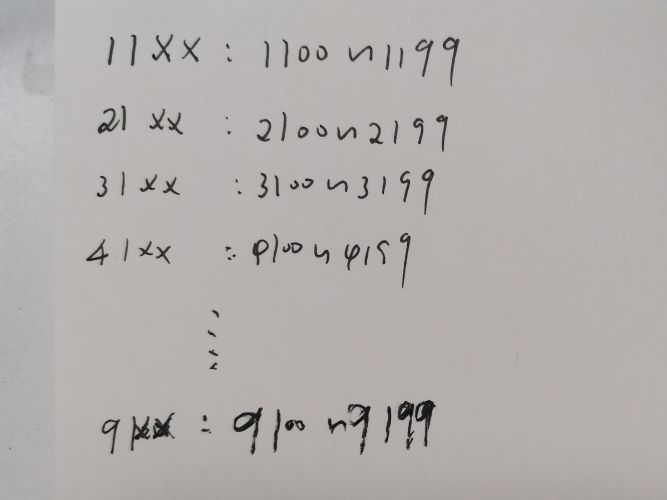

# [LeetCode-671. 二叉树中第二小的节点](https://leetcode.cn/problems/second-minimum-node-in-a-binary-tree/)


## 我的解题

### 第一次的错误解题

```C++
#include <bits/stdc++.h>
using namespace std;

/**
 * Definition for a binary tree node.
 * struct TreeNode {
 *     int val;
 *     TreeNode *left;
 *     TreeNode *right;
 *     TreeNode() : val(0), left(nullptr), right(nullptr) {}
 *     TreeNode(int x) : val(x), left(nullptr), right(nullptr) {}
 *     TreeNode(int x, TreeNode *left, TreeNode *right) : val(x), left(left), right(right) {}
 * };
 */

struct TreeNode
{
	int val;
	TreeNode *left;
	TreeNode *right;
	TreeNode() :
					val(0), left(nullptr), right(nullptr)
	{
	}
	TreeNode(int x) :
					val(x), left(nullptr), right(nullptr)
	{
	}
	TreeNode(int x, TreeNode *left, TreeNode *right) :
					val(x), left(left), right(right)
	{
	}
};

class Solution
{
public:

	int findSecondMinimumValue(TreeNode *root)
	{
		if (root)
		{
			if (root->left)
			{
				if (root->left->val == root->right->val) // 说明root、left、right的值都相等
				{
					int left2ndMin = findSecondMinimumValue(root->left);
					int right2ndMin = findSecondMinimumValue(root->right);
					if (left2ndMin != -1 && right2ndMin != -1)
					{
						return min(left2ndMin, right2ndMin);
					}
					else if (left2ndMin == -1 && right2ndMin == -1)
					{
						return -1;
					}
					else //(left2ndMin =! -1 || right2ndMin == -1)
					{
						return left2ndMin = !-1 ? left2ndMin : right2ndMin;
					}

				}
				else // 说明left、right的值不相等
				{
					return max(root->left->val, root->right->val);
				}

			}
			else // 说明没有子节点，所以也就没有第二小的值
			{
				return -1;
			}

		}
		else
		{
			return -1;
		}
	}
};

int main()
{
	Solution s;
}
// g++ test.cpp --std=c++11 -pedantic -Wall -Wextra -g


```

```
[1,1,3,1,1,3,4,3,1,1,1,3,8,4,8,3,3,1,6,2,1]
```




### 第二次的错误解题

```C++
#include <bits/stdc++.h>
using namespace std;

/**
 * Definition for a binary tree node.
 * struct TreeNode {
 *     int val;
 *     TreeNode *left;
 *     TreeNode *right;
 *     TreeNode() : val(0), left(nullptr), right(nullptr) {}
 *     TreeNode(int x) : val(x), left(nullptr), right(nullptr) {}
 *     TreeNode(int x, TreeNode *left, TreeNode *right) : val(x), left(left), right(right) {}
 * };
 */

struct TreeNode
{
	int val;
	TreeNode *left;
	TreeNode *right;
	TreeNode() :
					val(0), left(nullptr), right(nullptr)
	{
	}
	TreeNode(int x) :
					val(x), left(nullptr), right(nullptr)
	{
	}
	TreeNode(int x, TreeNode *left, TreeNode *right) :
					val(x), left(left), right(right)
	{
	}
};

class Solution
{
public:

	int findSecondMinimumValue(TreeNode *root)
	{
		if (root)
		{
			if (root->left)
			{
				if (root->left->val == root->right->val) // 说明root、left、right的值都相等
				{
					int left2ndMin = findSecondMinimumValue(root->left);
					int right2ndMin = findSecondMinimumValue(root->right);
					if (left2ndMin != -1 && right2ndMin != -1)
					{
						return min(left2ndMin, right2ndMin);
					}
					else if (left2ndMin == -1 && right2ndMin == -1)
					{
						return -1;
					}
					else //(left2ndMin =! -1 || right2ndMin == -1)
					{
						return left2ndMin = !-1 ? left2ndMin : right2ndMin; // 存在错误，"= !"写错了，应该是"!=" 
					}

				}
				else // 说明left、right的值不相等
				{
					TreeNode *smallChildNode = root->val == root->left->val ? root->left : root->right;
					int smallChild2ndMinValue = findSecondMinimumValue(smallChildNode);
					TreeNode *bigChildNode = root->val == root->left->val ? root->right : root->left;
					if (smallChild2ndMinValue == -1)
					{
						return bigChildNode->val;
					}
					else
					{
						return min(smallChild2ndMinValue, bigChildNode->val);
					}
				}

			}
			else // 说明没有子节点，所以也就没有第二小的值
			{
				return -1;
			}

		}
		else
		{
			return -1;
		}
	}
};

int main()
{
	Solution s;
}
// g++ test.cpp --std=c++11 -pedantic -Wall -Wextra -g


```


```
[1,1,3,1,2]
```

通过

```
[1,1,1,3,1,1,1,3,3,1,6,2,1]
```

未通过

```
[1,3,1,3,3,1,6]
```

通过

```
[1,1,1,2,1]
```


### 正确的程序

```C++
#include <bits/stdc++.h>
using namespace std;

/**
 * Definition for a binary tree node.
 * struct TreeNode {
 *     int val;
 *     TreeNode *left;
 *     TreeNode *right;
 *     TreeNode() : val(0), left(nullptr), right(nullptr) {}
 *     TreeNode(int x) : val(x), left(nullptr), right(nullptr) {}
 *     TreeNode(int x, TreeNode *left, TreeNode *right) : val(x), left(left), right(right) {}
 * };
 */

struct TreeNode
{
	int val;
	TreeNode *left;
	TreeNode *right;
	TreeNode() :
					val(0), left(nullptr), right(nullptr)
	{
	}
	TreeNode(int x) :
					val(x), left(nullptr), right(nullptr)
	{
	}
	TreeNode(int x, TreeNode *left, TreeNode *right) :
					val(x), left(left), right(right)
	{
	}
};

class Solution
{
public:

	int findSecondMinimumValue(TreeNode *root)
	{
		if (root)
		{
			if (root->left)
			{
				if (root->left->val == root->right->val) // 说明root、left、right的值都相等
				{
					int left2ndMin = findSecondMinimumValue(root->left);
					int right2ndMin = findSecondMinimumValue(root->right);
					if (left2ndMin != -1 && right2ndMin != -1)
					{
						return min(left2ndMin, right2ndMin);
					}
					else if (left2ndMin == -1 && right2ndMin == -1)
					{
						return -1;
					}
					else //(left2ndMin =! -1 || right2ndMin == -1)
					{
						return left2ndMin != -1 ? left2ndMin : right2ndMin;;
					}
				}
				else // 说明left、right的值不相等
				{
					TreeNode *smallChildNode = root->val == root->left->val ? root->left : root->right;
					int smallChild2ndMinValue = findSecondMinimumValue(smallChildNode);
					TreeNode *bigChildNode = root->val == root->left->val ? root->right : root->left;
					if (smallChild2ndMinValue == -1)
					{
						return bigChildNode->val;
					}
					else
					{
						return min(smallChild2ndMinValue, bigChildNode->val);
					}
				}

			}
			else // 说明没有子节点，所以也就没有第二小的值
			{
				return -1;
			}

		}
		else
		{
			return -1;
		}
	}
};

int main()
{
	Solution s;
	TreeNode root { 1 };
	TreeNode left { 1 };
	TreeNode right { 1 };
	TreeNode leftLeft { 2 };
	TreeNode leftRight { 1 };
	root.left = &left;
	root.right = &right;
	left.left = &leftLeft;
	left.right = &leftRight;
	cout << s.findSecondMinimumValue(&root) << endl;
}
// g++ test.cpp --std=c++11 -pedantic -Wall -Wextra -g


```


## [官方解题](https://leetcode.cn/problems/second-minimum-node-in-a-binary-tree/solution/er-cha-shu-zhong-di-er-xiao-de-jie-dian-bhxiw/)

因此，我们可以对整棵二叉树进行一次遍历。设根节点的值为 $\textit{rootvalue}$，我们只需要通过遍历，找出严格大于 $\textit{rootvalue}$ 的最小值，即为「所有节点中的第二小的值」。


```C++
class Solution {
public:
    int findSecondMinimumValue(TreeNode* root) {
        int ans = -1;
        int rootvalue = root->val;

        function<void(TreeNode*)> dfs = [&](TreeNode* node) {
            if (!node) {
                return;
            }
            if (ans != -1 && node->val >= ans) { // 剪枝
                return;
            }
            if (node->val > rootvalue) {
                ans = node->val;
            }
            dfs(node->left);
            dfs(node->right);
        };

        dfs(root);
        return ans;
    }
};

```

