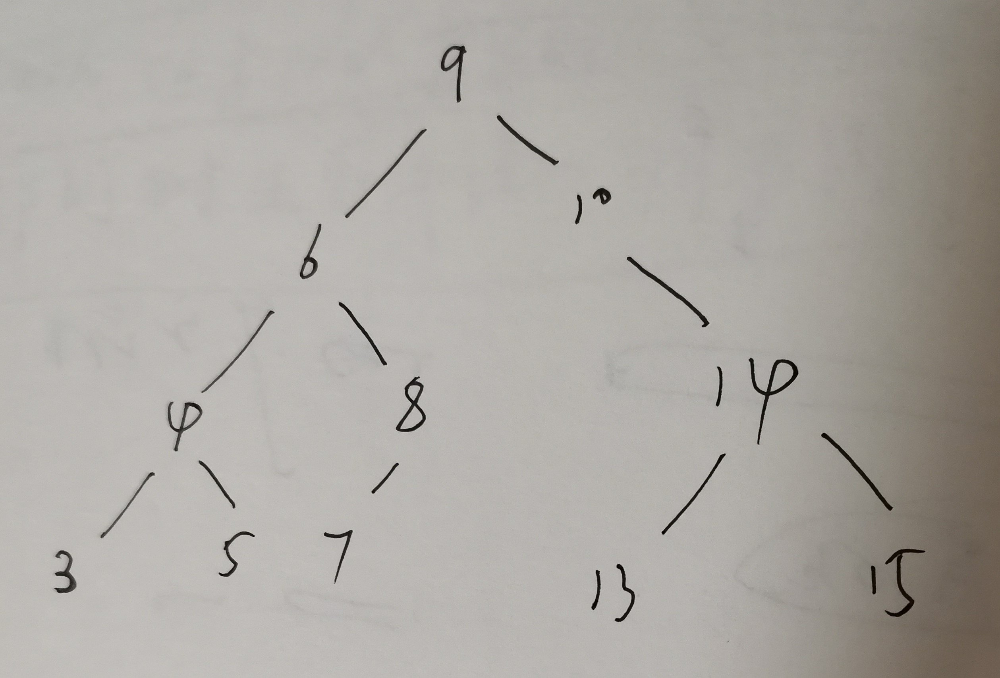

# wikipedia [Tree traversal](https://en.wikipedia.org/wiki/Tree_traversal)  # Implementations

> NOTE: 
>
> 一、tree是满足递归结构的，那为什么广度优先遍历不能够使用递归而深度优先遍历能够使用递归呢？因为广度优先遍历并没有按照tree的递归结构来进行遍历，而深度优先遍历则是按照树的递归结构来进行遍历的；所以，深度优先遍历就能够按照递归的方式来进行实现；
>
> 二、
>
> 1、迭代版本的实现是需要explicit stack的
>
> 2、迭代版本中，对于遇到的，但是还不能够visit的node，要将它push到explicit stack中
>
> 3、`iterativePostorder` 和 `iterativeInorder` 的循环条件为: 
>
> ```C++
>   while (not s.isEmpty() or node ≠ null)
> ```
>
> `iterativePreorder` 为: 
>
> ```C++
>   while (not s.isEmpty())
> ```
>
> 这是因为`iterativePreorder` 在while开始之前，就将确定的root node push到了explicit stack中；`iterativePostorder` 和 `iterativeInorder` 不能这样做的原因是: 它们无法先access parent node。
>
> 4、循环体中的`if (node ≠ null)`和迭代版本中的`if (node ≠ null)`是对应的
>
> 5、递归版本的入参表示的是current node，迭代版本中的`node`表示的是current node，它就相当于一个iterator。在pre-order的iterative版本中，并没有显式地使用`node` iterator，而是使用explicit stack的top。
>
> 迭代版本中的 `node ← node.left # 迭代` 、`N = N->right_child; // 迭代`就相当与我们平时熟悉的`iterator++`，即迭代到next element。

## Depth-first search

> NOTE: 
>
> 1、递归函数在执行过程中，其实是有一个call stack的，下面的伪代码都提供了两个版本：
>
> - 递归版本
>
> - 迭代版本
>
> 2、为了便于理解，下面的例子，都以这个tree进行测试
>
> 


### Pre-order

#### 递归版本

```pseudocode
preorder(node)
  if (node == null)
    return
  visit(node)
  preorder(node.left)
  preorder(node.right)
```

> NOTE: 
>
> 1、由于leaf node的`left`和`right`成员都为null，因此对于leaf node:
>
> ```
>   preorder(node.left)
>   preorder(node.right)
> ```
>
> 会直接`return`。
>
> 2、完整测试程序如下
>
> ```C++
> #include <iostream>
> #include <stack>
> 
> class Node
> {
> public:
> 	int info;
> 	Node *left_child;
> 	Node *right_child;
> 	Node(int info) :
> 					info { info }, left_child { nullptr }, right_child { nullptr }
> 	{
> 	}
> };
> 
> class BinaryTree
> {
> public:
> 	Node *root;
> 	BinaryTree() :
> 					root { nullptr }
> 	{
> 		root = new Node(9);
> 		root->left_child = new Node(6);
> 
> 		root->left_child->left_child = new Node(4);
> 		root->left_child->right_child = new Node(8);
> 
> 		root->left_child->left_child->left_child = new Node(3);
> 		root->left_child->left_child->right_child = new Node(5);
> 
> 		root->right_child = new Node(10);
> 		root->right_child->right_child = new Node(14);
> 		root->right_child->right_child->left_child = new Node(13);
> 		root->right_child->right_child->right_child = new Node(15);
> 	}
> 	/**
> 	 * @brief 先序遍历
> 	 *
> 	 */
> 	void PreorderTraversal()
> 	{
> 		PreorderTraversalImpl(root);
> 	}
> 	void Visit(Node *N)
> 	{
> 		std::cout << N->info << " ";
> 	}
> private:
> 	void PreorderTraversalImpl(Node *N)
> 	{
> 		if (N)
> 		{
> 			Visit(N);
> 			PreorderTraversalImpl(N->left_child);
> 			PreorderTraversalImpl(N->right_child);
> 		}
> 	}
> };
> 
> int main()
> {
> 	BinaryTree binary_tree;
> 
> 	binary_tree.PreorderTraversal();
> 	return 0;
> }
> // g++ test.cpp
> 
> ```
>
> 上述code参考自: https://github.com/OpenGenus/cosmos/blob/master/code/data_structures/src/tree/binary_tree/binary_tree/traversal/zigzag/zigzag.cpp
>
> 输出如下:
>
> ```C++
> 9 6 4 3 5 8 10 14 13 15
> ```
>
> 

#### 迭代版本

```pseudocode
iterativePreorder(node)
  if (node == null)
    return
  s ← empty stack
  s.push(node)
  while (not s.isEmpty())
    node ← s.pop()
    visit(node)
    //right child is pushed first so that left is processed first
    if (node.right ≠ null)
      s.push(node.right)
    if (node.left ≠ null)
      s.push(node.left)
```

> NOTE: 
>
> 1、代码理解: stack中存放的是待visit的node，每次visit栈顶的node，一旦该node被visit后，就要将其pop；由于pre-order是一旦遇到该节点，就要进行visit，所以在`while`中就会首先执行`node ← s.pop()`、`visit(node)`，然后再先stack中压入新的node；
>
> 2、
>
> | 循环次数 | 栈内容(栈底在左) | 输出(出栈) |
> | -------- | ---------------- | ---------- |
> | 1        | 10、6            | 9          |
> | 2        | 10、8、4         | 6          |
> | 3        | 10、8、5、3      | 4          |
> | 4        | 10、8、5         | 3          |
> | 5        | 10、8            | 5          |
> | 7        | 10、7            | 8          |
> | 8        | 10               | 7          |
> | 9        | 14               | 10         |
> | 10       | 15、13           | 14         |
> | 11       | 15               | 13         |
> | 12       |                  | 15         |
>
> 3、完整的测试程序如下:
>
> ```C++
> #include <iostream>
> #include <stack>
> 
> class Node
> {
> public:
> 	int info;
> 	Node *left_child;
> 	Node *right_child;
> 	Node(int info) :
> 					info { info }, left_child { nullptr }, right_child { nullptr }
> 	{
> 	}
> };
> 
> class BinaryTree
> {
> public:
> 	Node *root;
> 	BinaryTree() :
> 					root { nullptr }
> 	{
> 		root = new Node(9);
> 		root->left_child = new Node(6);
> 
> 		root->left_child->left_child = new Node(4);
> 		root->left_child->right_child = new Node(8);
> 
> 		root->left_child->left_child->left_child = new Node(3);
> 		root->left_child->left_child->right_child = new Node(5);
> 
> 		root->right_child = new Node(10);
> 		root->right_child->right_child = new Node(14);
> 		root->right_child->right_child->left_child = new Node(13);
> 		root->right_child->right_child->right_child = new Node(15);
> 	}
> 	/**
> 	 * @brief 先序遍历
> 	 *
> 	 */
> 	void IterativePreorderTraversal()
> 	{
> 		if (root)
> 		{
> 			std::stack<Node*> ExplicitStack;
> 			ExplicitStack.push(root);
> 			while (!ExplicitStack.empty())
> 			{
> 				Node *N = ExplicitStack.top();
> 				ExplicitStack.pop();
> 				Vist(N);
> 				if (N->right_child)
> 				{
> 					ExplicitStack.push(N->right_child);
> 				}
> 				if (N->left_child)
> 				{
> 					ExplicitStack.push(N->left_child);
> 				}
> 			}
> 			std::cout << std::endl;
> 		}
> 	}
> 	void Vist(Node *N)
> 	{
> 		std::cout << N->info << " ";
> 	}
> private:
> };
> 
> int main()
> {
> 	BinaryTree binary_tree;
> 
> 	binary_tree.IterativePreorderTraversal();
> 	return 0;
> }
> // g++ test.cpp
> 
> ```
>
> 输出如下:
>
> ```C++
> 9 6 4 3 5 8 10 14 13 15
> ```
>
> 

### In-order

#### 递归版本

```pseudocode
inorder(node)
  if (node == null)
    return
  inorder(node.left)
  visit(node)
  inorder(node.right)
```

> NOTE: 
>
> 1、完整测试程序如下:
>
> ```C++
> #include <iostream>
> #include <stack>
> 
> class Node
> {
> public:
> 	int info;
> 	Node *left_child;
> 	Node *right_child;
> 	Node(int info) :
> 					info { info }, left_child { nullptr }, right_child { nullptr }
> 	{
> 	}
> };
> 
> class BinaryTree
> {
> public:
> 	Node *root;
> 	BinaryTree() :
> 					root { nullptr }
> 	{
> 		root = new Node(9);
> 		root->left_child = new Node(6);
> 
> 		root->left_child->left_child = new Node(4);
> 		root->left_child->right_child = new Node(8);
> 
> 		root->left_child->left_child->left_child = new Node(3);
> 		root->left_child->left_child->right_child = new Node(5);
> 
> 		root->right_child = new Node(10);
> 		root->right_child->right_child = new Node(14);
> 		root->right_child->right_child->left_child = new Node(13);
> 		root->right_child->right_child->right_child = new Node(15);
> 	}
> 	/**
> 	 * @brief 先序遍历
> 	 *
> 	 */
> 	void PreorderTraversal()
> 	{
> 		PreorderTraversalImpl(root);
> 	}
> 	void Visit(Node *N)
> 	{
> 		std::cout << N->info << " ";
> 	}
> private:
> 	void PreorderTraversalImpl(Node *N)
> 	{
> 		if (N)
> 		{
> 			PreorderTraversalImpl(N->left_child);
> 			Visit(N);
> 			PreorderTraversalImpl(N->right_child);
> 		}
> 	}
> };
> 
> int main()
> {
> 	BinaryTree binary_tree;
> 
> 	binary_tree.PreorderTraversal();
> 	return 0;
> }
> // g++ test.cpp
> 
> ```
>
> 输出如下:
>
> ```
> 3 4 5 6 8 9 10 13 14 15
> ```
>
> 

#### 迭代版本

```pseudocode
iterativeInorder(node)
  s ← empty stack
  while (not s.isEmpty() or node ≠ null)
    if (node ≠ null) # 继续深入
      s.push(node)
      node ← node.left # 迭代
    else
      node ← s.pop()
      visit(node)
      node ← node.right # 可能有right child
```

> NOTE: 
>
> 一、in-order的一个特点是：
>
> 1、只有当left child为null，才去visit它；然后去visit它的right child:
>
> 先parent node入栈、然后left child node 入栈；
>
> left child node出栈、visit；
>
> parent node出栈、visit；
>
> right child node入栈；
>
> ---
>
> 另外需要注意的是: 对于每个node，既需要处理它的left node又需要处理它的right node；
>
> 2、对于每个node，只要它不是null，都需要首先将它push到explicit stack中，然后去access它的left node(迭代)，这对应的是:
>
> ```pseudocode
> if (node ≠ null) # 继续深入
> s.push(node)
> node ← node.left # 迭代
> ```
>
> 3、由于迭代体中，总是push left node，这样就可能将leaf node的"left child"即一个**null pointer** push到**explicit stack**中；对于一个leaf node，它的children都是null，这是一个非常重要的特征，可以据此来判断是否已经到达了leaf node，一旦current node是null，这就说明当前explicit stack的top是需要进行visit的node；因此，当while的迭代体中，发现node是null的时候，则说明已经到达了leaf node，因此就可以开始visit了；
>
> 4、只有当一个node没有left node或者它的left node已经visit过了，它才能够被visit，然后再去visit它的right node，这对应的是:
>
> ```pseudocode
> node ← s.pop()
> visit(node)
> node ← node.right
> ```
>
> 
>
> 二、上述程序看似简单，但是还是比较难直接写出的，下面结合具体的案例来理解上述程序
>
> 案例:
>
> ```C++
> 1
> ```
>
> 最最简单的情况: 单个node
>
> |      | 循环体                             | 栈   | 输出 |
> | ---- | ---------------------------------- | ---- | ---- |
> | 1    | node=1、node.left=null             | 1    |      |
> | 2    | node=null、node=1、node.right=null |      | 1    |
> |      | null                               |      |      |
>
> 
>
> 案例: 
>
> ```
>    4
>  /   \
> 3     5       
> ```
>
> 
>
> |      | 循环体                             | 栈   | 输出 |
> | ---- | ---------------------------------- | ---- | ---- |
> | 1    | node=4、node.left=3                | 4    |      |
> | 2    | node=3、node.left=null             | 4、3 |      |
> | 3    | node=null、node=3、node.right=null | 4    | 3    |
> | 4    | node=null、node=4、node.right=5    |      | 4    |
> | 5    | node=5、node.left=null             | 5    |      |
> | 6    | node=null、node=5、node.right=null |      | 5    |
> |      | node=null                          |      |      |
>
> 
>
> 案例:
>
> ```
>    5
>  /
> 3
>  \
>    4
> ```
>
> 
>
> |      | 循环体                             | 栈   | 输出 |
> | ---- | ---------------------------------- | ---- | ---- |
> | 1    | node=5、node.left=3                | 5    |      |
> | 2    | node=3、node.left=null             | 5、3 |      |
> | 3    | node=null、node=3、node.right=4    | 5    | 3    |
> | 4    | node=4、node.left=null             | 5、4 |      |
> | 5    | node=null、node=4、node.right=null | 5    | 4    |
> | 6    | node=null、node=5、node.right=null |      | 5    |
> |      | node=null                          |      |      |
>
> 三、完整程序如下:
>
> ```C++
> #include <iostream>
> #include <stack>
> 
> class Node
> {
> public:
> 	int info;
> 	Node *left_child;
> 	Node *right_child;
> 	Node(int info) :
> 					info { info }, left_child { nullptr }, right_child { nullptr }
> 	{
> 	}
> };
> 
> class BinaryTree
> {
> public:
> 	Node *root;
> 	BinaryTree() :
> 					root { nullptr }
> 	{
> 		root = new Node(9);
> 		root->left_child = new Node(6);
> 
> 		root->left_child->left_child = new Node(4);
> 		root->left_child->right_child = new Node(8);
> 
> 		root->left_child->left_child->left_child = new Node(3);
> 		root->left_child->left_child->right_child = new Node(5);
> 
> 		root->right_child = new Node(10);
> 		root->right_child->right_child = new Node(14);
> 		root->right_child->right_child->left_child = new Node(13);
> 		root->right_child->right_child->right_child = new Node(15);
> 	}
> 	/**
> 	 * @brief 先序遍历
> 	 *
> 	 */
> 	void IterativeInorderTraversal()
> 	{
> 		if (root)
> 		{
> 			IterativeInorderTraversalImpl(root);
> 			std::cout << std::endl;
> 		}
> 	}
> 	void Visit(Node *N)
> 	{
> 		std::cout << N->info << " ";
> 	}
> private:
> 	void IterativeInorderTraversalImpl(Node *N)
> 	{
> 		std::stack<Node*> ExplicitStack;
> 		while (!ExplicitStack.empty() || N)
> 		{
> 			if (N)
> 			{
> 				ExplicitStack.push(N);
> 				N = N->left_child;
> 			}
> 			else
> 			{
> 				Node *Top = ExplicitStack.top();
> 				ExplicitStack.pop();
> 				Visit(Top);
> 				N = Top->right_child;
> 			}
> 		}
> 	}
> };
> 
> int main()
> {
> 	BinaryTree binary_tree;
> 
> 	binary_tree.IterativeInorderTraversal();
> 	return 0;
> }
> // g++ test.cpp
> 
> ```
>
> 四、[LeetCode-173. Binary Search Tree Iterator-Middle](https://leetcode.cn/problems/binary-search-tree-iterator/)
>
> 

### Post-order

#### 递归版本

```pseudocode
postorder(node)
  if (node == null)
    return
  postorder(node.left)
  postorder(node.right)
  visit(node)
```

> NOTE: 
>
> 一、完整测试程序如下:
>
> ```C++
> #include <iostream>
> #include <stack>
> 
> class Node
> {
> public:
> 	int info;
> 	Node *left_child;
> 	Node *right_child;
> 	Node(int info) :
> 					info { info }, left_child { nullptr }, right_child { nullptr }
> 	{
> 	}
> };
> 
> class BinaryTree
> {
> public:
> 	Node *root;
> 	BinaryTree() :
> 					root { nullptr }
> 	{
> 		root = new Node(9);
> 		root->left_child = new Node(6);
> 
> 		root->left_child->left_child = new Node(4);
> 		root->left_child->right_child = new Node(8);
> 
> 		root->left_child->left_child->left_child = new Node(3);
> 		root->left_child->left_child->right_child = new Node(5);
> 
> 		root->right_child = new Node(10);
> 		root->right_child->right_child = new Node(14);
> 		root->right_child->right_child->left_child = new Node(13);
> 		root->right_child->right_child->right_child = new Node(15);
> 	}
> 	/**
> 	 * @brief 先序遍历
> 	 *
> 	 */
> 	void PostorderTraversal()
> 	{
> 		PreorderTraversalImpl(root);
> 	}
> 	void Visit(Node *N)
> 	{
> 		std::cout << N->info << " ";
> 	}
> private:
> 	void PreorderTraversalImpl(Node *N)
> 	{
> 		if (N)
> 		{
> 			PreorderTraversalImpl(N->left_child);
> 			PreorderTraversalImpl(N->right_child);
> 			Visit(N);
> 		}
> 	}
> };
> 
> int main()
> {
> 	BinaryTree binary_tree;
> 
> 	binary_tree.PostorderTraversal();
> 	return 0;
> }
> // g++ test.cpp
> 
> ```
>
> 输出如下:
>
> ```
> 3 5 4 8 6 13 15 14 10 9
> ```

#### 迭代版本

```pseudocode
iterativePostorder(node)
  s ← empty stack
  lastNodeVisited ← null
  while (not s.isEmpty() or node ≠ null)
    if (node ≠ null)
      s.push(node)
      node ← node.left
    else
      peekNode ← s.peek()
      // if right child exists and traversing node
      // from left child, then move right
      if (peekNode.right ≠ null and lastNodeVisited ≠ peekNode.right)
        node ← peekNode.right
      else
        visit(peekNode)
        lastNodeVisited ← s.pop()
```

> NOTE : 
>
> 一、只有当left child为null、right child为null，才能够access parent node
>
> 二、
>
> 案例1:
>
> ```
>         5
>       /   \
>     4       6
> ```
>
> 
>
> |      | 循环体                                              | 栈   | 输出 |
> | ---- | --------------------------------------------------- | ---- | ---- |
> | 1    | node=5、node.left=4                                 | 5    |      |
> | 2    | node=4、node.left=null                              | 5、4 |      |
> | 3    | node=null、top=4、top.right=null、lastNodeVisited=4 | 5    | 4    |
> | 4    | node=null、top=5、top.right=6、node=6               | 5、6 |      |
> | 5    | node=6、node.left=null                              | 5、6 |      |
> | 6    | node=null、top=6、top.right=null、lastNodeVisited=6 | 5    | 6    |
> | 7    | node=null、top=5、top.right=6、lastNodeVisited=6    |      | 5    |
> |      | node=null                                           |      |      |
>
> 三、说明
>
> 1、从上述7可以看出，添加 `lastNodeVisited` 的目的是: 当left child 和 right child已经visit了后，再去visit parent node，此时`lastNodeVisited` 和 `parent.right` 是相等的，因此据此可以判断，left child 和 right child已经visit了，就可以visit parent了。
>
> 2、只有当left node 为null 且right node为null；或者left node 和 right node都已经visit了，才能够visit parent node。
>
> 三、完整程序如下:
>
> ```C++
> #include <iostream>
> #include <stack>
> 
> class Node
> {
> public:
> 	int info;
> 	Node *left_child;
> 	Node *right_child;
> 	Node(int info) :
> 					info { info }, left_child { nullptr }, right_child { nullptr }
> 	{
> 	}
> };
> 
> class BinaryTree
> {
> public:
> 	Node *root;
> 	BinaryTree() :
> 					root { nullptr }
> 	{
> 		root = new Node(9);
> 		root->left_child = new Node(6);
> 
> 		root->left_child->left_child = new Node(4);
> 		root->left_child->right_child = new Node(8);
> 
> 		root->left_child->left_child->left_child = new Node(3);
> 		root->left_child->left_child->right_child = new Node(5);
> 
> 		root->right_child = new Node(10);
> 		root->right_child->right_child = new Node(14);
> 		root->right_child->right_child->left_child = new Node(13);
> 		root->right_child->right_child->right_child = new Node(15);
> 	}
> 	/**
> 	 * @brief 先序遍历
> 	 *
> 	 */
> 	void IterativePostorderTraversal()
> 	{
> 		if (root)
> 		{
> 			IterativePostorderTraversalImpl(root);
> 			std::cout << std::endl;
> 		}
> 	}
> 	void Visit(Node *N)
> 	{
> 		std::cout << N->info << " ";
> 	}
> private:
> 	void IterativePostorderTraversalImpl(Node *N)
> 	{
> 		std::stack<Node*> ExplicitStack;
> 		Node *LastVisitNode = 0;
> 		while (!ExplicitStack.empty() || N)
> 		{
> 			if (N)
> 			{
> 				ExplicitStack.push(N);
> 				N = N->left_child;
> 			}
> 			else
> 			{
> 				Node *Top = ExplicitStack.top();
> 				if (Top->right_child && Top->right_child != LastVisitNode)
> 				{
> 					N = Top->right_child; // 迭代
> 				}
> 				else
> 				{
> 					ExplicitStack.pop();
> 					Visit(Top);
> 					LastVisitNode = Top;
> 				}
> 
> 			}
> 		}
> 	}
> };
> 
> int main()
> {
> 	BinaryTree binary_tree;
> 
> 	binary_tree.IterativePostorderTraversal();
> 	return 0;
> }
> // g++ test.cpp
> 
> ```
>
> 

All the above implementations require stack space proportional to the height of the tree which is a [call stack](https://en.wikipedia.org/wiki/Call_stack) for the recursive and a parent stack for the iterative ones. In a poorly balanced tree, this can be considerable. With the iterative implementations we can remove the stack requirement by maintaining parent pointers in each node, or by [threading the tree](https://en.wikipedia.org/wiki/Tree_traversal#Morris_in-order_traversal_using_threading) (next section).


### Morris in-order traversal using threading

> NOTE: 
>
> 1、这一段没有读懂

A binary tree is threaded by making every left child pointer (that would otherwise be null) point to the in-order predecessor of the node (if it exists) and every right child pointer (that would otherwise be null) point to the in-order successor of the node (if it exists).

Advantages:

1. Avoids recursion, which uses a call stack and consumes memory and time.
2. The node keeps a record of its parent.

Disadvantages:

1. The tree is more complex.
2. We can make only one traversal at a time.
3. It is more prone to errors when both the children are not present and both values of nodes point to their ancestors.

**Morris traversal** is an implementation of in-order traversal that uses threading:[[6\]](https://en.wikipedia.org/wiki/Tree_traversal#cite_note-6)

1. Create links to the in-order successor.
2. Print the data using these links.
3. Revert the changes to restore original tree.


## Breadth-first search


Also, listed below is pseudocode for a simple [queue](https://en.wikipedia.org/wiki/Queue_(data_structure)) based level-order traversal, and will require space proportional to the maximum number of nodes at a given depth. This can be as much as the total number of nodes / 2. A more space-efficient approach for this type of traversal can be implemented using an [iterative deepening depth-first search](https://en.wikipedia.org/wiki/Iterative_deepening_depth-first_search).

```pseudocode
levelorder(root)
  q ← empty queue
  q.enqueue(root)
  while (not q.isEmpty())
    node ← q.dequeue()
    visit(node)
    if (node.left ≠ null)
      q.enqueue(node.left)
    if (node.right ≠ null)
      q.enqueue(node.right)
```

> NOTE: 
>
> 一、实现如下:
>
> ```C++
> #include <iostream>
> #include <list>
> 
> class Node
> {
> public:
> 	int info;
> 	Node *left_child;
> 	Node *right_child;
> 	Node(int info) :
> 					info { info }, left_child { nullptr }, right_child { nullptr }
> 	{
> 	}
> };
> 
> class BinaryTree
> {
> public:
> 	Node *root;
> 	BinaryTree() :
> 					root { nullptr }
> 	{
> 		root = new Node(9);
> 		root->left_child = new Node(6);
> 
> 		root->left_child->left_child = new Node(4);
> 		root->left_child->right_child = new Node(8);
> 
> 		root->left_child->left_child->left_child = new Node(3);
> 		root->left_child->left_child->right_child = new Node(5);
> 
> 		root->right_child = new Node(10);
> 		root->right_child->right_child = new Node(14);
> 		root->right_child->right_child->left_child = new Node(13);
> 		root->right_child->right_child->right_child = new Node(15);
> 	}
> 	void BFT()
> 	{
> 		if (root)
> 		{
> 			BFTImpl(root);
> 		}
> 	}
> 
> 	void Visit(Node *N)
> 	{
> 		std::cout << N->info << " ";
> 	}
> private:
> 	/**
> 	 * @brief 先序遍历
> 	 *
> 	 */
> 	void BFTImpl(Node *n)
> 	{
> 		std::list<Node*> queue;
> 
> 		queue.push_back(n);
> 
> 		while (!queue.empty())
> 		{
> 			n = queue.front();
> 			Visit(n);
> 			queue.pop_front();
> 
> 			if (n->left_child != NULL)
> 				queue.push_back(n->left_child);
> 			if (n->right_child != NULL)
> 				queue.push_back(n->right_child);
> 		}
> 	}
> };
> 
> int main()
> {
> 	BinaryTree binary_tree;
> 
> 	binary_tree.BFT();
> 	return 0;
> }
> // g++ test.cpp
> 
> ```
>
> 


## 其它implementation

github [C-Plus-Plus](https://github.com/TheAlgorithms/C-Plus-Plus)/[data_structures](https://github.com/TheAlgorithms/C-Plus-Plus/tree/master/data_structures)/[tree.cpp](https://github.com/TheAlgorithms/C-Plus-Plus/blob/master/data_structures/tree.cpp)