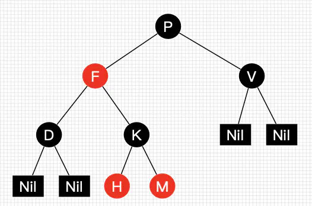

# Red–black tree

参考文章:

1、wisc [Red-Black Trees](http://pages.cs.wisc.edu/~skrentny/cs367-common/readings/Red-Black-Trees/)

这篇文章对red-black tree的property进行了非常好的总结

2、brilliant [Red-Black Tree](https://brilliant.org/wiki/red-black-tree/)

其中给出了Python实现

3、cnblogs [红黑树(一)之 原理和算法详细介绍](https://www.cnblogs.com/skywang12345/p/3245399.html)

4、jianshu [30张图带你彻底理解红黑树](https://www.jianshu.com/p/e136ec79235c)


## Example

### jianshu [30张图带你彻底理解红黑树](https://www.jianshu.com/p/e136ec79235c)

红黑树并不是一个*完美*平衡二叉查找树，从图1可以看到，根结点P的左子树显然比右子树高，但左子树和右子树的黑结点的层数是相等的，也即任意一个结点到到每个叶子结点的路径都包含数量相同的黑结点(性质5)。所以我们叫红黑树这种平衡为**黑色完美平衡**。




> NOTE: 
>
> 上述例子非常重要，它揭示了red-black tree不是完美的平衡二叉树，而只是**黑色完美平衡**。


### wisc [Red-Black Trees](http://pages.cs.wisc.edu/~skrentny/cs367-common/readings/Red-Black-Trees/)


## wikipedia [Red–black tree](https://en.wikipedia.org/wiki/Red%E2%80%93black_tree)

A **red–black tree** is a kind of [self-balancing binary search tree](https://en.wikipedia.org/wiki/Self-balancing_binary_search_tree) in [computer science](https://en.wikipedia.org/wiki/Computer_science). Each node of the binary tree has an extra **bit**, and that bit is often interpreted as the **color** (red or black) of the node. These **color bits** are used to ensure the tree remains approximately balanced during insertions and deletions.


Balance is preserved by painting each node of the tree with one of two colors in a way that satisfies certain properties, which collectively constrain how unbalanced the tree can become in the worst case. When the tree is modified, the new tree is subsequently rearranged and repainted to restore the coloring properties. The properties are designed in such a way that this rearranging and recoloring can be performed efficiently.

> NOTE: 
>
> 一、red-black tree能够得以流行在于它的高效性
>
> 1、从空间角度来看: 空间需求是非常低的，只需要1 bit即可
>
> 2、从时间角度来看: "The insertion and deletion operations, along with the **tree rearrangement and recoloring**, are also performed in O(log *n*) time. "
>
> 也就是说，并不会带来额外的时间负荷

**The balancing of the tree is not perfect**, but it is good enough to allow it to guarantee searching in [O(log *n*)](https://en.wikipedia.org/wiki/Big-O_notation) time, where *n* is the total number of elements in the tree. The insertion and deletion operations, along with the **tree rearrangement and recoloring**, are also performed in O(log *n*) time. 

Tracking the color of each node requires only 1 bit of information per node because there are only two colors. The tree does not contain any other data specific to its being a red–black tree so its memory footprint is almost identical to a classic (uncolored) [binary search tree](https://en.wikipedia.org/wiki/Binary_search_tree). In many cases, the additional bit of information can be stored at no additional memory cost.

### History

> NOTE: 
>
> B-tree-> [2-3-4 trees](https://en.wikipedia.org/wiki/2–3–4_tree) 、symmetric binary B-tree -> red-black tree->left-leaning red–black tree

In 1972, [Rudolf Bayer](https://en.wikipedia.org/wiki/Rudolf_Bayer)[[4\]](https://en.wikipedia.org/wiki/Red–black_tree#cite_note-Bayer72-4) invented a data structure that was a special order-4 case of a [B-tree](https://en.wikipedia.org/wiki/B-tree). These trees maintained all paths from root to leaf with the same number of nodes, creating perfectly balanced trees. However, they were not binary search trees. Bayer called them a "symmetric binary B-tree" in his paper and later they became popular as [2-3-4 trees](https://en.wikipedia.org/wiki/2–3–4_tree) or just 2-4 trees. 

In a 1978 paper, "A Dichromatic Framework for Balanced Trees",[[6\]](https://en.wikipedia.org/wiki/Red–black_tree#cite_note-GS78-6) [Leonidas J. Guibas](https://en.wikipedia.org/wiki/Leonidas_J._Guibas) and [Robert Sedgewick](https://en.wikipedia.org/wiki/Robert_Sedgewick_(computer_scientist)) derived the red-black tree from the symmetric binary B-tree.[[7\]](https://en.wikipedia.org/wiki/Red–black_tree#cite_note-7) The color "red" was chosen because it was the best-looking color produced by the color laser printer available to the authors while working at [Xerox PARC](https://en.wikipedia.org/wiki/Xerox_PARC).[[8\]](https://en.wikipedia.org/wiki/Red–black_tree#cite_note-Sedgewick12-8) Another response from Guibas states that it was because of the red and black pens available to them to draw the trees. 

In 1993, Arne Andersson introduced the idea of right leaning tree to simplify insert and delete operations.

In 1999, Chris Okasaki showed how to make the insert operation purely functional. Its balance function needed to take care of only 4 unbalanced cases and one default balanced case.  

The original algorithm used 8 unbalanced cases, but [Cormen et al. (2001)](https://en.wikipedia.org/wiki/Red–black_tree#CITEREFCormenLeisersonRivestStein2001) reduced that to 6 unbalanced cases.[[2\]](https://en.wikipedia.org/wiki/Red–black_tree#cite_note-:0-2) Sedgewick showed that the insert operation can be implemented in just 46 lines of Java code. In 2008, Sedgewick proposed the [left-leaning red–black tree](https://en.wikipedia.org/wiki/Left-leaning_red–black_tree), leveraging Andersson's idea that simplified algorithms. Sedgewick originally allowed nodes whose two children are red, making his trees more like 2-3-4 trees, but later this restriction was added, making new trees more like 2-3 trees. Sedgewick implemented the insert algorithm in just 33 lines, significantly shortening his original 46 lines of code. 


### Terminology

A **red–black tree** is a special type of [binary tree](https://en.wikipedia.org/wiki/Binary_tree), used in [computer science](https://en.wikipedia.org/wiki/Computer_science) to organize pieces of comparable [data](https://en.wikipedia.org/wiki/Data), such as text fragments or numbers.

The [leaf nodes](https://en.wikipedia.org/wiki/Leaf_node) of red–black trees do not contain data. These leaves need not be explicit in computer memory—a **null child pointer** can encode the fact that this child is a leaf—but it simplifies some algorithms for operating on red–black trees if the leaves really are explicit nodes. To save execution time, sometimes a pointer to a single [sentinel node](https://en.wikipedia.org/wiki/Sentinel_node) (instead of a null pointer) performs the role of all **leaf nodes**; all references from [internal nodes](https://en.wikipedia.org/wiki/Tree_(data_structure)#Internal_nodes) to leaf nodes then point to the **sentinel node**.

Red–black trees, like all [binary search trees](https://en.wikipedia.org/wiki/Binary_search_tree), allow efficient [in-order traversal](https://en.wikipedia.org/wiki/In-order_traversal) (that is: in the order Left–Root–Right) of their elements. The search-time results from the traversal from root to leaf, and therefore a balanced tree of *n* nodes, having the least possible tree height, results in O(log *n*) search time.


### Properties

In addition to the requirements imposed on a [binary search tree](https://en.wikipedia.org/wiki/Binary_search_tree) the following must be satisfied by a **red–black tree**:[[16\]](https://en.wikipedia.org/wiki/Red–black_tree#cite_note-16)

1、Each node is either red or black.

2、The root is black. This rule is sometimes omitted（省略）. Since the root can always be changed from red to black, but not necessarily vice versa, this rule has little effect on analysis.

3、All leaves (NIL) are **black**.

4、If a node is red, then both its children are black.

5、Every [path](https://en.wikipedia.org/wiki/Path_(graph_theory)) from a given node to any of its descendant NIL nodes contains the same number of black nodes.

> NOTE: 
>
> 一、在 jianshu [30张图带你彻底理解红黑树](https://www.jianshu.com/p/e136ec79235c) 中，称之为: **黑色完美平衡**
>
> 二、在 brilliant [Red-Black Tree](https://brilliant.org/wiki/red-black-tree/) 中，提出了 "**black-depth**"概念


Some definitions: the number of black nodes from the root to a node is the node's **black depth**; the uniform number of black nodes in all paths from root to the leaves is called the **black-height** of the **red–black tree**.[[17\]](https://en.wikipedia.org/wiki/Red–black_tree#cite_note-17)


These constraints enforce a critical property of red–black trees: *the path from the root to the farthest leaf is no more than twice as long as the path from the root to the nearest leaf*. The result is that the tree is roughly height-balanced. Since operations such as inserting, deleting, and finding values require worst-case time proportional to the **height of the tree**, this **theoretical upper bound** on the height allows red–black trees to be efficient in the worst case, unlike ordinary [binary search trees](https://en.wikipedia.org/wiki/Binary_search_tree).


To see why this is guaranteed, it suffices to consider the effect of properties 4 and 5 together. For a red–black tree *T*, let *B* be the number of black nodes in *property 5*. Let the shortest possible path from the **root** of *T* to any **leaf** consist of *B* black nodes. Longer possible paths may be constructed by inserting red nodes. However, property 4 makes it impossible to insert more than one consecutive red node. Therefore, ignoring any black NIL leaves, the longest possible path consists of *2\*B* nodes, alternating（交替） black and red (this is the worst case). Counting the black NIL leaves, the longest possible path consists of *2\*B-1* nodes.

*The shortest possible path has all black nodes, and the longest possible path alternates（交替） between red and black nodes*. Since all maximal paths have the same number of black nodes, by property 5, this shows that *no path is more than twice as long as any other path*.


### Analogy to B-trees of order 4

A red–black tree is similar in structure to a [B-tree](https://en.wikipedia.org/wiki/B-tree) of order[[note 1\]](https://en.wikipedia.org/wiki/Red–black_tree#cite_note-18) 4, where each node can contain between 1 and 3 values and (accordingly) between 2 and 4 child pointers. In such a B-tree, each node will contain only one value matching the value in a black node of the red–black tree, with an optional value before and/or after it in the same node, both matching an equivalent red node of the red–black tree.

One way to see this equivalence is to "move up" the red nodes in a graphical representation of the red–black tree, so that they align horizontally with their parent black node, by creating together a horizontal cluster. In the B-tree, or in the modified graphical representation of the red–black tree, all leaf nodes are at the same depth.

The red–black tree is then structurally equivalent to a B-tree of order 4, with a minimum fill factor of 33% of values per cluster with a maximum capacity of 3 values.

This B-tree type is still more general than a red–black tree though, as it allows ambiguity in a red–black tree conversion—multiple red–black trees can be produced from an equivalent B-tree of order 4. If a B-tree cluster contains only 1 value, it is the minimum, black, and has two child pointers. If a cluster contains 3 values, then the central value will be black and each value stored on its sides will be red. If the cluster contains two values, however, either one can become the black node in the red–black tree (and the other one will be red).

So the order-4 B-tree does not maintain which of the values contained in each cluster is the root black tree for the whole cluster and the parent of the other values in the same cluster. Despite this, the operations on red–black trees are more economical in time because you don't have to maintain the vector of values.[[18\]](https://en.wikipedia.org/wiki/Red–black_tree#cite_note-19) It may be costly if values are stored directly in each node rather than being stored by reference. B-tree nodes, however, are more economical in space because you don't need to store the color attribute for each node. Instead, you have to know which slot in the cluster vector is used. If values are stored by reference, e.g. objects, null references can be used and so the cluster can be represented by a vector containing 3 slots for value pointers plus 4 slots for child references in the tree. In that case, the B-tree can be more compact in memory, improving data locality.

The same analogy can be made with B-trees with larger orders that can be structurally equivalent to a colored binary tree: you just need more colors. Suppose that you add blue, then the blue–red–black tree defined like red–black trees but with the additional constraint that no two successive nodes in the hierarchy will be blue and all blue nodes will be children of a red node, then it becomes equivalent to a B-tree whose clusters will have at most 7 values in the following colors: blue, red, blue, black, blue, red, blue (For each cluster, there will be at most 1 black node, 2 red nodes, and 4 blue nodes).

For moderate volumes of values, insertions and deletions in a colored binary tree are faster compared to B-trees because colored trees don't attempt to maximize the fill factor of each horizontal cluster of nodes (only the minimum fill factor is guaranteed in colored binary trees, limiting the number of splits or junctions of clusters). B-trees will be faster for performing [rotations](https://en.wikipedia.org/wiki/Tree_rotation) (because rotations will frequently occur within the same cluster rather than with multiple separate nodes in a colored binary tree). For storing large volumes, however, B-trees will be much faster as they will be more compact by grouping several children in the same cluster where they can be accessed locally.

All optimizations possible in B-trees to increase the average fill factors of clusters are possible in the equivalent multicolored binary tree. Notably, maximizing the average fill factor in a structurally equivalent B-tree is the same as reducing the total height of the multicolored tree, by increasing the number of non-black nodes. The worst case occurs when all nodes in a colored binary tree are black, the best case occurs when only a third of them are black (and the other two thirds are red nodes).

[](https://en.wikipedia.org/wiki/File:Red-black_tree_example_(B-tree_analogy).svg)

The same red–black tree as in the example above, seen as a B-tree.


> NOTE: 
>
> 上面这一段并没有搞懂，需要Google：red black tree to 2-3-4 tree


### Applications and related data structures

Red–black trees offer worst-case guarantees for insertion time, deletion time, and search time. Not only does this make them valuable in time-sensitive applications such as [real-time applications](https://en.wikipedia.org/wiki/Real-time_computing), but it makes them valuable building blocks in other data structures which provide worst-case guarantees; for example, many data structures used in [computational geometry](https://en.wikipedia.org/wiki/Computational_geometry) can be based on red–black trees, and the [Completely Fair Scheduler](https://en.wikipedia.org/wiki/Completely_Fair_Scheduler) used in current [Linux](https://en.wikipedia.org/wiki/Linux) kernels and [epoll](https://en.wikipedia.org/wiki/Epoll) system call implementation[[19\]](https://en.wikipedia.org/wiki/Red–black_tree#cite_note-20) uses red–black trees.

The [AVL tree](https://en.wikipedia.org/wiki/AVL_tree) is another structure supporting O(log *n*) search, insertion, and removal. AVL trees can be colored red-black, thus are a subset of RB trees. Worst-case height is 0.720 times the worst-case height of RB trees, so AVL trees are more rigidly（严格的） balanced. The performance measurements of Ben Pfaff with realistic test cases in 79 runs find AVL to RB ratios between 0.677 and 1.077, median at 0.947, and geometric mean 0.910.[[20\]](https://en.wikipedia.org/wiki/Red–black_tree#cite_note-21) [WAVL trees](https://en.wikipedia.org/wiki/WAVL_tree)have a performance in between those two.

Red–black trees are also particularly valuable in [functional programming](https://en.wikipedia.org/wiki/Functional_programming), where they are one of the most common [persistent data structures](https://en.wikipedia.org/wiki/Persistent_data_structure), used to construct [associative arrays](https://en.wikipedia.org/wiki/Associative_array) and [sets](https://en.wikipedia.org/wiki/Set_(computer_science)) which can retain previous versions after mutations. The persistent version of red–black trees requires O(log *n*) space for each insertion or deletion, in addition to time.

For every [2-4 tree](https://en.wikipedia.org/wiki/2-4_tree), there are corresponding red–black trees with data elements in the same order. The insertion and deletion operations on 2-4 trees are also equivalent to color-flipping and rotations in red–black trees. This makes 2-4 trees an important tool for understanding the logic behind red–black trees, and this is why many introductory algorithm texts introduce 2-4 trees just before red–black trees, even though 2-4 trees are not often used in practice.

In 2008, [Sedgewick](https://en.wikipedia.org/wiki/Robert_Sedgewick_(computer_scientist)) introduced a simpler version of the red–black tree called the [left-leaning red–black tree](https://en.wikipedia.org/wiki/Left-leaning_red–black_tree)[[21\]](https://en.wikipedia.org/wiki/Red–black_tree#cite_note-cs.princeton.edu-22) by eliminating a previously unspecified degree of freedom in the implementation. The LLRB maintains an additional invariant that all red links must lean left except during inserts and deletes. Red–black trees can be made isometric to either [2-3 trees](https://en.wikipedia.org/wiki/2-3_tree),[[22\]](https://en.wikipedia.org/wiki/Red–black_tree#cite_note-23) or 2-4 trees,[[21\]](https://en.wikipedia.org/wiki/Red–black_tree#cite_note-cs.princeton.edu-22) for any sequence of operations. The 2-4 tree isometry was described in 1978 by Sedgewick.[*This quote needs a citation*] With 2-4 trees, the isometry is resolved by a "color flip," corresponding to a split, in which the red color of two children nodes leaves the children and moves to the parent node.

The original description of the [tango tree](https://en.wikipedia.org/wiki/Tango_tree), a type of tree optimized for fast searches, specifically uses red–black trees as part of its data structure.[[23\]](https://en.wikipedia.org/wiki/Red–black_tree#cite_note-DHIP-24)

In the version 8 of Java, the Collection [HashMap](https://en.wikipedia.org/wiki/Hashtable) has been modified such that instead of using a [LinkedList](https://en.wikipedia.org/wiki/LinkedList) to store different elements with [colliding](https://en.wikipedia.org/wiki/Hash_function#Uniformity) [hashcodes](https://en.wikipedia.org/wiki/Hashcode), a Red-Black tree is used. This results in the improvement of time complexity of searching such an element from O(*n*) to O(log *n*).[[24\]](https://en.wikipedia.org/wiki/Red–black_tree#cite_note-25)


### Operations

Read-only operations on a red–black tree require no modification from those used for [binary search trees](https://en.wikipedia.org/wiki/Binary_search_tree), because every red–black tree is a special case of a simple binary search tree. However, the immediate result of an insertion or removal may violate the properties of a red–black tree. Restoring the red–black properties requires a small number ([O(log *n*)](https://en.wikipedia.org/wiki/Big-O_notation) or [amortized O(1)](https://en.wikipedia.org/wiki/Amortized_analysis)) of color changes (which are very quick in practice) and no more than three [tree rotations](https://en.wikipedia.org/wiki/Tree_rotation) (two for insertion). Although insert and delete operations are complicated, their times remain O(log *n*).

If the example implementation below is not suitable, there are a couple other implementations with explanations found in Ben Pfaff's annotated C library [GNU libavl](http://adtinfo.org/) (v2.0.3 as of June 2019) and Eternally Confuzzled's [tutorial on red-black trees](http://eternallyconfuzzled.com/tuts/datastructures/jsw_tut_rbtree.aspx).

The details of the insert and removal operations will be demonstrated with example [C++](https://en.wikipedia.org/wiki/C%2B%2B_(programming_language)) code. The example code may call upon the helper functions below to find the parent, sibling, uncle and grandparent nodes and to rotate a node left or right:

```C
// Basic type defintions:

enum color_t { BLACK, RED };

struct Node {
  Node* parent;
  Node* left;
  Node* right;
  enum color_t color;
  int key;
};

// Helper functions:

Node* GetParent(Node* n) {
  // Note that parent is set to null for the root node.
  return n->parent;
}

Node* GetGrandParent(Node* n) {
  Node* p = GetParent(n);

  // No parent means no grandparent.
  if (p == nullptr) {
    return nullptr;
  }

  // Note: Will be nullptr if parent is root.
  return GetParent(p);
}

Node* GetSibling(Node* n) {
  Node* p = GetParent(n);

  // No parent means no sibling.
  if (p == nullptr) {
    return nullptr;
  }

  if (n == p->left) {
    return p->right;
  } else {
    return p->left;
  }
}

Node* GetUncle(Node* n) {
  Node* p = GetParent(n);
  Node* g = GetGrandParent(n);

  // No grandparent means no uncle
  if (g == nullptr) {
    return nullptr;
  }

  return GetSibling(p);
}

void RotateLeft(Node* n) {
  Node* nnew = n->right;
  Node* p = GetParent(n);
  assert(nnew != nullptr);  // Since the leaves of a red-black tree are empty,
                            // they cannot become internal nodes.
  n->right = nnew->left;
  nnew->left = n;
  n->parent = nnew;
  // Handle other child/parent pointers.
  if (n->right != nullptr) {
    n->right->parent = n;
  }

  // Initially n could be the root.
  if (p != nullptr) {
    if (n == p->left) {
      p->left = nnew;
    } else if (n == p->right) {
      p->right = nnew;
    }
  }
  nnew->parent = p;
}

void RotateRight(Node* n) {
  Node* nnew = n->left;
  Node* p = GetParent(n);
  assert(nnew != nullptr);  // Since the leaves of a red-black tree are empty,
                            // they cannot become internal nodes.

  n->left = nnew->right;
  nnew->right = n;
  n->parent = nnew;

  // Handle other child/parent pointers.
  if (n->left != nullptr) {
    n->left->parent = n;
  }

  // Initially n could be the root.
  if (p != nullptr) {
    if (n == p->left) {
      p->left = nnew;
    } else if (n == p->right) {
      p->right = nnew;
    }
  }
  nnew->parent = p;
}
```


## TODO

在各种各样的DS中都需要维持一些invariant


在red black tree中，它为什么需要为每个node赋予red、black这两种颜色呢？

显然，它这样做的目的在于便于维持整棵树的高度在于$O(ln(n))$，即保持balanced


