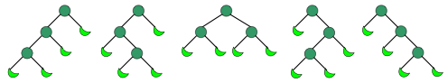

# wikipedia [Catalan number](https://en.wikipedia.org/wiki/Catalan_number)

In [combinatorial mathematics](https://en.wikipedia.org/wiki/Combinatorics), the **Catalan numbers** form a [sequence](https://en.wikipedia.org/wiki/Sequence) of [natural numbers](https://en.wikipedia.org/wiki/Natural_number) that occur in various [counting problems](https://en.wikipedia.org/wiki/Enumeration), often involving [recursively](https://en.wikipedia.org/wiki/Recursion)-defined objects. They are named after the [Belgian](https://en.wikipedia.org/wiki/Belgium) [mathematician](https://en.wikipedia.org/wiki/Mathematician) [Eugène Charles Catalan](https://en.wikipedia.org/wiki/Eugène_Charles_Catalan) (1814–1894). 

 The *n*th Catalan number is given directly in terms of [binomial coefficients](https://en.wikipedia.org/wiki/Binomial_coefficient) by 

$$
{\displaystyle C_{n}={\frac {1}{n+1}}{2n \choose n}={\frac {(2n)!}{(n+1)!\,n!}}=\prod \limits _{k=2}^{n}{\frac {n+k}{k}}\qquad {\text{for }}n\geq 0.}
$$

> NOTE: 
>
> 注意是连乘，上式给出的是Catalan number的计算方式，但是在实际地解决问题过程中，我们更多的是使用Catalan number的递归表达式；

​	

 The $C_5 = 42$ [noncrossing partitions](https://en.wikipedia.org/wiki/Noncrossing_partition) of a 5-element set (below, the other 10 of the [52](https://en.wikipedia.org/wiki/Bell_number) [partitions](https://en.wikipedia.org/wiki/Partition_of_a_set)) 

## Properties

An alternative expression for $C_n$ is 

 $ C_{n}={2n \choose n}-{2n \choose n+1}={1 \over n+1}{2n \choose n}\quad {\text{ for }}n\geq 0, $ 

which is equivalent to the expression given above because $ {\tbinom {2n}{n+1}}={\tfrac {n}{n+1}}{\tbinom {2n}{n}} $. This shows that  $C_n$is an [integer](https://en.wikipedia.org/wiki/Integer), which is not immediately obvious from the first formula given. This expression forms the basis for a [proof of the correctness of the formula](https://en.wikipedia.org/wiki/Catalan_number#Second_proof). 

The Catalan numbers satisfy the [recurrence relations](https://en.wikipedia.org/wiki/Recurrence_relation)[[1\]](https://en.wikipedia.org/wiki/Catalan_number#cite_note-1) 

 $ C_{0}=1\quad {\text{and}}\quad C_{n+1}=\sum _{i=0}^{n}C_{i}\,C_{n-i}\quad {\text{for }}n\geq 0, $ 

> NOTE: 
>
> 一、为什么是$C_{i}$ 乘以$C_{n-i}$，而不是相加呢？如何来结和具体案例对这个问题进行分析？
>
> 1、结合"矩阵连乘"的例子来理解
>
> 2、需要以"divide and conquer-原问题 子问题"
>
>  在位置`i`初，断开，则左侧子问题的解空间的个数为$C_{i}$，右侧子问题的解空间个数为$C_{n-i}$，原问题的解空间个数是由左右两侧子问题的解组合而成，因此应该使用乘法而不是加法。
>
> 

$$
{\displaystyle \sum _{i_{1}+\cdots +i_{m}=n,i_{1},\ldots ,i_{m}\geq 0}C_{i_{1}}\cdots C_{i_{m}}={\begin{cases}{\dfrac {m(n+1)(n+2)\cdots (n+m/2-1)}{2(n+m/2+2)(n+m/2+3)\cdots (n+m)}}C_{n+m/2},&m{\text{ even}}\\[5pt]{\dfrac {m(n+1)(n+2)\cdots (n+(m-1)/2)}{(n+(m+3)/2)(n+(m+3)/2+1)\cdots (n+m)}}C_{n+(m-1)/2},&m{\text{ odd,}}\end{cases}}}
$$

> NOTE: 
>
> 1、原文后面是一系列的数学公式推导

## Applications in combinatorics

There are many counting problems in [combinatorics](https://en.wikipedia.org/wiki/Combinatorics) whose solution is given by the **Catalan numbers**. The book *Enumerative Combinatorics: Volume 2* by combinatorialist [Richard P. Stanley](https://en.wikipedia.org/wiki/Richard_P._Stanley) contains a set of exercises which describe 66 different interpretations（解释） of the **Catalan numbers**. Following are some examples, with illustrations of the cases $C_3 = 5$ and $C_4 = 14$. 

### 1、Dyck word

> NOTE: 
>
> 1、其实就是matched parentheses 

$C_n$ is the number of [Dyck words](https://en.wikipedia.org/wiki/Dyck_word)[[3\]](https://en.wikipedia.org/wiki/Catalan_number#cite_note-3) of length $2n$. A Dyck word is a [string](https://en.wikipedia.org/wiki/String_(computer_science)) consisting of *n* X's and *n* Y's such that no initial segment of the string has more Y's than X's. For example, the following are the Dyck words of length 6:

`XXXYYY   XYXXYY   XYXYXY   XXYYXY   XXYXYY.`

### 2、Matched parentheses 

> NOTE: 
>
> 1、很多问题都可以转换为Matched parentheses 

Re-interpreting the symbol X as an open [parenthesis](https://en.wikipedia.org/wiki/Bracket#Parentheses) and Y as a close parenthesis, $C_n$ counts the number of expressions containing *n* pairs of parentheses which are correctly matched:

 `((()))   ()(())   ()()()   (())()   (()())` 

### 3、

$C_n$ is the number of different ways *n* + 1 factors can be completely [parenthesized](https://en.wikipedia.org/wiki/Bracket) (or the number of ways of [associating](https://en.wikipedia.org/wiki/Associativity) *n* applications of a [binary operator](https://en.wikipedia.org/wiki/Binary_operator)). For *n* = 3, for example, we have the following five different parenthesizations of four factors:

 `((ab)c)d   (a(bc))d   (ab)(cd)   a((bc)d)   a(b(cd))` 

### 4、

Successive applications of a binary operator can be represented in terms of a full [binary tree](https://en.wikipedia.org/wiki/Binary_tree). (A rooted binary tree is *full* if every vertex has either two children or no children.) It follows that $C_n$ is the number of full binary [trees](https://en.wikipedia.org/wiki/Tree_(graph_theory)) with *n* + 1 leaves:

> NOTE: 
>
> 如果将 `((ab)c)d   (a(bc))d   (ab)(cd)   a((bc)d)   a(b(cd))` 中的字符看做上面树中的leaf node的话，则它们是一一对应的，这说明它们本质上是同一类问题；这说明catalan number和二叉树之间也是存在着一定的关联的；

### 5、

$C_n$ is the number of non-isomorphic ordered trees with *n* + 1 vertices. (An ordered tree is a rooted tree in which the children of each vertex are given a fixed left-to-right order.)[[4\]](https://en.wikipedia.org/wiki/Catalan_number#cite_note-4) 

### 6、lattice path

$C_n$ is the number of monotonic [lattice paths](https://en.wikipedia.org/wiki/Lattice_path) along the edges of a grid with *n* × *n* square cells, which do not pass above the diagonal. A monotonic path is one which starts in the lower left corner, finishes in the upper right corner, and consists entirely of edges pointing rightwards or upwards. Counting such paths is equivalent to counting Dyck words: X stands for "move right" and Y stands for "move up". 

> NOTE: 
>
> 1、最后一句话提示我们: lattice path 和 dyck word 的一一对应关系

### 7、[convex polygon](https://en.wanweibaike.com/wiki-Convex_polygon) non-crossing [triangulation](https://en.wanweibaike.com/wiki-Triangle)

> NOTE: 
>
> 1、凸多边形的非交叉三角剖分，参见 `凸多边形的最优三角剖分` 章节
>
> 

A [convex polygon](https://en.wanweibaike.com/wiki-Convex_polygon) with *n* + 2 sides can be cut into [triangles](https://en.wanweibaike.com/wiki-Triangle) by connecting vertices with non-crossing [line segments](https://en.wanweibaike.com/wiki-Line_segment) (a form of [polygon triangulation](https://en.wanweibaike.com/wiki-Polygon_triangulation)).

### 8、 [stack](https://en.wanweibaike.com/wiki-Stack_(data_structure))-sortable [permutations](https://en.wanweibaike.com/wiki-Permutation) 

*Cn* is the number of [stack](https://en.wanweibaike.com/wiki-Stack_(data_structure))-sortable [permutations](https://en.wanweibaike.com/wiki-Permutation) of {1, ..., *n*}. 

