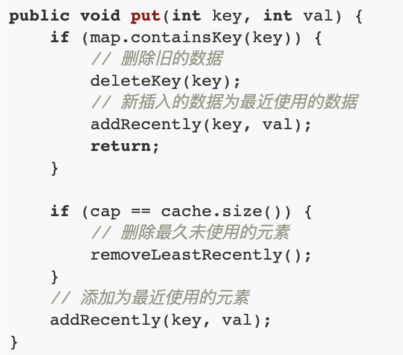
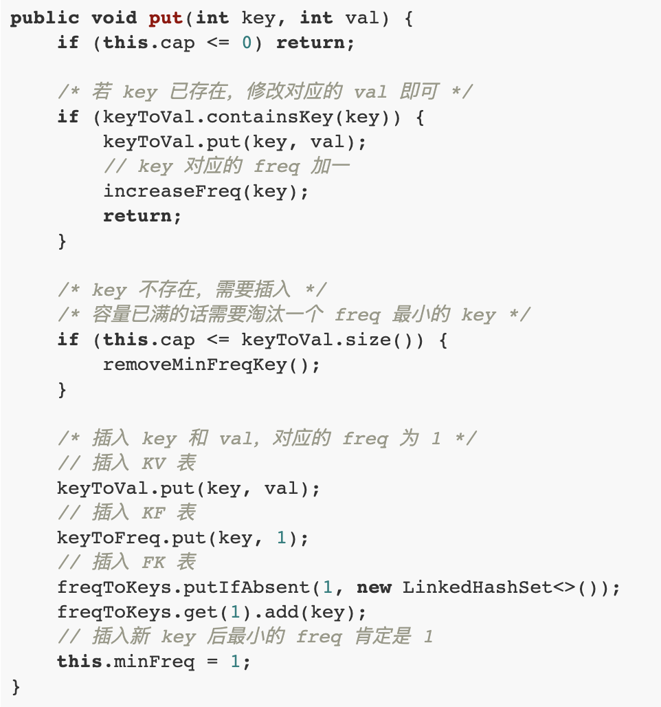
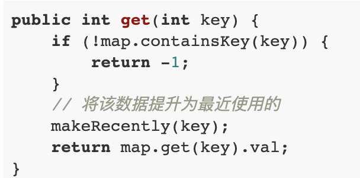
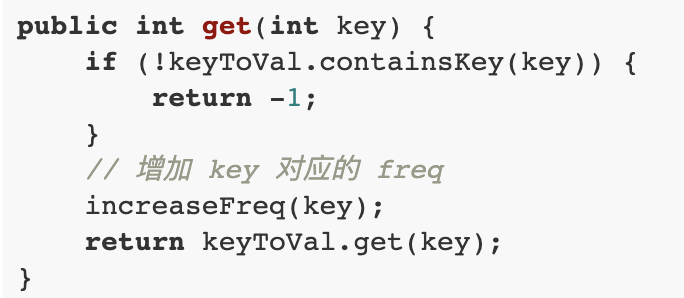

# 设计数据结构

## LRU & LFU

两者相同点：

一、capacity

当capacity满后，需要删除末尾节点

二、一旦get、put，就需要更新这个node的属性：

在LRU中，需要`makeRecently`；

在LFU中，需要`increaseFreq`；

三、两者的`put`逻辑类似

| LRU                | LFU                |
| ------------------ | ------------------ |
|  |  |

四、两者get逻辑类似

| LRU   | LFU  |
| ----- | ---- |
|  |      |

四、两者的本质是自定义排序:

1、LRU中，根据"recently"进行排序

2、LFU中，根据"frequency"进行排序

五、动态变化的

LRU中，根据key获得value，则这个节点对应的位置就需要调整

LFU中，根据key获得value，则这个节点对应的位置就需要调整