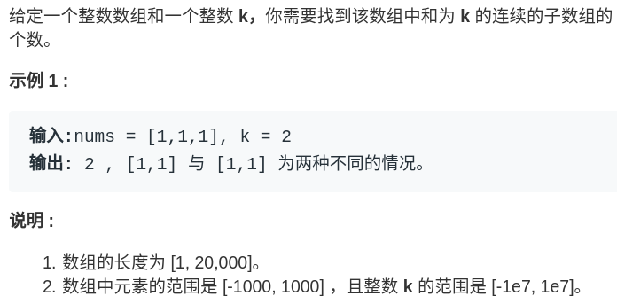

# labuladong [前缀和技巧：解决子数组问题](https://mp.weixin.qq.com/s/4TxF0xVhlUO6v3teip9Jzg) 

今天来聊一道简单却十分巧妙的算法问题：算出一共有几个和为 k 的子数组。

> NOTE: 
>
> 1、原题为: LeetCode [560. 和为K的子数组](https://leetcode.cn/problems/subarray-sum-equals-k/)
>
> 显然这种解法就是充分运用prefix sum，其实 LeetCode [560. 和为K的子数组](https://leetcode.cn/problems/subarray-sum-equals-k/) 的官方解题中对这种解法的命名为: "前缀和 + 哈希表优化"，显然它是更加能够反映这种算法的内容的。



思路很简单，我把所有子数组都穷举出来，算它们的和，看看谁的和等于 k 不就行了。

关键是，**如何快速得到某个子数组的和呢**，比如说给你一个数组`nums`，让你实现一个接口`sum(i, j)`，这个接口要返回`nums[i..j]`的和，而且会被多次调用，你怎么实现这个接口呢？

因为接口要被多次调用，显然不能每次都去遍历`nums[i..j]`，有没有一种快速的方法在 O(1) 时间内算出`nums[i..j]`呢？这就需要**前缀和**技巧了。

## 一、什么是前缀和

前缀和的思路是这样的，对于一个给定的数组`nums`，我们额外开辟一个前缀和数组进行预处理：

```
int n = nums.length;
// 前缀和数组
int[] preSum = new int[n + 1];
preSum[0] = 0;
for (int i = 0; i < n; i++)
    preSum[i + 1] = preSum[i] + nums[i];
```


这个前缀和数组`preSum`的含义也很好理解，`preSum[i]`就是`nums[0..i-1]`的和。那么如果我们想求`nums[i..j]`的和，只需要一步操作`preSum[j+1]-preSum[i]`即可，而不需要重新去遍历数组了。

回到这个子数组问题，我们想求有多少个子数组的和为 k，借助前缀和技巧很容易写出一个解法：

```Java
int subarraySum(int[] nums, int k) {
    int n = nums.length;
    // 构造前缀和
    int[] sum = new int[n + 1];
    sum[0] = 0; 
    for (int i = 0; i < n; i++)
        sum[i + 1] = sum[i] + nums[i];

    int ans = 0;
    // 穷举所有子数组
    for (int i = 1; i <= n; i++)
        for (int j = 0; j < i; j++)
            // sum of nums[j..i-1]
            if (sum[i] - sum[j] == k)
                ans++;

    return ans;
}
```

这个解法的时间复杂度空间复杂度，并不是最优的解法。不过通过这个解法理解了前缀和数组的工作原理之后，可以使用一些巧妙的办法把时间复杂度进一步降低。

## 二、优化解法

前面的解法有嵌套的 for 循环：

```Java
for (int i = 1; i <= n; i++)
    for (int j = 0; j < i; j++)
        if (sum[i] - sum[j] == k)
            ans++;
```

第二层 for 循环在干嘛呢？翻译一下就是，**在计算，有几个`j`能够使得`sum[i]`和`sum[j]`的差为 k。**毎找到一个这样的`j`，就把结果加一。

我们可以把 if 语句里的条件判断移项，这样写：

```Java
if (sum[j] == sum[i] - k)
    ans++;
```

优化的思路是：**我直接记录下有几个`sum[j]`和`sum[i]-k`相等，直接更新结果，就避免了内层的 for 循环**。我们可以用**哈希表**，在记录**前缀和**的同时记录该**前缀和**出现的次数。


比如说下面这个情况，需要前缀和 8 就能找到和为 k 的子数组了，之前的暴力解法需要遍历数组去数有几个 8，而优化解法借助哈希表可以直接得知有几个前缀和为 8。


这样，就把时间复杂度降到了，是最优解法了。

## 三、总结

前缀和不难，却很有用，主要用于处理**数组区间**的问题。

> NOTE: 
>
> 上述所谓**数组区间**，其实就是子数组。

比如说，让你统计班上同学考试成绩在不同分数段的百分比，也可以利用前缀和技巧：

```Java
int[] scores; // 存储着所有同学的分数
// 试卷满分 150 分
int[] count = new int[150 + 1]
// 记录每个分数有几个同学
for (int score : scores)
    count[score]++
// 构造前缀和
for (int i = 1; i < count.length; i++)
    count[i] = count[i] + count[i-1];
```

这样，给你任何一个分数段，你都能通过前缀和相减快速计算出这个分数段的人数，百分比也就很容易计算了。