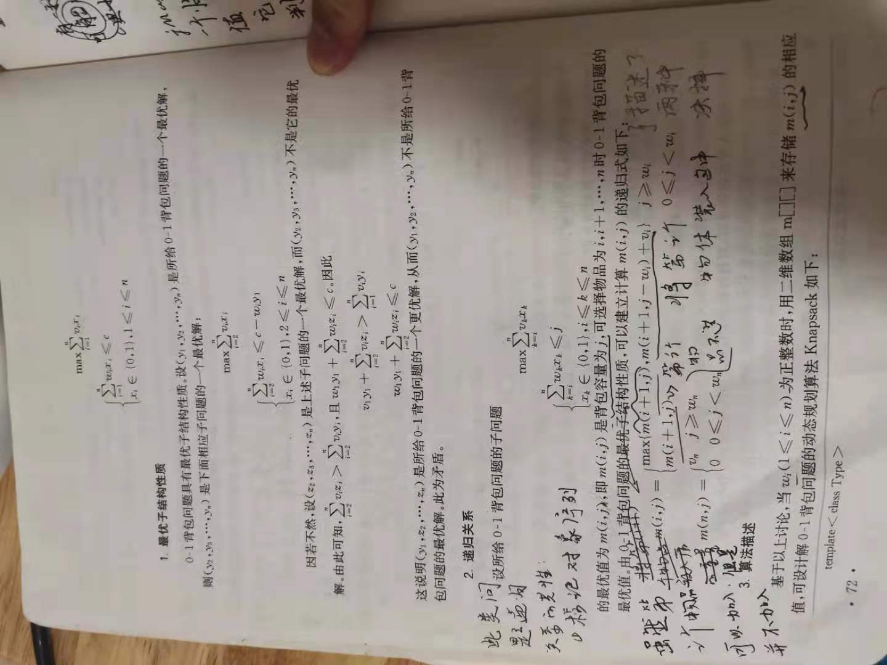
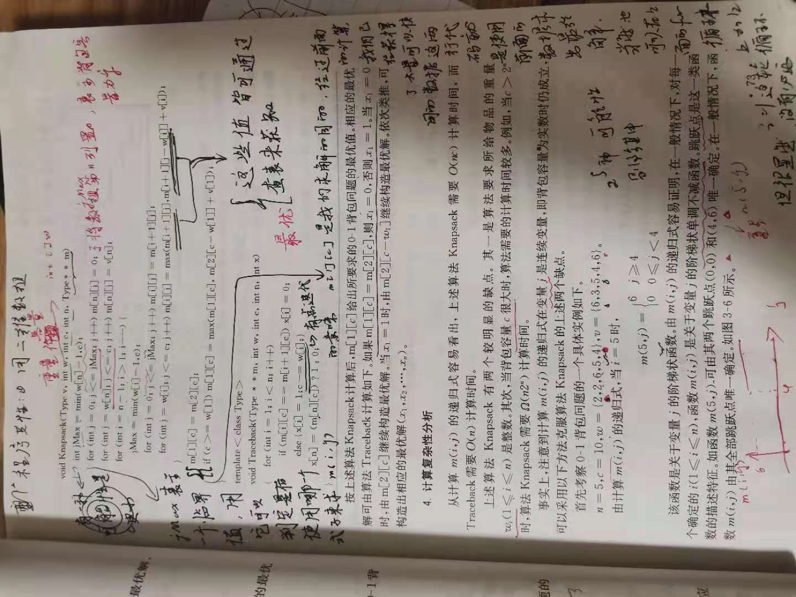

# 3.10 0-1背包问题






上述程序是存在错误的，下面是正确的写法:

```C++
#include <bits/stdc++.h>
using namespace std;

/**
 * @brief
 *
 * @tparam Type
 * @param v
 * @param w 数组，表示物品重量
 * @param c 背包容量
 * @param n 物品个数
 * @param m
 */
template<typename Type>
void Knapsack(Type v, int *w, int c, int n, Type **m)
{
	/**
	 * base case: 只有第n个物品，它的重量为w[n]
	 */
	int jMax = min(w[n] - 1, c); // 表示一个分界值，用它可以判定使用哪一个式子来求m(i, j]
	for (int j = 0; j <= jMax; ++j) // j表示的是背包的容量，显然，此时它无法装下第n个物品，所以全部都初始化为0
	{
		m[n][j] = 0;
	}
	for (int j = w[n]; j <= c; j++) // j表示的是背包的容量，显然，此时可以装下第n个物品
	{
		m[n][j] = v[n];
	}
	for (int i = n - 1; i > 1; ++i)
	{
		jMax = min(w[1] - 1, c);
		for (int j = 0; i <= jMax; ++i)
		{
			m[i][j] = m[i + 1][j];
		}
		for (int j = w[i]; j <= c; ++j)
		{
			m[i][j] = max(m[i + 1][j], m[i + 1][j - w[i]] + v[i]);
		}
	}
	m[1][c] = m[2][c];
	if (c >= w[1])
	{
		m[1][c] = max(m[1][c], m[2][c - w[1]] + v[2]);
	}
}
/**
 * @brief
 *
 * @tparam Type
 * @param m
 * @param w
 * @param c
 * @param n
 * @param x solution
 */
template<typename Type>
void Trackback(Type **m, int w, int c, int n, int *x)
{
	for (int i = 1; i < n; ++i)
	{
		if (m[i][c] == m[i + 1][c])
		{
			x[i] = 0;
		}
		else
		{
			x[i] = 1;
			c -= w[i];
		}
	}
	x[n] = (m[n][c]) ? 1 : 0;
}
int main()
{

}
// g++ test.cpp --std=c++11 -pedantic -Wall -Wextra -g

```


