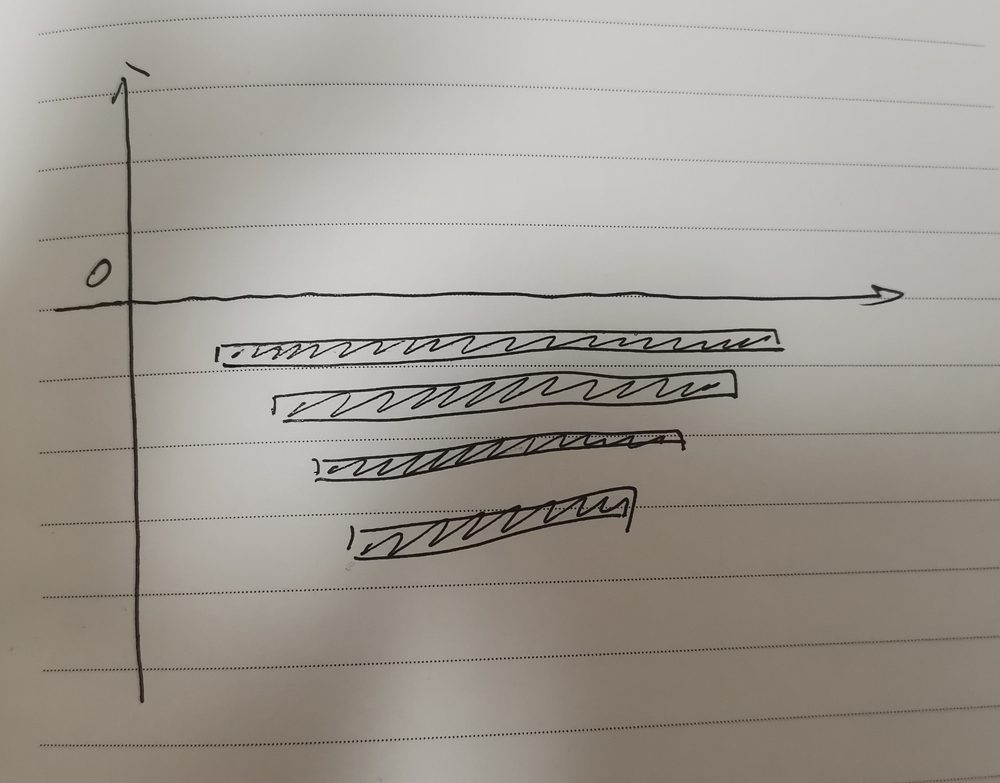

# labuladong [最长递增子序列之信封嵌套问题](https://mp.weixin.qq.com/s/PSDCjKlTh8MtANdgi-QIug) 

> NOTE:
>
> 其实这个问题可以想象成下面的样子：
>
> 
>
> 可以看到：
>
> 1、左侧边界：自上而下递增
>
> 2、右侧边界：自上而下递减
>
> 因此，在进行排序的时候，是按照

## 二、解法

这道题的解法是比较巧妙的：

**先对宽度`w`进行升序排序，如果遇到`w`相同的情况，则按照高度`h`降序排序。之后把所有的`h`作为一个数组，在这个数组上计算 LIS 的长度就是答案。**

画个图理解一下，先对这些数对进行排序：

然后在`h`上寻找最长递增子序列：

这个子序列 [2,3],[5,4],[6,7] 就是最优的嵌套方案。

这个解法的关键在于，对于宽度`w`相同的数对，要对其高度`h`进行降序排序。因为两个宽度相同的信封不能相互包含的，而逆序排序保证在`w`相同的数对中最多只选取一个计入 LIS。

> NOTE: 
>
> 上面这段话解释了对高度`h` 进行降序的原因