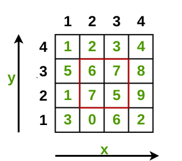
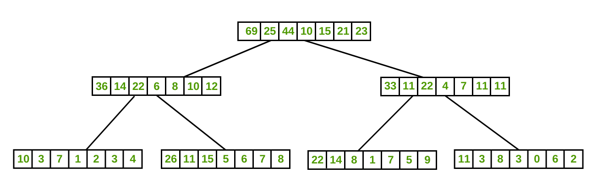

# cp-algorithms [Segment Tree](https://cp-algorithms.com/data_structures/segment_tree.html) 

> 一、理解这篇文章的内容的一个非常关键点: **modification query**、**addition query** ，作者其实将对segment的modification也看作是一种query

A **Segment Tree** is a data structure that stores information about array intervals as a tree. This allows answering range queries over an array efficiently, while still being flexible enough to allow quick modification of the array. This includes finding the sum of consecutive array elements $a[l \dots r]$ , or finding the minimum element in a such a range in  $O(\log n)$  time. Between answering such queries, the **Segment Tree** allows modifying the array by replacing one element, or even changing the elements of a whole subsegment (e.g. assigning all elements  $a[l \dots r]$  to any value, or adding a value to all element in the subsegment).

> NOTE:
>
> 一、segment tree是否只能够建立于array之上？
>
> 准确来说，只能够建立在支持random access的容器上
>
> 二、上面这段话的后半段说明它是支持三种形式的update的:
>
> 1、element update
>
> 2、range update
>
> 

In general, a Segment Tree is a very flexible data structure, and a huge number of problems can be solved with it. Additionally, it is also possible to apply more complex operations and answer more complex queries (see Advanced versions of Segment Trees). In particular the Segment Tree can be easily generalized to larger dimensions. For instance, with a two-dimensional Segment Tree you can answer sum or minimum queries over some subrectangle of a given matrix in only  $O(\log^2 n)$  time.

One important property of **Segment Trees** is that they require only a linear amount of memory. The standard **Segment Tree** requires  $4n$  vertices for working on an array of size  $n$ .


## [Advanced versions of Segment Trees](https://cp-algorithms.com/data_structures/segment_tree.html#advanced-versions-of-segment-trees)

### More complex queries

It can be quite easy to change the Segment Tree in a direction, such that it computes different queries (e.g. computing the minimum / maximum instead of the sum), but it also can be very nontrivial.

#### Finding the maximum

Let us slightly change the condition of the problem described above: instead of querying the sum, we will now make maximum queries.

The tree will have exactly the same structure as the tree described above. We only need to change the way $t[v]$  is computed in the  $\text{build}$  and  $\text{update}$  functions. $t[v]$  will now store the maximum of the corresponding segment. And we also need to change the calculation of the returned value of the  $\text{sum}$  function (replacing the summation by the maximum).

Of course this problem can be easily changed into computing the minimum instead of the maximum.

Instead of showing an implementation to this problem, the implementation will be given to a more complex version of this problem in the next section.

#### Finding the maximum and the number of times it appears

This task is very similar to the previous one. In addition of finding the maximum, we also have to find the number of occurrences of the maximum.

```c++
#include<utility>
#include<algorithm>
#include<float.h>

using namespace std;
pair<int, int> t[4 * MAXN];

pair<int, int> combine(pair<int, int> a, pair<int, int> b) {
    if (a.first > b.first)
        return a;
    if (b.first > a.first)
        return b;
    return make_pair(a.first, a.second + b.second);
}

/**
 *
 * @param a array
 * @param v vertex of root node
 * @param tl left
 * @param tr right
 */
void build(int a[], int v, int tl, int tr) {
    if (tl == tr) {
        t[v] = make_pair(a[tl], 1);
    } else {
        int tm = (tl + tr) / 2;
        build(a, v * 2, tl, tm);
        build(a, v * 2 + 1, tm + 1, tr);
        t[v] = combine(t[v * 2], t[v * 2 + 1]);
    }
}

pair<int, int> get_max(int v, int tl, int tr, int l, int r) {
    if (l > r)
        return make_pair(-INF, 0);
    if (l == tl && r == tr)
        return t[v];
    int tm = (tl + tr) / 2; // middle
    return combine(get_max(v * 2, tl, tm, l, min(r, tm)),
                   get_max(v * 2 + 1, tm + 1, tr, max(l, tm + 1), r));
}

/**
 * update array[pos] to be new_val
 * @param v vertex of root node
 * @param tl
 * @param tr
 * @param pos
 * @param new_val
 */
void update(int v, int tl, int tr, int pos, int new_val) {
    if (tl == tr) {
        t[v] = make_pair(new_val, 1);
    } else {
        int tm = (tl + tr) / 2;
        if (pos <= tm)
            update(v * 2, tl, tm, pos, new_val);
        else
            update(v * 2 + 1, tm + 1, tr, pos, new_val);
        t[v] = combine(t[v * 2], t[v * 2 + 1]);
    }
}
```

#### Compute the greatest common divisor / least common multiple

> NOTE:
>
> 一、最大公约数
>
> 二、最小公倍数
>
> 三、
>
> [geeksforgeeks-Range LCM Queries](https://www.geeksforgeeks.org/range-lcm-queries/) 
>
> [quora-**How can you find the LCM of numbers in a given range [l,r] in an array of size n?**](https://www.quora.com/How-can-you-find-the-LCM-of-numbers-in-a-given-range-l-r-in-an-array-of-size-n) 

In this problem we want to compute the GCD / LCM of all numbers of given ranges of the array.

This interesting variation of the **Segment Tree** can be solved in exactly the same way as the **Segment Trees** we derived for sum / minimum / maximum queries: it is enough to store the GCD / LCM of the corresponding vertex in each vertex of the tree. Combining two vertices can be done by computing the GCD / LCM of both vertices. 


#### Counting the number of zeros, searching for the  $k$ -th zero

In this problem we want to find the number of zeros in a given range, and additionally find the index of the  
$k$ -th zero using a second function.

Again we have to change the store values of the tree a bit: This time we will store the number of zeros in each segment in  
$t[]$ . It is pretty clear, how to implement the   $\text{build}$ ,   $\text{update}$  and  $\text{count\_zero}$  functions, we can simply use the ideas from the sum query problem. Thus we solved the first part of the problem.

Now we learn how to solve the problem of finding the $k$ -th zero in the array $a[]$ . To do this task, we will descend the Segment Tree, starting at the root vertex, and moving each time to either the left or the right child, depending on which segment contains the $k$ -th zero. In order to decide to which child we need to go, it is enough to look at the number of zeros appearing in the segment corresponding to the left vertex. If this precomputed count is greater or equal to $k$ , it is necessary to descend to the left child, and otherwise descent to the right child. Notice, if we chose the right child, we have to subtract the number of zeros of the left child from $k$ .

In the implementation we can handle the special case,  $a[]$  containing less than $k$  zeros, by returning -1.

```c++
int find_kth(int v, int tl, int tr, int k) {
    if (k > t[v])
        return -1;
    if (tl == tr)
        return tl;
    int tm = (tl + tr) / 2;
    if (t[v*2] >= k)
        return find_kth(v*2, tl, tm, k);
    else 
        return find_kth(v*2+1, tm+1, tr, k - t[v*2]);
}
```

#### Searching for an array prefix with a given amount

The task is as follows: for a given value $x$  we have to quickly find smallest index $i$  such that the sum of the first $i$  elements of the array $a[]$  is greater or equal to $x$  (assuming that the array $a[]$  only contains non-negative values).

This task can be solved using binary search, computing the sum of the prefixes with the **Segment Tree**. However this will lead to a $O(\log^2 n)$  solution.

Instead we can use the same idea as in the previous section, and find the position by descending the tree: by moving each time to the left or the right, depending on the sum of the left child. Thus finding the answer in $O(\log n)$  time.

> NOTE:
>
> 一、是指前面的 "Counting the number of zeros, searching for the  $k$ -th zero" 中描述的方法？

#### Searching for the first element greater than a given amount

The task is as follows: for a given value $x$  and a range $a[l \dots r]$  find the smallest $i$  in the range $a[l \dots r]$ , such that $a[i]$  is greater than $x$ .

This task can be solved using binary search over max prefix queries with the Segment Tree. However, this will lead to a $O(\log^2 n)$  solution.

Instead, we can use the same idea as in the previous sections, and find the position by descending the tree: by moving each time to the left or the right, depending on the maximum value of the left child. Thus finding the answer in $O(\log n)$  time.

```c++
int get_first(int v, int lv, int rv, int l, int r, int x) {
    if(lv > r || rv < l) return -1;
    if(l <= lv && rv <= r) {
        if(t[v] <= x) return -1;
        while(lv != rv) {
            int mid = lv + (rv-lv)/2;
            if(t[2*v] > x) {
                v = 2*v;
                rv = mid;
            }else {
                v = 2*v+1;
                lv = mid+1;
            }
        }
        return lv;
    }

    int mid = lv + (rv-lv)/2;
    int rs = get_first(2*v, lv, mid, l, r, x);
    if(rs != -1) return rs;
    return get_first(2*v+1, mid+1, rv, l ,r, x);
}
```

#### Finding subsegments with the maximal sum


How to build a tree with such data? Again we compute it in a recursive fashion: we first compute all four values for the left and the right child, and then combine those to archive the four values for the current vertex. Note the answer for the current vertex is either:

### Saving the entire subarrays in each vertex

This is a separate subsection(部分) that stands apart from the others, because at each vertex of the **Segment Tree** we don't store information about the corresponding segment in compressed form (sum, minimum, maximum, ...), but store all elements of the segment. Thus the root of the **Segment Tree** will store all elements of the array, the left child vertex will store the first half of the array, the right vertex the second half, and so on.

In its simplest application of this technique we store the elements in sorted order. In more complex versions the elements are not stored in lists, but more advanced data structures (sets, maps, ...). But all these methods have the **common factor**, that each vertex requires linear memory (i.e. proportional to the length of the corresponding segment).

The first natural question, when considering these **Segment Trees**, is about memory consumption. Intuitively this might look like $O(n^2)$  memory, but it turns out that the complete tree will only need $O(n \log n)$  memory. Why is this so? Quite simply, because each element of the array falls into $O(\log n)$  segments (remember the height of the tree is $O(\log n)$ ).

So in spite of the apparent extravagance of such a **Segment Tree**, it consumes only slightly more memory than the usual **Segment Tree**.

Several typical applications of this data structure are described below. It is worth noting the similarity of these **Segment Trees** with 2D data structures (in fact this is a 2D data structure, but with rather limited capabilities).

#### Find the smallest number greater or equal to a specified number. No modification queries.

We want to answer queries of the following form: for three given numbers $(l, r, x)$  we have to find the minimal number in the segment $a[l \dots r]$  which is greater than or equal to $x$ .

We construct a **Segment Tree**. In each vertex we store a sorted list of all numbers occurring in the corresponding segment, like described above. How to build such a **Segment Tree** as effectively as possible? As always we approach this problem recursively: let the lists of the left and right children already be constructed, and we want to build the list for the current vertex. From this view the operation is now trivial and can be accomplished in linear time: We only need to combine the two sorted lists into one, which can be done by iterating over them using two pointers. The C++ STL already has an implementation of this algorithm.

Because this structure of the Segment Tree and the similarities to the merge sort algorithm, the data structure is also often called "**Merge Sort Tree**".

```c++
#include <vector>
#include <algorithm>

std::vector<int> t[4 * MAXN];

void build(int a[], int v, int tl, int tr) {
    if (tl == tr) {
        t[v] = std::vector<int>(1, a[tl]);
    } else {
        int tm = (tl + tr) / 2;
        build(a, v * 2, tl, tm);
        build(a, v * 2 + 1, tm + 1, tr);
        std::merge(t[v * 2].begin(), t[v * 2].end(), t[v * 2 + 1].begin(), t[v * 2 + 1].end(),
                   std::back_inserter(t[v]));
    }
}

```

We already know that the Segment Tree constructed in this way will require   $O(n \log n)$  memory. And thanks to this implementation its construction also takes $O(n \log n)$  time, after all each list is constructed in linear time in respect to its size.

Now consider the answer to the query. We will go down the tree, like in the regular Segment Tree, breaking our segment $a[l \dots r]$  into several subsegments (into at most $O(\log n)$  pieces). It is clear that the answer of the whole answer is the minimum of each of the subqueries. So now we only need to understand, how to respond to a query on one such subsegment that corresponds with some vertex of the tree.

We are at some vertex of the **Segment Tree** and we want to compute the answer to the query, i.e. find the minimum number greater that or equal to a given number $x$ . Since the vertex contains the list of elements in sorted order, we can simply perform a **binary search** on this list and return the first number, greater than or equal to $x$ . 

```C++
#include <vector>
#include <algorithm>
#include <limits>

int query(int v, int tl, int tr, int l, int r, int x) {
    if (l > r)
        return std::numeric_limits<int>::max();
    if (l == tl && r == tr) {
        std::vector<int>::iterator pos = std::lower_bound(t[v].begin(), t[v].end(), x);
        if (pos != t[v].end())
            return *pos;
        return std::numeric_limits<int>::max();
    }
    int tm = (tl + tr) / 2;
    return std::min(query(v * 2, tl, tm, l, std::min(r, tm), x),
                    query(v * 2 + 1, tm + 1, tr, std::max(l, tm + 1), r, x));
}

```

The constant $\text{INF}$  is equal to some large number that is bigger than all numbers in the array. Its usage means, that there is no number greater than or equal to $x$  in the segment. It has the meaning of "there is no answer in the given interval".

#### Find the smallest number greater or equal to a specified number. With modification queries.

This task is similar to the previous. The last approach has a disadvantage, it was not possible to modify the array between answering queries. Now we want to do exactly this: a **modification query** will do the assignment  $a[i] = y$ .


### Range updates (Lazy Propagation)

All problems in the above sections discussed modification queries that only affected a single element of the array each. However the **Segment Tree** allows applying modification queries to an entire segment of contiguous elements, and perform the query in the same time $O(\log n)$ .

> NOTE:
>
> 一、update:
>
> 1、addition
>
> 2、assignment

#### Addition on segments

We begin by considering problems of the simplest form: the **modification query** should add a number $x$  to all numbers in the segment  $a[l \dots r]$ . The second query, that we are supposed to answer, asked simply for the value of $a[i]$ .

> NOTE:
>
> 一、上面这段话的简单意思就是: 首先执行segment update，然后执行query
>
> 

To make the **addition query** efficient, we store at each vertex in the **Segment Tree** how many we should add to all numbers in the corresponding segment. For example, if the query "add 3 to the whole array  $a[0 \dots n-1]$ " comes, then we place the number 3 in the root of the tree. In general we have to place this number to multiple segments, which form a partition of the query segment. Thus we don't have to change all $O(n)$  values, but only  $O(\log n)$  many.

> NOTE:
>
> 一、上面这段话是非常跳跃的，在 [LeetCode-Recursive Approach to Segment Trees](https://leetcode.com/articles/a-recursive-approach-to-segment-trees-range-sum-queries-lazy-propagation/) 中有着更好的描述，这里简单的记忆是: 将自底向上传播转化为自顶向下传播，这种方式是非常适合于segment tree的。
>
> 上面这段话的含义是需要结合下面的代码来进行理解的，它其实描述的是采用这种方式的益处: 
>
> >  Thus we don't have to change all $O(n)$  values, but only  $O(\log n)$  many

If now there comes a query that asks the current value of a particular array entry, it is enough to go down the tree and add up all values found along the way(**track current path**).

> NOTE: 
>
> 一、关于下面code的一些注解: 
>
> 下面的code snippet所展示的仅仅是对一个segment tree的lazy propagation，其实下面所展示的严格来说，并不算是segment tree，因为它的internal node并没有存储任何统计数据。下面的这种写法所带来的最大的好处就是前面提到的: 
>
> > Thus we don't have to change all $O(n)$  values, but only  $O(\log n)$  many
>
> 从下面的代码可知，所有的修改都是在index层进行的。

```c++
#include <vector>
#include <algorithm>
#include <limits>

void build(int a[], int v, int tl, int tr) {
    if (tl == tr) { // Leaf node
        t[v] = a[tl];
    } else {
        int tm = (tl + tr) / 2;
        build(a, v * 2, tl, tm);
        build(a, v * 2 + 1, tm + 1, tr);
        t[v] = 0; // Internal node
    }
}

void update(int v, int tl, int tr, int l, int r, int add) {
    if (l > r)
        return;
    if (l == tl && r == tr) {
        t[v] += add;
    } else {
        int tm = (tl + tr) / 2;
        update(v * 2, tl, tm, l, std::min(r, tm), add);
        update(v * 2 + 1, tm + 1, tr, std::max(l, tm + 1), r, add);
    }
}

int get(int v, int tl, int tr, int pos) {
    if (tl == tr) // Leaf node
        return t[v];
    int tm = (tl + tr) / 2;
    if (pos <= tm)
        // track current path, 自顶向下
        return t[v] + get(v * 2, tl, tm, pos); // go down the tree and add up all values found along the way
    else
        return t[v] + get(v * 2 + 1, tm + 1, tr, pos);
}

```


##### 完整测试程序

```c++
#include <algorithm>
#include <vector>
#include <iostream>
#include <concepts>

template <typename T>
class SegmentTree
{
private:
    std::vector<T> tree_;
    int hi_{0}; // segment hi

public:
    SegmentTree(const std::vector<T> &arr)
    {
        tree_.resize(arr.size() * 4);
        hi_ = arr.size() - 1;
        build(0, 0, hi_, arr);
    }
    /// @brief 将arr[i, j]范围内的元素的值设置为newVal
    /// @param i
    /// @param j
    /// @param newVal
    void rangeAdd(int i, int j, T &&addend)
    {
        rangeAdd(0, 0, hi_, i, j, std::forward<T>(addend));
    }
    T get(int idx)
    {
        return get(0, 0, hi_, idx);
    }

private:
    void build(int rootIdx, int lo, int hi, const std::vector<T> &arr)
    {
        if (lo == hi) // Leaf node
        {
            tree_[rootIdx] = arr[lo];
        }
        else
        {
            int mid = lo + (hi - lo) / 2;
            int left = rootIdx * 2 + 1, right = rootIdx * 2 + 2;
            build(left, lo, mid, arr);
            build(right, mid + 1, hi, arr);
            tree_[rootIdx] = T(); // internal node
        }
    }

    void rangeAdd(int rootIdx, int lo, int hi, int i, int j, T &&addend)
    {
        if (i > j)
        {
            return;
        }
        if (lo == i && hi == j)
        {
            tree_[rootIdx] += std::move(addend);
            return;
        }
        int mid = lo + (hi - lo) / 2;
        int left = rootIdx * 2 + 1, right = rootIdx * 2 + 2;

        rangeAdd(left, lo, mid, lo, std::min(hi, mid), std::forward<T>(addend));
        rangeAdd(left, mid + 1, hi, std::max(lo, mid + 1), hi, std::forward<T>(addend));
    }

    T get(int rootIdx, int lo, int hi, int idx)
    {
        if (lo == hi) // Leaf node
            return tree_[rootIdx];
        int mid = lo + (hi - lo) / 2;
        if (idx <= mid)
        {
            // track current path, 自顶向下
            return tree_[rootIdx] + get(rootIdx * 2 + 1, lo, mid, idx); // go down the tree and add up all values found along the way
        }
        else
        {
            return tree_[rootIdx] + get(rootIdx * 2 + 2, mid + 1, hi, idx);
        }
    }
};

int main()
{
    std::vector<int> arr{1, 2, 3, 4, 5, 6};
    SegmentTree<int> segTree(arr);
    std::cout << segTree.get(0) << std::endl;
    std::cout << segTree.get(2) << std::endl;
    std::cout << segTree.get(4) << std::endl;
    segTree.rangeAdd(0, 5, 1);
    std::cout << segTree.get(0) << std::endl;
    std::cout << segTree.get(2) << std::endl;
    std::cout << segTree.get(4) << std::endl;

    segTree.rangeAdd(0, 4, 1);
    std::cout << segTree.get(0) << std::endl;
    std::cout << segTree.get(2) << std::endl;
    std::cout << segTree.get(4) << std::endl;
}
```


#### Assignment on segments

> NOTE:
>
> 一、这一段介绍的实现是非常类似于 [LeetCode-Recursive Approach to Segment Trees](https://leetcode.com/articles/a-recursive-approach-to-segment-trees-range-sum-queries-lazy-propagation/) 中的实现的

Suppose now that the **modification query** asks to assign each element of a certain segment  $a[l \dots r]$  to some value  
$p$ . As a second query we will again consider reading the value of the array  $a[i]$ . 

To perform this **modification query** on a whole segment, you have to store at each vertex of the **Segment Tree** whether the corresponding segment is covered entirely with the same value or not. This allows us to make a "lazy" update: instead of changing all segments in the tree that cover the **query segment**, we only change some, and leave others unchanged. A **marked vertex** will mean, that every element of the corresponding segment is assigned to that value, and actually also the complete subtree should only contain this value. In a sense we are lazy and delay writing the new value to all those vertices. We can do this tedious task later, if this is necessary.

So after the **modification query** is executed, some parts of the tree become irrelevant - some modifications remain unfulfilled in it.

For example if a **modification query** "assign a number to the whole array  $a[0 \dots n-1]$ " gets executed, in the **Segment Tree** only a single change is made - the number is placed in the root of the tree and this vertex gets **marked**. The remaining segments remain unchanged, although in fact the number should be placed in the whole tree.

Suppose now that the second **modification query** says, that the first half of the array $a[0 \dots n/2]$  should be assigned with some other number. To process this query we must assign each element in the whole left child of the root vertex with that number. But before we do this, we must first sort out the root vertex first. The subtlety(细微差别) here is that the right half of the array should still be assigned to the value of the first query, and at the moment there is no information for the right half stored.

The way to solve this is to **push** the information of the root to its children, i.e. if the root of the tree was assigned with any number, then we assign the left and the right child vertices with this number and remove the mark of the root. After that, we can assign the left child with the new value, without losing any necessary information.

> NOTE:
>
> 一、上述"**push**"所对应的就是下面的 `push` 函数，它的实现本质上是**自顶向下传播**

Summarizing we get: for any queries (a modification or reading query) during the descent along the tree we should always push information from the current vertex into both of its children. We can understand this in such a way, that when we descent the tree we apply delayed modifications, but exactly as much as necessary (so not to degrade the complexity of  $O(\log n)$ ). 

For the implementation we need to make a  $\text{push}$  function, which will receive the current vertex, and it will push the information for its vertex to both its children. We will call this function at the beginning of the query functions (but we will not call it from the leaves, because there is no need to push information from them any further). 

```c++
#include <vector>
#include <algorithm>
#include <limits>

void push(int v) {
    if (marked[v]) {
        t[v * 2] = t[v * 2 + 1] = t[v];
        marked[v * 2] = marked[v * 2 + 1] = true;
        marked[v] = false;
    }
}

void update(int v, int tl, int tr, int l, int r, int new_val) {
    if (l > r)
        return;
    if (l == tl && tr == r) {
        t[v] = new_val;
        marked[v] = true;
    } else {
        push(v);
        int tm = (tl + tr) / 2;
        update(v * 2, tl, tm, l, min(r, tm), new_val);
        update(v * 2 + 1, tm + 1, tr, max(l, tm + 1), r, new_val);
    }
}

int get(int v, int tl, int tr, int pos) {
    if (tl == tr) {
        return t[v];
    }
    push(v);
    int tm = (tl + tr) / 2;
    if (pos <= tm)
        return get(v * 2, tl, tm, pos);
    else
        return get(v * 2 + 1, tm + 1, tr, pos);
}
```

Notice: the function  $\text{get}$  can also be implemented in a different way: do not make delayed updates, but immediately return the value  $t[v]$  if  $marked[v]$  is true.

#### Adding on segments, querying for maximum

Now the modification query is to add a number to all elements in a range, and the reading query is to find the maximum in a range.

So for each vertex of the Segment Tree we have to store the maximum of the corresponding subsegment. The interesting part is how to recompute these values during a modification request.

For this purpose we keep store an additional value for each vertex. In this value we store the addends we haven't propagated to the child vertices. Before traversing to a child vertex, we call  $\text{push}$  and propagate the value to both children. We have to do this in both the  $\text{update}$  function and the  $\text{query}$  function.

```c++
#include <vector>
#include <algorithm>
#include <limits>

void push(int v) {
    t[v * 2] += lazy[v];
    lazy[v * 2] += lazy[v];
    t[v * 2 + 1] += lazy[v];
    lazy[v * 2 + 1] += lazy[v];
    lazy[v] = 0;
}

void update(int v, int tl, int tr, int l, int r, int addend) {
    if (l > r)
        return;
    if (l == tl && tr == r) {
        t[v] += addend;
        lazy[v] += addend;
    } else {
        push(v);
        int tm = (tl + tr) / 2;
        update(v * 2, tl, tm, l, min(r, tm), addend);
        update(v * 2 + 1, tm + 1, tr, max(l, tm + 1), r, addend);
        t[v] = max(t[v * 2], t[v * 2 + 1]);
    }
}

int query(int v, int tl, int tr, int l, int r) {
    if (l > r)
        return -INF;
    if (l == tl && tr == r)
        return t[v];
    push(v);
    int tm = (tl + tr) / 2;
    return max(query(v * 2, tl, tm, l, min(r, tm)),
               query(v * 2 + 1, tm + 1, tr, max(l, tm + 1), r));
}
```


### [Generalization to higher dimensions](https://cp-algorithms.com/data_structures/segment_tree.html#generalization-to-higher-dimensions)

> NOTE:
>
> 一、补充内容:
>
> geeksforgeeks [Two Dimensional Segment Tree | Sub-Matrix Sum](https://www.geeksforgeeks.org/two-dimensional-segment-tree-sub-matrix-sum/) 

A **Segment Tree** can be generalized quite natural to higher dimensions. If in the one-dimensional case we split the indices of the array into **segments**, then in the two-dimensional we make an ordinary **Segment Tree** with respect to the first indices, and for each segment we build an ordinary **Segment Tree** with respect to the second indices.


#### Simple 2D Segment Tree

A matrix $a[0 \dots n-1, 0 \dots m-1]$  is given, and we have to find the sum (or minimum/maximum) on some submatrix   $a[x_1 \dots x_2, y_1 \dots y_2]$ , as well as perform modifications of individual matrix elements (i.e. queries of the form   $a[x][y] = p$ ).

> NOTE:
>
> 一、$a[0 \dots n-1, 0 \dots m-1]$ 表示matrix是 $m \times n$ 

##### Build

So we build a 2D **Segment Tree**: first the **Segment Tree** using the first coordinate (  $x$ ), then the second (  $y$ ).

To make the construction process more understandable, you can forget for a while that the matrix is two-dimensional, and only leave(留下) the first coordinate. We will construct an ordinary one-dimensional **Segment Tree** using only the first coordinate. But instead of storing a number in a segment, we store an entire **Segment Tree**: i.e. at this moment we remember that we also have a second coordinate; but because at this moment the first coordinate is already fixed to some interval   $[l \dots r]$ , we actually work with such a strip   $a[l \dots r, 0 \dots m-1]$  and for it we build a **Segment Tree**.

> NOTE:
>
> 一、"We will construct an ordinary one-dimensional **Segment Tree** using only the first coordinate. But instead of storing a number in a segment, we store an entire **Segment Tree**"
>
> 上面这段话的意思是: 在segment中存储的不是number而是segment tree，这其实就是segment tree of segment tree，关于此可以参见 geeksforgeeks [Two Dimensional Segment Tree | Sub-Matrix Sum](https://www.geeksforgeeks.org/two-dimensional-segment-tree-sub-matrix-sum/) 中图示的立体的segment tree:
>
> 

Here is the implementation of the construction of a **2D Segment Tree**. It actually represents two separate blocks: the construction of a **Segment Tree** along the $x$  coordinate ( $\text{build}_x$ ), and the $y$  coordinate ( $\text{build}_y$ ). For the leaf nodes in $\text{build}_y$  we have to separate two cases: when the current segment of the first coordinate   $[tlx \dots trx]$  has length 1, and when it has a length greater than one. In the first case, we just take the corresponding value from the matrix, and in the second case we can combine the values of two **Segment Trees** from the left and the right son in the coordinate  $x$ .


```c++
void build_y(int vx, int lx, int rx, int vy, int ly, int ry) {
    if (ly == ry) {
        if (lx == rx)
            t[vx][vy] = a[lx][ly];
        else
            t[vx][vy] = t[vx*2][vy] + t[vx*2+1][vy];
    } else {
        int my = (ly + ry) / 2;
        build_y(vx, lx, rx, vy*2, ly, my);
        build_y(vx, lx, rx, vy*2+1, my+1, ry);
        t[vx][vy] = t[vx][vy*2] + t[vx][vy*2+1];
    }
}

void build_x(int vx, int lx, int rx) {
    if (lx != rx) {
        int mx = (lx + rx) / 2;
        build_x(vx*2, lx, mx);
        build_x(vx*2+1, mx+1, rx);
    }
    build_y(vx, lx, rx, 1, 0, m-1);
}
```

> NOTE:
>
> 一、使用 geeksforgeeks [Two Dimensional Segment Tree | Sub-Matrix Sum](https://www.geeksforgeeks.org/two-dimensional-segment-tree-sub-matrix-sum/) 中图示的立体的segment tree来理解上述内容 
>
>  
>
> 
>
> 1、首先是单行创建segment tree、然后在第一步的基础上两两合并
>
> 2、`build_x` 也是先一分为二、然后两两合并: 
>
> 在 `build_y(vx, lx, rx, 1, 0, m-1)` 中执行merge
>
> 
>
> 3、上述是典型的segment  tree of segment tree
>
> 二、思考它的内存分布
>
> inner-row(行内): $column\_count \times 4$
>
> inter-row (行间): $row\_count \times 4$

Such a **Segment Tree** still uses a linear amount of memory, but with a larger constant: $16 n m$ . It is clear that the described procedure $\text{build}_x$  also works in linear time.

##### Query

Now we turn to processing of queries. We will answer to the two-dimensional query using the same principle: first break the query on the first coordinate, and then for every reached vertex, we call the corresponding **Segment Tree** of the second coordinate.

```c++


int sum_y(int vx, int vy, int tly, int try_, int ly, int ry) {
    if (ly > ry) // empty case
        return 0;
    if (ly == tly && try_ == ry) // base case
        return t[vx][vy];
    int tmy = (tly + try_) / 2; // mid
    // 下面代码将ly、ry沿着tmy分割为两部分，它采用的是简化写法
    return sum_y(vx, vy * 2, tly, tmy, ly, min(ry, tmy)) // min保证至多为tmy(最大不超过tmy)
           +
           sum_y(vx, vy * 2 + 1, tmy + 1, try_, max(ly, tmy + 1), ry); // max保证至少为tmy + 1(最小要超过tmy + 1)
}

int sum_x(int vx, int tlx, int trx, int lx, int rx, int ly, int ry) {
    if (lx > rx) // empty case
        return 0;
    if (lx == tlx && trx == rx) // base case
        return sum_y(vx, 1, 0, m - 1, ly, ry);
    int tmx = (tlx + trx) / 2; // mid
    // 下面代码将tlx、trx沿着tmx分割为两部分，它采用的是简化写法
    return sum_x(vx * 2, tlx, tmx, lx, min(rx, tmx), ly, ry) // min保证至多为tmx(最大不超过tmx)
           +
           sum_x(vx * 2 + 1, tmx + 1, trx, max(lx, tmx + 1), rx, ly, ry); // max保证至少为tmx + 1(最小要超过tmx + 1)
}

```

> NOTE:
>
> 一、上述所展示的是一种简化的写法:
>
> 1、base case
>
> 2、empty case
>
> 3、min、max妙用

This function works in $O(\log n \log m)$  time, since it first descends the tree in the first coordinate, and for each traversed vertex in the tree it makes a query in the corresponding **Segment Tree** along the second coordinate.

##### Modify

Finally we consider the **modification query**. We want to learn how to modify the **Segment Tree** in accordance with the change in the value of some element $a[x][y] = p$ . It is clear, that the changes will occur only in those vertices of the first **Segment Tree** that cover the coordinate $x$  (and such will be $O(\log n)$ ), and for Segment Trees corresponding to them the changes will only occurs at those vertices that covers the coordinate  $y$  (and such will be  $O(\log m)$ ). Therefore the implementation will be not very different form the one-dimensional case, only now we first descend the first coordinate, and then the second.

> NOTE:
>
> 一、"We want to learn how to modify the **Segment Tree** in accordance with the change in the value of some element $a[x][y] = p$ "
>
> 上面这段话的意思是: 在修改了原始数组后，如何更新segment tree。
>
> 


```c++

void update_y(int vx, int lx, int rx, int vy, int ly, int ry, int x, int y, int new_val)
{
	if (ly == ry)
	{
		if (lx == rx)
			t[vx][vy] = new_val;
		else
			t[vx][vy] = t[vx * 2][vy] + t[vx * 2 + 1][vy];
	}
	else
	{
		int my = (ly + ry) / 2;
		if (y <= my)
			update_y(vx, lx, rx, vy * 2, ly, my, x, y, new_val);
		else
			update_y(vx, lx, rx, vy * 2 + 1, my + 1, ry, x, y, new_val);
		t[vx][vy] = t[vx][vy * 2] + t[vx][vy * 2 + 1];
	}
}

/// @brief 将arr[x][y]设置为new_val
/// @param vx
/// @param lx
/// @param rx
/// @param x
/// @param y
/// @param new_val
void update_x(int vx, int lx, int rx, int x, int y, int new_val)
{
	if (lx != rx)
	{
		int mx = (lx + rx) / 2;
		if (x <= mx) // 只对包含x的分支执行update
			update_x(vx * 2, lx, mx, x, y, new_val);
		else
			update_x(vx * 2 + 1, mx + 1, rx, x, y, new_val);
	}
	update_y(vx, lx, rx, 1, 0, m - 1, x, y, new_val);
}

```


#### Compression of 2D Segment Tree

Let the problem be the following: there are $n$  points on the plane given by their coordinates $(x_i, y_i)$  and queries of the form "count the number of points lying in the rectangle $((x_1, y_1), (x_2, y_2))$ ". It is clear that in the case of such a problem it becomes unreasonably wasteful to construct a two-dimensional Segment Tree with $O(n^2)$  elements. Most on this memory will be wasted, since each single point can only get into $O(\log n)$  segments of the tree along the first coordinate, and therefore the total "useful" size of all tree segments on the second coordinate is $O(n \log n)$ .


So we proceed as follows: at each vertex of the Segment Tree with respect to the first coordinate we store a Segment Tree constructed only by those second coordinates that occur in the current segment of the first coordinates. In other words, when constructing a Segment Tree inside some vertex with index $vx$  and the boundaries $tlx$  and $trx$ , we only consider those points that fall into this interval $x \in [tlx, trx]$ , and build a Segment Tree just using them.


### Preserving the history of its values (Persistent Segment Tree)

A persistent data structure is a data structure that remembers it previous state for each modification. This allows to access any version of this data structure that interest us and execute a query on it.

In fact, any change request in the **Segment Tree** leads to a change in the data of only $O(\log n)$  vertices along the path starting from the root. So if we store the Segment Tree using pointers (i.e. a vertex stores pointers to the left and the right child vertices), then when performing the **modification query**, we simply need to create new vertices instead of changing the available vertices. Vertices that are not affected by the **modification query** can still be used by pointing the pointers to the old vertices. Thus for a **modification query** $O(\log n)$  new vertices will be created, including a new root vertex of the Segment Tree, and the entire previous version of the tree rooted at the old root vertex will remain unchanged.

Let's give an example implementation for the simplest Segment Tree: when there is only a query asking for sums, and modification queries of single elements.

```c++
struct Vertex {
    Vertex *l, *r;
    int sum;

    Vertex(int val) : l(nullptr), r(nullptr), sum(val) {}
    Vertex(Vertex *l, Vertex *r) : l(l), r(r), sum(0) {
        if (l) sum += l->sum;
        if (r) sum += r->sum;
    }
};

Vertex* build(int a[], int tl, int tr) {
    if (tl == tr)
        return new Vertex(a[tl]);
    int tm = (tl + tr) / 2;
    return new Vertex(build(a, tl, tm), build(a, tm+1, tr));
}

int get_sum(Vertex* v, int tl, int tr, int l, int r) {
    if (l > r)
        return 0;
    if (l == tl && tr == r)
        return v->sum;
    int tm = (tl + tr) / 2;
    return get_sum(v->l, tl, tm, l, min(r, tm))
         + get_sum(v->r, tm+1, tr, max(l, tm+1), r);
}

Vertex* update(Vertex* v, int tl, int tr, int pos, int new_val) {
    if (tl == tr)
        return new Vertex(new_val);
    int tm = (tl + tr) / 2;
    if (pos <= tm)
        return new Vertex(update(v->l, tl, tm, pos, new_val), v->r);
    else
        return new Vertex(v->l, update(v->r, tm+1, tr, pos, new_val));
}
```

For each modification of the **Segment Tree** we will receive a new root vertex. To quickly jump between two different versions of the **Segment Tree**, we need to store this roots in an array. To use a specific version of the Segment Tree we simply call the query using the appropriate root vertex.

With the approach described above almost any **Segment Tree** can be turned into a persistent data structure.


#### Finding the  $k$ -th smallest number in a range

This time we have to answer queries of the form "What is the $k$ -th smallest element in the range  $a[l \dots r]$ . This query can be answered using a **binary search** and a **Merge Sort Tree**, but the **time complexity** for a single query would be  $O(\log^3 n)$ . We will accomplish the same task using a persistent Segment Tree in  
$O(\log n)$ .

