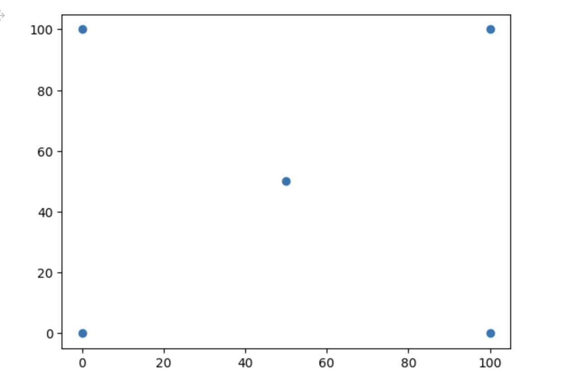

# [LeetCode 587. Erect the Fence](https://leetcode.cn/problems/erect-the-fence/)


## Andrew 算法

下面程序是参考 [LeetCode-【宫水三叶】二维凸包模板题](https://leetcode.cn/problems/erect-the-fence/solution/by-ac_oier-4xuu/) 写的。

一、由于题目所给的点的顺序未知，因此首先需要对输入的点进行排序以保证点序列，这是使用Andrew 算法的前提:

[LeetCode-【宫水三叶】二维凸包模板题](https://leetcode.cn/problems/erect-the-fence/solution/by-ac_oier-4xuu/) : 

> 根据 *x* 排升序的目的，是为了我们能够往一个方向画出凸包边缘（从左往后画出一半凸壳，从右往左画出另外一半），而将 *y* 升序目的是可以确保一旦我们现在从 *a* 到 *b* 进行连线，那么 *a* 到 *b* 之间的所有点能够确保被围住；

二、该算法处理的单位是edge，存在在stack中的本质上是edge

三、需要注意的是: `stk` 保存的是index而不是坐标，这是因为它`vis`需要被不断地更新，如果`stk`保存的是坐标的话，那么无法根据坐标去更新 `vis` 

四、在构建upper half和downer half的时候，都会涉及起点，容易写错的是在构建upper half的时候就直接将 `isInUpperHalf[0]` 设置为true，这样做是会导致在构建downer half的时候，无法使用到起点，在一些情况下是会导致错误的，下面是一个由于这个错误而无法通过的bad case，在这个case中，如果在构建downer half的时候能够使用到起点的话，那么 `[50,50]` 将会被淘汰掉。为了避免这种更浓错误，需要对起点进行特殊处理: 直接将它放到栈中，但是将 `isInUpperHalf[0]` 设置为false，这样在处理downer half的时候还是能够使用到**起点**，这也意味着起点将会两次进入到栈中，因此:

1、栈的大小需要大于行点数量，否则会出现heap- buffer-overflow的错误

2、当算法终结的时候，stk中的第一个和最后一个元素肯定都是起点，所有在最后返回答案的时候记得只取一个

### 特殊用例

散点图: 

https://colab.research.google.com/drive/1BLQ8hipphX0aMUnp6sICbRCe6YE9mZBy#scrollTo=FocUhXoozrDe

#### case1

输入

```
trees =
[[0,0],[0,100],[100,100],[100,0],[50,50]]
```

输出

```
[[0,0],[0,100],[100,100],[100,0],[50,50]]
```

预期结果

```
[[0,100],[100,0],[100,100],[0,0]]
```



#### case2


```
[[1,2],[2,2],[4,2]]
```


### C++完整代码

```c++

class Solution
{
public:
    std::vector<std::vector<int>> outerTrees(std::vector<std::vector<int>> &trees)
    {
        std::sort(trees.begin(), trees.end(), [&](const auto &p1, const auto &p2)
                  { return p1[0] != p2[0] ? p1[0] < p2[0] : p1[1] < p2[1]; });
        std::vector<int> stk(trees.size() + 1); // index stack，多分配一个是因为起点会两次进入栈中
        int stkTopIdx = -1;

        std::vector<bool> isInUpperHalf(trees.size(), false); // 是否位于上半部分
        stk[++stkTopIdx] = 0;                                 // 不标记起点
        for (int i = 1; i < trees.size(); ++i)                // 构建upper half
        {
            while (stkTopIdx + 1 >= 2) // stkTopIdx 是index，由于这里是长度的比较，所哟需要将它转换长度
            {
                std::vector<int> &pointO = trees[stk[stkTopIdx - 1]];
                std::vector<int> &pointA = trees[stk[stkTopIdx]];
                std::vector<int> &pointB = trees[i];
                if (crossProduct(pointO, pointA, pointB) > 0)
                {
                    isInUpperHalf[stk[stkTopIdx]] = false; // 需要注意此处的更新
                    --stkTopIdx;
                }
                else
                {
                    break;
                }
            }
            stk[++stkTopIdx] = i;
            isInUpperHalf[i] = true;
        }
        int upperHalfPointCnt = stkTopIdx + 1;      // 上半部分形点点个数
        for (int i = trees.size() - 1; i >= 0; --i) // 构建downer half
        {
            if (isInUpperHalf[i]) // 已经位于upper half的不再处理
                continue;

            while (stkTopIdx + 1 > upperHalfPointCnt)
            {
                std::vector<int> &pointO = trees[stk[stkTopIdx - 1]];
                std::vector<int> &pointA = trees[stk[stkTopIdx]];
                std::vector<int> &pointB = trees[i];
                if (crossProduct(pointO, pointA, pointB) > 0)
                {
                    --stkTopIdx;
                }
                else
                {
                    break;
                }
            }
            stk[++stkTopIdx] = i;
        }
        std::vector<std::vector<int>> res;
        for (int i = 0; i < stkTopIdx; ++i) // 需要注意，停止条件是 < stkTopIdx，它保证stk中的stk[stkTopIdx]不会被取到，stk[0]、stk[-1]都是起点
        {
            res.push_back(trees[stk[i]]);
        }
        return res;
    }

    /// @brief  OA、OB 的cross product
    /// OA counter clock wise 旋转到 OB，则返回值大于0，or 小于0
    /// @param O
    /// @param A
    /// @param B
    /// @return
    int crossProduct(const vector<int> &o, const vector<int> &a, const vector<int> &b)
    {
        int x_a = a[0] - o[0];
        int y_a = a[1] - o[1];

        int x_b = b[0] - o[0];
        int y_b = b[1] - o[1];
        return x_a * y_b - y_a * x_b;
    }
};

```


