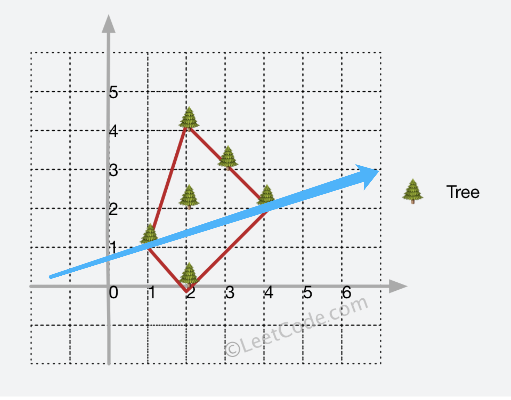
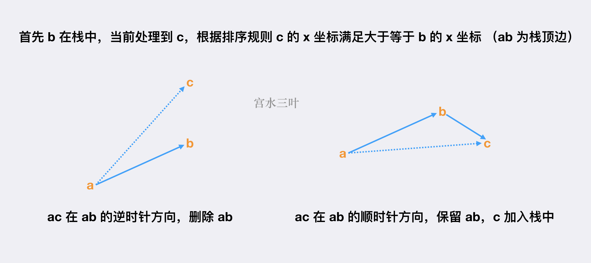

# [LeetCode-【宫水三叶】二维凸包模板题](https://leetcode.cn/problems/erect-the-fence/solution/by-ac_oier-4xuu/) 

## 二维凸包（Andrew 算法）

这是一道「二维凸包」板子题，需要注意的是网上大多数 Andrew 算法的板子都是有问题的（下面会说）。

Andrew 算法正是用于求解凸包上的所有点（围成所有点的最小周长），其算法逻辑将凸包分为「上凸壳」和「下凸壳」，并分别画出（蓝色分割线将凸包分为两部分）：




基本流程为：

一、对所有点进行双关键字排序，先根据 *x* 坐标排升序，后根据 *y* 排升序；

根据 *x* 排升序的目的，是为了我们能够往一个方向画出凸包边缘（从左往后画出一半凸壳，从右往左画出另外一半），而将 *y* 升序目的是可以确保一旦我们现在从 *a* 到 *b* 进行连线，那么 *a* 到 *b* 之间的所有点能够确保被围住；

> NOTE:
>
> 一、由于题目所给的点的顺序未知，因此首先需要对输入的点进行排序以保证点序列，这是使用Andrew 算法的前提

二、使用**栈**来维护所有**凸包**上的**点**，或者说**凸包**上的**边**，会更为准确，凸包**起点元素**会在栈中出现两次（首尾），因此更为准确的描述应该是使用栈维护**凸包**的所有的**边**，栈中相邻元素代表**凸包**上的一条**边**；

> NOTE:
>
> 二、该算法处理的单位是edge，存在在stack中的本质上是edge

三、分别「从前往后」和「从后往前」处理排序好的所有点，来分别画出凸包的两半部分，根据画的是第一部分还是第二部分，维护栈内元的处理逻辑稍有不同：

### 1、**画的是凸包的第一部分：**

- 若栈内元素少于 $2$个，组成一条线至少需要两个点，说明此时第一条边都还没画出，直接将元素添加到栈中；

- 若栈内元素不少于 $2$ 个，考虑是否要将栈顶的边删掉（由栈顶前两个元素组成的边）假设栈顶元素为 $b$，栈顶元素的下一位为 $a$，即栈顶存在一条 $a$ 到 $b$ 的边，当前处理到的点为 $c$，此时我们根据 $ac$ 边是否在 $ab$ 边的时针方向来决定是否要将 $ab$ 边去掉：

  




### 2、**画的是凸包的第二部分：**

逻辑同理，唯一需要注意的是，第一部分的**凸包边**我们不能删去，假定处理完第一部分**凸包**，我们栈内有 *m* 个元素，我们需要将上述「栈顶元素不少于 2 个」的逻辑替换为「栈顶元素大于 *m* 个」，同时已参与到凸包第一部分的点，不能再考虑，因此需要额外使用一个 
`vis` 数组来记录使用过的点。

一些细节，为了方便取得栈顶的前两位元素，我们使用数组实现栈，`stk` 代表栈容器，*top* 代表栈顶元素下标。


### Java code

```java
package com.company;


import java.util.Arrays;


class Solution {
    int[] subtraction(int[] a, int[] b) { // 向量相减
        return new int[]{a[0] - b[0], a[1] - b[1]};
    }

    double cross(int[] a, int[] b) { // 叉乘
        return a[0] * b[1] - a[1] * b[0];
    }

    double getArea(int[] a, int[] b, int[] c) { // 向量 ab 转为 向量 ac 过程中扫过的面积
        return cross(subtraction(b, a), subtraction(c, a));
    }

    public int[][] outerTrees(int[][] trees) {
        Arrays.sort(trees, (a, b) -> {
            return a[0] != b[0] ? a[0] - b[0] : a[1] - b[1];
        });
        int n = trees.length, tp = 0; // tp是直线stack top的指针，它是array as stack的辅助
        int[] stk = new int[n + 10];
        boolean[] vis = new boolean[n + 10];
        stk[++tp] = 0; // 不标记起点
        for (int i = 1; i < n; i++) {
            int[] c = trees[i];
            while (tp >= 2) {
                int[] a = trees[stk[tp - 1]], b = trees[stk[tp]];
                if (getArea(a, b, c) > 0) vis[stk[tp--]] = false;
                else break;
            }
            stk[++tp] = i;
            vis[i] = true;
        }
        int size = tp; // 上凸壳的节点个数
        for (int i = n - 1; i >= 0; i--) {
            if (vis[i]) continue;
            int[] c = trees[i];
            while (tp > size) {
                int[] a = trees[stk[tp - 1]], b = trees[stk[tp]];
                if (getArea(a, b, c) > 0) tp--;
                    // vis[stk[tp--]] = false; // 非必须
                else break;
            }
            stk[++tp] = i;
            // vis[i] = true; // 非必须
        }
        int[][] ans = new int[tp - 1][2];
        for (int i = 1; i < tp; i++) ans[i - 1] = trees[stk[i]];
        return ans;
    }

    public static void main(String[] args) {


    }
}

```

> NOTE:
>
> 一、需要注意的是: `stk` 保存的是index而不是坐标，这是因为它`vis`需要被不断地更新，如果`stk`保存的是坐标的话，那么无法根据坐标去更新 `vis` 


