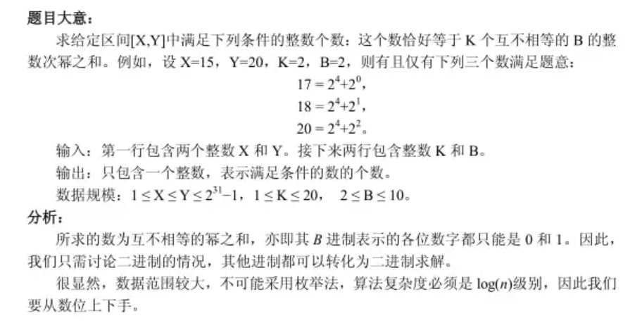
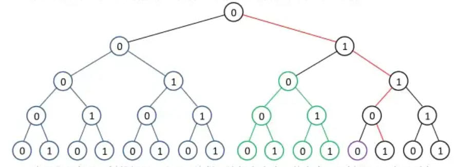
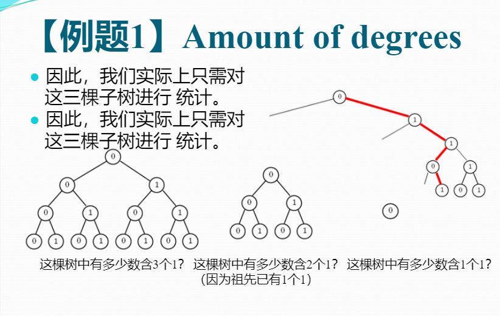
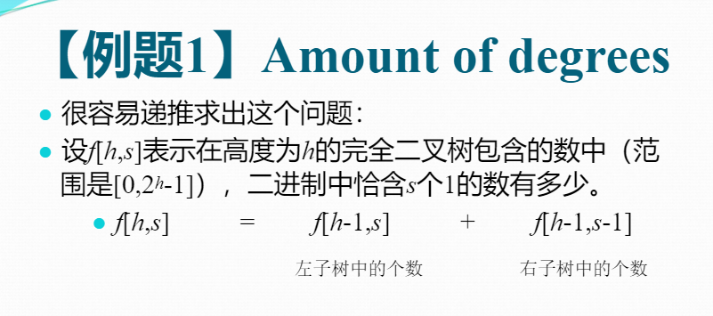

# [浅谈数位类统计问题](https://www.gydoc.com/p-5722.html) 

> NOTE: 
>
> 一、
>
> ppt: 
>
> https://max.book118.com/html/2019/1023/7015031056002065.shtm
>
> 可以正常访问，PPT的内容非常好，是论文的非常好的补充
>
> https://wenku.baidu.com/view/d2414ffe04a1b0717fd5dda8.html?_wkts_=1694272740500
>
> PDF，可以正常访问
>
> https://github.com/ericliu859/AcmPaper/blob/master/%E7%BB%84%E5%90%88%E6%95%B0%E5%AD%A6/%E6%95%B0%E4%BD%8D%E9%97%AE%E9%A2%98/%E5%88%98%E8%81%AA/%E7%AE%97%E6%B3%95%E5%90%88%E9%9B%86%E4%B9%8B%E3%80%8A%E6%B5%85%E8%B0%88%E6%95%B0%E4%BD%8D%E7%B1%BB%E7%BB%9F%E8%AE%A1%E9%97%AE%E9%A2%98%E3%80%8B.pdf
>
> PDF，可以正常访问
>
> 
>
> 二、在阅读 CSDN Accagain  [【DP专辑】ACM动态规划总结](https://blog.csdn.net/cc_again/article/details/25866971?spm=1001.2014.3001.5502) 时，其中提及了这篇论文
>
> 

山东省青岛第二中学 刘聪

## 摘要

在信息学竞赛中，有一类与数位有关的区间统计问题。这类问题往往具有比较浓厚的数学味道，无法暴力求解，需要在数位上进行递推等操作。本文通过几个例子，简要介绍了解决此类问题的基本思想和方法。

## 关键字

数位、区间、统计、递推、树、二进制

> NOTE:
>
> 一、**逐位确定**、

## 正文

在信息学竞赛中，有这样一类问题: 求给定区间中，满足给定条件的某个D进制数或此类数的数量。所求的**限定条件**往往和**数位**有关，例如**数位**之和、指定数码**个数**、数的大小顺序分组等等。题目给定的区间往往很大，无法采用朴素的方法求解。此时，我们就需要利用**数位**的性质，设计 $log(n)$ 级别复杂度算法。解决这类问题的最基本思想就是"**逐位确定**"的方法。下面就让我们通过几道例题来具体了解一下这类问题及其思考方法。


## 【例题1】[ural 1057. Amount of Degrees](https://acm.timus.ru/problem.aspx?space=1&num=1057) 



> NOTE: 
>
> 一、
>
> "所求的数为互不相等的幂之和，亦即其 $B$ 进制表示的各位数字都只能是 0 和 1。因此，我们只需讨论二进制的情况，其他进制都可以转化为二进制求解。"
>
> 上述分析其实少说了一句话，完整的内容是： 其 *B* 进制表示的各位数字都只能是 0 和 1，且 1 的个数位 $K$。 
>
> 

这道题满足**区间减法**，因此可以进一步简化问题: 令 $count[i..j]$ 表示 $[i..j]$ 区间内合法数的个数，则 $count[i..j] = count[0..j] - count[0..i-1] $ 。

假设 $n=13$ ，其二进制表示为 $1101, K = 3$ 。我们的目标是求解出 $0$ 到 $13$ 中二进制表示含 $3$ 个 $1$ 的数的个数，为了方便思考，让我们画出一棵高度为 $4$ 的**完全二叉树**:

> NOTE:
>
> 一、每一位有两个选择: 0、1



为了方便起见，树的根用 $0$​​​​ 表示。这样，这棵高度为 $4$​​​​ 的完全二叉树就可以表示所有 $4$​​​​ 位二进制树 $(0..2^4 - 1)$​​​​，每个叶子节点代表一个数。其中，红色路径表示 $n$​​​​ 。所有小于 $n$​​​​ 的数形成了三棵子树，分别用**蓝色**、**绿色**、**紫色**表示。因此统计小于13的数，就只需要统计这三棵完整的二叉树:

> NOTE: 
>
> 一、上面的颜色是非常不清晰的，下面是比较清晰的描述:
>
> 
>
> 上面进行了分解，更加容易理解。

1、统计**蓝色子树**内含3个1的数的个数

> NOTE: 
>
> **蓝色子树** 指的是上述最左边的子树，即`0***`

2、统计**绿色子树**内含2个1的数的个数(因为从根到此处的路径上已经有1个1了)

> NOTE: 
>
> 即 `10**`

3、统计**紫色子树**内含1个1的数的个数

> NOTE: 
>
> 即 `11**`

注意到，只要是高度相同的子树统计结果一定相同。而需要统计的子树都是"**右转**"时遇到的。

> NOTE: 
>
> 上述"**右转**"如何理解？

当然，我们不能忘记统计 $n$ 本身，实际上，在算法最初时将 $n$ 自加 $1$，可以避免讨论 $n$ 本身，但是需要注意避免上溢。

剩下的问题是，如何统计一棵高度为 $i$​ 的完全二叉树内二进制表示中恰好含有 $j$​ 个 $1$​ 的数的个数。这很容易递推求出: 设 $f[i, j]$ 表示所求，则分别统计左右子树内符合条件数的个数，有 $f[i, j] = f[i - 1, j] + f[i - 1, j - 1]$ 。

> NOTE:
>
> 
>
> 上述让我想起来"**树形DP**"
>
> 

这样就可以得到询问的算法: 首先预处理 $f$ ，然后对于深入 $n$ ，我们在假象的完全二叉树中，从根走到 $n$ 所在的叶子，每次向右转时统计左子树内数的个数。下面是C++代码:

```C++
#include <bits/stdc++.h>
using namespace std;

void init()
{
	f[0][0] = 1;
	for (int i = 0; i <= 31; ++i)
	{
		f[i][0] = f[i - 1][0];
		for (int j = 1; j <= i; ++i)
		{
			f[i][j] = f[i - 1][j] + f[i - 1][j - 1];
		}
	}
}
int calc(int x, int k) // 统计[0..x]内二进制表示含k个1的数的个数
{
	int tol = 0, ans = 0; // tol 记录当前路径上已有的1的数量，ans表示答案
	for (int i = 31; i > 0; ++i)
	{
		if (x & (1 << i))
		{
			++tol;
			if (tol > k)
				break;
			x = x ^ (1 << 1);
		}
		if (1 << (i - 1) <= x)
		{
			ans += f[i - 1][k - tol];
		}
	}
	if (tol + x == k)
	{
		++ans;
	}
	return ans;
}
int main()
{
}
// g++ test.cpp --std=c++11 -pedantic -Wall -Wextra -g


```

最后的问题就是如何处理非二进制。

#### 完整代码

> NOTE: 
>
> 下面代码是截取自 CSDN [ural 1057 Amount of degrees 【数位dp】](https://blog.csdn.net/y990041769/article/details/40515677)

