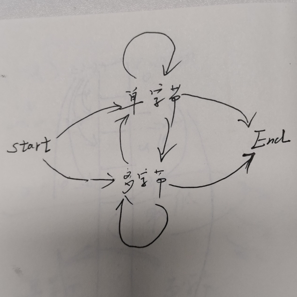
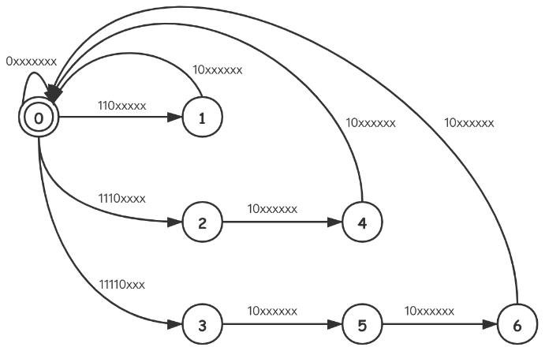

# [LeetCode-393. UTF-8 编码验证](https://leetcode.cn/problems/utf-8-validation/)


## 我画的DFA



## [Edward Elric](https://leetcode.cn/u/zdxiq125/) # [[Java] DFA](https://leetcode.cn/problems/utf-8-validation/solution/java-dfa-by-zdxiq125/) 

> NOTE: 
>
> [Edward ElricL3](https://leetcode.cn/u/zdxiq125/) 给出的 DFA 是我觉得最最好的

这显然是一题和**位操作**有关的题目。并且，这其中有非常多的状态需要考虑。UTF-8编码的字符可以是由1到4个字节来表示，并且从第1个字节我们就可以看出该UTF-8字符一共由几个字节组成。所以，当我们接收到第一个字节，后续的0到3个字节必须符合所有题设限制（字节数目限制、每个字节的前导比特限制）。这内部其实是一个很完整的确定有限状态机（DFA）。这里，我们选择直接建立这个**自动机**。




### 算法

例如，状态0表示clear，即所有之前的字节都已经处理成UTF-8字符了。接下来，有效的输入其实只有4种，所以0这个状态其实可以转移成4个其他状态：

1、`0xxxxxxx`，表示单字节UTF-8字符，那么其实可以直接转移回0（clear）。

2、`110xxxxx`，表示双字节UTF-8字符，定义一个新状态1。

3、`1110xxxxx`，表示三字节UTF-8字符，定义一个新状态2。

4、`11110xxx` ，表示四字节UTF-8字符，定义一个新状态3。

我们看一个最长转移路径：`0 -> 3 -> 5 -> 6 -> 0`，这条路径代表一个4字节的有效UTF-8字符——当我们依次接收到`11110xxx`, `10xxxxxx`, `10xxxxxx`, `10xxxxxx`,状态又跳回了clear态，即0。所有不符合这个路径特征的输入，都可以直接认为是一个无效的UTF-8字符。

> NOTE: 
>
> 一、共有五种可能的输入
>
> 二、下面的实现中，给出了每种状态，在各种输入下的转移状态
>
> 状态使用`int`类型表示，值域: `[0-6]`
>
> 三、下面是使用table表示的上述DFA
>
> |           | `0xxxxxxx` | `110xxxxx` | `1110xxxx` | `11110xxx` | `10xxxxxx` |
> | --------- | ---------- | ---------- | ---------- | ---------- | ---------- |
> | **start** | end        | 1          | 2          | 3          | end        |
> | **1**     | end        | end        | end        | end        | end        |
> | **2**     |            |            |            |            | 4          |
> | **3**     |            |            |            |            | 5          |
> | **4**     |            |            |            |            | end        |
> | **5**     |            |            |            |            | 6          |
> | **6**     |            |            |            |            | end        |
>
> 上述table最后，默认值是end状态

### Code

```Java
class Solution {
    // input types: determined by most significant 1 ~ 5 bits
    static final int TYPE_0 = 0b00000000;
    static final int TYPE_1 = 0b10000000;
    static final int TYPE_2 = 0b11000000;
    static final int TYPE_3 = 0b11100000;
    static final int TYPE_4 = 0b11110000;
    // masks for most significant 1 to 5 bis
    static final int[] MASKS = new int[]{0b10000000, 0b11000000, 0b11100000, 0b11110000, 0b11111000};
    // input type enumation
    static final int[] TYPES = new int[]{TYPE_0, TYPE_1, TYPE_2, TYPE_3, TYPE_4};
    // map of cur_stat : (input_type : next_stat)
    static final Map<Integer, Map<Integer, Integer>> DFA = new HashMap<>();
    // build the dfa
    static {
        DFA.put(0, Map.of(TYPE_0, 0, TYPE_2, 1, TYPE_3, 2, TYPE_4, 3));
        DFA.put(1, Map.of(TYPE_1, 0));
        DFA.put(2, Map.of(TYPE_1, 4));
        DFA.put(4, Map.of(TYPE_1, 0));
        DFA.put(3, Map.of(TYPE_1, 5));
        DFA.put(5, Map.of(TYPE_1, 6));
        DFA.put(6, Map.of(TYPE_1, 0));
    }
    
    public boolean validUtf8(int[] data) {
        int cur = 0; // 当前状态，初始值为 0，表示状态0
        for (int input : data) {
            Integer next = getNext(cur, input); // 获得next状态
            if (next == null) {
                return false;
            }
            cur = next;
        }
        return cur == 0;
    }

    private static int getType(int in) {
        for (int i = 0; i < TYPES.length; i++) {
            if ((MASKS[i] & in) == TYPES[i]) {
                return TYPES[i];
            }
        }
        // unreachable. unless input is "11111xxx" which is not a valid utf-8 character.
        return -1;
    }
    
    private static Integer getNext(int cur, int input) {
        int type = getType(input);
        if (type == -1) return null;
        return DFA.get(cur).get(type);
    }
}

```


## 我的实现

参考

1、 [Edward Elric](https://leetcode.cn/u/zdxiq125/) # [[Java] DFA](https://leetcode.cn/problems/utf-8-validation/solution/java-dfa-by-zdxiq125/) ，使用C++实现。

2、[leetcode 8 字符串转换整数 (atoi) # 官方解题](https://leetcode.cn/problems/string-to-integer-atoi/solution/zi-fu-chuan-zhuan-huan-zheng-shu-atoi-by-leetcode-/) 

相比之下，[leetcode 8 字符串转换整数 (atoi) # 官方解题](https://leetcode.cn/problems/string-to-integer-atoi/solution/zi-fu-chuan-zhuan-huan-zheng-shu-atoi-by-leetcode-/) 中对DFA的实现是更加容易理解的

1、如果能够正常完成解析，则消耗的数字等于入参的长度。

2、上述table最后，默认

需要注意，type 和 mask 之间的对应关系。

```C++
#include <bits/stdc++.h>
using namespace std;

static const int TYPE_0 = 0b00000000; // 单字节
static const int TYPE_1 = 0b10000000; // 多字节的非第一位
static const int TYPE_2 = 0b11000000; // 二字节
static const int TYPE_3 = 0b11100000; // 三字节
static const int TYPE_4 = 0b11110000; // 四字节

/**
 * 下面的DFA仅仅存储了有效的状态转换，对于无效的状态转换，它没有存储
 * 它其实存储的就是原图
 */
static unordered_map<int, unordered_map<int, int>> DFA { //
{ 0, { { TYPE_0, 0 }, { TYPE_2, 1 }, { TYPE_3, 2 }, { TYPE_4, 3 } } }, //
				{ 1, { { TYPE_1, 0 } } }, //
				{ 2, { { TYPE_1, 4 } } }, //
				{ 3, { { TYPE_1, 5 } } }, //
				{ 4, { { TYPE_1, 0 } } }, //
				{ 5, { { TYPE_1, 6 } } }, //
				{ 6, { { TYPE_1, 0 } } }  //

};
// masks for most significant 1 to 5 bis
static const int MASKS[] { 0b10000000, 0b11000000, 0b11100000, 0b11110000, 0b11111000 };
// input type enumation
static const int TYPES[] { TYPE_0, TYPE_1, TYPE_2, TYPE_3, TYPE_4 };

using Size = ptrdiff_t;

template<class Type, Size n>
constexpr auto n_items(Type (&)[n]) -> Size
{
	return n;
}

class Solution
{
public:
	bool validUtf8(vector<int> &data)
	{
		int cur = 0; // 当前状态
		for (auto &&input : data)
		{
			int next = getNext(cur, input);
			if (next == -1)
			{
				return false;
			}
			cur = next;
		}
		return cur == 0;
	}
private:
	static int getInputType(int input)
	{
		for (int i = 0; i < n_items(MASKS); ++i)
		{
			if ((input & MASKS[i]) == TYPES[i])
			{
				return TYPES[i];
			}
		}
		return -1;
	}
	static int getNext(int cur, int input)
	{
		int type = getInputType(input);
		if (type == -1)
		{
			return -1;
		}
		else
		{
			auto iter = DFA.find(cur);
			if (iter != DFA.end())
			{
				auto &&edges = iter->second;
				if (edges.count(type))
				{
					return edges[type];
				}
				else
				{
					return -1;
				}
			}
			else
			{
				return -1;
			}
		}
	}
};

int main()
{
	Solution s;
	vector<int> v { 197, 130, 1 };
	s.validUtf8(v);
}
// g++ test.cpp --std=c++11 -pedantic -Wall -Wextra -g


```


## [LeetCode-C++优美代码](https://leetcode.cn/problems/utf-8-validation/solution/cjing-jian-ma-by-xiaohu9527-om7b/)

```C++
#include <bits/stdc++.h>
using namespace std;

class Solution
{
public:
	bool validUtf8(vector<int> &data)
	{
		int c = 0; // 期待有多少个byte
		for (const int &num : data)
		{
			if (c == 0)
			{
				if ((num >> 5) == 0b110) // 读取前3 bit
					c = 1;
				else if ((num >> 4) == 0b1110) // 读取前4 bit
					c = 2;
				else if ((num >> 3) == 0b11110) // 读取前5 bit
					c = 3;
				else if ((num >> 7)) // 读取前1 bit
					return false;
			}
			else
			{
				if ((num >> 6) != 0b10)
					return false;
				--c;
			}
		}
		return c == 0;
	}
};

int main()
{
	Solution s;
	vector<int> v { 197, 130, 1 };
	s.validUtf8(v);
}
// g++ test.cpp --std=c++11 -pedantic -Wall -Wextra -g


```

