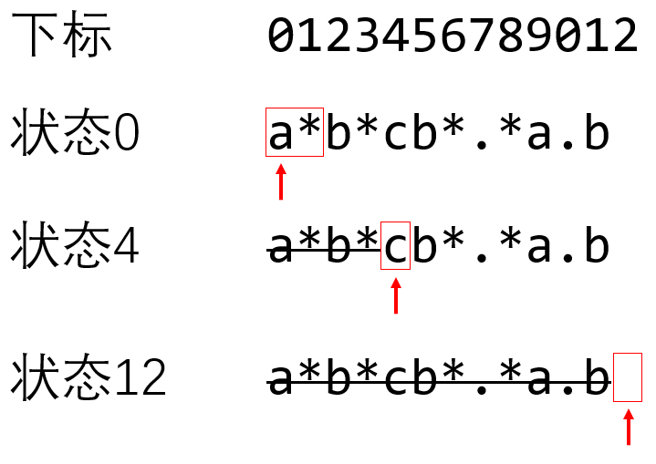

# LeetCode regex

| 题目                                                         | 需要实现的 |      |
| ------------------------------------------------------------ | ---------- | ---- |
| [LeetCode-10. Regular Expression Matching-hard](https://leetcode.cn/problems/regular-expression-matching/) | `.`, `*`   |      |
| [LeetCode-44. Wildcard Matching-hard](https://leetcode.cn/problems/wildcard-matching/) | `?`, `*`   |      |

这两道题所考察的其实是 [Thompson's construction](https://en.wikipedia.org/wiki/Thompson%27s_construction) 

## [LeetCode-10. Regular Expression Matching-hard](https://leetcode.cn/problems/regular-expression-matching/) 

### DFA/NFA

对于regex，首先想到的就是DFA/NFA

Q: 如何实现`*`？

A: 对于每一步，都有两个选择:

- character transition

- epsilon transition


一. epsilon transition保证能够找到所有的可能性。

epsilon transition 是为了找到所有可能的**起始状态**，这样后续的匹配可以从这些可能的起始状态开始匹配。

这种方式直接将regex看做是NFA，它不需要显示地构造出一个DFA，这样避免对 undeterministic 的讨论: 对于同一状态，遇到相同字符的时候，出现多种转换方式的讨论。

````
/**
* 在匹配完成后，如果node有epsilon transition，则不断执行epsilon transition
* 一、因为可能出现字符串比pattern短的情况，比如:
* s = "a"
* p = "ab*"
* 二、最后的"c*a*"都不在匹配
* s = "cbaacacaaccbaabcb"
* p = "c*b*b*.*ac*.*bc*a*"
*/
````


二. DFA VS NFA

```
/**
 * 1、处理诸如 "a*a" 的case，这种case是本程序不支持的形式，因为本程序是DFA，而这种case在一个状态下，从"a"有两种transition，
 * 本程序的做法是将它转换为 "a+" 的形式
 * 2、"a*a*" => "a*"
 */
```

在 DFA 的写法中，是通过分别调用 epsilon transition 和 character transition 来实现存储 DFA 是会出现的类似上述的问题

三. 我之前的DFA的写法如下:

```
    bool dfsDFA(const string &s, int i, Node *&node)
    {
         char c = s[i];
    }
```


对比 LeetCode [六硝基六氮杂三环十四](https://leetcode.cn/u/liu-xiao-ji-liu-dan-za-san-huan-shi-si-wan-dui-er-fu-zan/) [10、 正则表达式匹配：有限自动机（FA）算法](https://leetcode.cn/problems/regular-expression-matching/solutions/1532116/10-zheng-ze-biao-da-shi-pi-pei-by-liu-xi-wi4p/) 中的写法，是可以不消耗字符，直接通过 epsilon transition 进行转换，我之前的写法没有加入这种 transition，所以无法穷举所有的可能性。

### BFS 


### LeetCode [六硝基六氮杂三环十四](https://leetcode.cn/u/liu-xiao-ji-liu-dan-za-san-huan-shi-si-wan-dui-er-fu-zan/) # [10、 正则表达式匹配：有限自动机（FA）算法](https://leetcode.cn/problems/regular-expression-matching/solutions/1532116/10-zheng-ze-biao-da-shi-pi-pei-by-liu-xi-wi4p/)

例子:

输入`s = "abcacb", p = "a*b*cb*.*a.b"`，看看算法是怎么工作的。



> NOTE:
>
> 1. 上述状态的命名是根据下标

算法的基本原理是：从s中每读一个字符，我们就从一个状态合法地跳转到另一个状态。当s的字符被读完的时候，如果状态能来到终止状态，就说明能匹配；如果状态无法来到终止状态，就说明不能匹配。

在上述分析中遇到带 `*` 号的匹配项时，什么字符都不读就可以转换状态，所以当前所处的状态其实构成一个**状态集合**。比如说，在什么字符都没读到的时候，对于正则表达式`p`，我们处在状态0、2、4都是可能的。在代码中，用`now_state_set`来记录当前的状态集合。

对于状态集合 *S* 的跳转结果，其实也是个**状态集合** $S^{'} = \left\{ s^{'} | s \rightarrow s^{'}, s \in S \right\} $，其中箭头 $\rightarrow$ 表示合法的跳转。

总体来说，算法的流程如下：

1. 设**当前状态集合**为 $\left\{ 0 \right\} $
2. 什么字符都不读，根据p更新一下**当前状态集合** (epsilon transition)
3. 读取s的下一个字符，根据p更新一下**当前状态集合**。如果更新之后**当前状态集合**为空集，即匹配失败，直接返回False. 如果s已经读完了，执行第6步。
   什么字符都不读，根据p更新一下当前状态集合。
   循环，回到第3步执行。
   此时s已经读完了，如果当前状态集合里面有终止状态，则至少有一种状态跳转路径可以匹配成功，返回True，否则返回False.

作者：六硝基六氮杂三环十四
链接：https://leetcode.cn/problems/regular-expression-matching/solutions/1532116/10-zheng-ze-biao-da-shi-pi-pei-by-liu-xi-wi4p/
来源：力扣（LeetCode）
著作权归作者所有。商业转载请联系作者获得授权，非商业转载请注明出处。

```python
class Solution:
    def isMatch(self, s: str, p: str) -> bool:
        """
        :param s: 待匹配的字符串s.
        :param p: 正则表达式p.
        :return: 是否成功匹配。
        """
        now_state_set = {0}  # 表示现在可能处于的所有状态的集合。状态state表示接下来匹配p[state].

        def update_now_state_set(char: str) -> None:
            """
            :param char: 接续字符char后更新一下now_state_set. 如果char是'~'，表示后继字符为空。
            :return: 无。
            """
            nonlocal now_state_set
            tmp_state_set = set()  # 用一个临时变量tmp_state_set记录结果。
            if char == '~':
                # 将直接跳过_*的所有后继状态加入now_state_set.
                for state in now_state_set:
                    tmp_state_set.add(state)
                    possible_state = state
                    while possible_state + 1 < len(p) and p[possible_state + 1] == '*':
                        possible_state += 2
                        tmp_state_set.add(possible_state)
            else:
                # 接续字符char后的所有后继状态构成now_state_set.
                for state in now_state_set:
                    if state >= len(p) or p[state] not in {char, '.'}:
                        # state是终止状态，或者p[state]不匹配，此时匹配失败。
                        continue
                    if state + 1 < len(p) and p[state + 1] == '*':
                        # 从状态state开始，匹配了一个char*之后，还可以停留在该状态。
                        tmp_state_set.add(state)
                    else:
                        tmp_state_set.add(state + 1)
            now_state_set = tmp_state_set

        update_now_state_set('~')
        for char in s:
            update_now_state_set(char)  # 首先尝试
            update_now_state_set('~')

        if len(p) in now_state_set:
            # 如果now_state可能是终止状态len(p)，即存在一种方法进行匹配，返回True.
            return True
        return False


if __name__ == '__main__':
    s = Solution()
    s.isMatch("aa", "a*")

```


它的这种搜索方式更加类似于BFS，它在每一步骤都加入了epsilon transition。

它的这种搜索方式，能够穷举出所有的可能性，即使相同的字符有两种transition，它都会去尝试。


思考: 能否DFS来实现呢？


## C++

```c++
#include <algorithm>
#include <string>
#include <iostream>
#include <unordered_set>

using namespace std;


class Solution {
    static constexpr char epsilonChar = 0;
    static constexpr char wildCardChar = '.';
    static constexpr char KleenStarChar = '*';
    std::unordered_set<int> states_;
public:
    Solution() {
    }


    bool isMatch(string s, string p) {
        states_ = {0};
        transition(epsilonChar, p); // 这其实是一个初始化，将所有的起始状态全部加入进来
        for (auto &&c: s) {
            transition(c, p);
            transition(epsilonChar, p);
        }
        return states_.contains(p.size());
    }

private:
    void transition(char c, const string &p) {
        std::unordered_set<int> newStates{};
        if (c == epsilonChar) {
            /**
             * 将*的所有后继状态加入 newStates 中，epsilon transition是为了找到所有可能的起始状态，这样后续的匹配可以从这些可能的起始状态开始匹配
             * 需要注意的是: epsilon transition需要保留原来的状态，因为它主要对应的是KleenStarChar的0
             */
            for (auto &&state: states_) {
                newStates.insert(state);// epsilon transition需要保留原来的状态，因为它主要对应的是KleenStarChar的0
                int nextState = state;
                while (nextState + 1 < p.size() && p[nextState + 1] == KleenStarChar) {
                    nextState = nextState + 2;
                    newStates.insert(nextState);
                }
            }
        } else {
            // 接续字符char后的所有后继状态构成newStates
            for (auto &&state: states_) {
                if (state >= p.size() or (p[state] != c && p[state] != wildCardChar)) {
                    // state是终止状态，或者p[state]不匹配，此时匹配失败。
                    continue;
                }
                /**
                 * 对应的是KleenStarChar的+
                 */
                if (state + 1 < p.size() and p[state + 1] == '*') {
                    // 从状态state开始，匹配了一个char*之后，还可以停留在该状态。
                    newStates.insert(state);
                } else {
                    newStates.insert(state + 1);
                }
            }

        }
        states_ = std::move(newStates);
    }
};


// Driver code
int main() {
    Solution s1;
    std::cout << s1.isMatch("aab", "c*a*b") << std::endl;

    /* Solution s2;
     std::cout << s2.isMatch("aa", "aa") << std::endl;

     Solution s3;
     std::cout << s3.isMatch("aa", "a") << std::endl;

     Solution s4;
     std::cout << s4.isMatch("aaa", "a*a") << std::endl;

     Solution s5;
     std::cout << s5.isMatch("bbbaccbbbaababbac", ".b*b*.*...*.*c*.") << std::endl;
 */
    return 0;
}
// g++ test.cpp --std=c++11 -pedantic -Wall -Wextra

```


## [LeetCode-44. Wildcard Matching](https://leetcode.cn/problems/wildcard-matching/) 