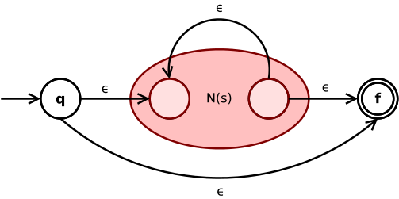
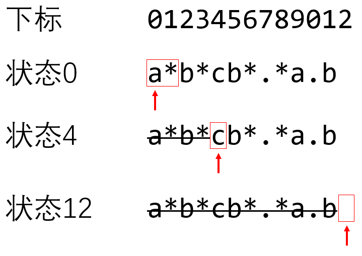

# LeetCode regex

| 题目                                                         | 需要实现的 |      |
| ------------------------------------------------------------ | ---------- | ---- |
| [LeetCode-10. Regular Expression Matching-hard](https://leetcode.cn/problems/regular-expression-matching/) | `.`, `*`   |      |
| [LeetCode-44. Wildcard Matching-hard](https://leetcode.cn/problems/wildcard-matching/) | `.`, `.*`  |      |


## Regex $\epsilon$-NFA

对于regex，首先想到的就是NFA，这两道题的一个相同点是: [Kleene star](https://en.wikipedia.org/wiki/Kleene_star) `*` ，根据 [Thompson's construction algorithm](https://en.wikipedia.org/wiki/Thompson%27s_construction) 中的内容可知，[Kleene star](https://en.wikipedia.org/wiki/Kleene_star) `*` 对应的NFA如下: 

> The **[Kleene star](https://en.wikipedia.org/wiki/Kleene_star) expression** $s^*$ is converted to
>
> [](https://en.wikipedia.org/wiki/File:Thompson-kleene-star.svg)

那在答题的时候，我们要实现  [Thompson's construction algorithm](https://en.wikipedia.org/wiki/Thompson%27s_construction) 吗？显示是不需要的，我们可以不显示地构建一个NFA而是等价模拟实现它的功能。

Q: 如何模拟实现 regex [Kleene star](https://en.wikipedia.org/wiki/Kleene_star) `*` NFA? 

A: current state set: 记录当前所处的状体，每一步执行如下transition:

- character transition


- epsilon transition

从下面的实现可以看出，对于`*`，character transition 和 epsilon transition的做法是不同的:

- epsilon transition: 直接跳过
- character transition: 回到自身

需要注意: epsilon transition是往 current state set 中添加新的state，而 character transition 则是从current state set中挑选出在character下才能够进行transition的state。

Q: 如何枚举所有的可能？

A: 对比 LeetCode [六硝基六氮杂三环十四](https://leetcode.cn/u/liu-xiao-ji-liu-dan-za-san-huan-shi-si-wan-dui-er-fu-zan/) [10、 正则表达式匹配：有限自动机（FA）算法](https://leetcode.cn/problems/regular-expression-matching/solutions/1532116/10-zheng-ze-biao-da-shi-pi-pei-by-liu-xi-wi4p/) 中的写法，是可以不消耗字符，直接通过 epsilon transition 进行转换，我之前的写法没有加入这种 transition，所以无法穷举所有的可能性。

Q: 

A: BFS、DFS

## [LeetCode-10. Regular Expression Matching-hard](https://leetcode.cn/problems/regular-expression-matching/) 

- `'.'` Matches any single character.
- `'*'` Matches zero or more of the preceding element.

### BFS regex $\epsilon$-NFA

LeetCode [六硝基六氮杂三环十四](https://leetcode.cn/u/liu-xiao-ji-liu-dan-za-san-huan-shi-si-wan-dui-er-fu-zan/) # [10、 正则表达式匹配：有限自动机（FA）算法](https://leetcode.cn/problems/regular-expression-matching/solutions/1532116/10-zheng-ze-biao-da-shi-pi-pei-by-liu-xi-wi4p/)

例子:

输入`s = "abcacb", p = "a*b*cb*.*a.b"`，看看算法是怎么工作的。



> NOTE:
>
> 1. 上述状态的命名是根据下标

算法的基本原理是：从s中每读一个字符，我们就从一个状态合法地跳转到另一个状态。当s的字符被读完的时候，如果状态能来到终止状态，就说明能匹配；如果状态无法来到终止状态，就说明不能匹配。

在上述分析中遇到带 `*` 号的匹配项时，什么字符都不读就可以转换状态，所以当前所处的状态其实构成一个**状态集合**。比如说，在什么字符都没读到的时候，对于正则表达式`p`，我们处在状态0、2、4都是可能的。在代码中，用`now_state_set`来记录当前的状态集合。

对于状态集合 *S* 的跳转结果，其实也是个**状态集合** $S^{'} = \left\{ s^{'} | s \rightarrow s^{'}, s \in S \right\} $，其中箭头 $\rightarrow$ 表示合法的跳转。

总体来说，算法的流程如下：

1. 设**当前状态集合**为 $\left\{ 0 \right\} $
2. 什么字符都不读，根据p更新一下**当前状态集合** (epsilon transition)
3. 读取s的下一个字符，根据p更新一下**当前状态集合**。如果更新之后**当前状态集合**为空集，即匹配失败，直接返回False. 如果s已经读完了，执行第6步 (character transition)
4. 什么字符都不读，根据p更新一下**当前状态集合** (epsilon transition)
5. 循环，回到第3步执行。
6. 此时s已经读完了，如果**当前状态集合**里面有**终止状态**，则至少有一种状态跳转路径可以匹配成功，返回True，否则返回False.

> NOTE: 
>
> 需要首先执行一次 epsilon transition( 实际计算的是**epsilon closure** )，这是对automaton的初始化
>
> 它的这种搜索方式更加类似于BFS，它在每一步骤都加入了epsilon transition。
>
> 它的这种搜索方式，能够穷举出所有的可能性，即使相同的字符有两种transition，它都会去尝试。
>
>  

#### Python0

```python
class Solution:
    def isMatch(self, s: str, p: str) -> bool:
        cur_state_set = {0}  # 当前状态集合

        def epsilon_transition():
            """
            计算epsilon closure
            往 cur_state_set 中添加通过epsilon transition能够到达的状态
            由于set不支持一边循环一边修改所以下面采取的写法是先copy now_state_set
            然后往其中添加新的元素
            """
            nonlocal cur_state_set
            for state in cur_state_set.copy():
                next_state = state
                while next_state + 1 < len(p) and p[next_state + 1] == '*':
                    next_state += 2
                    cur_state_set.add(next_state)

        def char_transition(char: str):
            nonlocal cur_state_set
            tmp_state_set = set()  # 用一个临时变量tmp_state_set记录结果
            for state in cur_state_set:
                if state >= len(p) or p[state] not in {char, '.'}:
                    # state是终止状态，或者p[state]不匹配，此时匹配失败。
                    continue
                if state + 1 < len(p) and p[state + 1] == '*':
                    # 从状态state开始，匹配了一个char*之后，还可以停留在该状态。
                    tmp_state_set.add(state)
                else:
                    tmp_state_set.add(state + 1)
            cur_state_set = tmp_state_set

        epsilon_transition()
        for char in s:
            char_transition(char)  # 首先尝试
            epsilon_transition()

        if len(p) in cur_state_set:
            # 如果now_state可能是终止状态len(p)，即存在一种方法进行匹配，返回True.
            return True
        return False


if __name__ == '__main__':
    pass

```

需要注意: 在for loop中，需要先执行 `char_transition()` 再执行 `epsilon_transition()` 。

#### Python1

```python
class Solution:
    def isMatch(self, s: str, p: str) -> bool:
        """
        :param s: 待匹配的字符串s.
        :param p: 正则表达式p.
        :return: 是否成功匹配。
        """
        now_state_set = {0}  # 表示现在可能处于的所有状态的集合。状态state表示接下来匹配p[state].

        def update_now_state_set(char: str) -> None:
            """
            :param char: 接续字符char后更新一下now_state_set. 如果char是'~'，表示后继字符为空。
            :return: 无。
            """
            nonlocal now_state_set
            tmp_state_set = set()  # 用一个临时变量tmp_state_set记录结果。
            if char == '~':
                # 将直接跳过_*的所有后继状态加入now_state_set.
                for state in now_state_set:
                    tmp_state_set.add(state)
                    possible_state = state
                    while possible_state + 1 < len(p) and p[possible_state + 1] == '*':
                        possible_state += 2
                        tmp_state_set.add(possible_state)
            else:
                # 接续字符char后的所有后继状态构成now_state_set.
                for state in now_state_set:
                    if state >= len(p) or p[state] not in {char, '.'}:
                        # state是终止状态，或者p[state]不匹配，此时匹配失败。
                        continue
                    if state + 1 < len(p) and p[state + 1] == '*':
                        # 从状态state开始，匹配了一个char*之后，还可以停留在该状态。
                        tmp_state_set.add(state)
                    else:
                        tmp_state_set.add(state + 1)
            now_state_set = tmp_state_set

        update_now_state_set('~')
        for char in s:
            update_now_state_set(char)  # 首先尝试
            update_now_state_set('~')

        if len(p) in now_state_set:
            # 如果now_state可能是终止状态len(p)，即存在一种方法进行匹配，返回True.
            return True
        return False


if __name__ == '__main__':
    s = Solution()
    s.isMatch("aa", "a*")

```


#### C++

```c++
#include <algorithm>
#include <string>
#include <iostream>
#include <unordered_set>

using namespace std;


class Solution {
    static constexpr char epsilonChar = 0;
    static constexpr char wildCardChar = '.';
    static constexpr char KleenStarChar = '*';
    std::unordered_set<int> states_;
public:
    Solution() {
    }


    bool isMatch(string s, string p) {
        states_ = {0};
        transition(epsilonChar, p); // 这其实是一个初始化，将所有的起始状态全部加入进来
        for (auto &&c: s) {
            transition(c, p);
            transition(epsilonChar, p);
        }
        return states_.contains(p.size());
    }

private:
    void transition(char c, const string &p) {
        std::unordered_set<int> newStates{};
        if (c == epsilonChar) {
            /**
             * 将*的所有后继状态加入 newStates 中，epsilon transition是为了找到所有可能的起始状态，这样后续的匹配可以从这些可能的起始状态开始匹配
             * 需要注意的是: epsilon transition需要保留原来的状态，因为它主要对应的是KleenStarChar的0
             */
            for (auto &&state: states_) {
                newStates.insert(state);// epsilon transition需要保留原来的状态，因为它主要对应的是KleenStarChar的0
                int nextState = state;
                while (nextState + 1 < p.size() && p[nextState + 1] == KleenStarChar) {
                    nextState = nextState + 2;
                    newStates.insert(nextState);
                }
            }
        } else {
            // 接续字符char后的所有后继状态构成newStates
            for (auto &&state: states_) {
                if (state >= p.size() or (p[state] != c && p[state] != wildCardChar)) {
                    // state是终止状态，或者p[state]不匹配，此时匹配失败。
                    continue;
                }
                /**
                 * 对应的是KleenStarChar的+
                 */
                if (state + 1 < p.size() and p[state + 1] == '*') {
                    // 从状态state开始，匹配了一个char*之后，还可以停留在该状态。
                    newStates.insert(state);
                } else {
                    newStates.insert(state + 1);
                }
            }

        }
        states_ = std::move(newStates);
    }
};


// Driver code
int main() {
    Solution s1;
    std::cout << s1.isMatch("aab", "c*a*b") << std::endl;

    /* Solution s2;
     std::cout << s2.isMatch("aa", "aa") << std::endl;

     Solution s3;
     std::cout << s3.isMatch("aa", "a") << std::endl;

     Solution s4;
     std::cout << s4.isMatch("aaa", "a*a") << std::endl;

     Solution s5;
     std::cout << s5.isMatch("bbbaccbbbaababbac", ".b*b*.*...*.*c*.") << std::endl;
 */
    return 0;
}
// g++ test.cpp --std=c++11 -pedantic -Wall -Wextra

```


## [LeetCode-44. Wildcard Matching-hard](https://leetcode.cn/problems/wildcard-matching/) 

题目要求:

> - `'?'` Matches any single character.
> - `'*'` Matches any sequence of characters (including the empty sequence).

### BFS regex $\epsilon$-NFA

#### Python

```python
class Solution:
    def isMatch(self, s: str, p: str) -> bool:
        cur_state_set = {0}

        def epsilon_transition():
            for state in cur_state_set.copy():
                next_state = state
                while next_state < len(p) and p[next_state] == '*':
                    next_state += 1
                    cur_state_set.add(next_state)

        def char_transition(c: str):
            nonlocal cur_state_set
            tmp_state_set = set()
            for state in cur_state_set:
                if state >= len(p):
                    continue
                if p[state] in {'?', c}:
                    tmp_state_set.add(state + 1)
                if p[state] == '*':
                    tmp_state_set.add(state + 1)
                    tmp_state_set.add(state)
            cur_state_set = tmp_state_set

        epsilon_transition()
        for char in s:
            char_transition(char)
            epsilon_transition()
        return len(p) in cur_state_set


if __name__ == '__main__':
    pass

```

