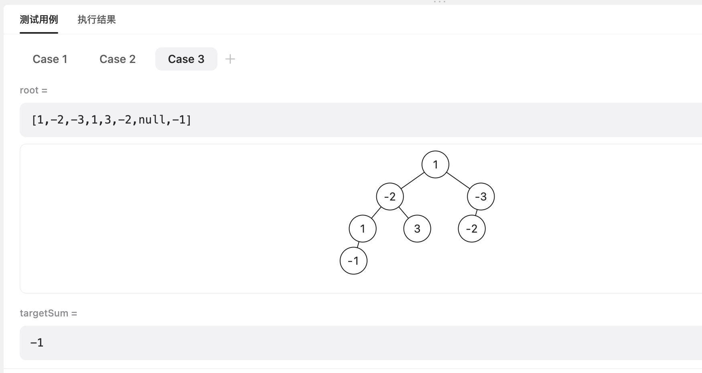
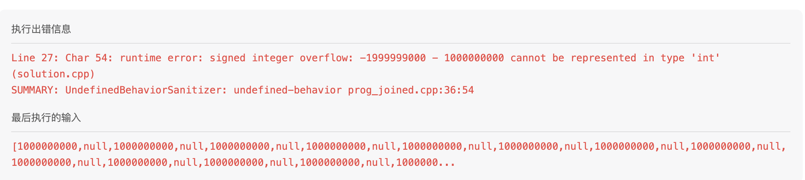

# LeetCode-path-sum-series

[LeetCode-112. Path Sum-easy](https://leetcode.cn/problems/path-sum/) 判断

[LeetCode-113. Path Sum II-middle](https://leetcode.cn/problems/path-sum-ii/) 枚举所有的可能性

[LeetCode-437. Path Sum III-middle](https://leetcode.cn/problems/path-sum-iii/) 计数


[LeetCode-129. Sum Root to Leaf Numbers-middle](https://leetcode.cn/problems/sum-root-to-leaf-numbers/)

本质上是类似的。

## [LeetCode-112. Path Sum-easy](https://leetcode.cn/problems/path-sum/)


### DFS


```c++
class Solution {
public:
    bool hasPathSum(TreeNode *root, int targetSum) {
        if (root == nullptr) {
            return false;
        }
        if (root->left == nullptr && root->right == nullptr) {
            return root->val == targetSum;
        } else {
            return hasPathSum(root->left, targetSum - root->val) || hasPathSum(root->right, targetSum - root->val);
        }
    }
};
```


## [LeetCode-113. Path Sum II-middle](https://leetcode.cn/problems/path-sum-ii/) 


### DFS+backtrack

```c++
#include <algorithm>
#include <string>
#include <vector>
#include <set>

using namespace std;

/**
 * Definition for a binary tree node.
 * struct TreeNode {
 *     int val;
 *     TreeNode *left;
 *     TreeNode *right;
 *     TreeNode() : val(0), left(nullptr), right(nullptr) {}
 *     TreeNode(int x) : val(x), left(nullptr), right(nullptr) {}
 *     TreeNode(int x, TreeNode *left, TreeNode *right) : val(x), left(left), right(right) {}
 * };
 */

struct TreeNode {
    int val;
    TreeNode *left;
    TreeNode *right;

    TreeNode() : val(0), left(nullptr), right(nullptr) {}

    TreeNode(int x) : val(x), left(nullptr), right(nullptr) {}

    TreeNode(int x, TreeNode *left, TreeNode *right) : val(x), left(left), right(right) {}
};

class Solution {
    vector<vector<int>> result;
public:
    vector<vector<int>> pathSum(TreeNode *root, int targetSum) {
        vector<int> path;
        dfs(root, targetSum, path);
        return result;
    }

private:
    void dfs(TreeNode *root, int targetSum, vector<int> &path) {
        if (root == nullptr) {
            return;
        }
        path.push_back(root->val);
        if (root->left == nullptr && root->right == nullptr) {
            if (root->val == targetSum) {
                result.push_back(path);
            }
        } else {
            dfs(root->left, targetSum - root->val, path);
            dfs(root->right, targetSum - root->val, path);
        }
        path.pop_back();
    }
};

// Driver code
int main() {

    Solution s;

    return 0;
}
// g++ test.cpp --std=c++11 -pedantic -Wall -Wextra

```


## [LeetCode-437. Path Sum III-middle](https://leetcode.cn/problems/path-sum-iii/) 


### 第一次解题: 错误

```c++
#include <algorithm>
#include <string>
#include <vector>
#include <set>

using namespace std;

/**
 * Definition for a binary tree node.
 * struct TreeNode {
 *     int val;
 *     TreeNode *left;
 *     TreeNode *right;
 *     TreeNode() : val(0), left(nullptr), right(nullptr) {}
 *     TreeNode(int x) : val(x), left(nullptr), right(nullptr) {}
 *     TreeNode(int x, TreeNode *left, TreeNode *right) : val(x), left(left), right(right) {}
 * };
 */

struct TreeNode {
    int val;
    TreeNode *left;
    TreeNode *right;

    TreeNode() : val(0), left(nullptr), right(nullptr) {}

    TreeNode(int x) : val(x), left(nullptr), right(nullptr) {}

    TreeNode(int x, TreeNode *left, TreeNode *right) : val(x), left(left), right(right) {}
};

class Solution {
public:
    int pathSum(TreeNode *root, int targetSum) {
        if (root == nullptr) {
            return 0;
        }

        int result = 0;
        if (root->val == targetSum) {
            result += 1; // 选择当前节点，则到此为止了
            // 不选择当前节点，分别到left、right中去尝试
            result += pathSum(root->left, targetSum);
            result += pathSum(root->right, targetSum);
            return result;
        } else {
            return pathSum(root->left, targetSum) + // 不包含当前节点
                   pathSum(root->left, targetSum - root->val) + // 包含当前节点
                   pathSum(root->right, targetSum) +
                   pathSum(root->right, targetSum - root->val);
        }
    }
};

// Driver code
int main() {

    Solution s;

    return 0;
}
// g++ test.cpp --std=c++11 -pedantic -Wall -Wextra

```

上述方式的一个问题是它包含了间隔的节点，但是题目要求的是连续的节点，所以它的计算结果肯定会正确答案更大。


### 第二次解题: 错误

对于每个节点: 寻找包含它的满足题目要求的path的数目。

```c++
class Solution {
    int result{0};
public:
    int pathSum(TreeNode *root, int targetSum) {
        dfs(root, targetSum);
        return result;
    }

private:
    void dfs(TreeNode *root, int targetSum) {
        if (root == nullptr) {
            return;
        }
        result += pathSumImpl(root, targetSum);
        dfs(root->left, targetSum);
        dfs(root->right, targetSum);
    }

    int pathSumImpl(TreeNode *root, int targetSum) {
        if (root == nullptr) {
            return 0;
        }
        if (root->val == targetSum) {
            return 1;
        } else {
            return pathSumImpl(root->left, targetSum - root->val) + // 包含当前节点
                   pathSumImpl(root->right, targetSum - root->val);
        }
    }
};
```


无法通过的用例:

```
[1,-2,-3,1,3,-2,null,-1] 
-1
```

预期结果: 4

实际: 3



分析: 没有包含 `1,-2,1,-1` ，所以改法是: 

```c++
    int pathSumImpl(TreeNode *root, int targetSum) {
        if (root == nullptr) {
            return 0;
        }
        if (root->val == targetSum) {
            return 1 + pathSumImpl(root->left, 0) + pathSumImpl(root->right, 0);
        } else {
            return pathSumImpl(root->left, targetSum - root->val) + // 包含当前节点
                   pathSumImpl(root->right, targetSum - root->val);
        }
    }
```


第三次解题: 

```c++
#include <algorithm>
#include <string>
#include <vector>
#include <set>

using namespace std;

/**
 * Definition for a binary tree node.
 * struct TreeNode {
 *     int val;
 *     TreeNode *left;
 *     TreeNode *right;
 *     TreeNode() : val(0), left(nullptr), right(nullptr) {}
 *     TreeNode(int x) : val(x), left(nullptr), right(nullptr) {}
 *     TreeNode(int x, TreeNode *left, TreeNode *right) : val(x), left(left), right(right) {}
 * };
 */

struct TreeNode {
    int val;
    TreeNode *left;
    TreeNode *right;

    TreeNode() : val(0), left(nullptr), right(nullptr) {}

    TreeNode(int x) : val(x), left(nullptr), right(nullptr) {}

    TreeNode(int x, TreeNode *left, TreeNode *right) : val(x), left(left), right(right) {}
};

class Solution {
    int result{0};
public:
    int pathSum(TreeNode *root, int targetSum) {
        dfs(root, targetSum);
        return result;
    }

private:
    void dfs(TreeNode *root, int targetSum) {
        if (root == nullptr) {
            return;
        }
        result += pathSumImpl(root, targetSum);
        dfs(root->left, targetSum);
        dfs(root->right, targetSum);
    }

    int pathSumImpl(TreeNode *root, int targetSum) {
        if (root == nullptr) {
            return 0;
        }
        if (root->val == targetSum) {
            return 1 + pathSumImpl(root->left, 0) + pathSumImpl(root->right, 0);
        } else {
            return pathSumImpl(root->left, targetSum - root->val) + // 包含当前节点
                   pathSumImpl(root->right, targetSum - root->val);
        }
    }
};

// Driver code
int main() {

    Solution s;

    return 0;
}
// g++ test.cpp --std=c++11 -pedantic -Wall -Wextra

```


### 第三次解题: 错误

```c++

class Solution {
    long result{0};
public:
    int pathSum(TreeNode *root, int targetSum) {
        dfs(root, targetSum);
        return result;
    }

private:
    void dfs(TreeNode *root, int targetSum) {
        if (root == nullptr) {
            return;
        }
        result += pathSumImpl(root, targetSum);
        dfs(root->left, targetSum);
        dfs(root->right, targetSum);
    }

    int pathSumImpl(TreeNode *root, int targetSum) {
        if (root == nullptr) {
            return 0;
        }
        if (root->val == targetSum) {
            return 1 + pathSumImpl(root->left, 0) + pathSumImpl(root->right, 0);
        } else {
            return pathSumImpl(root->left, targetSum - root->val) + // 包含当前节点
                   pathSumImpl(root->right, targetSum - root->val);
        }
    }
};

```

无法通过的用例:



问题的原因在于: `targetSum - root->val` 、`targetSum - root->val` 等操作造成了，解决方法是使用更宽的类型 `long`。

### 第四次解题

```c++
#include <algorithm>
#include <string>
#include <vector>
#include <set>

using namespace std;

/**
 * Definition for a binary tree node.
 * struct TreeNode {
 *     int val;
 *     TreeNode *left;
 *     TreeNode *right;
 *     TreeNode() : val(0), left(nullptr), right(nullptr) {}
 *     TreeNode(int x) : val(x), left(nullptr), right(nullptr) {}
 *     TreeNode(int x, TreeNode *left, TreeNode *right) : val(x), left(left), right(right) {}
 * };
 */

struct TreeNode {
    int val;
    TreeNode *left;
    TreeNode *right;

    TreeNode() : val(0), left(nullptr), right(nullptr) {}

    TreeNode(int x) : val(x), left(nullptr), right(nullptr) {}

    TreeNode(int x, TreeNode *left, TreeNode *right) : val(x), left(left), right(right) {}
};

class Solution {
public:
    int pathSum(TreeNode *root, int targetSum) {
        if (root == nullptr) {
            return 0;
        }
        int result = rootSum(root, targetSum);
        result += pathSum(root->left, targetSum);
        result += pathSum(root->right, targetSum);
        return result;
    }

private:
    int rootSum(TreeNode *root, long targetSum) {
        if (root == nullptr) {
            return 0;
        }
        if (root->val == targetSum) {
            return 1 + rootSum(root->left, 0) + rootSum(root->right, 0);
        } else {
            return rootSum(root->left, targetSum - root->val) + // 包含当前节点
                   rootSum(root->right, targetSum - root->val);
        }
    }
};

// Driver code
int main() {

    Solution s;

    return 0;
}
// g++ test.cpp --std=c++11 -pedantic -Wall -Wextra

```


## [LeetCode-666. Path Sum IV-middle](https://leetcode.cn/problems/path-sum-iv/)

If the depth of a tree is smaller than `5`, then this tree can be represented by an array of three-digit integers. For each integer in this array:

- The hundreds digit represents the depth `d` of this node where `1 <= d <= 4`.
- The tens digit represents the position `p` of this node in the level it belongs to where `1 <= p <= 8`. The position is the same as that in a full binary tree.
- The units digit represents the value `v` of this node where `0 <= v <= 9`.


Given an array of **ascending** three-digit integers `nums` representing a binary tree with a depth smaller than `5`, return *the sum of all paths from the root towards the leaves*.

It is **guaranteed** that the given array represents a valid connected binary tree.


### DFS+backtrack

```c++
#include <algorithm>
#include <iostream>
#include <string>
#include <vector>
#include <set>
#include <array>

using namespace std;


class Solution {
    vector<std::array<int, 3>> numDigits;
    std::unordered_map<int, int> nodes;
    int result{0};
public:
    int pathSum(vector<int> &nums) {
        for (int i = 0; i < nums.size(); ++i) {
            int num = nums[i];
            auto digit = getDigits(num);
            numDigits.push_back(digit);
            int nodeKey = digit[1] + // 十位
                          digit[2] * 10;// 百位
            nodes[nodeKey] = i;
        }
        int pathSum = 0;
        dfs(nums, 0, pathSum);
        return result;
    }

private:
    /**
     * 每一层节点的个数: 2^(depth-1)
     * 给定节点 [i,j,k]，它的左子节点 [i+1, j*2-1, ], 它的右节点: [i+1, j*2, ]
     * @param nums
     * @param i
     * @return
     */
    void dfs(vector<int> &nums, int i, int &pathSum) {
        if (i >= nums.size()) {
            return;
        }
        int leftChild = getLeftChild(i), rightChild = getRightChild(i);
        const auto &digit = numDigits[i];
        pathSum += digit[0];
        if (leftChild == -1 && rightChild == -1) {
            result += pathSum;
        }
        if (leftChild != -1) {
            dfs(nums, leftChild, pathSum);
        }
        if (rightChild != -1) {
            dfs(nums, rightChild, pathSum);
        }
        pathSum -= digit[0];
    }

    int getLeftChild(int i) {
        auto &digit = numDigits[i];
        int nodeKey = (digit[1] * 2 - 1) + // 十位
                      (digit[2] + 1) * 10;// 百位
        if (nodes.contains(nodeKey)) {
            return nodes[nodeKey];
        } else {
            return -1;
        }
    }

    int getRightChild(int i) {
        auto &digit = numDigits[i];
        int nodeKey = digit[1] * 2 + // 十位
                      (digit[2] + 1) * 10;// 百位
        if (nodes.contains(nodeKey)) {
            return nodes[nodeKey];
        } else {
            return -1;
        }
    }

    /**
     * 百位
     * @param num
     * @return
     */
    std::array<int, 3> getDigits(int num) {
        std::array<int, 3> digits;
        int i = 0;
        while (num) {
            digits[i++] = num % 10;
            num /= 10;
        }
        return digits;
    }
};

// Driver code
int main() {

    Solution s;
    vector<int> nums{113, 215, 221};
    s.pathSum(nums);
    return 0;

}
// g++ test.cpp --std=c++11 -pedantic -Wall -Wextra

```


## [129. Sum Root to Leaf Numbers-middle](https://leetcode.cn/problems/sum-root-to-leaf-numbers/)

```c++

struct TreeNode {
    int val;
    TreeNode *left;
    TreeNode *right;

    TreeNode() : val(0), left(nullptr), right(nullptr) {}

    TreeNode(int x) : val(x), left(nullptr), right(nullptr) {}

    TreeNode(int x, TreeNode *left, TreeNode *right) : val(x), left(left), right(right) {}
};

class Solution {
    int sum_{0};
public:
    int sumNumbers(TreeNode *root) {
        dfs(root, 0);
        return sum_;
    }

private:
    void dfs(TreeNode *root, int pathSum) {
        if (root == nullptr) {
            return;
        }
        pathSum = pathSum * 10 + root->val;
        if (root->left == nullptr && root->right == nullptr) {
            sum_ += pathSum;
            return;
        }

        dfs(root->left, pathSum);
        dfs(root->right, pathSum);
    }
};

```

上述写法让我想到了Huffman coding tree。

