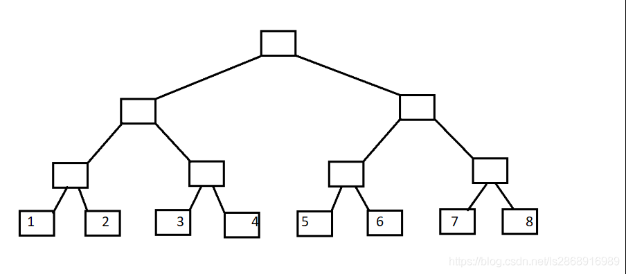
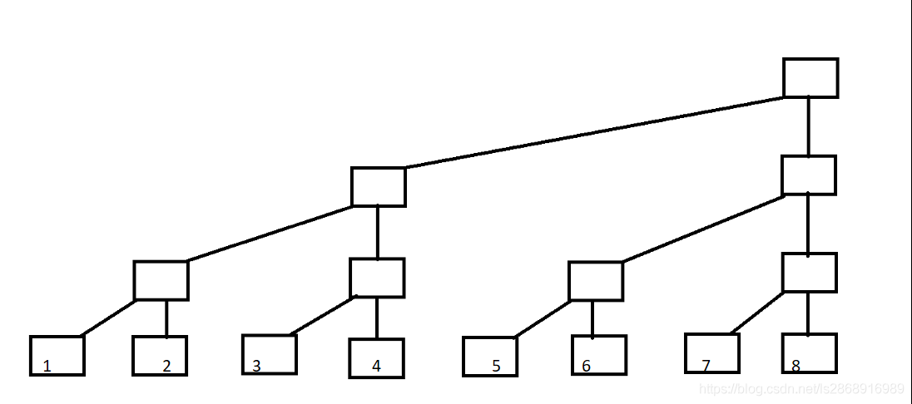
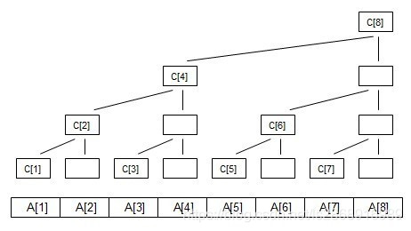

# CSDN [树状数组详解](https://blog.csdn.net/ls2868916989/article/details/119268741)

## 一、树状数组概括

树状数组是一个查询和修改复杂度都为log(n)的数据结构。主要用于数组的单点修改&&区间求和，另外一个拥有类似功能的是**线段树**。

具体区别和联系如下：

1.两者在复杂度上同级, 但是树状数组的常数明显优于线段树, 其编程复杂度也远小于线段树. 

2.树状数组的作用被**线段树**完全涵盖, 凡是可以使用树状数组解决的问题, 使用**线段树**一定可以解决, 但是**线段树**能够解决的问题树状数组未必能够解决. 

3.树状数组的突出特点是其编程的极端简洁性, 使用lowbit技术可以在很短的几步操作中完成**树状数组**的核心操作，其代码效率远高于**线段树**。

## 二、树状数组的应用


### 1.单点修改+区间查询

```c++
int lowbit(int i)
{
    return i & -i;//或者是return i-(i&(i-1));表示求数组下标二进制的非0最低位所表示的值
}
void update(int i,int val)//单点更新
{
    while(i<=n){
        C[i]+=val;
        i+=lowbit(i);//由叶子节点向上更新树状数组C，从左往右更新
    }
}
int sum(int i)//求区间[1,i]内所有元素的和
{
    int ret=0;
    while(i>0){
        ret+=C[i];//从右往左累加求和
        i-=lowbit(i);
    }
    return ret;
}

```

### 实现原理

模板中最常见的三个函数：

①取数组下标二进制非0最低位所表示的值；

②单点更新；

③区间查询。

**树状数组**，顾名思义就是树状的数组，我们首先引入二叉树，叶子节点代表$A[1]~A[8]$。





现在变形一下:



现在定义每一列的顶端节点C数组（其实C数组就是树状数组），如图：


## 理解树状数组的重点

`C[i]`代表子树的叶子节点的**权值之和**，如图可以知道：

```c++
C[1]=A[1];
C[2]=A[1]+A[2];
C[3]=A[3];
C[4]=A[1]+A[2]+A[3]+A[4];
C[5]=A[5];
C[6]=A[5]+A[6];
C[7]=A[7];
C[8]=A[1]+A[2]+A[3]+A[4]+A[5]+A[6]+A[7]+A[8];
```

首先是区间查询（求和）：

利用`C[i]`数组，求A数组中前i项和，举两个栗子：

①i=7，前7项和：`sum[7]=A[1]+A[2]+A[3]+A[4]+A[5]+A[6]+A[7]`；

而`C[4]=A[1]+A[2]+A[3]+A[4]`；`C[6]=A[5]+A[6]`；`C[7]=A[7]`；可以得到：`sum[7]=C[4]+C[6]+C[7]`。 **数组下标**写成二进制：`sum[(111)]=C[(100)]+C[(110)]+C[(111)]`；

②i=5，前5项和：`sum[5]=A[1]+A[2]+A[3]+A[4]+A[5]`；

而`C[4]=A[1]+A[2]+A[3]+A[4]；C[5]=A[5]`；可以得到：`sum[5]=C[4]+C[5]`； 数组下标写成二进制：`sum[(101)]=C[(100)]+C[(101)]`；

细细观察二进制，树状数组追其根本就是二进制的应用，结合代码演示一下代码过程：

```c++
int sum(int i) // 求区间[1,i]所有元素的和
{
    int ret = 0;
    while(i>0){
        ret += C[i]; // 从右往左区间求和
        i -= lowbit(i);
    }
    return ret;
}
```

### 代码推演

对于`i=7`进行演示：

```C++
7(111) ans+=C[7]
```


```c++
lowbit(7)=001 7-lowbit(7)=6(110) ans+=C[6] 
lowbit(6)=010 6-lowbit(6)=4(100) ans+=C[4] 
lowbit(4)=100 4-lowbit(4)=0(000) break；
```


对于`i=5`进行演示：

```c++
5(101) ans+=C[5]
```


```C++
lowbit(5)=001 5-lowbit(5)=4(100) ans+=C[4]
lowbit(4)=100 4-lowbit(4)=0(000) break；
```


## 然后单点更新：

当我们修改A数组中某个值时，应当如何更新C数组呢？回想一下，区间查询的过程，再看一下上文中列出的过程。这里声明一下：单点更新实际上是不修改A数组的，而是修改**树状数组**`C`，向上更新区间长度为`lowbit(i)`所代表的节点的值。




如图：当在`A[1]`加上值val，即更新A[1]时，需要向上更新C[1],C[2],C[4],C[8]，这个时候只需将这4个节点每个节点的值加上`val`即可。这里为了方便大家理解，人为添加了个A数组表示每个叶子节点的值，事实上A数组并不用修改，实际运用中也可不设置A数组，单点更新只需修改树状数组C即可。下标写成二进制：C[(001)],C[(010)],C[(100)],C[(1000)]；