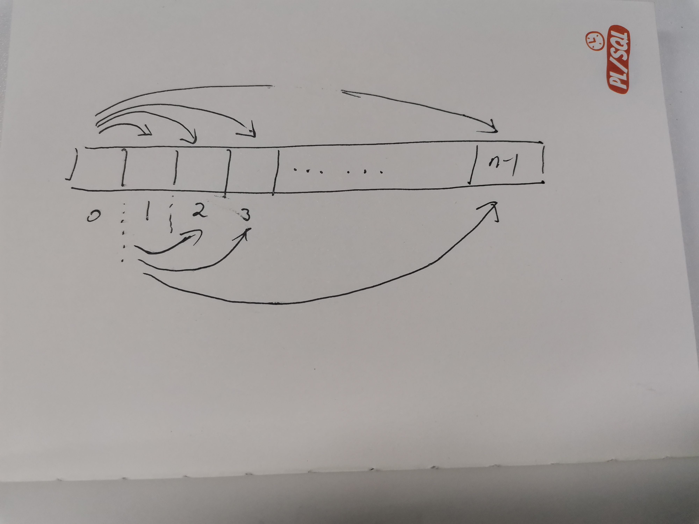

# 最大子数组和

## csdn [最大子段和的分治算法](https://blog.csdn.net/weixin_40170902/article/details/80585218)


## 问题：最大字段和

参考：[最大子段和问题：蛮力、递归及动态规划](https://blog.csdn.net/weixin_40170902/article/details/80585218)

### 问题描述

给的$n$个整数组成的序列$a_1, a_2, \dots , a_n$，求该序列形如$\sum_{k=i}^j {a_k}$的子段和的最大值。当所有整数均为负整数时，定义其最大子段和为0。依次定义，所求的最优值为：
$$
\max\{ 0, \max \limits_{1 \le i \le j \le n} \sum_{k=i}^j a_k \}
$$

> NOTE: 需要注意的是，子序列是连续的，这意味中，在遇到一个新的元素的时候，必须要将它加入到子序列中，但是可选的是将之前的子序列给抛弃掉；

### $O(n^3)$解决算法

 **思想**：从序列首元素开始穷举所有可能的子序列。 

```c++
#include<iostream>
using namespace std;
int MaxSubsequenceSum(const int array[], int n)
{
    int tempSum, maxSum;
    maxSum = 0;
    for (int i = 0;i < n;i++)       // 子序列起始位置
    {
        for (int j = i;j < n;j++)   // 子序列终止位置
        {
            tempSum = 0;    
            for (int k = i;k < j;k++)   // 子序列遍历求和
                tempSum += array[k];
            if (tempSum > maxSum)       // 更新最大和值
                maxSum = tempSum;
        }
    }
    return maxSum;
}

int main()
{
    const int a[] = { 4, -3, 5, -2, -1, 2, 6, -2 };
    int maxSubSum = MaxSubsequenceSum(a, 8);
    cout << "The max subsequence sum of a is: " << maxSubSum << endl;
    system("pause");
    return 0;
}

```


### $O(n^2)$解决算法

 思想：直接在划定子序列时累加元素值，减少一层循环。 

````c++
#include<iostream>
using namespace std;
int MaxSubsequenceSum(const int array[],int n)
{
    int tempSum, maxSum;
    maxSum = 0;
    for (int i = 0;i < n;i++)
    {
        tempSum = 0;
        for (int j = i;j < n;j++)
        {
            tempSum += array[j];
            if (tempSum > maxSum)
                maxSum = tempSum;
        }
    }
    return maxSum;
}

int main()
{
    const int a[] = { 4, -3, 5, -2, -1, 2, 6, -2 };
    int maxSubSum = MaxSubsequenceSum(a, 8);
    cout << "The max subsequence sum of a is: " << maxSubSum << endl;
    system("pause");
    return 0;
}

````

> NOTE: 
>
> 一、计算 `sum([i, j])` 即从 `i` 到 `j` 的子数组的和；
>
> 从上述实现来看，由于它计算的是sum，并且序列是不断地扩展的
>
> 显然: 
>
> ```
> sum( [ i, j ] ) = sum( [ i, j - 1] ) + array[ j ]
> ```
>
> 显然，这是典型的原问题 和 子问题，通过 `tempSum` 来保存子问题 `sum( [ i, j - 1] )`
>
> 这是非常典型的动态规划思想、以空间换时间
>
> 它的计算次序如下:
>
> 
>
> 二、一种错误的写法
>
> ```c++
> #include <string>
> #include <vector>
> #include <stack>
> #include <unordered_map>
> #include <algorithm>
> #include <random>
> #include <iostream>
> #include <stdexcept>
> #include <cstdlib>
> #include <ctime>
> using namespace std;
> 
> class Solution {
> public:
> 	int subarraySum(vector<int>& nums, int k) {
> 		int N = nums.size();
> 		int res = 0;
> 		for (int end = 0; end < N; ++end) {
> 			int sum = 0;
> 			for (int start = 0; start <= end; ++start) {
> 				sum = nums[start] + sum;
> 				if (sum == k) {
> 					++res;
> 				}
> 			}
> 		}
> 		return res;
> 	}
> };
> 
> 
> int main()
> {
> 	Solution s;
> 	vector<int> nums{ 1,2,3,4 };
> 	int k = 5;
> 	cout<<s.subarraySum(nums, k)<<endl;
> }
> 
> // g++ test.cpp --std=c++11 -pedantic -Wall -Wextra -Werror
> 
> ```
>
> 这是在做 [LeetCode-560. 和为 K 的子数组](https://leetcode.cn/problems/subarray-sum-equals-k/) 的时候，我写的一个非常典型的错误的代码，上述程序预期的输出应该是1，但是实际的输出是0。
>
> 上述程序实际执行的是:
>
> ```C++
> 0
> 0, 01
> 0, 01, 012
> 0, 01, 012, 0123
> 0, 01, 012, 0123, 01234
> 0, 01, 012, 0123, 01234, 012345
> ```
>
> 

### $O(n \log n)$解决算法-二分法


### $O(n)$算法-动态规划法

若记$b[j]=\max \limits_{1 \le i \le j} \{ \sum_{k=i}^{j} a[k] \}, 1 \le j \le n$，则所求的最大子段和为
$$
\max \limits_{1 \le i \le j \le n} \sum_{k=i}^j a[k] =  \max \limits_{1 \le j \le n} \max \limits_{1 \le i \le j } \sum_{k=i}^j a[k] = \max \limits_{1 \le j \le n} b[j]
$$
由$b[j]$的定义可知，当$b[j-1] \gt 0 $时，$b[j] = b[j-1] + a[j]$，否则 $b[j] = a[j]$。由此可知计算$b[j]$的动态规划递归式：
$$
b[j] = \max\{b[j-1] + a[j], a[j] \}, 1 \le j \le n
$$

> NOTE: 
>
> 一、递归关系$b[j] = b[j-1] + a[j]$与最长公共子序列的非常类似；$b[j]$的计算仅仅依赖于$b[j-1]$，就如  [Fibonacci sequence](https://en.wikipedia.org/wiki/Fibonacci_sequence) 的计算仅仅依赖于前两项一样；
>
> 二、正如在 [画解算法：53. 最大子序和](https://leetcode.cn/problems/maximum-subarray/solution/hua-jie-suan-fa-53-zui-da-zi-xu-he-by-guanpengchn/) 中所说的：
>
> 1、$b[j-1] \gt 0 $ 说明 $b[j-1]$对结果有增益效果，则 $b[j-1]$保留并加上当前遍历数字 
>
> 2、如果$b[j-1] \le 0$则说明它对结果并没有增益，需要舍弃， 则 $b[j]$ 直接更新为当前遍历数字 
>
> 三、它的非压缩版本的写法如下:
>
> ```c++
> class Solution
> {
> public:
> /**
>    * @brief 整体思路是穷举以nums[i]结尾的最大子数组和然后将这些子数组和打擂台选择出最优值
>    *
>    * @param nums
>    * @return int
>    */
>   int maxSubArray(vector<int> &nums)
>   {
>     vector<int> dp(nums.size()); //以nums[i]结尾的最大子数组和
>     dp[0] = nums[0];             // base case
>     for (int i = 1; i < nums.size(); ++i)
>     {
>       if (dp[i - 1] + nums[i] > nums[i]) // 有增益则与前面的相连
>       {
>         dp[i] = nums[i] + dp[i - 1];
>       }
>       else
>       {
>         dp[i] = nums[i]; // 自成一家
>       }
>     }
>     return *std::max_element(dp.begin(), dp.end()); // 取出最大值
>   }
> };
> ```
>
> 

据此，可设计出求最大子段和的动态规划算法如下：

```c++
int MaxSum(int n, int *a){
	int sum = 0, b= 0;
    int start = 0, end = 0;//记录下子序列的起始和终止位置
    for(int i=1; i <= n; ++i){
        if(b>0) b+=a[i];
        else {
            b=a[i];
            start = i;
        }
        if(b>sum) {	
            sum=b;
            end = i;
        }
    }
}
```

在 csdn [最大子段和问题：蛮力、递归及动态规划](https://blog.csdn.net/weixin_40170902/article/details/80585218) 中给出的程序是这样的：

```c++
#include<iostream>
using namespace std;

int MaxSubsequenceSum(const int A[], int n)
{
    int tempSum = 0;
    int maxSum = 0;
    for (int j = 0;j < n;j++)   // 子问题后边界
    {
        tempSum = (tempSum + A[j]) > A[j] ? (tempSum + A[j]) : A[j];
        if (tempSum > maxSum)   // 更新最大和
            maxSum = tempSum;

    }
    return maxSum;
}

int main()
{
    const int a[] = { 4, -3, 5, -2, -1, 2, 6, -2 };
    int maxSubSum = MaxSubsequenceSum(a, 8);
    cout << "The max subsequence sum of a is: " << maxSubSum << endl;
    system("pause");
    return 0;
}

```

这种实现和上面的那种实现是完全不同的；


## draft: 源代码

```C++
//此算法应用迭代法求最大子段和
Int MaxSum(int *a,int n,int &besti,int & bestj)
{
   int sum=0;
   for(int i=0;i<n;i++)//i和j是子段的起始下标和终止下标
     for(int j=i;j<n;j++)
     {
        int thissum=0;
        for(int k=i;k<=j)thissum+=a[k];
        if(thissum>sum){
          sum=thissum;
          besti=i;
          bestj=j;
　　　}
　　　return sum;
}

```

