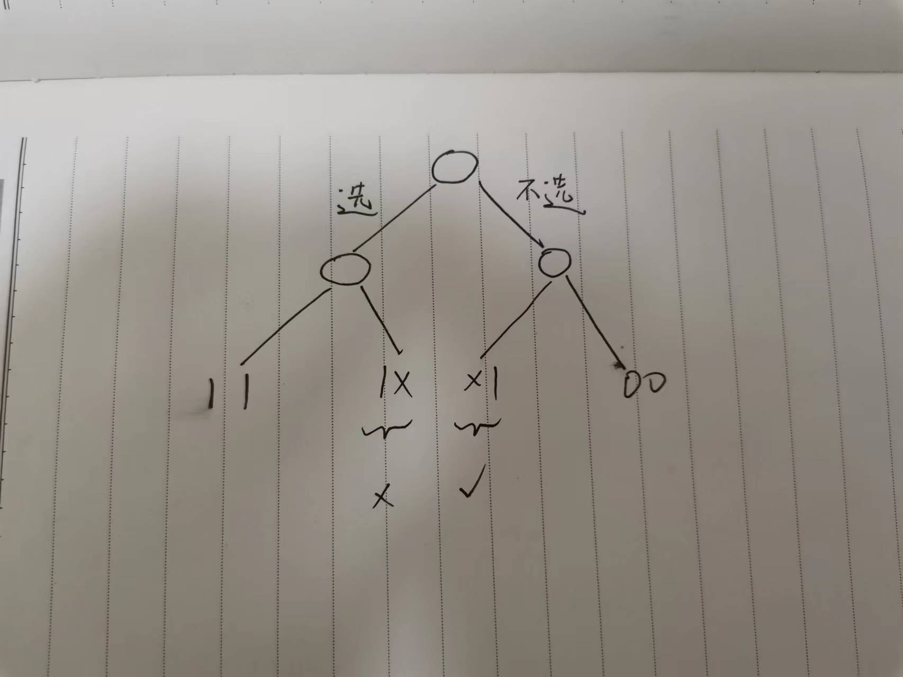
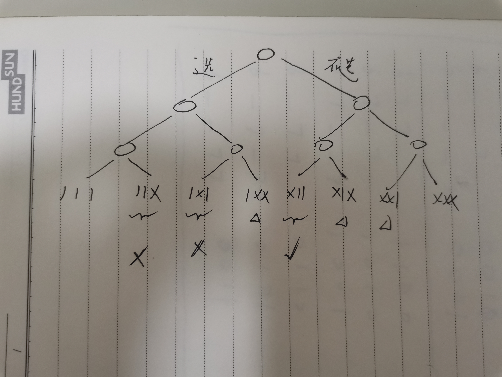

# [LeetCode-491. 递增子序列](https://leetcode.cn/problems/increasing-subsequences/) 中等


## 我的解题-一次错误的解题记录

这道题其实和 [LeetCode-90. 子集 II](https://leetcode.cn/problems/subsets-ii/) 非常类似，它在那道题的基础上增加了一个递增子序列而已。


```c++

class Solution
{
public:
  vector<vector<int>> findSubsequences(vector<int> &nums)
  {
    // sort(nums.begin(), nums.end());
    vector<vector<int>> res;
    vector<int> tmp;
    int N = nums.size();
    for (int mask = 0; mask < (1 << N); ++mask)
    {
      bool good = true;
      tmp.clear();
      for (int i = 0; i < N; ++i)
      {
        if (mask & (1 << i))
        {
          if (i > 0 && (nums[i] == nums[i - 1]) && ((mask & (1 << (i - 1))) == 0))
          {
            good = false;
            break;
          }
          if (tmp.size() == 0)
          {
            tmp.push_back(nums[i]);
          }
          else if (nums[i] >= tmp.back())
          {
            tmp.push_back(nums[i]);
          }
          else
          {
            good = false;
            break;
          }
        }
      }
      if (good && tmp.size() >= 2)
      {

        res.push_back(tmp);
      }
    }
    return res;
  }
};

```

上述算法是仿照 [LeetCode-90. 子集 II](https://leetcode.cn/problems/subsets-ii/) 写的，它在如下用例执行失败：

```c++
输入：
[1,2,3,4,5,6,7,8,9,10,1,1,1,1,1]
```

显然，它身边的原因是：重复元素1没有在一起，而这道题要求的是递增子序列，因此需要保持元素的相对位置不变，所以不能够先排序，所以上述算法无法应用到这一题。


## [LeetCode-官方解题](https://leetcode.cn/problems/increasing-subsequences/solution/di-zeng-zi-xu-lie-by-leetcode-solution/)

> NOTE:
>
> 面试的时候，更容易写出的是"方法二：递归枚举 + 减枝"，因为"方法一：二进制枚举 + 哈希"中的hash是难以写出的

### 方法一：二进制枚举 + 哈希

> NOTE:
>
> 由于这道题的结果是顺序相关的，因此不能够先排序然后将重复的元素放到一起然后使用类似于 [LeetCode-90. 子集 II](https://leetcode.cn/problems/subsets-ii/) 的方法，所以需要该换另外一种去重的方法，这种方法使用的是Rabin-Karp hash来快速去重

### 方法二：递归枚举 + 减枝

> NOTE: 
>
> 典型的子集树

我们也可以用递归的方法实现二进制枚举，像「方法一」那样枚举出所有的子序列，然后判断是否合法。直接把方法一变成递归形式，我们可以得到这样的代码：


```C++
class Solution
{
	vector<vector<int>> ans;
	vector<int> temp;
public:
	void dfs(int cur, vector<int> &nums)
	{
		if (cur == nums.size())
		{
			// 判断是否合法，如果合法判断是否重复，将满足条件的加入答案
			if (isValid() && notVisited())
			{
				ans.push_back(temp);
			}
			return;
		}
		// 如果选择当前元素
		temp.push_back(nums[cur]);
		dfs(cur + 1, nums);
		temp.pop_back();
		// 如果不选择当前元素
		dfs(cur + 1, nums);
	}
};
```

这是一个递归枚举子序列的通用模板，即用一个临时数组 $\rm temp$ 来保存当前选出的子序列，使用 $\rm cur$ 来表示当前位置的下标，在 `dfs(cur, nums)` 开始之前，$[0, {\rm cur} - 1]$ 这个区间内的所有元素都已经被考虑过，而 $[{\rm cur}, n]$ 这个区间内的元素还未被考虑。在执行 `dfs(cur, nums)` 时，我们考虑 ${\rm cur}$ 这个位置选或者不选，如果选择当前元素，那么把当前元素加入到 $\rm temp$ 中，然后递归下一个位置，在递归结束后，应当把 $\rm temp$ 的最后一个元素删除进行回溯；如果不选当前的元素，直接递归下一个位置。

当然，如果我们简单地这样枚举，对于每一个子序列，我们还需要做一次 $O(n)$ 的合法性检查和哈希判重复，在执行整个程序的过程中，我们还需要使用一个空间代价 $O(2^n)$ 的哈希表来维护已经出现的子序列的哈希值。我们可以对选择和不选择做一些简单的限定，就可以让枚举出来的都是合法的并且不重复：

一、使序列合法的办法非常简单，即给「选择」做一个限定条件，只有当前的元素大于等于上一个选择的元素的时候才能选择这个元素，这样枚举出来的所有元素都是合法的

二、那如何保证没有重复呢？我们需要给「不选择」做一个限定条件，只有当当前的元素不等于上一个选择的元素的时候，才考虑不选择当前元素，直接递归后面的元素。因为如果有两个相同的元素，我们会考虑这样四种情况：

1、前者被选择，后者被选择

2、前者被选择，后者不被选择（10）

3、前者不被选择，后者被选择（01）

4、前者不被选择，后者不被选择

其中第二种情况和第三种情况其实是等价的，我们这样限制之后，舍弃了第二种，保留了第三种，于是达到了去重的目的。

```c++
// #include <bits/stdc++.h>
#include <iostream>
#include <string>
#include <algorithm>
#include <vector>
#include <bitset>
#include <map>
#include <list>
#include <stack>
#include <unordered_map>
#include <unordered_set>
#include <queue>
#include <deque>
#include <cmath>
#include <numeric>
#include <climits>
#include <random>
// example1.cpp
// new-delete-type-mismatch error
#include <memory>
#include <vector>
using namespace std;

class Solution
{
public:
  vector<int> temp;
  vector<vector<int>> ans;

  /**
   * @brief last表示上一个被选中加入到集合的元素，它的初始值是INT_MIN
   *
   * @param cur
   * @param last
   * @param nums
   */
  void dfs(int cur, int last, vector<int> &nums)
  {
    if (cur == nums.size())
    {
      if (temp.size() >= 2)
      {
        ans.push_back(temp);
      }
      return;
    }
    // 选择当前元素
    if (nums[cur] >= last) //这里是递增子序列的剪枝
    {
      temp.push_back(nums[cur]);
      dfs(cur + 1, nums[cur], nums); // 选择了nums[cur]，因此使用它来替代last
      temp.pop_back();
    }
    // 不选择当前元素
    // 比如last是1，nums[cur]也是1，那么下面的判定条件就不满足
    if (nums[cur] != last) // 这里是去重剪枝
    {
      dfs(cur + 1, last, nums); // 这里没有选择nums[cur]，因此last保持不变
    }
  }

  vector<vector<int>> findSubsequences(vector<int> &nums)
  {
    dfs(0, INT_MIN, nums);
    return ans;
  }
};

// Driver code
int main()
{

  Solution solu;
  vector<int> prices{7, 1, 5, 3, 6, 4};
  return 0;
}
// g++ test.cpp --std=c++11 -pedantic -Wall -Wextra

```

> NOTE:
>
> 一、相比于 [LeetCode-90. 子集 II](https://leetcode.cn/problems/subsets-ii/) ，上述算法并不要求重复元素在一起，上述算法中的`last`为上一个选中的元素，这是一种子序列的做法，它并不要求元素是相邻的
>
> 二、上面展示了DFS的一个技巧: last + prev，它通过这个技巧来实现对上一个选取的元素和当前元素的比较
>
> 三、上述程序其实是在普通的DFS+backtrack的基础上增加了剪枝，它的特殊之处在于它为两个分支都增加了剪枝条件。
>
> 为了便于理解上述程序的运行逻辑，下面是图示：
>
> 1、两个节点
>
> 
>
> 2、三个节点
>
> 
>
> 显然所有的10模式都被剪枝掉了，只留下了01模式。

