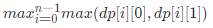

# LeetCode 最大连续1的个数


| 题目                                                         |         | 算法     |
| ------------------------------------------------------------ | ------- | -------- |
| [LeetCode-485. 最大连续 1 的个数-简单](https://leetcode.cn/problems/max-consecutive-ones/) | 不翻转  |          |
| [LeetCode-487. 最大连续1的个数 II-中等](https://leetcode.cn/problems/max-consecutive-ones-ii/) | 翻转1个 | 动态规划 |
| [LeetCode-1004. 最大连续1的个数 III-中等](https://leetcode.cn/problems/max-consecutive-ones-iii/) | 翻转K个 | 滑动窗口 |

- 这三道题是 LeetCode 典型的出题套路
- 连续1的个数，显然要么连在一起要么自成一派
- TODO: [LeetCode-487. 最大连续1的个数 II-中等](https://leetcode.cn/problems/max-consecutive-ones-ii/) 能否使用和 [LeetCode-1004. 最大连续1的个数 III-中等](https://leetcode.cn/problems/max-consecutive-ones-iii/) 相同的sliding window算法？我觉得应该是可以的

## [LeetCode-485. 最大连续 1 的个数-简单](https://leetcode.cn/problems/max-consecutive-ones/) 


### Python

```python
from typing import *

class Solution:
    def findMaxConsecutiveOnes(self, nums: List[int]) -> int:
        ans = 0
        cnt = 0  # 连续1的个数
        for num in nums:
            if num == 0:  # 一旦发现0，则肯定不再连续，将cnt设置为0
                cnt = 0
            else:
                cnt += 1
                ans = max(ans, cnt)  # 更新答案
        return ans

```


### C++

```c++
#include <vector>
#include <algorithm>
using namespace std;

class Solution
{
public:
    int findMaxConsecutiveOnes(vector<int> &nums)
    {
        int cnt = 0, ans = 0;
        for (auto &&num : nums)
        {
            if (num == 0)
            {
                cnt = 0;
            }
            else
            {
                ++cnt;
                ans = std::max(ans, cnt);
            }
        }
        return ans;
    }
};

int main()
{
    Solution s;
}

// g++ test.cpp --std=c++11 -pedantic -Wall -Wextra -Werror

```


## [LeetCode-487. 最大连续1的个数 II](https://leetcode.cn/problems/max-consecutive-ones-ii/) 

给定一个二进制数组 `nums` ，如果最多可以翻转一个 `0` ，则返回数组中连续 `1` 的最大个数。

**示例 1：**

```
输入：nums = [1,0,1,1,0]
输出：4
解释：翻转第一个 0 可以得到最长的连续 1。
     当翻转以后，最大连续 1 的个数为 4。
```

**示例 2:**

```
输入：nums = [1,0,1,1,0,1]
输出：4
```

**进阶：**如果输入的数字是作为 **无限流** 逐个输入如何处理？换句话说，内存不能存储下所有从流中输入的数字。您可以有效地解决吗？

> NOTE: 
>
> 典型的无限流问题

### 解法一: 中心扩散法

一、思路比较简单，碰到0，就把它调整为1，然后left、right双指针向两边扩展统计相邻1的个数。

二、这道题是前面题 [LeetCode-485. 最大连续 1 的个数-简单](https://leetcode.cn/problems/max-consecutive-ones/) 的扩展，它包含前面题的代码，为什么这样说呢？下面的用例就是典型的情况:

```C++
1
```

对于这个用例，它应该返回为1,，这种情况是不需要翻转的。

### 完整代码

```C++
#include <string>
#include <vector>
#include <stack>
#include <unordered_map>
#include <algorithm>
#include <random>
#include <iostream>
#include <stdexcept>
#include <cstdlib>
#include <ctime>
using namespace std;

class Solution {
public:
	int findMaxConsecutiveOnes(vector<int>& nums) {
		int N = nums.size();
		int res = 0;
		int noFanZhuanCount = 0; // 不翻转的个数
		for (int i = 0; i < N; ++i) {
			if (nums[i] == 0) {
				noFanZhuanCount = 0;
				int fanZhuanCount = 1;
				for (int left = i - 1; left >= 0; --left) {
					if (nums[left] == 1) {
						++fanZhuanCount;
					}
					else {
						break;
					}
				}
				for (int right = i + 1; right < N; ++right) {
					if (nums[right] == 1) {
						++fanZhuanCount;
					}
					else {
						break;
					}
				}
				res = fanZhuanCount > res ? fanZhuanCount : res;
			}
			else {
				++noFanZhuanCount;
				res = noFanZhuanCount > res ? noFanZhuanCount : res;
			}
		}
		return res;
	}
};

int main()
{
	Solution s;
}

// g++ test.cpp --std=c++11 -pedantic -Wall -Wextra -Werror

```

### [力扣官方题解](https://leetcode.cn/u/leetcode-solution/) # [方法一：预处理 + 枚举](https://leetcode.cn/problems/max-consecutive-ones-ii/solution/zui-da-lian-xu-1de-ge-shu-ii-by-leetcode-solution/)


### [力扣官方题解](https://leetcode.cn/u/leetcode-solution/) # [方法二：动态规划](https://leetcode.cn/problems/max-consecutive-ones-ii/solution/zui-da-lian-xu-1de-ge-shu-ii-by-leetcode-solution/) 

方法一其实没有办法解决进阶问题：**如果输入的数字是作为无限流逐个输入如何处理？换句话说，内存不能存储下所有从流中输入的数字。您可以有效地解决吗？** 因为它需要预先知道所有的数，而我们如果用**动态规划**则可以有效解决进阶问题。

定义: 

1、 `dp[i][0]` 为考虑到以 `i` 为结尾未使用操作将 `[0,i]`某个 `0` 变成 `1` 的最大的连续 `1` 的个数

2、`dp[i][1]` 为考虑到以 `i` 为结尾使用操作将 `[0,i]` 某个 `0` 变成 `1` 的最大的连续 `1` 的个数

则我们可以列出转移式：


解释一下:

一、针对 `dp[i][0]` :

1、如果当前位置是 `0` ，由于未使用操作，所以肯定是 `0`

2、如果是 `1`，则从前一个位置未使用操作的状态转移过来即可

二、针对 `dp[i][1]`:

1、如果当前位置是 `0` ，则我们操作肯定是要用在这个位置，把它变成 `1`，所以只能从前一个未使用过操作的状态转移过来

2、如果是 `1` ，则从前一个已经使用过操作的状态转移过来

最后答案就是。

到这里其实还并不能解决进阶问题，因为开 `dp` 数组仍然需要提前知道数组的大小，但是我们注意到每次**转移**只与**前一个位置**有关，所以我们并不需要开数组，只需要额外两个变量记录一下前一个位置的两个状态即可，这样我们就可以有效解决进阶的问题。

#### 压缩变量

##### Python


##### C++

```C++
#include <vector>
#include <algorithm>
using namespace std;

class Solution
{
public:
    int findMaxConsecutiveOnes(vector<int> &nums)
    {
        int ans = 0, dp0 = 0, dp1 = 0;
        for (auto &&num : nums)
        {
            if (num != 0)
            {
                dp1++;
                dp0++;
            }
            else
            {
                // 需要注意: 先使用dp0，然后再更新dp0；
                // 如果顺序错误，则最终的结果也是错误的
                dp1 = dp0 + 1;
                dp0 = 0;
            }
            ans = max(ans, max(dp0, dp1));
        }
        return ans;
    }
};

int main()
{
    Solution s;
}

// g++ test.cpp --std=c++11 -pedantic -Wall -Wextra -Werror

```

#### 未压缩变量

[【python3】动态规划](https://leetcode.cn/problems/max-consecutive-ones-ii/solution/python3-dong-tai-gui-hua-by-caiji-ud-awny/)


```python
class Solution:
    def findMaxConsecutiveOnes(self, nums: List[int]) -> int:
        n = len(nums)
        dp = [[0,0] for _ in range(n+1)]
        res = 0
        for i in range(1,n+1):
            if nums[i-1] == 1:
                dp[i][0] = dp[i-1][0]+1
                dp[i][1] = dp[i-1][1]+1
            else:
                dp[i][0] = 0 
                dp[i][1] = dp[i-1][0]+1
            res = max(res,dp[i][0],dp[i][1])
        return res

```


## [LeetCode-1004. 最大连续1的个数 III-中等](https://leetcode.cn/problems/max-consecutive-ones-iii/)


### Sliding window

要求最大连续1的个数，并且允许翻转K 个0 为 1，显然贪心的思想就是将它们全部都翻转为1即可

[负雪明烛](https://leetcode.cn/u/fuxuemingzhu/) # [分享滑动窗口模板，秒杀滑动窗口问题](https://leetcode.cn/problems/max-consecutive-ones-iii/solution/fen-xiang-hua-dong-chuang-kou-mo-ban-mia-f76z/)

> 重点：题意转换。把「最多可以把 K 个 0 变成 1，求仅包含 1 的最长子数组的长度」转换为 「找出一个最长的子数组，该子数组内最多允许有 K 个 0 」。
>
> 经过上面的题意转换，我们可知本题是求**最大连续子区间**，可以使用**滑动窗口**方法。**滑动窗口**的限制条件是：窗口内最多有 K 个 0。

"最大连续子区间"是这道题的点题之语。

#### Python

```python

class Solution:
    def longestOnes(self, nums: List[int], k: int) -> int:
        left, right = 0, 0
        ans = 0
        window_stat = 0
        while right < len(nums):
            if nums[right] == 0:
                window_stat += 1
            right += 1
            while window_stat > k:
                if nums[left] == 0:
                    window_stat -= 1
                left += 1
            ans = max(ans, right - left)
        return ans

```


#### C++

```C++
// #include <bits/stdc++.h>
#include <algorithm>
#include <vector>
using namespace std;

class Solution
{
public:
    int longestOnes(vector<int> &A, int K)
    {
        int res = 0;   // 结果
        int zeros = 0; // 区间中0的个数

        int left = 0, right = 0;
        while (right < A.size()) // 将元素移入区间
        {
            if (A[right] == 0)
            {
                ++zeros;
            }
            ++right;
            while (zeros > K) // 这个while循环一定要放在后面的打擂台择优之前，它保证窗口内最多有K个0
            {
                if (A[left++] == 0) // 需要注意的是: A[left++] 相对于 A[left]; left = left + 1
                {                   // 它相当于将A[left]移出区间，显然之后left就需要自增1
                    --zeros;
                }
            }
            res = max(res, right - left); // 打擂台择优
        }
        return res;
    }
};

int main()
{
    vector<int> nums{1, 1, 1, 0, 0, 0, 1, 1, 1, 1, 0};
    int K = 2;
    Solution s;

    s.longestOnes(nums, K);
}
// g++ test.cpp --std=c++11 -pedantic -Wall -Wextra

```

上述code非常好地展示了移入移出区间的过程
