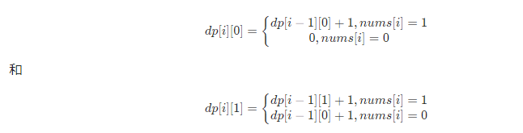

# LeetCode [487. 最大连续1的个数 II](https://leetcode-cn.com/problems/max-consecutive-ones-ii/)

给定一个二进制数组 `nums` ，如果最多可以翻转一个 `0` ，则返回数组中连续 `1` 的最大个数。

**示例 1：**

```
输入：nums = [1,0,1,1,0]
输出：4
解释：翻转第一个 0 可以得到最长的连续 1。
     当翻转以后，最大连续 1 的个数为 4。
```

**示例 2:**

```
输入：nums = [1,0,1,1,0,1]
输出：4
```

**进阶：**如果输入的数字是作为 **无限流** 逐个输入如何处理？换句话说，内存不能存储下所有从流中输入的数字。您可以有效地解决吗？

> NOTE: 
>
> 典型的无限流问题

## 我的解题

一、思路比较简单，碰到0，就把它调整为1，然后left、right双指针向两边扩展统计相邻1的个数。

二、这道题是前面题 [485. 最大连续 1 的个数](https://leetcode-cn.com/problems/max-consecutive-ones/) 的扩展，它包含前面题的代码，为什么这样说呢？下面的用例就是典型的情况:

```C++
1
```

对于这个用例，它应该返回为1,，这种情况是不需要翻转的。

### 完整代码

```C++
#include <string>
#include <vector>
#include <stack>
#include <unordered_map>
#include <algorithm>
#include <random>
#include <iostream>
#include <stdexcept>
#include <cstdlib>
#include <ctime>
using namespace std;

class Solution {
public:
	int findMaxConsecutiveOnes(vector<int>& nums) {
		int N = nums.size();
		int res = 0;
		int noFanZhuanCount = 0; // 不翻转的个数
		for (int i = 0; i < N; ++i) {
			if (nums[i] == 0) {
				noFanZhuanCount = 0;
				int fanZhuanCount = 1;
				for (int left = i - 1; left >= 0; --left) {
					if (nums[left] == 1) {
						++fanZhuanCount;
					}
					else {
						break;
					}
				}
				for (int right = i + 1; right < N; ++right) {
					if (nums[right] == 1) {
						++fanZhuanCount;
					}
					else {
						break;
					}
				}
				res = fanZhuanCount > res ? fanZhuanCount : res;
			}
			else {
				++noFanZhuanCount;
				res = noFanZhuanCount > res ? noFanZhuanCount : res;
			}
		}
		return res;
	}
};

int main()
{
	Solution s;
}

// g++ test.cpp --std=c++11 -pedantic -Wall -Wextra -Werror

```

## [力扣官方题解](https://leetcode-cn.com/u/leetcode-solution/) # [方法一：预处理 + 枚举](https://leetcode-cn.com/problems/max-consecutive-ones-ii/solution/zui-da-lian-xu-1de-ge-shu-ii-by-leetcode-solution/)


## [力扣官方题解](https://leetcode-cn.com/u/leetcode-solution/) # [方法二：动态规划](https://leetcode-cn.com/problems/max-consecutive-ones-ii/solution/zui-da-lian-xu-1de-ge-shu-ii-by-leetcode-solution/)

方法一其实没有办法解决进阶问题：**如果输入的数字是作为无限流逐个输入如何处理？换句话说，内存不能存储下所有从流中输入的数字。您可以有效地解决吗？** 因为它需要预先知道所有的数，而我们如果用**动态规划**则可以有效解决进阶问题。

定义: 

1、 `dp[i][0]` 为考虑到以 `i` 为结尾未使用操作将 `[0,i]`某个 `0` 变成 `1` 的最大的连续 `1` 的个数

2、`dp[i][1]` 为考虑到以 `i` 为结尾使用操作将 `[0,i]` 某个 `0` 变成 `1` 的最大的连续 `1` 的个数

则我们可以列出转移式：



解释一下:

一、针对 `dp[i][0]` :

1、如果当前位置是 `0` ，由于未使用操作，所以肯定是 `0`

2、如果是 `1`，则从前一个位置未使用操作的状态转移过来即可

二、针对 `dp[i][1]`:

1、如果当前位置是 `0` ，则我们操作肯定是要用在这个位置，把它变成 `1`，所以只能从前一个未使用过操作的状态转移过来

2、如果是 `1` ，则从前一个已经使用过操作的状态转移过来

最后答案就是。

到这里其实还并不能解决进阶问题，因为开 `dp` 数组仍然需要提前知道数组的大小，但是我们注意到每次**转移**只与**前一个位置**有关，所以我们并不需要开数组，只需要额外两个变量记录一下前一个位置的两个状态即可，这样我们就可以有效解决进阶的问题。

```C++
#include <string>
#include <vector>
#include <stack>
#include <unordered_map>
#include <algorithm>
#include <random>
#include <iostream>
#include <stdexcept>
#include <cstdlib>
#include <ctime>
using namespace std;

class Solution {
public:
	int findMaxConsecutiveOnes(vector<int>& nums) {
		int n = (int)nums.size(), ans = 0, dp0 = 0, dp1 = 0;
		for (int i = 0; i < n; ++i) {
			if (nums[i]) {
				dp1++;
				dp0++;
			}
			else {
				dp1 = dp0 + 1;
				dp0 = 0;
			}
			ans = max(ans, max(dp0, dp1));
		}
		return ans;
	}
};


int main()
{
	Solution s;
}

// g++ test.cpp --std=c++11 -pedantic -Wall -Wextra -Werror

```

