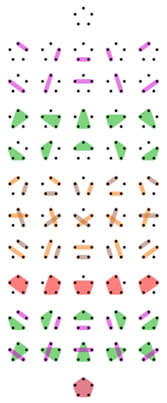

# Partition of a set

## wikipedia [Partition of a set](https://en.wikipedia.org/wiki/Partition_of_a_set)

> NOTE: 
>
> 1、这篇文章进行了系统的分析

The [52](https://en.wikipedia.org/wiki/Bell_number) partitions of a set with 5 elements. A colored region indicates a subset of X, forming a member of the enclosing partition. Uncolored dots indicate single-element subsets. The first shown partition contains five single-element subsets; the last partition contains one subset having five elements.

> NOTE: 
>
> 1、上述其实就是[bell number](https://en.wikipedia.org/wiki/Bell_number)

### Counting partitions

#### The number of noncrossing partitions

The number of noncrossing partitions of an *n*-element set is the [Catalan number](https://en.wikipedia.org/wiki/Catalan_number) *Cn*.

