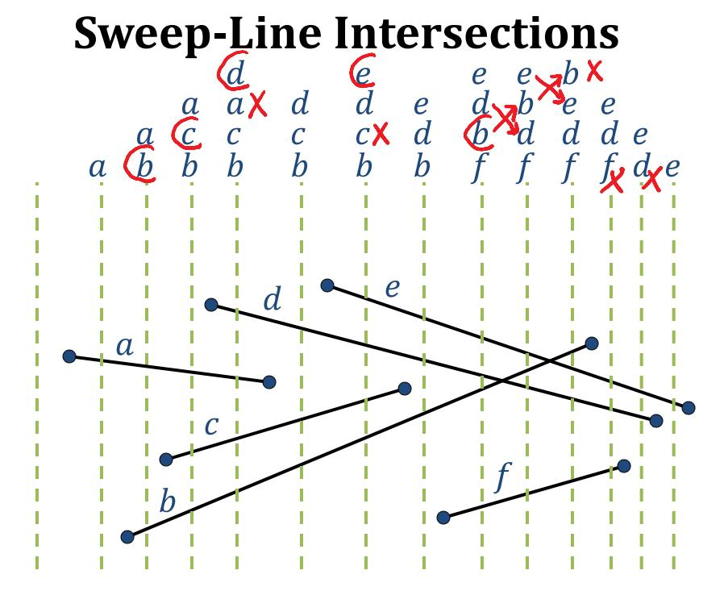
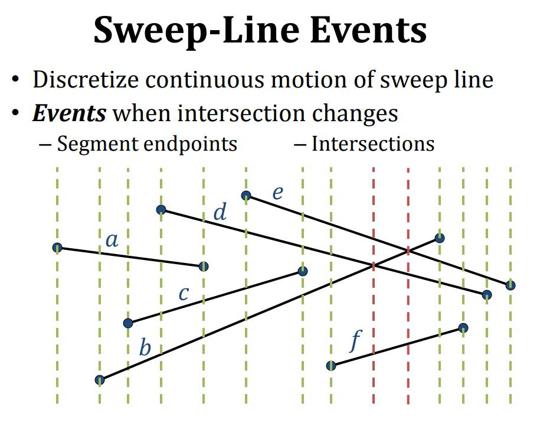
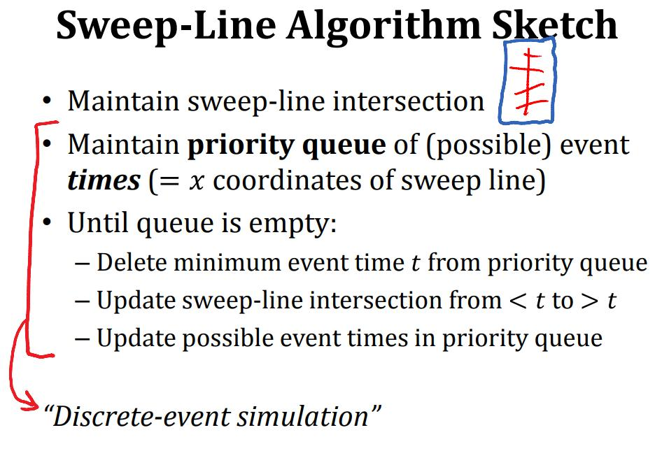
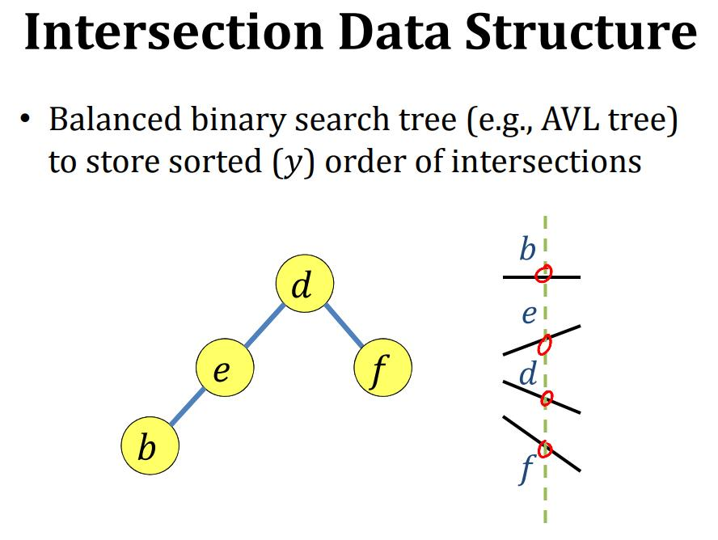
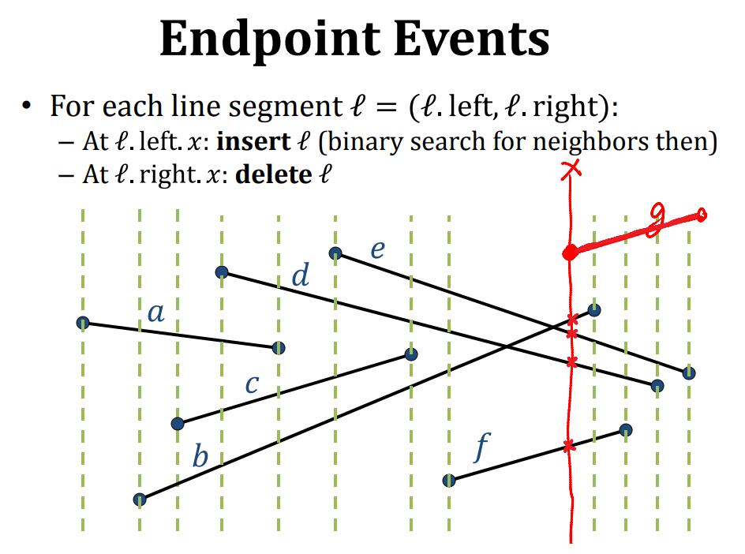
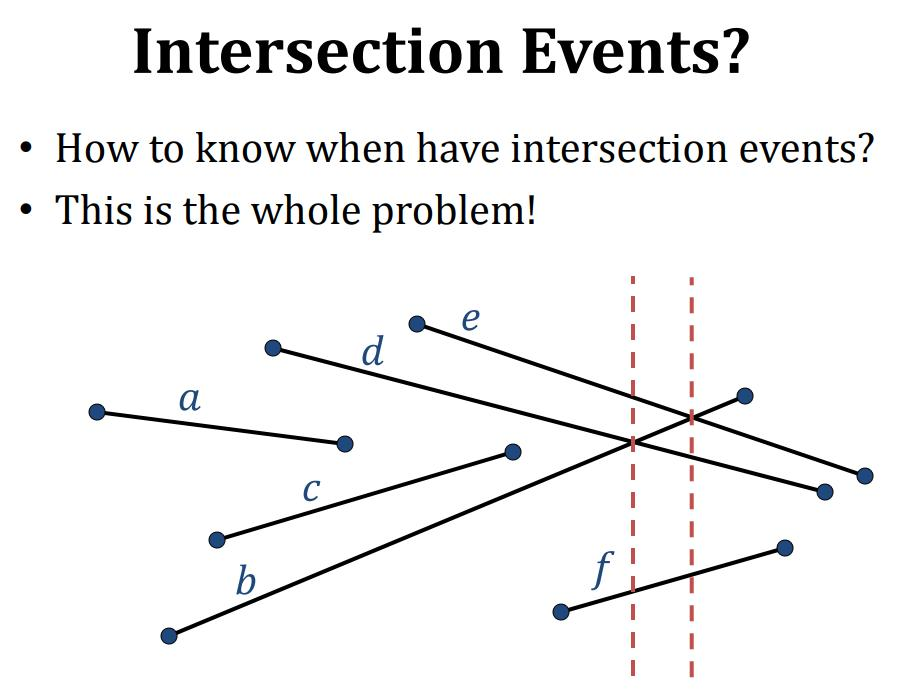
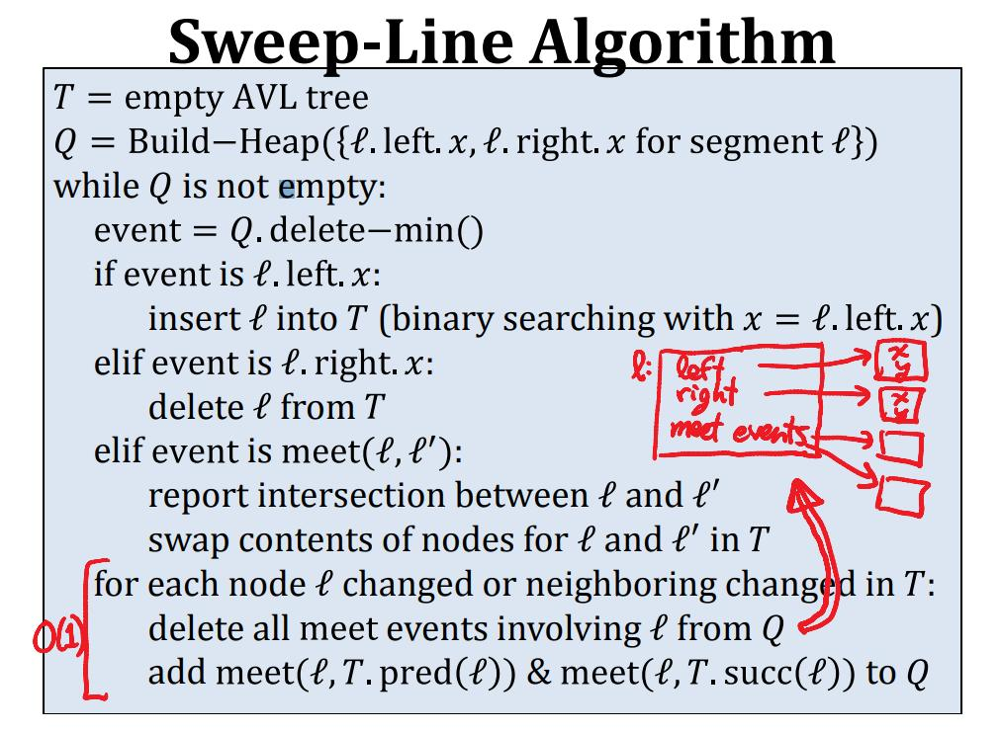

# Sweep Line Algorithm

## 导读

对这个算法的思想解释地最好的是 csail.mit.edu [6.006 Introduction to Algorithms](http://courses.csail.mit.edu/6.006/spring11/lectures/lec24.pdf) ，比较遗憾的是，其中没有完整的source code，在 geeksforgeeks [Given n line segments, find if any two segments intersect](https://www.geeksforgeeks.org/given-a-set-of-line-segments-find-if-any-two-segments-intersect/) 中对这个算法的实现细节进行了补充。

在LeetCode中，有多道使用Sweep Line Algorithm的题目，这在 LeetCode 章节进行了说明。

## wikipedia [Sweep line algorithm](https://en.wikipedia.org/wiki/Sweep_line_algorithm)

In computational geometry, a **sweep line algorithm** or **plane sweep algorithm** is an algorithmic paradigm that uses a conceptual sweep line or sweep surface to solve various problems in Euclidean space. It is one of the key techniques in computational geometry.

The idea behind algorithms of this type is to imagine that a line (often a vertical line) is swept or moved across the plane, stopping at some points. Geometric operations are restricted to geometric objects that either intersect or are in the **immediate vicinity** of the sweep line whenever it stops, and the complete solution is available once the line has passed over all objects.

> NOTE:
>
> 一、"sweep line"的含义是 "扫线"
>
> 二、"conceptual sweep line"中的"conceptual"的表明并没有实际的、物理的线，只是一个逻辑上的线
>
> 三、sweep-line-algorithm让我想到了flood algorithm，flood algorithm是从一个点向四周扩散，而sweep-line-algorithm则是使用一个"conceptual sweep line"扫过平面
>
> 四、"**immediate vicinity**"的意思是"紧邻区域"

## csail.mit.edu [6.006 Introduction to Algorithms](http://courses.csail.mit.edu/6.006/spring11/lectures/lec24.pdf) 

### Line‐segment intersection

#### Sweep‐Line Technique

Idea: 

1、Sweep a vertical line from left to right

2、Maintain intersection of line with input

### Closest pair of points

## LeetCode

gitbooks [Sweep Line (Intervals)](https://robinliu.gitbooks.io/leetcode/content/Sweep_Line.html)	

csdn [扫描线Sweep Line算法总结](https://blog.csdn.net/u013325815/article/details/103957911)

csdn [Time Intersection](https://blog.csdn.net/u013325815/article/details/103402697)

csdn [Number of Airplanes in the Sky](https://blog.csdn.net/u013325815/article/details/103388203)

csdn [[翻译]扫描线算法(Line Sweep Algorithm)（1）](https://blog.csdn.net/LiRewriter/article/details/77512370)

