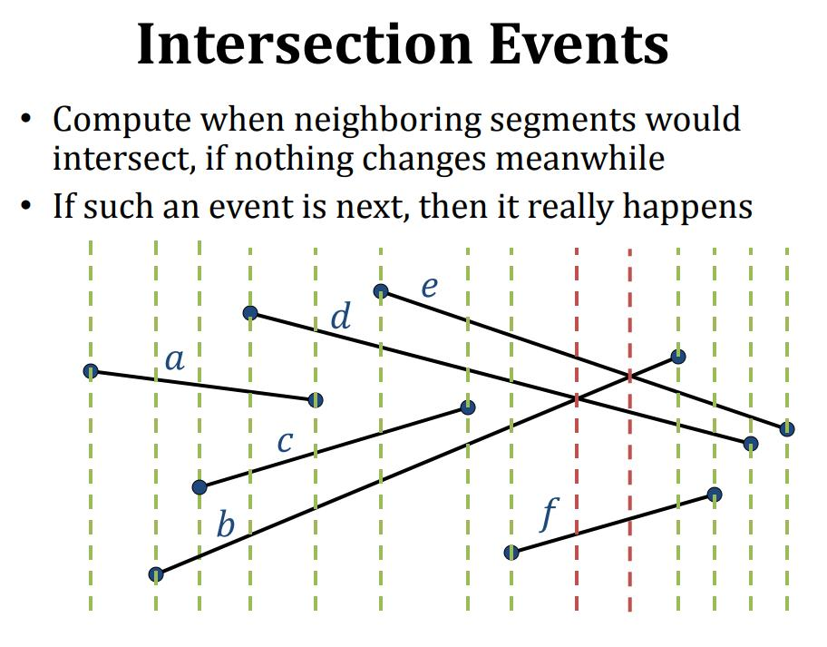

# Sweep Line Algorithm

## 导读

对这个算法的思想解释地最好的是 csail.mit.edu [6.006 Introduction to Algorithms](http://courses.csail.mit.edu/6.006/spring11/lectures/lec24.pdf) ，比较遗憾的是，其中没有完整的source code，在 geeksforgeeks [Given n line segments, find if any two segments intersect](https://www.geeksforgeeks.org/given-a-set-of-line-segments-find-if-any-two-segments-intersect/) 中对这个算法的实现细节进行了补充。

在LeetCode中，有多道使用Sweep Line Algorithm的题目，这在 LeetCode 章节进行了说明。

## wikipedia [Sweep line algorithm](https://en.wikipedia.org/wiki/Sweep_line_algorithm)

In computational geometry, a **sweep line algorithm** or **plane sweep algorithm** is an algorithmic paradigm that uses a conceptual sweep line or sweep surface to solve various problems in Euclidean space. It is one of the key techniques in computational geometry.

The idea behind algorithms of this type is to imagine that a line (often a vertical line) is swept or moved across the plane, stopping at some points. Geometric operations are restricted to geometric objects that either intersect or are in the **immediate vicinity** of the sweep line whenever it stops, and the complete solution is available once the line has passed over all objects.

> NOTE:
>
> 一、"sweep line"的含义是 "扫线"
>
> 二、"conceptual sweep line"中的"conceptual"的表明并没有实际的、物理的线，只是一个逻辑上的线
>
> 三、sweep-line-algorithm让我想到了flood algorithm，flood algorithm是从一个点向四周扩散，而sweep-line-algorithm则是使用一个"conceptual sweep line"扫过平面
>
> 四、"**immediate vicinity**"的意思是"紧邻区域"


## csail.mit.edu [6.006 Introduction to Algorithms](http://courses.csail.mit.edu/6.006/spring11/lectures/lec24.pdf) 

### Line‐segment intersection

#### Sweep‐Line Technique

Idea: 

1、Sweep a vertical line from left to right

2、Maintain intersection of line with input





### Closest pair of points


## geeksforgeeks [Given n line segments, find if any two segments intersect](https://www.geeksforgeeks.org/given-a-set-of-line-segments-find-if-any-two-segments-intersect/)

Given n line segments `(p1, q1), (p2, q2), … (pn, qn)`, find if the given line segments intersect with each other or not.

Example:

```
Input:  
{{1, 5}, {4, 5}}, {{2, 5}, {10, 1}},{{3, 2}, {10, 3}},{{6, 4}, {9, 4}},{{7, 1}, {8, 1}}
Output:  2
Explanation: Lines {{1, 5}, {4, 5}}, {{2, 5}, {10, 1}} are intersecting, as well as {{2, 5}, {10, 1}},{{3, 2}, {10, 3}}.
```


### Sweep Line Algorithm

We can solve this problem in **O(nLogn)** time using **Sweep Line Algorithm**. The algorithm first sorts the end points along the x axis from left to right, then it passes a vertical line through all points from left to right and checks for intersections. Following are detailed steps. 

**1)** Let there be `n` given lines. There must be `2n` end points to represent the `n` lines. Sort all points according to `x` coordinates. While sorting maintain a flag to indicate whether this point is left point of its line or right point. 

**2)** Start from the leftmost point. Do following for every point 

…..**a)** If the current point is a **left poin**t of its line segment, check for intersection of its line segment with the segments just above and below it. And add its line to ***active* line segments** (line segments for which left end point is seen, but right end point is not seen yet).  Note that we consider only those neighbors which are still active. 

….**b)** If the current point is a **right point**, remove its line segment from active list and check whether its two active neighbors (points just above and below) intersect with each other. 

The step 2 is like passing a vertical line from all points starting from the leftmost point to the rightmost point. That is why this algorithm is called Sweep Line Algorithm. The Sweep Line technique is useful in many other geometric algorithms like calculating the 2D Voronoi diagram

### PseudoCode

The following pseudocode doesn’t use heap. It simply sort the array. 

```pseudocode
sweepLineIntersection(Points[0..2n-1]):
1. Sort Points[] from left to right (according to x coordinate)

2. Create an empty Self-Balancing BST T. It will contain 
  all active line Segments ordered by y coordinate.

// Process all 2n points 
3. for i = 0 to 2n-1

    // If this point is left end of its line  
    if (Points[i].isLeft) 
       T.insert(Points[i].line())  // Insert into the tree

       // Check if this points intersects with its predecessor and successor
       if ( doIntersect(Points[i].line(), T.pred(Points[i].line()) )
         return true
       if ( doIntersect(Points[i].line(), T.succ(Points[i].line()) )
         return true

    else  // If it's a right end of its line
       // Check if its predecessor and successor intersect with each other
       if ( doIntersect(T.pred(Points[i].line(), T.succ(Points[i].line()))
         return true
       T.delete(Points[i].line())  // Delete from tree

4. return False
```


### Example

Let us consider the following example taken from [here](http://www.eecs.wsu.edu/~cook/aa/lectures/l25/node10.html).  There are 5 line segments 1, 2, 3, 4 and 5.  The dotted green lines show sweep lines. 
 


Following are steps followed by the algorithm.  All points from left to right are processed one by one. We maintain a self-balancing binary search tree. 

*Left end point of line segment 1 is processed*: 1 is inserted into the Tree. The tree contains 1.  No intersection. 

*Left end point of line segment 2 is processed*:  Intersection of 1 and 2 is checked. 2 is inserted into the Tree. Intersection of 1&2 Found (“Note that the above pseudocode returns at this point”). We can continue from here to report all intersection points. The tree contains 1, 2. 

*Left end point of line segment 3 is processed:* Intersection of  3 with 1 is checked.  No intersection. 3 is inserted into the Tree. The tree contains  2, 1, 3. 

*Right end point of line segment 1 is processed:* 1 is deleted from the Tree.  Intersection of 2 and 3 is checked.  Intersection of 2 and 3 is reported.  The tree contains  2, 3. 

*Left end point of line segment 4 is processed*:  Intersections of line 4 with lines 2 and 3 are checked.  No intersection. 4 is inserted into the Tree. The tree contains  2, 4, 3. 

*Left end point of line segment 5 is processed*:  Intersection of  5 with 3 is checked.  No intersection. 5 is inserted into the Tree. The tree contains  2, 4, 3, 5. 

*Right end point of line segment 5 is processed:* 5 is deleted from the Tree.  The tree contains  2, 4, 3. 

*Right end point of line segment 4 is processed:* 4 is deleted from the Tree.  The tree contains  2, 4, 3.  Intersection of 2 with 3 is checked.  Intersection of 2 with 3 is reported (Note that the intersection of 2 and 3 is reported again. We can add some logic to check for duplicates ). The tree contains  2, 3.

*Right end point of line segment 2 and 3 are processed:*  Both are deleted from tree and tree becomes empty. 

#### 完整code

```c++

// #include <bits/stdc++.h>
#include <set>
#include <iostream>
#include <algorithm>
#include <unordered_map>
#include <vector>
#include <string>

using namespace std;

// A point in 2D plane
struct Point
{
    int x, y;
};

// A line segment with left as Point
// with smaller x value and right with
// larger x value.
struct Segment
{
    Point left, right;
};

// An event for sweep line algorithm
// An event has a point, the position
// of point (whether left or right) and
// index of point in the original input
// array of segments.
struct Event
{
    int x, y;
    bool isLeft;
    int index;
    Event(int x, int y, bool l, int i) : x(x), y(y), isLeft(l), index(i) {}

    // This is for maintaining the order in set.
    bool operator<(const Event &e) const
    {
        if (y == e.y)
            return x < e.x;
        return y < e.y;
    }
};

// Given three collinear points p, q, r, the function checks if
// point q lies on line segment 'pr'
bool onSegment(Point p, Point q, Point r)
{
    if (q.x <= max(p.x, r.x) && q.x >= min(p.x, r.x) &&
        q.y <= max(p.y, r.y) && q.y >= min(p.y, r.y))
        return true;

    return false;
}

// To find orientation of ordered triplet (p, q, r).
// The function returns following values
// 0 --> p, q and r are collinear
// 1 --> Clockwise
// 2 --> Counterclockwise
int orientation(Point p, Point q, Point r)
{
    // See https://www.geeksforgeeks.org/orientation-3-ordered-points/
    // for details of below formula.
    int val = (q.y - p.y) * (r.x - q.x) -
              (q.x - p.x) * (r.y - q.y);

    if (val == 0)
        return 0; // collinear

    return (val > 0) ? 1 : 2; // clock or counterclock wise
}

// The main function that returns true if line segment 'p1q1'
// and 'p2q2' intersect.
bool doIntersect(Segment s1, Segment s2)
{
    Point p1 = s1.left, q1 = s1.right, p2 = s2.left, q2 = s2.right;

    // Find the four orientations needed for general and
    // special cases
    int o1 = orientation(p1, q1, p2);
    int o2 = orientation(p1, q1, q2);
    int o3 = orientation(p2, q2, p1);
    int o4 = orientation(p2, q2, q1);

    // General case
    if (o1 != o2 && o3 != o4)
        return true;

    // Special Cases
    // p1, q1 and p2 are collinear and p2 lies on segment p1q1
    if (o1 == 0 && onSegment(p1, p2, q1))
        return true;

    // p1, q1 and q2 are collinear and q2 lies on segment p1q1
    if (o2 == 0 && onSegment(p1, q2, q1))
        return true;

    // p2, q2 and p1 are collinear and p1 lies on segment p2q2
    if (o3 == 0 && onSegment(p2, p1, q2))
        return true;

    // p2, q2 and q1 are collinear and q1 lies on segment p2q2
    if (o4 == 0 && onSegment(p2, q1, q2))
        return true;

    return false; // Doesn't fall in any of the above cases
}

// Find predecessor of iterator in s.
set<Event>::iterator pred(set<Event> &s, set<Event>::iterator it)
{
    return it == s.begin() ? s.end() : --it;
}

// Find successor of iterator in s.
set<Event>::iterator succ(set<Event> &s, set<Event>::iterator it)
{
    return ++it;
}

// Returns true if any two lines intersect.
int isIntersect(Segment arr[], int n)
{
    unordered_map<string, int> mp; // to note the pair for which intersection is checked already
    // Pushing all points to a vector of events
    vector<Event> e;
    for (int i = 0; i < n; ++i)
    {
        e.push_back(Event(arr[i].left.x, arr[i].left.y, true, i));
        e.push_back(Event(arr[i].right.x, arr[i].right.y, false, i));
    }

    // Sorting all events according to x coordinate.
    sort(e.begin(), e.end(), [](Event &e1, Event &e2)
         { return e1.x < e2.x; });

    // For storing active segments.
    set<Event> s;
    int ans = 0;
    // Traversing through sorted points
    for (int i = 0; i < 2 * n; i++)
    {
        Event curr = e[i];
        int index = curr.index;

        // If current point is left of its segment
        if (curr.isLeft)
        {
            // Get above and below points
            auto next = s.lower_bound(curr);
            auto prev = pred(s, next);
            // Check if current point intersects with
            // any of its adjacent
            bool flag = false;
            if (next != s.end() && doIntersect(arr[next->index], arr[index]))
            {
                string s = to_string(next->index + 1) + " " + to_string(index + 1);
                if (mp.count(s) == 0)
                {
                    mp[s]++;
                    ans++;
                } // if not already checked we can increase count in map
            }
            if (prev != s.end() && doIntersect(arr[prev->index], arr[index]))
            {
                string s = to_string(prev->index + 1) + " " + to_string(index + 1);
                if (mp.count(s) == 0)
                {
                    mp[s]++;
                    ans++;
                } // if not already checked we can increase count in map
            }
            // if same line segment is there then decrease answer as it got increased twice
            if (prev != s.end() && next != s.end() && next->index == prev->index)
                ans--;

            // Insert current point (or event)
            s.insert(curr);
        }

        // If current point is right of its segment
        else
        {
            // Find the iterator
            auto it = s.find(Event(arr[index].left.x, arr[index].left.y, true, index));
            // Find above and below points
            auto next = succ(s, it);
            auto prev = pred(s, it);

            // If above and below point intersect
            if (next != s.end() && prev != s.end())
            {
                string s = to_string(next->index + 1) + " " + to_string(prev->index + 1);
                string s1 = to_string(prev->index + 1) + " " + to_string(next->index + 1);
                if (mp.count(s) == 0 && mp.count(s1) == 0 && doIntersect(arr[prev->index], arr[next->index]))
                    ans++;
                mp[s]++;
            }

            // Remove current segment
            s.erase(it);
        }
    }
    // print pair of lines having intersection

    for (auto &pr : mp)
    {
        cout << "Line: " << pr.first << "\n";
    }
    return ans;
}

// Driver code
int main()
{
    Segment arr[] = {{{1, 5}, {4, 5}}, {{2, 5}, {10, 1}}, {{3, 2}, {10, 3}}, {{6, 4}, {9, 4}}, {{7, 1}, {8, 1}}};
    int n = sizeof(arr) / sizeof(arr[0]);
    cout << "Number of intersection points: " << isIntersect(arr, n);
    return 0;
}

```


## LeetCode


gitbooks [Sweep Line (Intervals)](https://robinliu.gitbooks.io/leetcode/content/Sweep_Line.html)	


csdn [扫描线Sweep Line算法总结](https://blog.csdn.net/u013325815/article/details/103957911)

csdn [Time Intersection](https://blog.csdn.net/u013325815/article/details/103402697)

csdn [Number of Airplanes in the Sky](https://blog.csdn.net/u013325815/article/details/103388203)

csdn [[翻译]扫描线算法(Line Sweep Algorithm)（1）](https://blog.csdn.net/LiRewriter/article/details/77512370)


