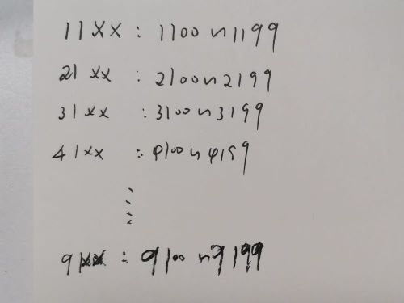

# LeetCode [233. 数字 1 的个数](https://leetcode-cn.com/problems/number-of-digit-one/) 困难


## [官方解题](https://leetcode-cn.com/problems/number-of-digit-one/solution/shu-zi-1-de-ge-shu-by-leetcode-solution-zopq/)

### 方法一：枚举每一数位上 11 的个数

根据题目要求，我们需要统计 $[0, n]$ 范围内所有整数中，数字 $1$ 出现的个数。由于 $n$ 的范围最大为 $10^9$，它是一个 $10$ 位整数，因此我们可以考虑枚举每一个**数位**，分别统计该数位上数字 $1$ 出现的次数，最后将所有数位统计出的次数进行累加即可得到答案。

> NOTE: 
>
> 基于数位而不是基于数的统计方式，这是一种高效的穷举，这一类问题都是基于数位的。
>
> 

为了直观地叙述我们的算法，下面我们以「**百位**」进行举例，对于几个不同的 $n$​ 手动计算出答案，随后扩展到任意数位。

以 $n = 1234567$​ 为例，我们需要统计「**百位**」上数字 $1$​ 出现的次数。我们知道，对于从 $0$​ 开始每 $1000$​ 个数，「百位」上的数字 $1$​ 都会出现 $100$​次，即数的最后三位每 $1000$​ 个数都呈现 $[000, 999]$​ 的循环，其中的 $[100, 199]$​ 在「百位」上的数字为 $1$​，共有 $100$​ 个。

> NOTE: 
>
> 要统计百位，就要看它的上一位: 千位。
>
> 一、对于上面这段话，可以结合下面的例子来进行理解:
>
> 
>
> 二、 $[100, 199]$ 的个数固定，为100个；那有多少个这样的区间呢？则是由更高位决定的。
>
> 


n 拥有 $1234$ 个这样的循环，每个循环「百位」上都出现了 $100$ 次 $1$，这样就一共出现了 $1234 \times 100$ 次 11。如果使用公式表示，那么这部分出现的 $1$ 的次数为：

$$
\lfloor \frac{n}{1000} \rfloor \times 100
$$
其中 $\lfloor x \rfloor$ 表示将 $x$ 向下取整，那么 $\lfloor \frac{n}{1000} \rfloor$ 就表示 $n$ 拥有的完整的 $[000, 999]$ 循环的数量。

对于剩余不在完整的循环中的部分，最后三位为 $[000, 567]$，其中 $567$ 可以用 $n \bmod 1000$表示，其中 $\bmod$ 表示取模运算。记 $n' = n \bmod 1000$，这一部分在「百位」上出现 $1$ 的次数可以通过分类讨论得出：

1、当 $n' < 100$ 时，「百位」上不会出现 $1$；

2、当 $100 \leq n' < 200$ 时，「百位」上出现 $1$ 的范围为 $[100, n']$，所以出现了 $n' - 100 + 1$ 次 $1$；

3、当 $n' \geq 200$ 时，「百位」上出现了全部 $100$ 次 $1$。

> NOTE: 
>
> 上面这种讨论仅仅局限于统计"**1**" 的个数，那如果推广到统计容易digit，应该如何来设计算法呢？
>
> 

我们用类似的方法可以计算出在其它数位上数字 11 出现的次数。如果该数位可以表示为 $10^k$（例如 $k=0, 1, 2$ 分别表示「个位」「十位」「百位」），那么数字 $1$ 出现的次数为：
$$
\lfloor \frac{n}{10^{k+1}} \rfloor \times 10^k + \min\big(\max(n \bmod 10^{k+1} - 10^k + 1, 0), 10^k\big) \tag{1}
$$


用形象化的语言描述 (1)式的意义即为：

> 当数位为 $10^k$ 时，最后的 $k$ 个数位每 $10^{k+1}$ 个数会循环一次，并且其中包含 $10^k$ 个 $1$，由于 $n$ 包含 $\lfloor \dfrac{n}{10^{k+1}} \rfloor$ 个完整的循环，那么这一部分的 $1$ 的个数为 $\lfloor \dfrac{n}{10^{k+1}} \rfloor \times 10^k$ 。不在循环中的部分还有 $n \bmod 10^{k+1}$个数，这一部分的 $1$ 的个数为 $n \bmod 10^{k+1} - 10^k + 1$，如果这个值小于 $0$，那么调整为出现 $0$ 次；如果这个值大于 $10^k$ ，那么调整为出现 $10^k$ 次。

### 完整代码

```C++
#include <bits/stdc++.h>
using namespace std;

class Solution
{
public:
	int countDigitOne(int n)
	{
		// mulk 表示 10^k
		// 在下面的代码中，可以发现 k 并没有被直接使用到（都是使用 10^k）
		// 但为了让代码看起来更加直观，这里保留了 k
		long long mulk = 1;
		int ans = 0;
		for (int k = 0; n >= mulk; ++k)
		{
			ans += (n / (mulk * 10)) * mulk + min(max(n % (mulk * 10) - mulk + 1, 0LL), mulk);
			mulk *= 10;
		}
		return ans;
	}
};

int main()
{
}
// g++ test.cpp --std=c++11 -pedantic -Wall -Wextra -g

```

思考: 上述程序如何和前面的分析过程进行对应？

其实注释已经给出了解答；

上述程序的逻辑是: 首先从个位开始至最高位逐位进行统计，即 `k` 从 `0` 开始。


## [【宫水三叶】将数位 DP 问题转化为计数类模拟题](https://leetcode-cn.com/problems/number-of-digit-one/solution/gong-shui-san-xie-jiang-shu-wei-dp-wen-t-c9oi/)

