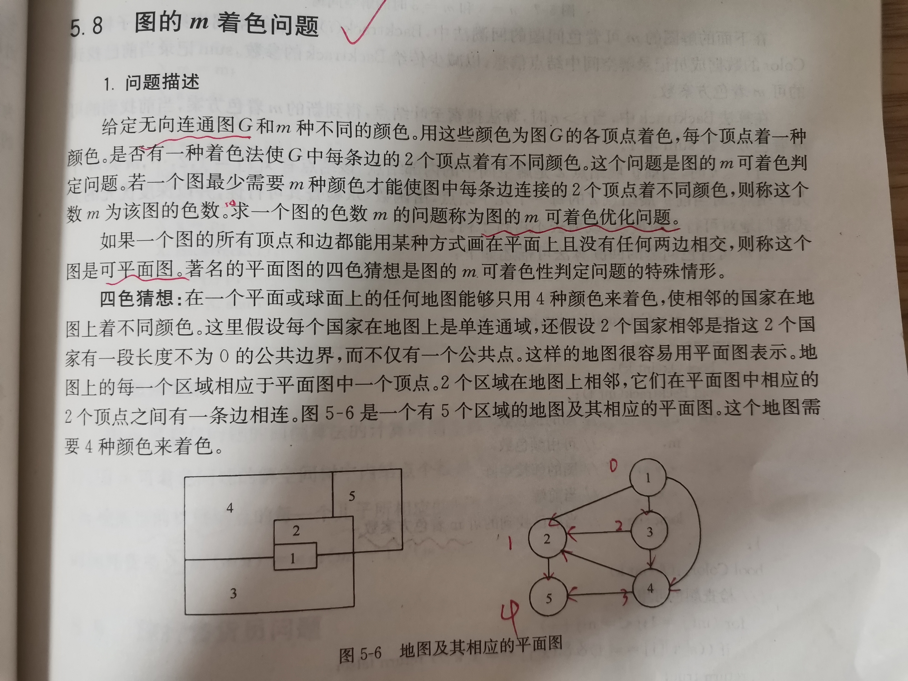
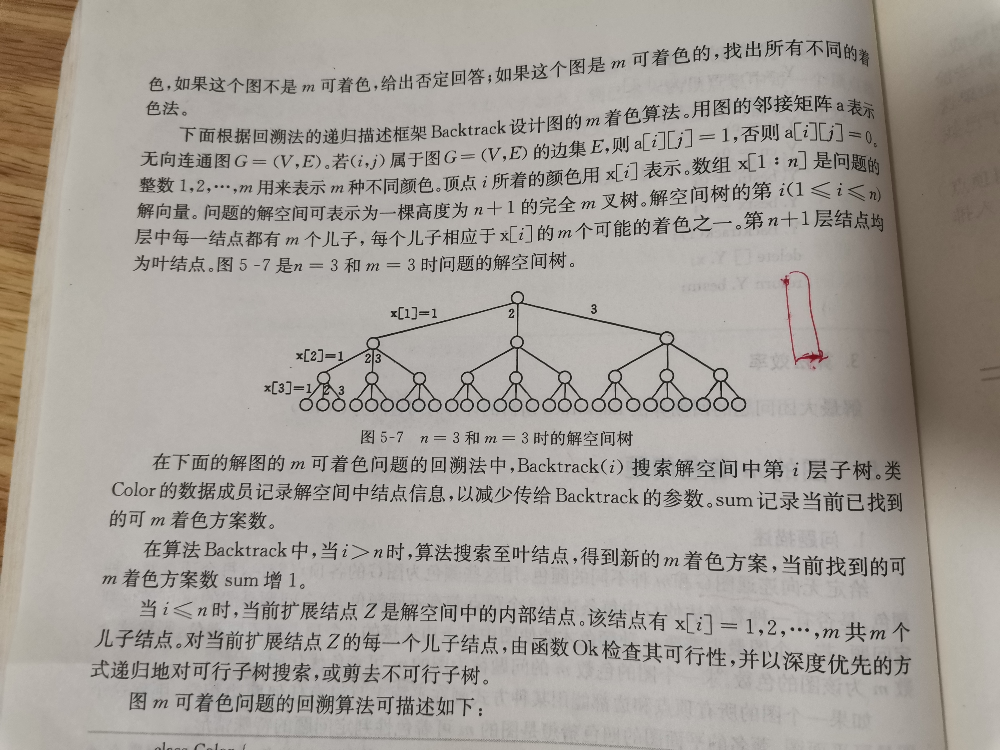

# M-coloring of graph

## 问题描述


## 算法设计

## Implementation

```C++
class Color
{    
public:
    Color(int n, int m, int** a): n(n), m(m), a(a)
    {
        x = new int[n+1]();
    }
    ~Color()
    {
        delete x;
    }
private:
    /**
    * 可行性检验：检查节点k的颜色与它的相邻节点的颜色，如果一致，显然k的当前着色是不可行的，否则是可行的
    */
    bool OK(int k)
    {
        for(int j=1;j<=n;j++)
        {
            if( ( a[k][j] == 1 ) && ( x[j] == x[k] ))
            {
                return false;
            }
        }
    }
    /**
    * 给节点t着色
    */
    void Backtrack(int t)
    {
        // 获得了完整解
        if(t>n)
        {
            sum++;
            for(int i = 1; i<n; ++1)
            {
                std::cout<<x[i]<<std::endl;
            }
        }
        // 部分解
        else
        {
            for(int i=1;i<=m;++1)
            {
                x[t] = i;
                // 满足可行性约束
                if(OK(t))
                {
                    Backtrack(t+1);
                }
                // 不满足可行性约束，直接剪枝
                else
                {
                    
                }
                
                x[t] = 0; // 还原
            }
        }
    }
private:
    int n; // 图的顶点数
    int m; // 可用的颜色
    int **a; // 图的邻接矩阵
    int *x; // 当前解，它的长度为 n + 1，因为只有给所有的节点都着色后，才能够得到完整解
    long sum { 0 }; //当前已经找到的可m着色方案数
};

/**
* @param n 图的顶点数
* @param m 可用的颜色
* @param a 图的邻接矩阵
*/
int mColoring(int n, int m, int** a)
{
    Color X(n, m, a);
    X.Backtrack(1);
    return X.sum;
}
```