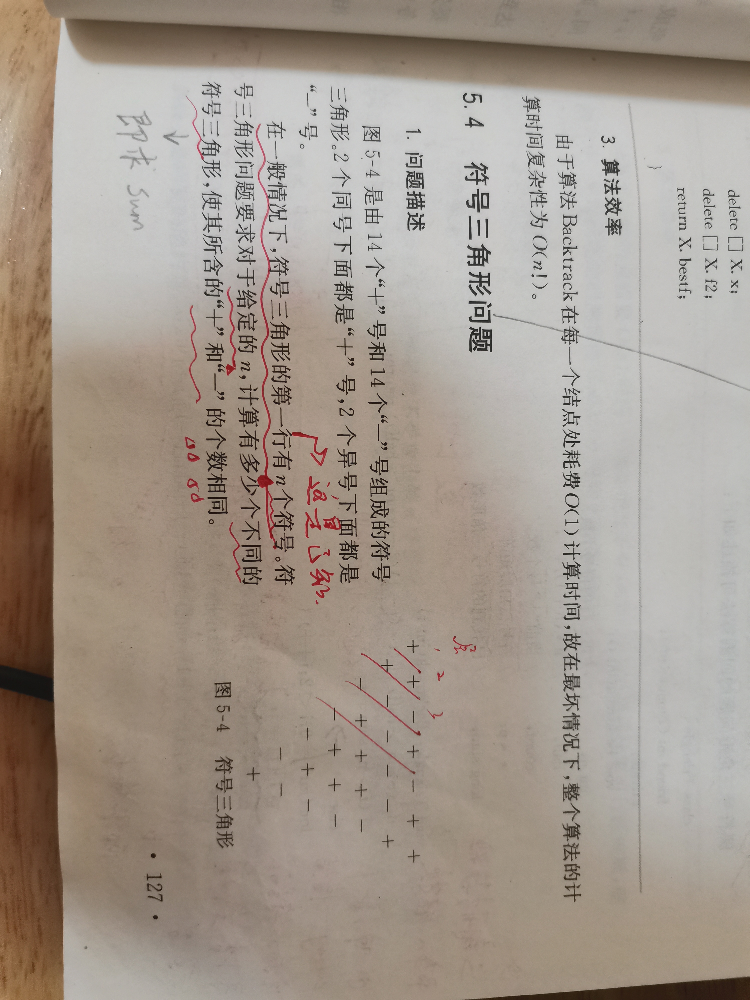
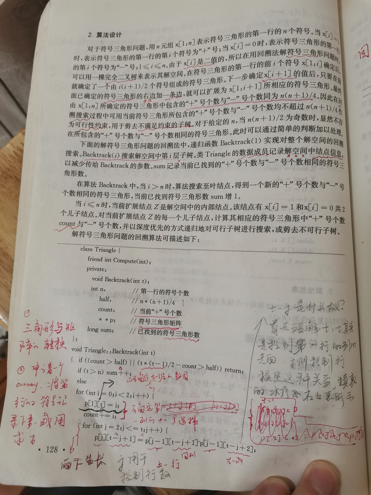

# Symbol triangle





## Implementation

整个符号三角形，是由第一行的符号确定的，因此它的解空间完全是由它的第一行的符号组成，可以使用一棵完全二叉树来表示其解空间。

如何来实现呢？依然是one-by-one，给出所有的组合。
```C++
class Triangle
{
public:
	friend int Compute(int n);
	Triangle(int n) :
			n(n)
	{

	}
	bool Init()
	{
		int total = (n * (n + 1) / 2); // 总个数
		if (total % 2 == 1) // 总个数为奇数，显然不存在可行解
		{

			return false;
		}
		half /= 2;
		p = new int*[n + 1]();
		for (int i = 0; i <= n; ++i)
		{
			p[i] = new int[n + 1]();
		}
		return true;
	}
private:
	int **p { nullptr }; // 符合三角形矩阵
	int n; // 第一行的符号的个数
	int count { 0 }; // 当前+号的个数，因为“+”号用1表示，“-”号用0表示
	int half { 0 }; // (n * ( n + 1 ))/4
	long sum { 0 }; //已经找到的解的个数

	void Backtack(int t)
	{
		// 如果在已经确定的t-1行三角形中，“+”或“-”的个数超过half，则显然不可能包含可行解，可以直接剪掉
		// t * (t - 1)) / 2 是“已经确定的t-1行三角形”中符合的总个数
		if ((count > half) || (t * (t - 1)) / 2 - count > half)
		{
			return;
		}
		// 得到了完整解
		if (t > n)
		{
			sum++;

		}
		// 解不完全
		else
		{
			for (int i = 0; i < 2; i++) // 每个当前扩展结点可以取两个值0，1取0表示“-”，取1表示“+”
			{
				p[1][t] = i; //第一行第t列填入符合
				count += i; //更新+号的个数
				for (int j = 2; j <= t; j++) //按照斜线方向有上网下进行填值
				{
					p[j][t - j + 1] = p[j - 1][t - j + 1] * p[j - 1][t - j + 2];
					count += p[j][t - j + 1];
				}
				Backtack(t + 1);
				// 回滚
				for (int j = 2; j <= t; j++)
				{ //这三句进行回滚
					count -= p[j][t - j + 1];
				}
				count -= i;
			}
		}

	}
};

int Compute(int n)
{
	Triangle X;
	if (X.Init())
	{
		X.Backtack(1);
	}
	return X.sum;
}

```