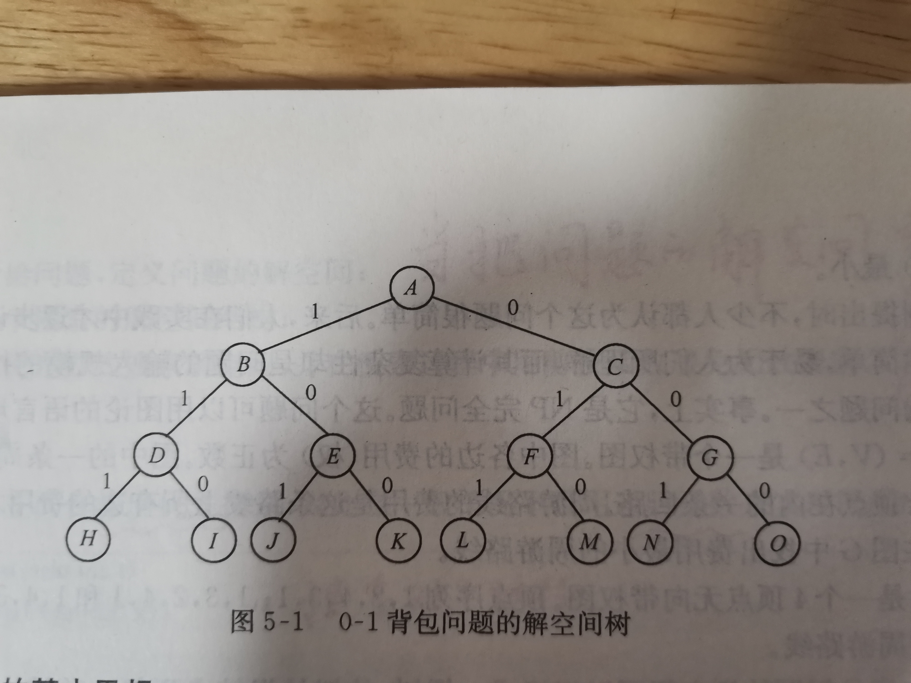

# Backtrack

书写思路：

需要一search algorithm的思路来描述Backtrack。

## 解空间


从以下几个方面来进行描述：

- 使用nesting关系来进行描述
- 呈现出tree structure
- 解空间是一种virtual space，解空间和state space类似

> 上面这种描述思想是符合 结构化思维的

对于解空间满足nesting关系的的问题，都可以使用Backtrack来进行求解。

问题的解：对应的是解空间树的一条**路径**





## Backtrack: a kind of systematic search algorithm

本节标题的含义是：回溯法，一种系统性地搜索算法。

要点：

1. 对解空间树进行系统性地搜索

系统性的含义是：每种可能的路径都会去尝试，因为每一条路径都可能是一个**可能解**。

那如何实现呢？

- 深度优先，这种策略的优势有：
  - 尽可能地搜索到一个完整的解
  - 提高搜索效率：及时发现无效解，进行剪枝

- 回溯


### One-by-one

典型的one-by-one computation，逐步计算得到完整解，完整解的长度`N`是可以提前确定的，用`t`来控制计算步骤，当`t==N`时，则表示已经计算得到了完整解。

`N`对应的是解空间树的深度。

`t`对应的是当前扩展节点的树深度。

### 搜索顺序

深度优先搜索，对应的是树的先序遍历

> 在n-queue问题中，对这个问题进行了思考

### 实现


#### 递归回溯

```c++
void BackTrack(int t)
{
    // 得到了一个完整解
	if (t > n)
    {
        Output(x);
    }
    // 解不完整
	else
    {
		for (int i = f(n, t); i < g(n, t); i++)
        {
			x[t] = h(i);
			if (Constraint(t) && Bound(t))
            {
                BackTrack(t + 1);
            }
            // 及时剪枝
		}
	}
}

/*
1.t表示递归深度
2.x[]用来记录可行解
3.f(n, t)和 g(n, t)分别表示当前开展结点处，未搜索过的子树的起始编号和终止编号
4.h（i）表示在当前扩展结点处，x[t]的第i可选值
*/
```


#### 迭代回溯


```C++
void IterativeBacktrack(void)
{
	int t = 1;
	while (t > 0)
    {
		if (f(n, t) <= g(n, t))
        {
			for (int i = f(n, t), i < g(n, t), i++)
            {
				x[t] = h(i);
				if (Constraint(t) && Bound(t))
                {
                    // 得到了一个完整解
					if (Solution(t))
                    {
                        Output(x);//此时已经得到了完整解，则可以进行输出了
                    }   
                    // 解不完整
					else 
                    {
                        t++;//还没有求得完整解，则往下一层迭代，这是深度优先的遍历算法
                    }
				}
                //此处会剪去相应的子树
			}
		}
        {
        	else t--;//进行回溯    
        }
		
	}
}
/*
1.t表示递归深度
2.x[]用来记录可行解
3.f(n, t)和 g(n, t)分别表示当前开展结点处，未搜索过的子树的起始编号和终止编号,比如m着色问题中为图的颜色总数
4.h（i）表示在当前扩展结点处，x[t]的第i可选值，比如m着色中的各种颜色
5.Solution(t)判断当前扩展结点是否已经得到问题的可行解，如果得到了完整解，则由Output(x)输出完整解，否则在当前扩展结点处得到的只是部分解，需要继续向纵深方向继续搜索
*/
```


#### 递归回溯 VS 迭代回溯

递归回溯利用call stack，当`Constrain(t) && Bound(t)`不满足的时候，它不往下一层递归（`t=t+1`），函数直接返回（剪枝），则call stack会弹出当前frame，回到上一层(`t=t-1`)，即**回溯**，然后接着尝试其他的可选值。

迭代回溯，需要由programmer来维护在各层次的搜索，直观来说，是维护`t`值：

- 当进入下一层时：`t++`
- 当**回溯**，即返回上一层时：`t--`

### 子集树 与 排列树


用回溯法搜索排列树的算法框架可描述如下：

```C++
void Backtrack(int t)
{
	if( t > n )
	{
		Output(x);
	}
	else
	{
		for(int i = t; i <= n; i++)
		{
			Swap(x[t], x[i]);
			if( Constrain(t) && Bound(t) )
			{
				Backtrack( t+1 );
			}
			Swap(x[t], x[i]);
		}
	}
}
```

