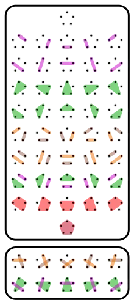
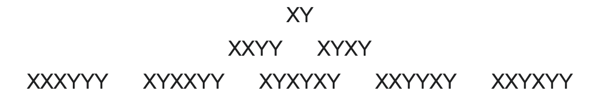
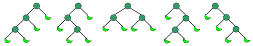
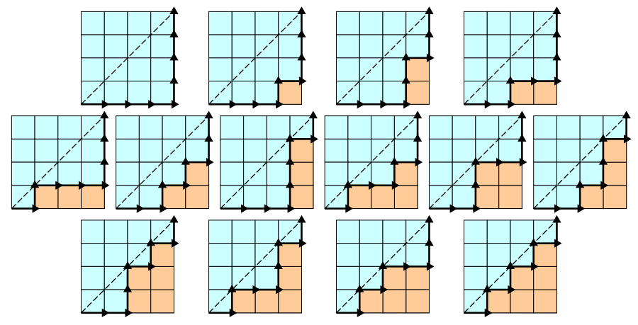

# Dyck-language&Catalan-number&Narayana-number

Catalan number 和 Dyck language密切相关。 

bijection: 很多问题，都可以通过bijection转换为Catalan number

## gpt-4o Dyck language

The **Dyck language** is a formal language that consists of **balanced strings of parentheses**. It is named after the German mathematician **Walther von Dyck**. The Dyck language is an important concept in the theory of **formal languages** and **automata**, and it is often used to model **nested structures** such as those found in **programming languages**, **arithmetic expressions**, and **XML documents**.

### Definition

A string belongs to the **Dyck language** if it consists of **balanced parentheses**. For example, the strings `""` (the empty string), `"()"`, `"(())"`, and `"()()"` are all in the **Dyck language**, while the strings `"("`, `")("`, and `"(()"` are not.

### Formal Definition

The Dyck language can be defined using a context-free grammar. A common grammar for the Dyck language over the alphabet `{ '(', ')' }` is:

```
S -> ε
S -> (S)S
```

Here, `S` is the **start symbol**, and `ε` represents the **empty string**.

### Examples

- Valid strings: `""`, `"()"`, `"(())"`, `"()()"`, `"(()(()))"`
- Invalid strings: `"("`, `")"`, `"(()"`, `")("`, `"())("`

### Recognizing Dyck Language in Python

You can use a stack to recognize whether a given string belongs to the **Dyck language**. The idea is to push an opening parenthesis `(` onto the stack and pop it when a closing parenthesis `)` is encountered. If the stack is empty at the end and all parentheses have been matched correctly, the string is in the **Dyck language**.

Here's a Python function to check if a string belongs to the **Dyck language**:

```python
def is_dyck_string(s):
    stack = []
    for char in s:
        if char == '(':
            stack.append(char)
        elif char == ')':
            if not stack:
                return False
            stack.pop()
    return len(stack) == 0


if __name__ == '__main__':
    # Test cases
    print(is_dyck_string(""))  # True
    print(is_dyck_string("()"))  # True
    print(is_dyck_string("(())"))  # True
    print(is_dyck_string("()()"))  # True
    print(is_dyck_string("(()(()))"))  # True
    print(is_dyck_string("("))  # False
    print(is_dyck_string(")"))  # False
    print(is_dyck_string("(()"))  # False
    print(is_dyck_string(")("))  # False
    print(is_dyck_string("())("))  # False

```


### Push-Down Automaton for Dyck Language

A **Push-Down Automaton (PDA)** can be used to recognize the **Dyck language**. The PDA uses a stack to keep track of the parentheses.

### Summary

The Dyck language is a formal language consisting of balanced strings of parentheses. It can be defined using a **context-free grammar** and recognized using a stack-based approach or a **Push-Down Automaton (PDA)**. This concept is widely used in computer science for parsing and validating nested structures.


## wikipedia [Dyck language](https://en.wikipedia.org/wiki/Dyck_language)

In the theory of [formal languages](https://en.wikipedia.org/wiki/Formal_languages) of [computer science](https://en.wikipedia.org/wiki/Computer_science), [mathematics](https://en.wikipedia.org/wiki/Mathematics), and [linguistics](https://en.wikipedia.org/wiki/Linguistics), a **Dyck word** is a balanced [string](https://en.wikipedia.org/wiki/String_(computer_science)#Formal_theory) of brackets. The set of Dyck words forms a **Dyck language**. The simplest, D1, uses just two matching brackets, e.g. ( and ).

### Formal definition

#### Context-free grammar

$$
S \rightarrow \epsilon | '[' S ']' S
$$

$$
S \rightarrow ('[' S ']')^*
$$


### Properties

- The Dyck language is closed under the operation of [concatenation](https://en.wikipedia.org/wiki/Concatenation).

- By treating $ \Sigma ^{*} $ as an algebraic [monoid](https://en.wikipedia.org/wiki/Monoid) under concatenation we see that the monoid structure transfers onto the [quotient](https://en.wikipedia.org/wiki/Quotient_monoid) $ \Sigma ^{*}/R $, resulting in the **[syntactic monoid](https://en.wikipedia.org/wiki/Syntactic_monoid) of the Dyck language**. The class $ \operatorname {Cl} (\epsilon ) $ will be denoted $ 1 $.

- The syntactic monoid of the Dyck language is not [commutative](https://en.wikipedia.org/wiki/Commutative): if $ u=\operatorname {Cl} ([) $ and $ v=\operatorname {Cl} (]) $ then $ uv=\operatorname {Cl} ([])=1\neq \operatorname {Cl} (][)=vu $.

- With the notation above, $ uv=1 $ but neither $ u $ nor $ v $ are invertible in $ \Sigma ^{*}/R $.

- The syntactic monoid of the Dyck language is isomorphic to the [bicyclic semigroup](https://en.wikipedia.org/wiki/Bicyclic_semigroup) by virtue of the properties of $ \operatorname {Cl} ([) $ and $ \operatorname {Cl} (]) $ described above.

- By the [Chomsky–Schützenberger representation theorem](https://en.wikipedia.org/wiki/Chomsky–Schützenberger_representation_theorem), any [context-free language](https://en.wikipedia.org/wiki/Context-free_language) is a homomorphic image of the intersection of some [regular language](https://en.wikipedia.org/wiki/Regular_language) with a Dyck language on one or more kinds of bracket pairs.

  > NOTE: 提过Dyck language，引入hierarchy。

- The Dyck language with two distinct types of brackets can be recognized in the [complexity class](https://en.wikipedia.org/wiki/Complexity_class) [$ TC^{0} $](https://en.wikipedia.org/wiki/TC0).[[2\]](https://en.wikipedia.org/wiki/Dyck_language#cite_note-2)

- The number of distinct Dyck words with exactly *n* pairs of parentheses is the *n*-th [Catalan number](https://en.wikipedia.org/wiki/Catalan_number).


## gpt-4o Lattice word

A lattice grid is a regular, repeating arrangement of points in space, typically in two or more dimensions. In the context of **combinatorics** and **formal language theory**, a **lattice grid** is often used to model paths or walks that follow specific rules. These paths can represent various combinatorial objects, such as **lattice words**, **Dyck paths**, and **Catalan paths**.

### 2D Lattice Grid

In a 2D lattice grid, points are arranged in a regular pattern, usually at integer coordinates. The grid can be visualized as a set of points where each point \((i, j)\) has integer coordinates \(i\) and \(j\). The most common types of steps in a 2D lattice grid are:

- **Up step (U)**: Moves from \((i, j)\) to \((i, j+1)\)
- **Down step (D)**: Moves from \((i, j)\) to \((i, j-1)\)
- **Right step (R)**: Moves from \((i, j)\) to \((i+1, j)\)
- **Left step (L)**: Moves from \((i, j)\) to \((i-1, j)\)

### Lattice Paths

A lattice path is a sequence of steps on a lattice grid that starts at a given point (usually the origin \((0, 0)\)) and follows a specific set of rules. For example, a common problem is to count the number of paths from \((0, 0)\) to \((n, m)\) using only certain types of steps.

### Dyck Paths

A **Dyck path** is a specific type of **lattice path** that starts at the origin \((0, 0)\), ends at \((2n, 0)\), and never falls below the x-axis. **Dyck paths** are closely related to the **Dyck language** and **Catalan numbers**. They can be represented by **lattice words** consisting of "up" and "down" steps.

### Example: Counting Lattice Paths

One common problem is to count the number of lattice paths from \((0, 0)\) to \((n, m)\) using only "right" and "up" steps. This can be solved using combinatorics. The number of such paths is given by the binomial coefficient:

$$
\binom{n+m}{n} = \frac{(n+m)!}{n! \cdot m!} 
$$


### Python Example: Counting Lattice Paths

Here's a Python function to count the number of lattice paths from \((0, 0)\) to \((n, m)\) using only "right" and "up" steps:

```python
import math

def count_lattice_paths(n, m):
    return math.comb(n + m, n)

# Test cases
print(count_lattice_paths(2, 2))  # 6
print(count_lattice_paths(3, 3))  # 20
print(count_lattice_paths(4, 2))  # 15
print(count_lattice_paths(5, 5))  # 252
```

### Visualizing Lattice Paths

To visualize lattice paths, you can use a grid and plot the steps. For example, a path from \((0, 0)\) to \((2, 2)\) using "right" (R) and "up" (U) steps might look like this:

```
Start at (0, 0)
R -> (1, 0)
R -> (2, 0)
U -> (2, 1)
U -> (2, 2)
```

This path can be represented as the string "RRUU".

### Summary

A lattice grid is a regular arrangement of points in space, often used to model paths or walks in combinatorics. Lattice paths are sequences of steps on a lattice grid that follow specific rules. Dyck paths are a special type of lattice path that never fall below the x-axis and are closely related to Catalan numbers. Counting lattice paths can be done using combinatorial methods, and these paths can be visualized on a grid.

## gpt-4o Dyck path

A **Dyck path** is a specific type of lattice path that is particularly important in combinatorics. It is a path on a 2D grid that starts at the origin \((0, 0)\), ends at \((2n, 0)\), and consists of steps that move either **up** or **down**, but never falls below the x-axis. **Dyck paths** are closely related to the **Dyck language** and **Catalan numbers**.

> NOTE:
>
> 1. "never falls below the x-axis" 则限制了第一步只能够是**up**

### Definition

A Dyck path of length \(2n\) is a sequence of steps that:

1. Starts at \((0, 0)\).
2. Ends at \((2n, 0)\).
3. Consists of \(n\) "up" steps (U) and \(n\) "down" steps (D).
4. Never falls below the x-axis, meaning that at any point in the path, the number of "down" steps does not exceed the number of "up" steps.

### Example

For \(n = 3\), a Dyck path of length 6 could be represented as:

- UUDDUD
- UUDUDD
- UDUDUD
- UUDDUU
- ...

### Catalan Numbers

The number of Dyck paths of length \(2n\) is given by the \(n\)-th Catalan number \(C_n\), which is defined as:

$$
[ C_n = \frac{1}{n+1} \binom{2n}{n} = \frac{(2n)!}{(n+1)!n!} ]
$$


### Recognizing Dyck Paths in Python

You can use a stack-based approach to recognize whether a given string is a valid Dyck path. The idea is to push an "up" step onto the stack and pop it when a "down" step is encountered. If the stack is empty at the end and all steps have been matched correctly, the string is a valid Dyck path.

Here's a Python function to check if a string is a valid Dyck path:

```python
def is_dyck_path(s):
    stack = []
    for char in s:
        if char == 'U':
            stack.append(char)
        elif char == 'D':
            if not stack:
                return False
            stack.pop()
    return len(stack) == 0


if __name__ == '__main__':
    # Test cases
    print(is_dyck_path("UUDD"))  # True
    print(is_dyck_path("UDUD"))  # True
    print(is_dyck_path("UUDUDD"))  # True
    print(is_dyck_path("UUUDDD"))  # True
    print(is_dyck_path("UUDDDU"))  # False
    print(is_dyck_path("UDDU"))  # False
    print(is_dyck_path("UUDDUUDD"))  # False

```

### Visualizing Dyck Paths

To visualize a Dyck path, you can plot the steps on a 2D grid. For example, the Dyck path "UUDD" can be visualized as follows:

```
Start at (0, 0)
U -> (1, 1)
U -> (2, 2)
D -> (3, 1)
D -> (4, 0)
```

This path can be represented graphically as:

```
(0,0) -> (1,1) -> (2,2) -> (3,1) -> (4,0)
```

### Generating Dyck Paths

You can generate all Dyck paths of a given length using a recursive approach. Here's a Python function to generate all Dyck paths of length \(2n\):

```python
def generate_dyck_paths(n, path="", up=0, down=0):
    if up == n and down == n:
        print(path)
        return
    if up < n:
        generate_dyck_paths(n, path + "U", up + 1, down)
    if down < up:
        generate_dyck_paths(n, path + "D", up, down + 1)

# Generate all Dyck paths of length 6 (n=3)
generate_dyck_paths(3)
```

> NOTE:
>
> 1. 充分利用Dyck Path "Never falls below the x-axis"的特性来进行剪枝

### Summary

A **Dyck path** is a lattice path that starts at the origin, ends at \((2n, 0)\), and never falls below the x-axis. It consists of \(n\) "up" steps and \(n\) "down" steps. The number of **Dyck paths** of length \(2n\) is given by the \(n\)-th **Catalan number**. Dyck paths can be recognized using a stack-based approach and can be generated recursively. They are important in combinatorics and have applications in various fields, including

## [findstat-Dyck paths](https://www.findstat.org/CollectionsDatabase/Cc0005/)

> NOTE:
>
> 1. 其中给出了dyck path的准确定义
>
> 2. `1`: up,     开括号
>
>    `0`: down,闭括号

| the 5 Dyck paths of size 3                                   |                                                              |                                                              |                                                              |                                                              |
| ------------------------------------------------------------ | ------------------------------------------------------------ | ------------------------------------------------------------ | ------------------------------------------------------------ | ------------------------------------------------------------ |
|  |  |  |  |  |
| ` [1,0,1,0,1,0]`                                             | ` [1,0,1,1,0,0]`                                             | ` [1,1,0,0,1,0]`                                             | ` [1,1,0,1,0,0]`                                             | ` [1,1,1,0,0,0]`                                             |


## wikipedia [Catalan number](https://en.wikipedia.org/wiki/Catalan_number)

In [combinatorial mathematics](https://en.wikipedia.org/wiki/Combinatorics), the **Catalan numbers** form a [sequence](https://en.wikipedia.org/wiki/Sequence) of [natural numbers](https://en.wikipedia.org/wiki/Natural_number) that occur in various [counting problems](https://en.wikipedia.org/wiki/Enumeration), often involving [recursively](https://en.wikipedia.org/wiki/Recursion)-defined objects. They are named after the [French-Belgian](https://en.wikipedia.org/wiki/Belgium) [mathematician](https://en.wikipedia.org/wiki/Mathematician) [Eugène Charles Catalan](https://en.wikipedia.org/wiki/Eugène_Charles_Catalan). 

 The *n*th Catalan number is given directly in terms of [binomial coefficients](https://en.wikipedia.org/wiki/Binomial_coefficient) by 

$$
{\displaystyle C_{n}={\frac {1}{n+1}}{2n \choose n}={\frac {(2n)!}{(n+1)!\,n!}}=\prod \limits _{k=2}^{n}{\frac {n+k}{k}}\qquad {\text{for }}n\geq 0.}
$$


> NOTE: 
>
> 注意是连乘，上式给出的是Catalan number的计算方式，但是在实际地解决问题过程中，我们更多的是使用Catalan number的递归表达式；

​	




 The $C_5 = 42$ [noncrossing partitions](https://en.wikipedia.org/wiki/Noncrossing_partition) of a 5-element set (below, the other 10 of the [52](https://en.wikipedia.org/wiki/Bell_number) [partitions](https://en.wikipedia.org/wiki/Partition_of_a_set)) 


### Properties

An alternative expression for $C_n$ is 

 $ C_{n}={2n \choose n}-{2n \choose n+1}={1 \over n+1}{2n \choose n}\quad {\text{ for }}n\geq 0, $ 

which is equivalent to the expression given above because $ {\tbinom {2n}{n+1}}={\tfrac {n}{n+1}}{\tbinom {2n}{n}} $. This shows that  $C_n$is an [integer](https://en.wikipedia.org/wiki/Integer), which is not immediately obvious from the first formula given. This expression forms the basis for a [proof of the correctness of the formula](https://en.wikipedia.org/wiki/Catalan_number#Second_proof). 

#### Recursive Definition

The Catalan numbers satisfy the [recurrence relations](https://en.wikipedia.org/wiki/Recurrence_relation) 

 $ C_{0}=1\quad {\text{and}}\quad C_{n+1}=\sum _{i=0}^{n}C_{i}\,C_{n-i}\quad {\text{for }}n\geq 0, $ 

> NOTE: 
>
> 一. 为什么是$C_{i}$ 乘以$C_{n-i}$，而不是相加呢？如何来结和具体案例对这个问题进行分析？
>
> - 结合"矩阵连乘"的例子来理解
>
> - 需要以"divide and conquer-原问题 子问题"
>
> 在位置 `i` 处断开，则左侧子问题的解空间的个数为$C_{i}$，右侧子问题的解空间个数为$C_{n-i}$，原问题的解空间个数是由左右两侧子问题的解组合而成，因此应该使用乘法而不是加法。
>
> 

$$
{\displaystyle \sum _{i_{1}+\cdots +i_{m}=n,i_{1},\ldots ,i_{m}\geq 0}C_{i_{1}}\cdots C_{i_{m}}={\begin{cases}
{\dfrac {m(n+1)(n+2)\cdots (n+m/2-1)}{2(n+m/2+2)(n+m/2+3)\cdots (n+m)}}C_{n+m/2},&m{\text{ even}}\\[5pt]{\dfrac {m(n+1)(n+2)\cdots (n+(m-1)/2)}{(n+(m+3)/2)(n+(m+3)/2+1)\cdots (n+m)}}C_{n+(m-1)/2},&m{\text{ odd,}}

\end{cases}}}
$$


### Applications in combinatorics

There are many counting problems in [combinatorics](https://en.wikipedia.org/wiki/Combinatorics) whose solution is given by the **Catalan numbers**. The book *Enumerative Combinatorics: Volume 2* by combinatorialist [Richard P. Stanley](https://en.wikipedia.org/wiki/Richard_P._Stanley) contains a set of exercises which describe 66 different interpretations(解释) of the **Catalan numbers**. Following are some examples, with illustrations of the cases $C_3 = 5$ and $C_4 = 14$. 

#### Dyck word/Matched parentheses 

> NOTE: 
>
> 1. 其实就是matched parentheses , 很多问题都可以转换为Matched parentheses 

$C_n$ is the number of [Dyck words](https://en.wikipedia.org/wiki/Dyck_word)[[3\]](https://en.wikipedia.org/wiki/Catalan_number#cite_note-3) of length $2n$​. A Dyck word is a [string](https://en.wikipedia.org/wiki/String_(computer_science)) consisting of *n* X's and *n* Y's such that no initial segment of the string has more Y's than X's. For example, the following are the Dyck words of length 6:




Re-interpreting the symbol X as an open [parenthesis](https://en.wikipedia.org/wiki/Bracket#Parentheses) and Y as a close parenthesis, $C_n$ counts the number of expressions containing *n* pairs of parentheses which are correctly matched:

 `((()))   ()(())   ()()()   (())()   (()())` 

#### Expression

$C_n$ is the number of different ways *n* + 1 factors can be completely [parenthesized](https://en.wikipedia.org/wiki/Bracket) (or the number of ways of [associating](https://en.wikipedia.org/wiki/Associativity) *n* applications of a [binary operator](https://en.wikipedia.org/wiki/Binary_operator)). For *n* = 3, for example, we have the following five different parenthesizations of four factors:

 `((ab)c)d   (a(bc))d   (ab)(cd)   a((bc)d)   a(b(cd))` 

#### Binary tree

Successive applications of a binary operator can be represented in terms of a full [binary tree](https://en.wikipedia.org/wiki/Binary_tree). (A rooted binary tree is *full* if every vertex has either two children or no children.) It follows that $C_n$ is the number of full binary [trees](https://en.wikipedia.org/wiki/Tree_(graph_theory)) with *n* + 1 leaves:



> NOTE: 
>
> 如果将 `((ab)c)d   (a(bc))d   (ab)(cd)   a((bc)d)   a(b(cd))` 中的字符看做上面树中的leaf node的话，则它们是一一对应的，这说明它们本质上是同一类问题；这说明catalan number和二叉树之间也是存在着一定的关联的；

#### Non-isomorphic ordered trees 

$C_n$ is the number of non-isomorphic ordered trees with *n* + 1 vertices. (An ordered tree is a rooted tree in which the children of each vertex are given a fixed left-to-right order.)[[4\]](https://en.wikipedia.org/wiki/Catalan_number#cite_note-4) 

#### Lattice path

$C_n$ is the number of monotonic [lattice paths](https://en.wikipedia.org/wiki/Lattice_path) along the edges of a grid with *n* × *n* square cells, which do not pass above the diagonal. A monotonic path is one which starts in the lower left corner, finishes in the upper right corner, and consists entirely of edges pointing rightwards(R) or upwards(U). Counting such paths is equivalent to counting **Dyck words**: X stands for "move right" and Y stands for "move up". 

> NOTE: 
>
> 1、最后一句话提示我们: lattice path 和 dyck word 的一一对应关系

The following diagrams show the case *n* = 4:



This can be represented by listing the Catalan elements by **column height**:[[6\]](https://en.wikipedia.org/wiki/Catalan_number#cite_note-6)

```
          [0,0,0,0] [0,0,0,1] [0,0,0,2] [0,0,1,1]
[0,1,1,1] [0,0,1,2] [0,0,0,3] [0,1,1,2] [0,0,2,2] [0,0,1,3]
          [0,0,2,3] [0,1,1,3] [0,1,2,2] [0,1,2,3]
```

> NOTE:
>
> Črepinšek, Matej; Mernik, Luka (2009). ["An efficient representation for solving Catalan number related problems"](http://www.ijpam.eu/contents/2009-56-4/11/11.pdf) (PDF). *International Journal of Pure and Applied Mathematics*. **56** (4): 589–604.

#### [Convex polygon](https://en.wanweibaike.com/wiki-Convex_polygon) non-crossing [triangulation](https://en.wanweibaike.com/wiki-Triangle)

> NOTE: 
>
> 1、凸多边形的非交叉三角剖分，参见 `凸多边形的最优三角剖分` 章节
>
> 

A [convex polygon](https://en.wanweibaike.com/wiki-Convex_polygon) with *n* + 2 sides can be cut into [triangles](https://en.wanweibaike.com/wiki-Triangle) by connecting vertices with non-crossing [line segments](https://en.wanweibaike.com/wiki-Line_segment) (a form of [polygon triangulation](https://en.wanweibaike.com/wiki-Polygon_triangulation)).

#### [Stack](https://en.wanweibaike.com/wiki-Stack_(data_structure))-sortable [permutations](https://en.wanweibaike.com/wiki-Permutation) 

*Cn* is the number of [stack](https://en.wanweibaike.com/wiki-Stack_(data_structure))-sortable [permutations](https://en.wanweibaike.com/wiki-Permutation) of {1, ..., *n*}. 


## 计算机算法设计与分析 # 3.1 矩阵连乘问题

> NOTE: 
>
> 1、是在阅读这篇文章的时候，其中提及了Catalan number，并且结合"矩阵连乘问题"，Catalan number的递归方程是非常容易理解的。
>
> 


## 如何理解、分析Catalan [recurrence relations](https://en.wikipedia.org/wiki/Recurrence_relation)？

wikipedia [Catalan number](https://en.wikipedia.org/wiki/Catalan_number) :

> The Catalan numbers satisfy the [recurrence relations](https://en.wikipedia.org/wiki/Recurrence_relation)[[1\]](https://en.wikipedia.org/wiki/Catalan_number#cite_note-1) 
>
> $ C_{0}=1\quad {\text{and}}\quad C_{n+1}=\sum _{i=0}^{n}C_{i}\,C_{n-i}\quad {\text{for }}n\geq 0, $ 


一. 为什么是$C_{i}$ 乘以$C_{n-i}$，而不是相加呢？如何来结和具体案例对这个问题进行分析？

1、结合"矩阵连乘"的例子来理解

2、需要以"divide and conquer-原问题 子问题"

在位置`i`初，断开，则左侧子问题的解空间的个a数为$C_{i}$，右侧子问题的解空间个数为$C_{n-i}$，原问题的解空间个数是由左右两侧子问题的解组合而成，因此应该使用乘法而不是加法。

二. 实际模型

1、expression tree、Parenthese-and-tree

2、noncrossing partition


## 素材

[csdn-找工作知识储备(1)---从头说catalan数及笔试面试里那些相关的问题](https://blog.csdn.net/han_xiaoyang/article/details/11938973)

