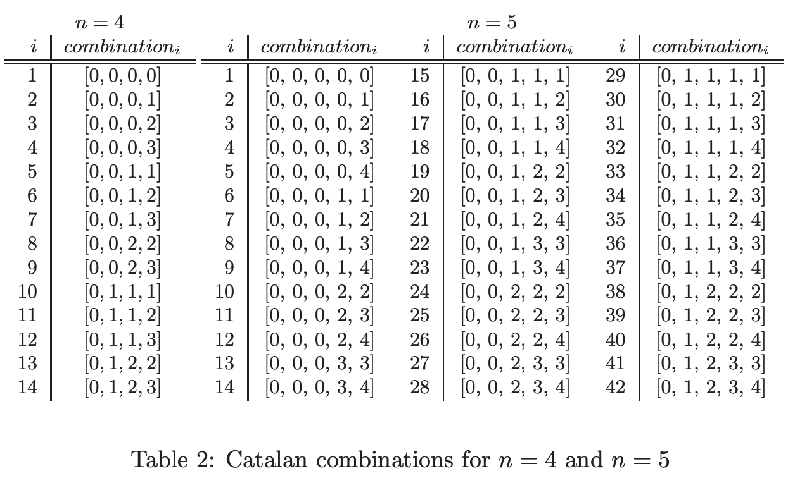
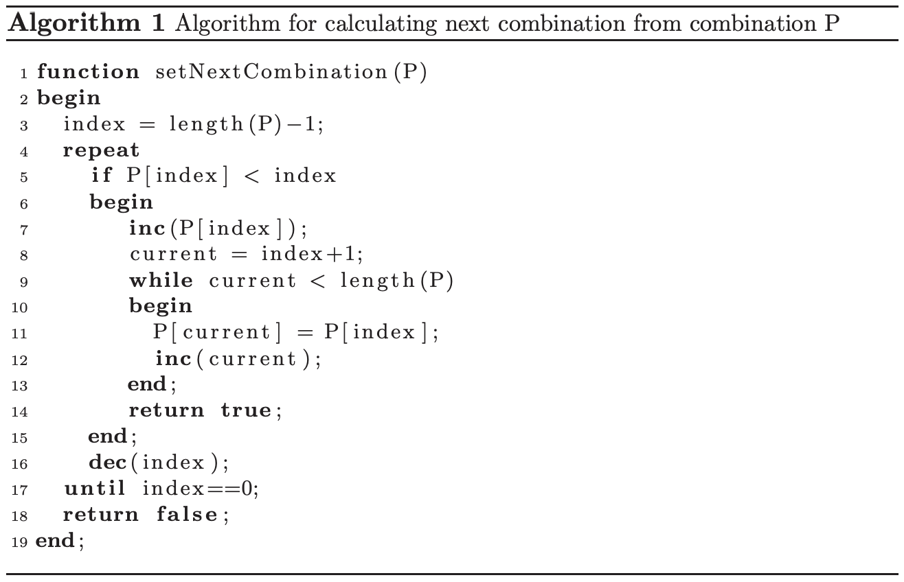
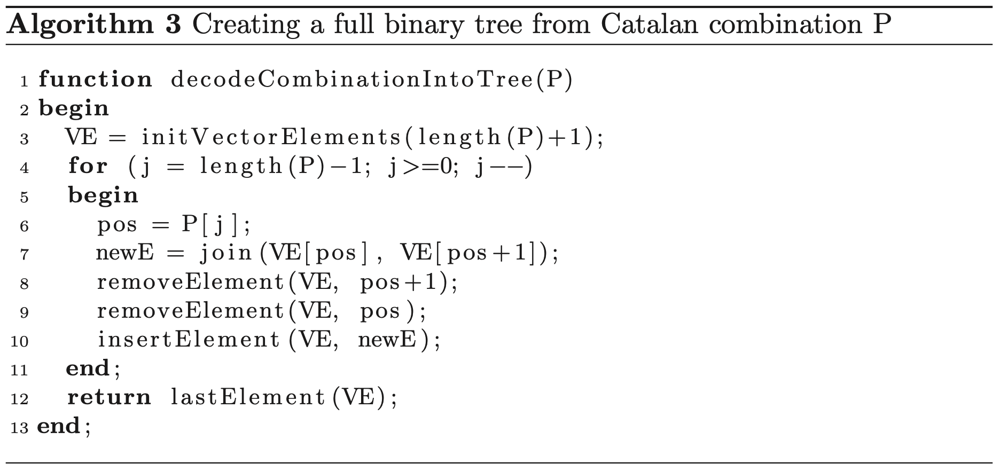
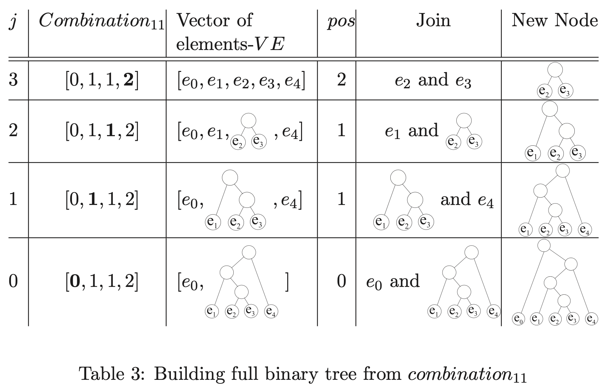
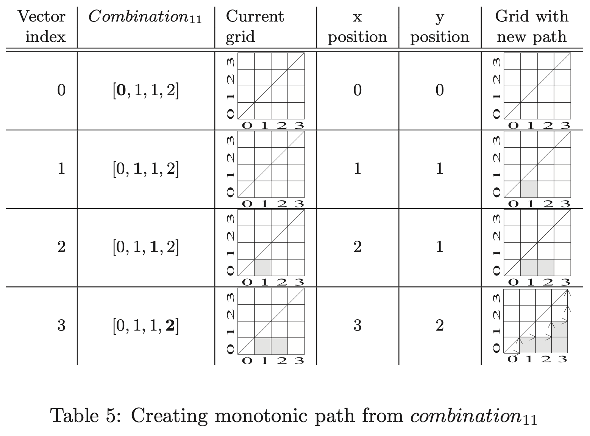

# [An-efficient-representation-for-solving-Catalan-number-related-problems](http://www.ijpam.eu/contents/2009-56-4/11/11.pdf)

## Abstract

Abstract: Nowadays, more and more computations, in artificial intelligence, knowledge representation, and scientific computations to name a few, require complex data processing and sophisticated algorithms, which are **NP hard**. Solutions to such problems might range from succinct(精简的) data representations to parallelized and incremental algorithms. In this paper Catalan related problems are discussed. For efficient computation of Catalan combinations a **succinct representation** is used and several algorithms are developed. Results show that the suggested approach can be successfully used for solving different Catalan problems.

## Introduction

...

However, to know the number of possible solutions is only a step towards the final solution. In other words, only the size of the **search space** has been identified. This **search space** then needs to be explored (exhaustively or heuristically) by deterministic [8] or by stochastic algorithms [11] to find a particular solution. For example, in grammatical inference [7] only a small fraction of all possible **derivation trees** satisfy additional constraints (to parse **positive samples** and to reject **negative samples**) [6], [4]. Often **search spaces** are enormous, for example when their sizes are given by the **Catalan numbers**. With the increasing processing power of modern computers and by parallel/distributed computing many problems can be solved today which were impossible to solve ten years ago. However, to solve a problem with parallel/distributed computing, algorithms need to be carefully developed to exploit different forms of parallelism. Solutions of problems related to **Catalan numbers** are usually recursively defined. This prevents us from exploiting straightforward parallelism. In this paper all possible solutions (combinations) described by **Catalan numbers** are succinctly represented as a vector of numbers which can be computed non-recursively. The main advantage of such representation is ease of use in parallel/distributed processing and the ability that the same combination can be differently interpreted depending on the underlying problem (e.g., full binary trees, convex polygon triangulation, monotonic paths, tiling a stair step). The developed algorithms systematically examine the whole search space, without repetition of solutions, and are easy to implement and understand.

The organization of the paper is as follows. Introduction to **Catalan numbers** and a succinct representation of combinations are described in Section 2. Algorithms to generate the **next combination** from the **current combination** and from its index are presented in Section 3. Various transformations from this succinct representation of Catalan combinations into underlying problem representations are shown in Section 4. The paper concludes with Section 5, which summarizes the contribution of the paper.

## Catalan Numbers and Enumeration of Combinations


For a problem having $C_n$ solutions to an instance of size n, we will speak of each solution as a “**combination**”.

By studying different problems a succinct representation of solutions that can be described by Catalan numbers has been identified. The **combination**
$$
P_n = [x_0,x_2,\dots,x_j,\dots,x_{n-1}]
$$
represents valid **solution** of $C_n$​ if and only if:
$$
\begin{align}
& \forall j;x_j \le j; \\
& \forall j;x_j \in \mathbb{Z}^*; \\
& \forall j,k; k >j \Rightarrow x_k \ge x_j
\end{align}
$$

> NOTE:
>
> 1. $\mathbb{Z}$​ 表示set of integer
> 2. bijection Dyck path


A similar representation can be found in many combinatorial problems [13]. All valid combinations in **lexicographic order** for n = 4 and n = 5 are listed in Table 2.



To be able to systematically search through combinations we enumerated combinations by index i.

To achieve our goal stated in the introductory section we need to develop algorithms which can generate a valid combination from the previous combination as well as from index i. Both algorithms are presented in the next section.

## Catalan Algorithms for the Succinct Representation

In this section two array based algorithms are presented. First, we present an algorithm which is able to produce $combination_i$ from $combination_{i−1}$. The second algorithm is able to produce $combination_i$ from $i$.

### Setting the Next Combination

Algorithm 1 calculates the **next combination** from the previous one, except for the last and the first combination. The first combination is filled with zeros and labeled as $combination_1$. The data structure used to represent a **combination** is an array of length $n$. As input to the algorithm the combination $P$ is given. As a result the **next valid combination** is calculated. The algorithm works by trying to change the input combination from the right to the left side and satisfy combination representation rules. It starts by setting index to the **last position** (line 3) and moving towards the zero position (line 16) in repeat loop. If a value at a selected index can be increased (first rule; line 5), the value is increased and all elements to the right from the current index are set to this value (second rule; lines 7-13). After the first successful change the algorithm stops (line 14). In the case where we wish to change the last combination, the algorithm returns false.

#### Algorithm 1 Algorithm for calculating next combination from combination P




```python
from typing import *


def next_combination(p: List[int]) -> bool:
    for idx in range(len(p) - 1, -1, -1):
        if p[idx] < idx:
            p[idx] += 1
            for idx_right in range(idx + 1, len(p)):
                p[idx_right] = p[idx]
            return True
    return False


if __name__ == '__main__':
    p = [0] * 4
    print(p)
    while next_combination(p):
        print(p)

```


```python
class CatalanCombinationGenerator:
    def __init__(self, n: int):
        self.n = n
        self.cur_combination = [0] * n
        self.ret_p0_flag = True

    def __iter__(self):
        return self

    def __next__(self):
        if self.ret_p0_flag:
            self.ret_p0_flag = False
            return self.cur_combination
        else:
            if self.__next_combination__():
                return self.cur_combination
            else:
                raise StopIteration

    def __next_combination__(self) -> bool:
        for idx in range(self.n - 1, -1, -1):
            if self.cur_combination[idx] < idx:
                self.cur_combination[idx] += 1
                for idx_right in range(idx + 1, self.n):
                    self.cur_combination[idx_right] = self.cur_combination[idx]
                return True
        return False


if __name__ == '__main__':
    for p in CatalanCombinationGenerator(4):
        print(p)

```

#### Creating a Combination from its Index i

TODO

## Transformation from a Combination to Underlying Problem Presentation

Since we used a single representation of Catalan combinations the next step is to show how to transform it to an underlying problem presentation. Several different problems have been selected to show that this mapping is problem specific:  

- full binary trees
- convex polygon triangulation
- monotonic paths
- tiling a stair step .


### Full Binary Trees

> NOTE:
>
> 1. 将`P[i]`解释为index







### Monotonic Paths on an n × n Grid

The decoding algorithm from a combination into a path is very simple. Every number in a combination describes **step right** and its value **the height of a movement**. The decoding process reads the combination from **the left to the right**. The decoding process for n = 4 and combination11 is shown in Table 4.3. The first step in the decoding process is always to move right (first row in the table). The second move can be move right or move up and right. Because we have a 1 in the second place, we move up and right. In the third step we move just right (because we are already at height 1) and in the last step we move up and right (since we have to reach height 2). At the end of decoding we need to move to the top of the grid by simple up moves (in our case two up moves) (Table 4.3).



