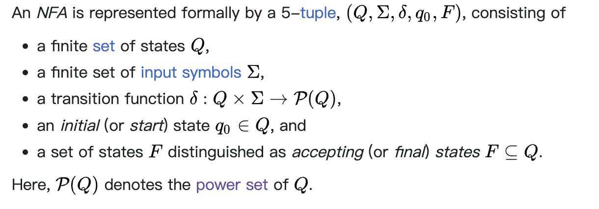
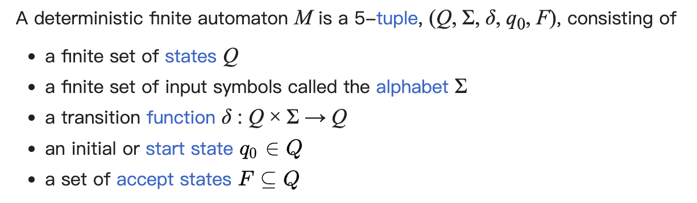

## DFA VS NFA

wikipedia [Nondeterministic finite automaton](https://en.wikipedia.org/wiki/Nondeterministic_finite_automaton) 

> In [automata theory](https://en.wikipedia.org/wiki/Automata_theory), a [finite-state machine](https://en.wikipedia.org/wiki/Finite-state_machine) is called a [deterministic finite automaton](https://en.wikipedia.org/wiki/Deterministic_finite_automaton) (DFA), if
> 
> - each of its transitions is *uniquely* determined by its source state and input symbol, and
> - reading an input symbol is required for each state transition.
> 
> A **nondeterministic finite automaton** (**NFA**), or **nondeterministic finite-state machine**, does not need to obey these restrictions. 

简而言之: DFA不支持wikipedia [epsilon transition](https://en.wikipedia.org/wiki/Epsilon_transition) 

|                                                                             | NFA                            | DFA                            |
| --------------------------------------------------------------------------- | ------------------------------ | ------------------------------ |
| Formal definition                                                           |  |  |
| 是否支持 [epsilon transition](https://en.wikipedia.org/wiki/Epsilon_transition) | yes                            | no                             |
| Current state                                                               | current state set              | current state只有一个              |
