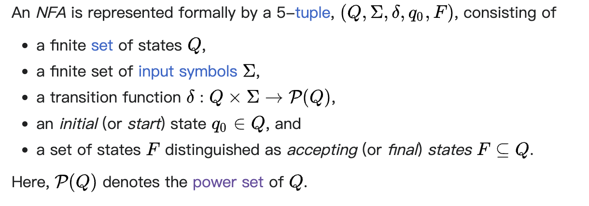
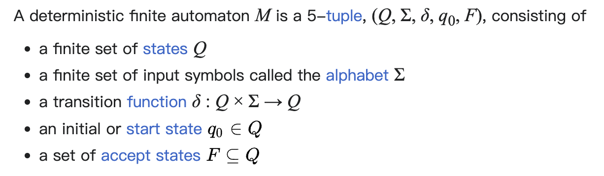
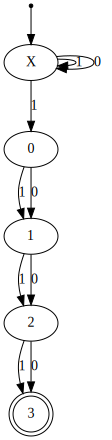
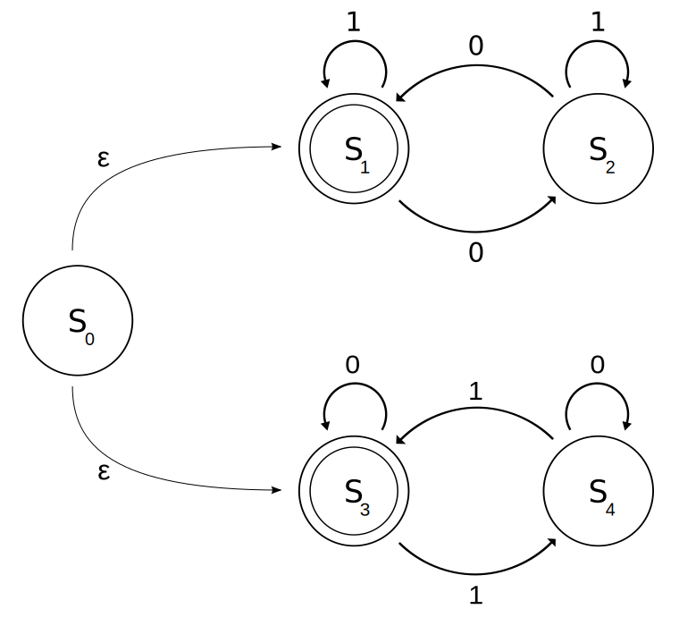

# Finite-state machine

FSA可以使用weighted-directed-graph来进行实现。

## wikipedia [Finite-state machine](https://en.wikipedia.org/wiki/Finite-state_machine)

> TIPS: In Chinese, [Finite-state machine](https://en.wikipedia.org/wiki/Finite-state_machine) means 有穷自动机

A **finite-state machine** (**FSM**) or **finite-state automaton** (**FSA**, plural: *automata*), **finite automaton**, or simply a **state machine**, is a mathematical [model of computation](https://en.wikipedia.org/wiki/Model_of_computation). It is an [abstract machine](https://en.wikipedia.org/wiki/Abstract_machine) that can be in exactly one of a finite number of *states* at any given time. The FSM can change from one state to another in response to some external [inputs](https://en.wikipedia.org/wiki/Input_(computer_science)) and/or a condition is satisfied; the change from one state to another is called a *transition*.[[1\]](https://en.wikipedia.org/wiki/Finite-state_machine#cite_note-1) An FSM is defined by a list of its states, its initial state, and the conditions for each transition. Finite state machines are of two types:

- [deterministic finite state machines](https://en.wikipedia.org/wiki/Deterministic_finite_automaton) 
- [non-deterministic finite state machines](https://en.wikipedia.org/wiki/Nondeterministic_finite_automaton).[[2\]](https://en.wikipedia.org/wiki/Finite-state_machine#cite_note-2) 

A deterministic finite-state machine can be constructed equivalent to any non-deterministic one.

The behavior of state machines can be observed in many devices in modern society that perform a predetermined sequence of actions depending on a sequence of events with which they are presented. Simple examples are [vending machines](https://en.wikipedia.org/wiki/Vending_machine), which dispense products when the proper combination of coins is deposited, [elevators](https://en.wikipedia.org/wiki/Elevator), whose sequence of stops is determined by the floors requested by riders, [traffic lights](https://en.wikipedia.org/wiki/Traffic_light), which change sequence when cars are waiting, and [combination locks](https://en.wikipedia.org/wiki/Combination_lock), which require the input of a sequence of numbers in the proper order.

> TIPS: The state machine can do much more, see [Usage](#Usage) for more detail.

The **finite state machine** has less computational power than some other models of computation such as the [Turing machine](https://en.wikipedia.org/wiki/Turing_machine).[[3\]](https://en.wikipedia.org/wiki/Finite-state_machine#cite_note-Belzer-3) The computational power distinction means there are computational tasks that a Turing machine can do but a FSM cannot. This is because a FSM's [memory](https://en.wikipedia.org/wiki/Computer_memory) is limited by the number of states it has. FSMs are studied in the more general field of [automata theory](https://en.wikipedia.org/wiki/Automata_theory).

> TIPS:  [Turing machine](https://en.wikipedia.org/wiki/Turing_machine) operates on an infinite memory.

> TIPS: There is an incomplete hierarchy in terms of powers of different types of abstract machines in page [automata theory](https://en.wikipedia.org/wiki/Automata_theory)


### Concepts and terminology

A *state* is a description of the status of a system that is waiting to execute a *transition*. A transition is a set of actions to be executed when a condition is fulfilled or when an **event** is received. For example, when using an audio system to listen to the radio (the system is in the "radio" state), receiving a "next" stimulus results in moving to the next station. When the system is in the "CD" state, the "next" stimulus results in moving to the next track. Identical stimuli trigger different actions depending on the current state.

In some finite-state machine representations, it is also possible to associate actions with a state:

- an entry action: performed *when entering* the state, and
- an exit action: performed *when exiting* the state.

### Representations

- [state transition table](https://en.wikipedia.org/wiki/State_transition_table)  
- [UML state machines](https://en.wikipedia.org/wiki/UML_state_machine)  
- [SDL state machines](https://en.wikipedia.org/wiki/Specification_and_Description_Language)
- [State diagram](https://en.wikipedia.org/wiki/State_diagram)


### Usage

In addition to their use in modeling **reactive systems** presented here, **finite state machines** are significant in many different areas, including [electrical engineering](https://en.wikipedia.org/wiki/Electrical_engineering), [linguistics](https://en.wikipedia.org/wiki/Linguistics), [computer science](https://en.wikipedia.org/wiki/Computer_science), [philosophy](https://en.wikipedia.org/wiki/Philosophy), [biology](https://en.wikipedia.org/wiki/Biology), [mathematics](https://en.wikipedia.org/wiki/Mathematic), and [logic](https://en.wikipedia.org/wiki/Logic). Finite state machines are a class of automata studied in [automata theory](https://en.wikipedia.org/wiki/Automata_theory) and the [theory of computation](https://en.wikipedia.org/wiki/Theory_of_computation). In computer science, finite state machines are widely used in modeling of application behavior, design of [hardware digital systems](https://en.wikipedia.org/wiki/Digital_electronics), [software engineering](https://en.wikipedia.org/wiki/Software_engineering), [compilers](https://en.wikipedia.org/wiki/Compiler), [network protocols](https://en.wikipedia.org/wiki/Network_protocol), and the study of computation and languages. 

#### Software applications

The following concepts are commonly used to build software applications with finite state machines: 

- [Automata-based programming](https://en.wikipedia.org/wiki/Automata-based_programming)
- [Event-driven finite-state machine](https://en.wikipedia.org/wiki/Event-driven_finite-state_machine)
- [Virtual finite-state machine](https://en.wikipedia.org/wiki/Virtual_finite-state_machine)
- [State design pattern](https://en.wikipedia.org/wiki/State_pattern)
- [State machine replication](https://en.wikipedia.org/wiki/State_machine_replication)
- [Regular expression](https://en.wikipedia.org/wiki/Regular_expression)

## DFA VS NFA

wikipedia [Nondeterministic finite automaton](https://en.wikipedia.org/wiki/Nondeterministic_finite_automaton) 

> In [automata theory](https://en.wikipedia.org/wiki/Automata_theory), a [finite-state machine](https://en.wikipedia.org/wiki/Finite-state_machine) is called a [deterministic finite automaton](https://en.wikipedia.org/wiki/Deterministic_finite_automaton) (DFA), if
>
> - each of its transitions is *uniquely* determined by its source state and input symbol, and
> - reading an input symbol is required for each state transition.
>
> A **nondeterministic finite automaton** (**NFA**), or **nondeterministic finite-state machine**, does not need to obey these restrictions. 

简而言之: DFA不支持wikipedia [epsilon transition](https://en.wikipedia.org/wiki/Epsilon_transition) 


|                                                              | NFA                            | DFA                            |
| ------------------------------------------------------------ | ------------------------------ | ------------------------------ |
| Formal definition                                            |  |  |
| 是否支持 [epsilon transition](https://en.wikipedia.org/wiki/Epsilon_transition) | yes                            | no                             |
| Current state                                                | current state set              | current state只有一个          |


## DFA

DFA可以使用weighted-directed-graph来进行实现。


### wikipedia [Deterministic finite automaton](https://en.wikipedia.org/wiki/Deterministic_finite_automaton)


### wikipedia [Deterministic acyclic finite state automaton](https://en.wikipedia.org/wiki/Deterministic_acyclic_finite_state_automaton)

In [computer science](https://en.wikipedia.org/wiki/Computer_science), a **deterministic acyclic finite state automaton** (**DAFSA**),[[1\]](https://en.wikipedia.org/wiki/Deterministic_acyclic_finite_state_automaton#cite_note-daciuk-1) also called a **directed acyclic word graph** (**DAWG**; though that name also refers to a [related data structure](https://en.wikipedia.org/wiki/Suffix_automaton) that functions as a suffix index[[2\]](https://en.wikipedia.org/wiki/Deterministic_acyclic_finite_state_automaton#cite_note-2)) is a [data structure](https://en.wikipedia.org/wiki/Data_structure) that represents a set of [strings](https://en.wikipedia.org/wiki/String_(computer_science)), and allows for a query operation that tests whether a given string belongs to the set in time proportional to its length. Algorithms exist to construct and maintain such automata,[*[citation needed](https://en.wikipedia.org/wiki/Wikipedia:Citation_needed)*] while keeping them [minimal](https://en.wikipedia.org/wiki/DFA_minimization).

A DAFSA is a special case of a [finite state recognizer](https://en.wikipedia.org/wiki/Finite_state_recognizer) that takes the form of a [directed acyclic graph](https://en.wikipedia.org/wiki/Directed_acyclic_graph) with a single source vertex (a vertex with no incoming edges), in which each edge of the graph is labeled by a letter or symbol, and in which each vertex has at most one outgoing edge for each possible letter or symbol. The strings represented by the DAFSA are formed by the symbols on paths in the graph from the source vertex to any sink vertex (a vertex with no outgoing edges). In fact, a [deterministic finite state automaton](https://en.wikipedia.org/wiki/Deterministic_finite_state_automaton) is acyclic [if and only if](https://en.wikipedia.org/wiki/If_and_only_if) it recognizes a [finite set of strings](https://en.wikipedia.org/wiki/Finite_language).[[1\]](https://en.wikipedia.org/wiki/Deterministic_acyclic_finite_state_automaton#cite_note-daciuk-1)


### Application

### [Finite-state-automaton-based string search algorithm](https://en.wikipedia.org/wiki/String-searching_algorithm#Finite-state-automaton-based_search) : 

[Aho–Corasick](https://en.wikipedia.org/wiki/Aho–Corasick_algorithm) 

[Knuth–Morris–Pratt](https://en.wikipedia.org/wiki/Knuth–Morris–Pratt_algorithm) 


## NFA


### wikipedia [Nondeterministic finite automaton](https://en.wikipedia.org/wiki/Nondeterministic_finite_automaton) 


#### Formal definition

An *NFA* is represented formally by a 5-[tuple](https://en.wikipedia.org/wiki/Tuple), ${\displaystyle (Q,\Sigma ,\delta ,q_{0},F)}$, consisting of

- a finite [set](https://en.wikipedia.org/wiki/Set_(mathematics)) of states ${\displaystyle Q}$.
- a finite set of [input symbols](https://en.wikipedia.org/wiki/Input_symbol) ${\displaystyle \Sigma }$.
- a transition function ${\displaystyle \delta }$ : ${\displaystyle Q\times \Sigma \rightarrow {\mathcal {P}}(Q)}$.
- an *initial* (or *start*) state ${\displaystyle q_{0}\in Q}$.
- a set of states ${\displaystyle F}$ distinguished as *accepting* (or *final*) *states* ${\displaystyle F\subseteq Q}$.

Here, ${\displaystyle {\mathcal {P}}(Q)}$ denotes the [power set](https://en.wikipedia.org/wiki/Power_set) of ${\displaystyle Q}$.


#### Example: $(0|1)^{\star}1(1|3)^{3}$

NFA for [regex](https://en.wikipedia.org/wiki/Regular_expression) $(0|1)^{\star}1(1|3)^{3}$, A [DFA](https://en.wikipedia.org/wiki/Deterministic_finite_automaton) for that [language](https://en.wikipedia.org/wiki/Formal_language) has at least 16 states.




#### Example: $(0|1)^{\star}1$

The following automaton ${\displaystyle M}$, with a binary alphabet, determines if the input ends with a 1. Let ${\displaystyle M=(\{p,q\},\{0,1\},\delta ,p,\{q\})}$ where the transition function ${\displaystyle \delta }$ can be defined by this state transition table (cf. upper left picture):

|     InputState      |              0               |              1               |
| :-----------------: | :--------------------------: | :--------------------------: |
| ${\displaystyle p}$ |   ${\displaystyle \{p\}}$    |  ${\displaystyle \{p,q\}}$   |
| ${\displaystyle q}$ | ${\displaystyle \emptyset }$ | ${\displaystyle \emptyset }$ |

##### NFA


##### NFA-ε



Since the set ${\displaystyle \delta (p,1)}$ contains more than one state, ${\displaystyle M}$ is nondeterministic. The language of ${\displaystyle M}$ can be described by the regular language given by the regular expression $(0|1)^{\star}1$.


#### NFA with $\epsilon$-moves

**Nondeterministic finite automaton** with ε-moves (NFA-ε) is a further generalization to NFA. In this kind of automaton, the **transition function** is additionally defined on the [empty string](https://en.wikipedia.org/wiki/Empty_string) ε. A transition without consuming an input symbol is called an ε-transition and is represented in state diagrams by an arrow labeled "ε". ε-transitions provide a convenient way of modeling systems whose current states are not precisely known: i.e., if we are modeling a system and it is not clear whether the current state (after processing some input string) should be q or q', then we can add an ε-transition between these two states, thus putting the automaton in both states simultaneously.

> NOTE:
>
> 一、wikipedia [Epsilon transition](https://en.wikipedia.org/wiki/Epsilon_transition) 
>
> 上面这段话非常好地介绍了 [epsilon transition](https://en.wikipedia.org/wiki/Epsilon_transition) 的意义，但是 [epsilon transition](https://en.wikipedia.org/wiki/Epsilon_transition) 的作用是否仅限于此呢？在后面会进行详细补充


## Epsilon transition

[LeetCode-10. Regular Expression Matching-hard](https://leetcode.cn/problems/regular-expression-matching/) 

epsilon transition保证能够找到所有的可能性。

epsilon transition 是为了找到所有可能的**起始状态**，这样后续的匹配可以从这些可能的起始状态开始匹配。

这种方式直接将regex看做是NFA，它不需要显示地构造出一个DFA，这样避免对 undeterministic 的讨论: 对于同一状态，遇到相同字符的时候，出现多种转换方式的讨论。

````
/**
* 在匹配完成后，如果node有epsilon transition，则不断执行epsilon transition
* 一、因为可能出现字符串比pattern短的情况，比如:
* s = "a"
* p = "ab*"
* 二、最后的"c*a*"都不在匹配
* s = "cbaacacaaccbaabcb"
* p = "c*b*b*.*ac*.*bc*a*"
*/
````

stackoverflow [What does an NFA with epsilon transitions let us do?](https://stackoverflow.com/questions/29401562/what-does-an-nfa-with-epsilon-transitions-let-us-do)

其中的例子很好

### wikipedia [Epsilon transition](https://en.wikipedia.org/wiki/Epsilon_transition) 

An **epsilon transition** (also **epsilon move** or **lambda transition**) allows an [automaton](https://en.wikipedia.org/wiki/Automata_theory) to change its state spontaneously(自发的), i.e. without consuming an input symbol. It may appear in almost all kinds of **nondeterministic automaton** in formal language theory, in particular:

- [Nondeterministic Turing machine](https://en.wikipedia.org/wiki/Nondeterministic_Turing_machine)
- [Nondeterministic pushdown automaton](https://en.wikipedia.org/wiki/Nondeterministic_pushdown_automaton)
- [Nondeterministic finite automaton](https://en.wikipedia.org/wiki/Nondeterministic_finite_automaton)


