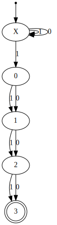

# NFA

NFA是无法使用computer进行表达的。

## wikipedia [Nondeterministic finite automaton](https://en.wikipedia.org/wiki/Nondeterministic_finite_automaton) 

NFA [regex](https://en.wikipedia.org/wiki/Regular_expression) $(0|1)^{\star}1(1|3)^{3}$, A [DFA](https://en.wikipedia.org/wiki/Deterministic_finite_automaton) for that [language](https://en.wikipedia.org/wiki/Formal_language) has at least 16 states.

An *NFA* is represented formally by a 5-[tuple](https://en.wikipedia.org/wiki/Tuple), ${\displaystyle (Q,\Sigma ,\delta ,q_{0},F)}$, consisting of

- a finite [set](https://en.wikipedia.org/wiki/Set_(mathematics)) of states ${\displaystyle Q}$.
- a finite set of [input symbols](https://en.wikipedia.org/wiki/Input_symbol) ${\displaystyle \Sigma }$.
- a transition function ${\displaystyle \delta }$ : ${\displaystyle Q\times \Sigma \rightarrow {\mathcal {P}}(Q)}$.
- an *initial* (or *start*) state ${\displaystyle q_{0}\in Q}$.
- a set of states ${\displaystyle F}$ distinguished as *accepting* (or *final*) *states* ${\displaystyle F\subseteq Q}$.

Here, ${\displaystyle {\mathcal {P}}(Q)}$ denotes the [power set](https://en.wikipedia.org/wiki/Power_set) of ${\displaystyle Q}$.

### Example

The following automaton ${\displaystyle M}$, with a binary alphabet, determines if the input ends with a 1. Let ${\displaystyle M=(\{p,q\},\{0,1\},\delta ,p,\{q\})}$ where the transition function ${\displaystyle \delta }$ can be defined by this state transition table (cf. upper left picture):

|     InputState      |              0               |              1               |
| :-----------------: | :--------------------------: | :--------------------------: |
| ${\displaystyle p}$ |   ${\displaystyle \{p\}}$    |  ${\displaystyle \{p,q\}}$   |
| ${\displaystyle q}$ | ${\displaystyle \emptyset }$ | ${\displaystyle \emptyset }$ |

Since the set ${\displaystyle \delta (p,1)}$ contains more than one state, ${\displaystyle M}$ is nondeterministic. The language of ${\displaystyle M}$ can be described by the regular language given by the regular expression $(0|1)^{\star}1$.

### NFA with ε-moves

**Nondeterministic finite automaton** with ε-moves (NFA-ε) is a further generalization to NFA. In this kind of automaton, the **transition function** is additionally defined on the [empty string](https://en.wikipedia.org/wiki/Empty_string) ε. A transition without consuming an input symbol is called an ε-transition and is represented in state diagrams by an arrow labeled "ε". ε-transitions provide a convenient way of modeling systems whose current states are not precisely known: i.e., if we are modeling a system and it is not clear whether the current state (after processing some input string) should be q or q', then we can add an ε-transition between these two states, thus putting the automaton in both states simultaneously.

> NOTE:
>
> 一、wikipedia [Epsilon transition](https://en.wikipedia.org/wiki/Epsilon_transition) 
>
> 上面这段话非常好地介绍了 [epsilon transition](https://en.wikipedia.org/wiki/Epsilon_transition) 的意义，但是 [epsilon transition](https://en.wikipedia.org/wiki/Epsilon_transition) 的作用是否仅限于此呢？在后面会进行详细补充

## Epsilon transition

wikipedia [Epsilon transition](https://en.wikipedia.org/wiki/Epsilon_transition) 

stackoverflow [What does an NFA with epsilon transitions let us do?](https://stackoverflow.com/questions/29401562/what-does-an-nfa-with-epsilon-transitions-let-us-do)

其中的例子很好