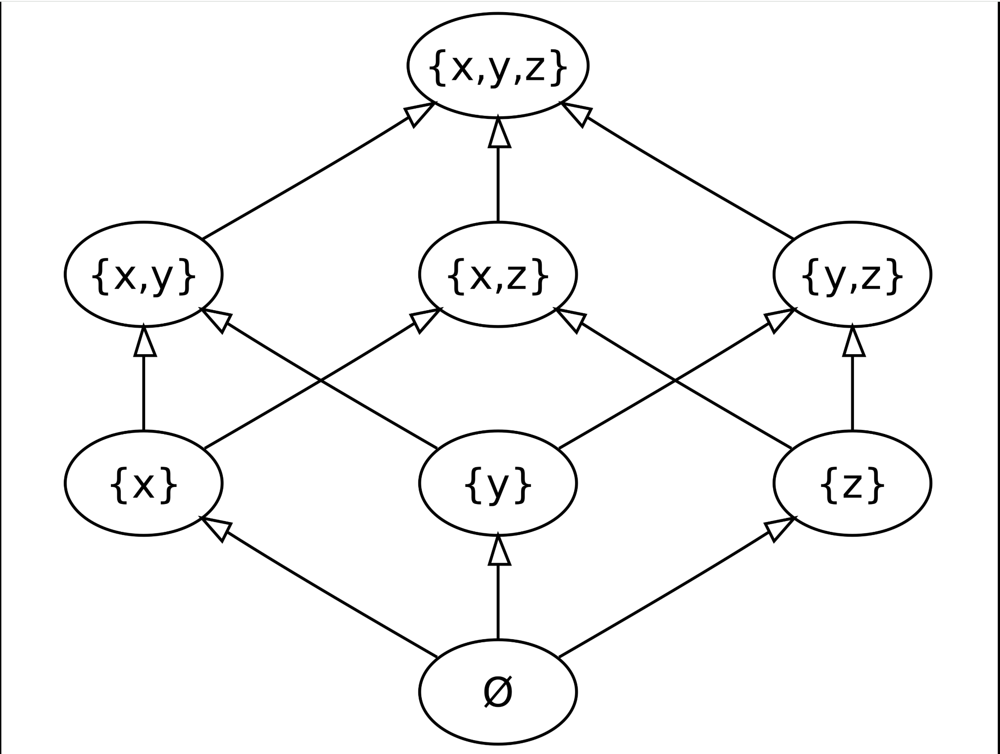

# Power set lattice

power set lattice: 幂集格，幂集格是**格论中最基础、最典型的格实例**，也是计算机科学（编译器静态分析、自动机理论、抽象解释）中最常用的格结构。它以集合论中的**幂集**为载体，以**集合包含关系**为**偏序**，天然具备完备的格运算与良好的代数性质。

---

## 一、基本定义

设 \( S \) 是任意集合，\( \mathcal{P}(S) \) 是 \( S \) 的**幂集**（即 \( S \) 的所有子集构成的集合），在偏序关系 **集合包含 \( \subseteq \)** 下，偏序集 \( \langle \mathcal{P}(S), \subseteq \rangle \) 构成一个格，称为 \( S \) 上的幂集格。

其核心格运算与集合运算一一对应：

- **最小上界（join，\( \vee \)）**：两个集合的**并集** \( A \cup B \) —— 同时包含 \( A \) 和 \( B \) 的最小集合
- **最大下界（meet，\( \wedge \)）**：两个集合的**交集** \( A \cap B \) —— 同时被 \( A \) 和 \( B \) 包含的最大集合
- **底元（bottom，\( \perp \)）**：**空集** \( \emptyset \) —— 所有集合的子集
- **顶元（top，\( \top \)）**：**全集** \( S \) —— 所有集合的超集

对任意两个子集 \( A,B \in \mathcal{P}(S) \)，\( A \subseteq B \) 等价于 \( A \vee B = B \)，也等价于 \( A \wedge B = A \)，完全符合格的代数定义与偏序定义的等价性。

---

## 二、核心代数性质

幂集格是性质最强的一类格，同时满足以下所有性质：

### 1. 完全格（Complete Lattice）

幂集的**任意子集族**都存在最小上界（全体并集）和最大下界（全体交集），因此幂集格是完全格。这是它能应用于不动点计算的根本前提——满足 Knaster-Tarski 定理的定义域要求，任意单调函数都存在最小不动点和最大不动点。

### 2. 分配格（Distributive Lattice）

集合的并与交互相满足分配律：

$$
A \cap (B \cup C) = (A \cap B) \cup (A \cap C)
$$

$$
A \cup (B \cap C) = (A \cup B) \cap (A \cup C)
$$

因此幂集格是典型的分配格，不存在非分配的子结构，运算规则简单直观。

### 3. 布尔格（Boolean Lattice）

相对于全集 \( S \)，每个子集 \( A \) 都存在唯一的**补集** \( \overline{A} = S \setminus A \)，满足：

$$
A \cup \overline{A} = S = \top, \quad A \cap \overline{A} = \emptyset = \perp
$$

因此幂集格是布尔格，也就是布尔代数的标准集合论模型，所有布尔逻辑运算都可以在其上直接定义。

---

## 三、直观示例

设全集 \( S = \{a,b\} \)，其幂集为 \( \mathcal{P}(S) = \{\emptyset, \{a\}, \{b\}, \{a,b\}\} \)，对应的幂集格哈斯图（Hasse Diagram）为菱形结构：

- 最底层：\( \emptyset \)（底元）
- 中间层：\( \{a\} \)、\( \{b\} \)（二者不可比较）
- 最顶层：\( \{a,b\} \)（顶元）

任意两个元素的 join 是向上汇聚的最小节点，meet 是向下汇聚的最大节点，完全符合集合的并、交运算结果。

---

## 四、在计算机科学与编译器中的核心应用

幂集格是理论计算机科学中最常用的格结构，几乎所有基于格的分析方法都以幂集格为基础实例：

### 1. 编译器数据流分析（最典型应用）

编译器的**到达-定值分析、可用表达式分析、活跃变量分析**等经典静态分析，本质都是在幂集格上进行不动点计算：

- 每个程序点对应一个“属性集合”（比如该点可达的定值集合），属于幂集 \( \mathcal{P}(S) \) 的元素
- 控制流的转移函数是**单调函数**：集合越大，转移后的结果也越大
- 分析过程就是从底元 \( \emptyset \) 出发迭代，最终收敛到转移函数的**最小不动点**，得到全程序各点的分析结果

### 2. 自动机理论：子集构造法

NFA 转 DFA 的**子集构造法**，本质就是在 NFA 状态集合的幂集格上构造确定自动机：

- 每个 DFA 状态对应 NFA 状态的一个子集，也就是幂集格中的一个元素
- 转移函数就是对当前状态集合应用 NFA 转移后的并集，即幂集格上的 join 运算
- 这也是“子集构造”名称的来源——直接构造幂集的子集作为状态

### 3. 抽象解释与程序验证

抽象解释中的具体语义域通常就是幂集格（所有程序状态的集合），抽象域则是对幂集格的近似与简化；程序安全性、活性属性的验证，也都建立在幂集格的单调不动点理论之上。

## example

**这是一个格，而且是最经典、最典型的「幂集格（Power Set Lattice）」**，对应3元集合 \( S=\{x,y,z\} \) 的幂集 \( \mathcal{P}(S) \) 在集合包含关系下的偏序结构。

---

### 判定依据（格的定义验证）

格的核心定义：一个偏序集是格，当且仅当**其中任意两个元素，都存在唯一的最小上界（join，\(\vee\)）和唯一的最大下界（meet，\(\wedge\)）**。

#### 1. 偏序结构

- 节点：\( S=\{x,y,z\} \) 的全部子集，共8个：\(\emptyset,\ \{x\},\ \{y\},\ \{z\},\ \{x,y\},\ \{x,z\},\ \{y,z\},\ \{x,y,z\}\)
- 偏序关系：箭头代表**集合包含 \( \subseteq \)**（从子集指向超集），显然满足自反、反对称、传递性，是合法偏序。

#### 2. 最小上界（join）恒存在且唯一

任意两个子集的**并集 \( \cup \)**，就是它们的最小上界——同时包含两个集合的最小集合，结果唯一且仍属于幂集：

- 例：\(\{x\} \vee \{y\} = \{x,y\}\)
- 例：\(\{x,y\} \vee \{x,z\} = \{x,y,z\}\)
- 例：\(\{x\} \vee \{y,z\} = \{x,y,z\}\)

#### 3. 最大下界（meet）恒存在且唯一

任意两个子集的**交集 \( \cap \)**，就是它们的最大下界——同时被两个集合包含的最大集合，结果唯一且仍属于幂集：

- 例：\(\{x,y\} \wedge \{x,z\} = \{x\}\)
- 例：\(\{x\} \wedge \{y\} = \emptyset\)
- 例：\(\{x,y\} \wedge \{z\} = \emptyset\)

所有两两元素都满足「有唯一的最小上界、唯一的最大下界」，因此它完全符合格的定义。

---

### 补充性质

这个幂集格不只是普通格，还是性质最强的一类格：

1. **完全格**：任意子集族都有全局上下确界（全体并/全体交），底元是 \( \emptyset \)，顶元是 \( \{x,y,z\} \)。
2. **分配格**：交、并运算互相满足分配律。
3. **布尔格**：每个元素都有唯一补集（相对于全集的补集）。

它也是编译器数据流分析、自动机子集构造、抽象解释等领域最常用的标准格结构。
