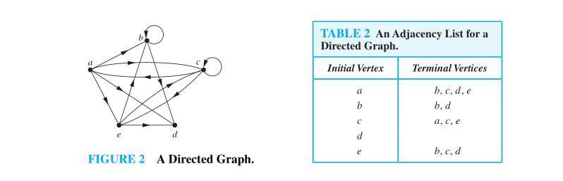

# Adjacency list

## 维基百科[Adjacency list](https://en.wikipedia.org/wiki/Adjacency_list)

### Implementation details

An adjacency list representation for a graph associates each vertex in the graph with the collection of its neighboring vertices or edges. There are many variations of this basic idea, differing in the details of how they implement the association between vertices and collections, in how they implement the collections, in whether they include both vertices and edges or only vertices as first class objects, and in what kinds of objects are used to represent the vertices and edges.

- An implementation suggested by [Guido van Rossum](https://en.wikipedia.org/wiki/Guido_van_Rossum) uses a [hash table](https://en.wikipedia.org/wiki/Hash_table) to associate each vertex in a graph with an [array](https://en.wikipedia.org/wiki/Array_data_structure) of adjacent vertices. In this representation, a vertex may be represented by any hashable object. There is no explicit representation of edges as objects.[[1\]](https://en.wikipedia.org/wiki/Adjacency_list#cite_note-1)
- Cormen et al. suggest an implementation in which the vertices are represented by index numbers.[[2\]](https://en.wikipedia.org/wiki/Adjacency_list#cite_note-2) Their representation uses an array indexed by vertex number, in which the array cell for each vertex points to a [singly linked list](https://en.wikipedia.org/wiki/Singly_linked_list) of the neighboring vertices of that vertex. In this representation, the nodes of the singly linked list may be interpreted as edge objects; however, they do not store the full information about each edge (they only store one of the two endpoints of the edge) and in undirected graphs there will be two different linked list nodes for each edge (one within the lists for each of the two endpoints of the edge).
- The [object oriented](https://en.wikipedia.org/wiki/Object_oriented) incidence list structure suggested by Goodrich and Tamassia has special classes of vertex objects and edge objects. Each vertex object has an instance variable pointing to a collection object that lists the neighboring edge objects. In turn, each edge object points to the two vertex objects at its endpoints.[[3\]](https://en.wikipedia.org/wiki/Adjacency_list#cite_note-A-3) This version of the adjacency list uses more memory than the version in which adjacent vertices are listed directly, but the existence of explicit edge objects allows it extra flexibility in storing additional information about edges.

## 10.3 Representing Graphs and Graph Isomorphism

