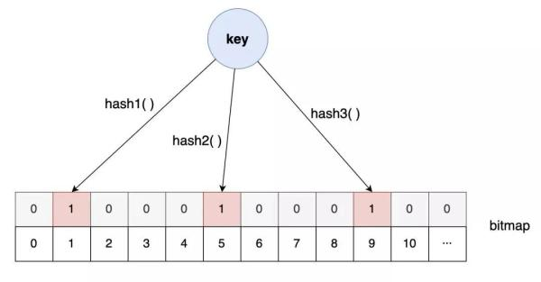

# Bloom filter

## developer.51cto [高性能开发的“十大武器”，爱了爱了！#**缓存技术&布隆过滤器**](https://developer.51cto.com/art/202011/630654.htm) 

> 在 developer.51cto [高性能开发的“十大武器”，爱了爱了！](https://developer.51cto.com/art/202011/630654.htm) 中，对Bloom filter有着比较好的介绍:

有了**缓存系统**，我们就可以在向数据库请求之前，先询问**缓存系统**是否有我们需要的数据，如果有且满足需要，我们就可以省去一次数据库的查询，如果没有，我们再向数据库请求。

注意，这里有一个关键的问题，如何判断我们要的数据是不是在**缓存系统**中呢?

进一步，我们把这个问题抽象出来：如何快速判断一个数据量很大的集合中是否包含我们指定的数据?

这个时候，就是**布隆过滤器**大显身手的时候了，它就是为了解决这个问题而诞生的。那**布隆过滤器**是如何解决这个问题的呢?

先回到上面的问题中来，这其实是一个**查找问题**，对于**查找问题**，最常用的解决方案是**搜索树**和**哈希表**两种方案。

因为这个问题有两个关键点：**快速**、**数据量**很大。

**树结构**首先得排除，哈希表倒是可以做到常数阶的性能，但数据量大了以后，一方面对**哈希表**的**容量**要求巨大，另一方面如何设计一个好的**哈希算法**能够做到如此大量数据的哈希映射也是一个难题。

对于**容量**的问题，考虑到只需要判断对象是否存在，而并非拿到对象，我们可以将**哈希表**的**表项**大小设置为 1 个 bit，1 表示存在，0 表示不存在，这样大大缩小**哈希表**的容量。

而对于**哈希算法**的问题，如果我们对**哈希算法**要求低一些，那**哈希碰撞**的机率就会增加。

那一个**哈希算法**容易冲突，那就多弄几个，多个哈希函数同时冲突的概率就小的多。

**布隆过滤器**就是基于这样的设计思路：

当设置对应的 key-value 时，按照一组哈希算法的计算，将对应比特位置 1。

但当对应的 key-value 删除时，却不能将对应的比特位置 0，因为保不准其他某个 key 的某个哈希算法也映射到了同一个位置。

也正是因为这样，引出了布隆过滤器的另外一个重要特点：布隆过滤器判定存在的实际上不一定存在，但判定不存在的则一定不存在。

## wikipedia [Bloom filter](https://en.wikipedia.org/wiki/Bloom_filter)